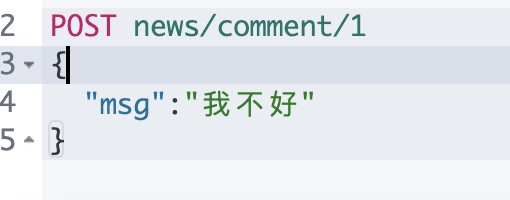

## 什么是ElasticSearch

``Elasticsearch``（简称``ES``）是一个基于``Apache Lucene(TM)``的开源搜索引擎，无论在开源还是专有领域，``Lucene`` 可以被认为是迄今为止最先进、性能最好的、功能最全的搜索引擎库。注意，``Lucene`` 只是一个库。想要发挥其强大的作用，你需使用 ``Java`` 并要将其集成到你的应用中。

重要特性：

- 分布式的实时文件存储，每个字段都被索引并可被搜索
- 实时分析的分布式搜索引擎
- 可以扩展到上百台服务器，处理PB级结构化或非结构化数据

> 基本概念&倒排索引

需要了解ElasticSearch中的一些基本概念。

```sql
- 索引(indices)
	-- Databases 数据库
	
- 类型(type)
	-- Table 数据表

- 文档(Document)
	-- Row 行

- 字段(Field)
	-- Columns 列
```

## ``ElasticSearch``中的倒排索引

``ElasticSearch``在插入数据的同时还会为这些数据维护了一张倒排索引表，通过这个倒排索引可以大大的提高搜索的性能

倒排索引（``Inverted Index``）也叫反向索引，有反向索引必有正向索引。简单来讲，正向索引是通过``key``找``value``，反向索引则是通过``value``找``key``。

举个例子：

1. ``comment`` 表有 ``id``、``content`` 两个字段，现在向 ``comment`` 表插入如下一条数据：
    ```sql
    id：1
    content：今天天气很好
    ```
    ``ElasticSearch`` 会把 ``content ``的内容进行分词，可以分成三个词：今天、天气、很好。倒排索引表就如下：
    ```sql
    今天		[1]
    天气		[1]
    很好		[1]
    ```
    表示 "今天"、"天气"、"很好"这三个词在 1号记录中存在。

2. 再向 ``comment`` 表中插入一条数据：
    ```sql
    id: 2
    content: 今天天气好冷
    ```
    继续将 ``content`` 的内容进行分词，得到：今天、天气、好冷。将这三个词添加到倒排索引表中
    今天		[1,2]
    天气		[1,2]
    很好		[1]
    好冷		[2]
    "今天"、"天气" 这两个词在 1号、2号记录中都存在。
    "很好" 在 1号 记录存在
    "好冷" 在 2号记录存在

3. 现在查询记录，检索条件：``今天好冷``
    通过 "今天好冷" 这个字符串进行检索记录，这种就属于通过value查找key。
    ``ElasticSearch`` 首先将 "今天好冷"进行分词为："今天"、"好冷"两个词。
    然后在倒排索引表中查询，发现 "今天" 这个词命中了 1号 和 2号 记录，再看 "好冷"这个词命中了 2号记录。
    这里有个评分机制，2号记录经过对比发现命中 2次，1号记录命中 1次。因此 2号记录的评分就比 1号 记录高。查询出来的结果顺序就是：
    ```sql
    id: 2 		content: 今天天气好冷
    id: 1		content: 今天天气很好
    ```
    这就是倒排索引的基本逻辑，通过 ``value`` 查找 ``key``。实际上，``ElasticSearch``引擎创建的倒排索引比这个复杂得多。

> Mac 安装 Kibana和ES

https://www.elastic.co/cn/downloads/past-releases
下载

## ``ES``基本操作

### _cat

``elasticsearch`` 提供 ``_cat API`` 来查看``ElasticSearch``状态

```sql
#0. 查看_cat支持的命令
GET /_cat

#1. 查看所有节点
GET /_cat/nodes

#2. 查看es健康状态
GET /_cat/health

#3. 查看主节点
GET /_cat/master

#4. 查看所有索引
GET /_cat/indices
```

### 新增数据

``elasticsearch`` 中保存的都是 ``json`` 格式的数据

现在向 es 添加一条数据 
```json
{ "msg": "Hello ElasticSearch" }
```

method |url地址	| 描述
---|:--:|---:
PUT |	localhost:9200/索引名称/类型名称/文档id	|创建文档(指定文档id)
POST |	localhost:9200/索引名称/类型名称 |	创建文档（随机文档id）
POST |	localhost:9200/索引名称/类型名称/文档id/_update	| 修改文档
DELETE |	localhost:9200/索引名称/类型名称/文档id |	删除文档
GET |	localhost:9200/索引名称/类型名称/文档id	| 通过文档id查询文档
POST |	localhost:9200/索引名称/类型名称/_search |	查询所有的数据

- ``PUT`` 方式
```json
PUT /news/comment/1
{
 "msg":"Hello ElasticSearch"
}
```

- ``POST ``方式
```json
POST /news/comment/1
{
 "name":"Hello ElasticSearch"
}
```
可以理解为向 ``news`` 数据库的 ``comment`` 表中添加了一条记录，不过这里叫做索引和类型


```sql
_index: 索引,对应就是数据库名
_type: 类型,对应就是数据表
_id: 数据的id
_version: 版本号,通过操作数据版本号会不断增加

_result: created表示创建了一条数据，如果重新put一条数据，则该状态会变为updated，并且版本号也会发生变化。

_shards: 分片信息
_seq_no: 序列号
_primary_term:	
```
``PUT``可以新增也可以修改。``PUT``必须指定``id``；

``POST``添加数据的时候不指定``id``，会自动的生成``id``，并且类型是新增

由于``PUT``需要指定``id``，我们一般用来做修改操作，不指定``id``会报错。

### 查询数据

查看使用GET请求方式检索数据

```sql
GET news/comment/1
```


可以理解为向 ``news`` 数据库的 ``comment`` 表中查询一条``id``为1的记录

``_source``：保存的数据


### 更新数据
- POST 方式
```json
POST /news/comment/1/_update
{
	"doc": {
		"msg": "Hello ES"
	}
}
```
```json 
POST /customer/external/1
{
	"msg": "Hello ES"
}
```

使用 ``_update`` 需要加 ``doc``


区别：

使用 ``_update``修改数据，版本号不会增加




- PUT 方式
```json
PUT /news/comment/1
{
  "msg": "Hello ES"
}
```

### 删除数据
删除一条数据
```sql
DELETE news/comment/1
```
删除一个索引
```sql
DELETE news
```


## bulk批量API

``bulk``相当于数据库里的``bash``操作， 其支持的操作类型包括：``index, create, update, delete``

> ``bulk ``语法：

```sql
{ action: { metadata } }
{ requstbody }
```

### 批量新增 ``index``

```json
POST /news/comment/_bulk
{ "index": {"_id": 2} }
{ "msg": "zhangsan" }
{ "index": {"_id": 3} }
{ "msg": "lisi" }
{ "index": {"_id": 4} }
{ "msg": "wangwu" }
```
执行结果


参数解析：
```json
{ "index": {"_id": 2} }

{ "msg": "zhangsan" }
```
这两行为一次操作，第一行指定了数据的``id``（还可以指定 ``index``、``type``;以下划线开头）

第二行是保存的数据体

结果解析：
```json
"took": 31：请求执行时间（毫秒）

"error": false ：请求是否出错，返回flase表示没有出错

"items"：操作过的文档的具体信息

"static"：响应状态码

```
### 批量新增 ``create``

```JSON
POST /news/comment/_bulk
{ "create": {"_id": 2} }
{ "msg": "zhangsan" }
{ "create": {"_id": 3} }
{ "msg": "lisi" }
{ "create": {"_id": 4} }
{ "msg": "wangwu" }
```


新增失败了，因为``id``重复问题

- ``create``方式新增，如果``id``已存在了就会报错
- ``index``方式新增，如果``id``存在不会报错，并且 ``version`` 增加

### 批量更新 ``update``

```json
POST /news/comment/_bulk
{ "update": {"_id": 2} }
{ "doc":{"msg": "zhangsan.cn"} }
{ "update": {"_id": 3} }
{ "doc":{"msg": "lisi.cn"} }
{ "update": {"_id": 4} }
{ "doc":{"msg": "wangwu.cn"} }
```


更新操作需要多加一层 ``doc``。
```json
{ "update": {"_id": 2} }

{ "doc":{"msg": "zhangsan.cn"} }
```

- 第一行``update``为更新操作，并指定了更新数据的``id``
- ​第二行 ``doc``里面是更新的新数据。


### 批量删除 ``delete``

批量删除不需要请求体（数据体）

```json
POST /news/comment/_bulk
{ "delete": {"_id": 2} }
{ "delete": {"_id": 3} }
{ "delete": {"_id": 4} }
```


## 进阶检索

学习之前先为es添加一些测试数据，这里使用官方提供的测试数据
 https://gitee.com/depthch/elasticsearch/blob/master/doc/test/resourses/accounts.json

1. 打开上面链接将里面的数据复制

2. 在 ``kibana`` 中使用 ``bulk`` 批量添加数据

```json
POST /bank/account/_bulk
{"index":{"_id":"1"}}
{"account_number":1,"balance":39225,"firstname":"Amber","lastname":"Duke","age":32,"gender":"M","address":"880 Holmes Lane","employer":"Pyrami","email":"amberduke@pyrami.com","city":"Brogan","state":"IL"}
{"index":{"_id":"6"}}
{"account_number":6,"balance":5686,"firstname":"Hattie","lastname":"Bond","age":36,"gender":"M","address":"671 Bristol Street","employer":"Netagy","email":"hattiebond@netagy.com","city":"Dante","state":"TN"}
{"index":{"_id":"13"}}
{"account_number":13,"balance":32838,"firstname":"Nanette","lastname":"Bates","age":28,"gender":"F","address":"789 Madison Street","employer":"Quility","email":"nanettebates@quility.com","city":"Nogal","state":"VA"}
{"index":{"_id":"18"}}
{"account_number":18,"balance":4180,"firstname":"Dale","lastname":"Adams","age":33,"gender":"M","address":"467 Hutchinson Court","employer":"Boink","email":"daleadams@boink.com","city":"Orick","state":"MD"}
{"index":{"_id":"20"}}
{"account_number":20,"balance":16418,"firstname":"Elinor","lastname":"Ratliff","age":36,"gender":"M","address":"282 Kings Place","employer":"Scentric","email":"elinorratliff@scentric.com","city":"Ribera","state":"WA"}
{"index":{"_id":"25"}}
{"account_number":25,"balance":40540,"firstname":"Virginia","lastname":"Ayala","age":39,"gender":"F","address":"171 Putnam Avenue","employer":"Filodyne","email":"virginiaayala@filodyne.com","city":"Nicholson","state":"PA"}
{"index":{"_id":"32"}}
{"account_number":32,"balance":48086,"firstname":"Dillard","lastname":"Mcpherson","age":34,"gender":"F","address":"702 Quentin Street","employer":"Quailcom","email":"dillardmcpherson@quailcom.com","city":"Veguita","state":"IN"}
{"index":{"_id":"37"}}
{"account_number":37,"balance":18612,"firstname":"Mcgee","lastname":"Mooney","age":39,"gender":"M","address":"826 Fillmore Place","employer":"Reversus","email":"mcgeemooney@reversus.com","city":"Tooleville","state":"OK"}
{"index":{"_id":"44"}}
{"account_number":44,"balance":34487,"firstname":"Aurelia","lastname":"Harding","age":37,"gender":"M","address":"502 Baycliff Terrace","employer":"Orbalix","email":"aureliaharding@orbalix.com","city":"Yardville","state":"DE"}
{"index":{"_id":"49"}}
{"account_number":49,"balance":29104,"firstname":"Fulton","lastname":"Holt","age":23,"gender":"F","address":"451 Humboldt Street","employer":"Anocha","email":"fultonholt@anocha.com","city":"Sunriver","state":"RI"}
```


在索引为 ``bank``，类型 ``account``中批量插入了数据

``ES``支持两种基本方式检索

- 通过``REST request uri`` 发送搜索参数 （``uri`` +检索参数）
- 通过``REST request body ``来发送它们（``uri``+请求体）

### _search

> 请求方式：``uri`` + 检索参数

1. 检索``bank``下的所有信息

```json
GET /bank/_search
```


响应结果解析：
```json
took：Elasticsearch执行搜索的时间(毫秒)
time_out：告诉我们搜索是否超时
_shards：告诉我们多少个分片被搜索了，以及统计了成功/失败的搜索分片
hits：搜索结果
hits.total：搜索结果数量
hits.hits：实际的搜索结果数组(默认为前10的文档)
sort：结果的排序key (键) (没有则按score排序)
score和max score：相关性得分和最高得分(全文检索用)
```

2. 检索 ``bank ``下所有信息，并按照 ``account_number``升序

```json
GET /bank/_search?q=*&sort=account_number:asc
```


- ``q=*``：``*`` 是通配符，表示查询所有的数据
- ``sort=account_number:asc``：按照 ``account_number ``排序，``asc`` 是升序

### queryDSL

> 请求方式：``uri`` + 请求体

基本语法
```sql
QUERY_NAME:{
   ARGUMENT:VALUE,
   ARGUMENT:VALUE,...
}
```

1. 检索 ``bank`` 下所有信息，并按照 ``account_number``降序
```json
GET /bank/_search
{
  "query": {
    "match_all": {}
  },
  "sort": [
    {
      "account_number": {
        "order": "desc"
      }
    }
  ]
}
```


查询参数解析：

- ``match_all``查询类型【代表查询所有的所有】，``es``中可以在``query``中组合非常多的查询类型完成复杂查询；
- 除了``query``参数之外，我们可也传递其他的参数以改变查询结果，如``sort，size``；
- ``from``+``size``限定，完成分页功能；
- ``sort``排序，多字段排序，会在前序字段相等时后续字段内部排序，否则以前序为准；

#### _source
``_source``：返回指定的部分字段
```json
GET bank/_search
{
  "query": {
    "match_all": {}
  },
  "from": 0,
  "size": 5,
  "sort": [
    {
      "account_number": {
        "order": "desc"
      }
    }
  ],
  "_source": ["balance","firstname"]
}
```


``_source``：指定返回的部分字段

####  match匹配查询

- 基本类型（非字符串），精确控制
```json
GET bank/_search
{
  "query": {
    "match": {
      "account_number": "20"
    }
  }
}
```


- 字符串，全文检索
```json
GET bank/_search
{
  "query": {
    "match": {
      "address": "kings"
    }
  }
}
```


#### match_phrase

``match_phrase``： 短句匹配，将需要匹配的值当成一整个单词（不分词）进行检索

```json
GET bank/_search
{
  "query": {
    "match_phrase": {
      "address": "mill road"
    }
  }
}
```


查出 ``address`` 中包含 ``mill road`` 的所有记录，并给出相关性得分

``match_phrase`` 和 ``match`` 的区别：

- ``match``：匹配时会分词，如：``mill road``，会拆分成：``mill、road``。然后检索出包含这两个词的记录(包含其中一个词也满足条件)
- ``match_phrase``：匹配时不会分词，如：``mill road``，会被当成一个整体来检索记录，必须包含整个整体的记录才会被检索出来

#### match.keyword

``keyword`` 是精确匹配，就是说某条记录必须完全满足匹配条件才会被检索出来
```json
GET bank/_search
{
  "query": {
    "match": {
      "address.keyword": "990 Mill Road"
    }
  }
}
```

#### multi_math

``multi_math``：多字段匹配可以在多个字段中去匹配条件
```json
GET bank/_search
{
  "query": {
    "multi_match": {
      "query": "mill",
      "fields": [
        "state",
        "address"
      ]
    }
  }
}
```

``state`` 或者 ``address`` 中包含 ``mill``，并且在查询过程中，会对于查询条件进行分词。

#### bool
``bool``：用来做复合查询，复合语句可以合并，任何其他查询语句，包括符合语句。这也就意味着，复合语句之间可以互相嵌套，可以表达非常复杂的逻辑。


#### must
``must``：必须达到``must``所列举的所有条件
```json
GET bank/_search
{
   "query":{
        "bool":{
             "must":[
              {"match":{"address":"mill"}},
              {"match":{"gender":"M"}}
             ]
         }
    }
}
```

匹配 ``gender``为 ``M``并且 ``address``包含 ``mill``的文档

#### must_not
``must_not``，必须不匹配``must_not``所列举的所有条件。
```json
GET bank/_search
{
  "query": {
    "bool": {
      "must": [
        {
          "match": {
            "gender": "M"
          }
        },
        {
          "match": {
            "address": "mill"
          }
        }
      ],
      "must_not": [
        {
          "match": {
            "age": "38"
          }
        }
      ]
    }
  }
```
匹配 ``gender``为 ``M``并且 ``address``包含 ``mill``的文档，但是 ``age`` 不等于38的数据

#### should
``should``：应该达到``should``列举的条件，如果到达会增加相关文档的评分，并不会改变查询的结果。

如果``query``中只有``should``且只有一种匹配规则，那么``should``的条件就会被作为默认匹配条件二区改变查询结果。
```json
GET bank/_search
{
  "query": {
    "bool": {
      "must": [
        {
          "match": {
            "gender": "M"
          }
        },
        {
          "match": {
            "address": "mill"
          }
        }
      ],
      "must_not": [
        {
          "match": {
            "age": "18"
          }
        }
      ],
      "should": [
        {
          "match": {
            "lastname": "Wallace"
          }
        }
      ]
    }
  }
}
```
``should``是"应该包含"的意思，不是必须包含，也就是除去其他匹配条件即使 ``lastName``不包含 ``Wallace``也能匹配成功。但是如果有数据的 ``lastName`` 包含 ``Wallace`` ，那么这条数据的相关性得分会更高，即优先匹配。

#### Filter
并不是所有的查询都需要产生分数，特别是哪些仅用于``filtering``过滤的文档。为了不计算分数，``elasticsearch``会自动检查场景并且优化查询的执行。
```json
GET bank/_search
{
  "query": {
    "bool": {
      "must": [
        {
          "match": {
            "address": "mill"
          }
        }
      ],
      "filter": {
        "range": {
          "balance": {
            "gte": "10000",
            "lte": "20000"
          }
        }
      }
    }
  }
}
```
这里先是查询所有匹配 ``address`` 包含 ``mill`` 的文档，然后再根据 ``10000<=balance<=20000``进行过滤查询结果

``filter``在使用过程中，并不会计算相关性得分，即`` "_score" : 0.0``

#### term
和``match``一样。匹配某个属性的值。

全文检索字段用 ``match``

非``text``字段匹配用``term``。
```JSON 
GET bank/_search
{
  "query": {
    "term": {
      "address": "mill Road"
    }
  }
}
```
使用`` term ``匹配 ``text``类型数据是匹配不到任何数据的。

### Aggregation

聚合提供了从数据中分组和提取数据的能力。最简单的聚合方法大致等于``SQL Group by``和``SQL``聚合函数。在``elasticsearch``中，执行搜索返回``this``（命中结果），并且同时返回聚合结果，把以响应中的所有``hits``（命中结果）分隔开的能力。这是非常强大且有效的，你可以执行查询和多个聚合，并且在一次使用中得到各自的（任何一个的）返回结果，使用一次简洁和简化的``API``啦避免网络往返。

聚合语法：
```json
"aggs":{
    "aggs_name这次聚合的名字，方便展示在结果集中":{
        "AGG_TYPE聚合的类型(avg,terms....)":{}
     }
}
```
常用聚合类型：

- avg：求平均值
- max：求最大值
- min：求最小值
- sum：求和
- filter：过滤聚合。基于一个条件，来对当前的文档进行过滤的聚合。
- terms：词聚合。基于某个field，该 field 内的每一个【唯一词元】为一个桶，并计算每个桶内文档个数。默认返回顺序是按照文档个数多少排序。

**搜索``address``中包含``mill``的所有人的年龄分布以及平均年龄**
```json
GET bank/_search
{
  "query": {
    "match": {
      "address": "Mill"
    }
  },
  "aggs": {
    "ageAgg": {
      "terms": {
        "field": "age",
        "size": 10
      }
    },
    "ageAvg": {
      "avg": {
        "field": "age"
      }
    }
  }
}
```
**查出所有年龄分布，并且求这些年龄段的这些人的平均薪资**
```json
GET bank/_search
{
  "query": {
    "match_all": {}
  },
  "aggs": {
    "ageAgg": {
      "terms": {
        "field": "age",
        "size": 100
      },
      "aggs": {
        "ageAvg": {
          "avg": {
            "field": "balance"
          }
        }
      }
    }
  }
}
```
聚合是可以嵌套聚合的。

**查出所有年龄分布，并且这些年龄段中M的平均薪资和F的平均薪资以及这个年龄段的总体平均薪资**

```json
GET bank/_search
{
  "query": {
    "match_all": {}
  },
  "aggs": {
    "ageAgg": {
      "terms": {
        "field": "age",
        "size": 100
      },
      "aggs": {
        "genderAgg": {
          "terms": {
            "field": "gender.keyword"
          },
          "aggs": {
            "balanceAvg": {
              "avg": {
                "field": "balance"
              }
            }
          }
        },
        "ageBalanceAvg": {
          "avg": {
            "field": "balance"
          }
        }
      }
    }
  }
}
```
先按年龄聚合查出了所有分布情况，再嵌套聚合 按性别聚合查出分布情况，最后再嵌套聚合 按薪资聚合查出平均薪资。

``ageBalanceAvg``：根据年龄分布计算出平均工资，这个聚合跟性别无关。

### mapping

``maping``是用来定义一个文档（``document``），以及它所包含的属性（``field``）是如何存储和索引的。比如：使用``maping``来定义：
- 哪些字符串属性应该被看做全文本属性（full text fields）；
- 哪些属性包含数字，日期或地理位置；
- 文档中的所有属性是否都能被索引（all 配置）；
- 日期的格式；
- 自定义映射规则来执行动态添加属性；

查看 ``bank`` 索引的 ``mapping`` 映射信息
```json
GET bank/_mapping
```


在 ``properties`` 中可以看到每个 ``field ``的字段类型

## **新版本的改变**
``ElasticSearch7`` 去掉了``type``（表）概念

1. 关系型数据库中两个数据表示是独立的，即使他们里面有相同名称的列也不影响使用，但ES中不是这样的。elasticsearch是基于Lucene开发的搜索引擎，而ES中不同type下名称相同的filed最终在Lucene中的处理方式是一样的。

- 两个不同type（表）下的两个名称 user_name（字段），在ES同一个索引下其实被认为是同一个filed，你必须在两个不同的type（表）中定义相同的 filed 映射。否则，不同 type（表）中的相同字段名称就会在处理中出现冲突的情况，导致Lucene处理效率下降。
- 去掉type（表）就是为了提高ES处理数据的效率。
  
2. Elasticsearch 7.x URL中的type参数为可选。比如，索引一个文档不再要求提供文档类型。
3. Elasticsearch 8.x 不再支持URL中的type参数。

> 创建映射

```json
PUT /student
{
  "mappings": {
    "properties": {
      "age": {
        "type": "integer"
      },
      "email": {
        "type": "keyword"
      },
      "name": {
        "type": "text"
      }
    }
  }
}
```


创建 ``student ``索引并指定了索引的 ``mapping`` 映射信息。

``properties``：指定映射的字段和字段类型

> 查看映射

```json
GET /student
```

> 添加新的字段映射

为 ``student``索引添加一个新的字段映射
```json
PUT /student/_mapping
{
  "properties": {
    "id": {
      "type": "keyword",
      "index": false
    }
  }
}
```
``"index": false``：表明新增的字段不能被检索，只是一个冗余字段。

## 数据迁移

由于``ElasticSearch``是不支持修改映射字段的，只能添加映射字段。如果必须修改就需要数据迁移。

需求：将 ``bank`` 索引的所有数据迁移到 ``newbank`` 索引下，并将 ``age``字段类型改为 ``integer``。修改 ``city、email、employer、gender``等字段类型改为 ``keyword``


**具体步骤：**

1. 查看 ``bank`` 的映射信息
```json
GET /bank
```


2. 创建一个跟 ``bank`` 索引字段相同 ``mapping`` 映射的索引，并且改变字段类型
```json
PUT /newbank
{
  "mappings": {
    "properties": {
      "account_number": {
        "type": "long"
      },
      "address": {
        "type": "text"
      },
      "age": {
        "type": "integer"
      },
      "balance": {
        "type": "long"
      },
      "city": {
        "type": "keyword"
      },
      "email": {
        "type": "keyword"
      },
      "employer": {
        "type": "keyword"
      },
      "firstname": {
        "type": "text"
      },
      "gender": {
        "type": "keyword"
      },
      "lastname": {
        "type": "text",
        "fields": {
          "keyword": {
            "type": "keyword",
            "ignore_above": 256
          }
        }
      },
      "state": {
        "type": "keyword"
      }
    }
  }
}
```
在指定映射信息时改变了字段的类型。

3. 可以查看到 newbank 索引的映射信息
```json
GET /newbank
```
字段类型都已经改变。


4. 将 ``bank ``索引中的数据迁移到`` newbank`` 索引中
```json
POST _reindex
{
  "source": {
    "index": "bank",
    "type": "account"
  },
  "dest": {
    "index": "newbank"
  }
}
```
``source``：指定旧索引信息

- ``index``：指定旧的索引名
- ``type``：指定 ``type``，如果没有 ``type`` 可以不指定。
- ``dest``：指定新索引信息
- ``index``：指定新的索引名

5. 查看``newbank``的数据

```json
get /newbank/_search
```


检索了1000条数据，数据迁移成功。发现 ``type: _doc``，我们在创建映射关系时并没有设置 ``type``，这是因为``ElasticSearch7`` 去掉了``type``（表）概念，但是有个默认的 ``type ``就是 ``_doc``


## 分词
一个 tokenizer（分词器）接收一个字符流，将之分割为独立的 tokens（词元，通常是独立的单词），然后输出tokens 流。例如：hello world 遇到空白字符时分割文本。它会将文本 "hello world" 分割为 [hello, world]。

tokenizer（分词器）还负责记录各个terms(词条)的顺序或position位置（用于phrase短语和word proximity词近邻查询），以及term（词条）所代表的原始word（单词）的start（起始）和 end（结束）的 character offsets（字符串偏移量） （用于高亮显示搜索的内容）。

elasticsearch 提供了很多内置的分词器，可以用来构建 custom analyzers（自定义分词器）。


### 下载ik 分词

```
wget https://github.com/medcl/elasticsearch-analysis-ik/releases/tag/v7.10.1/elasticsearch-analysis-ik-7.10.1.zip
```
在``plugins``文件夹下新建``ik``文件夹并解压缩进去


查看安装好的ik
```json
GET _cat/plugins
```


### 使用ik分词器
``ik``分词器有两种分词模式：``ik_max_word ``和 ``ik_smart`` 模式。

- ``ik_max_word``
会将文本做最细粒度的拆分，比如会将“中华人民共和国人民大会堂”拆分为“中华人民共和国、中华人民、中华、华人、人民共和国、人民、共和国、大会堂、大会、会堂等词语。

- ``ik_smart``
会做最粗粒度的拆分，比如会将“中华人民共和国人民大会堂”拆分为中华人民共和国、人民大会堂。

> 先来看看默认的分词器：
```json
GET _analyze
{
   "text":"每天都要努力"
}
```


> ik 分词器：
```json
GET _analyze
{
   "analyzer": "ik_smart", 
   "text":"每天都要努力"
}
```


> 自定义词库
虽然使用 ik 分词器默认的词库已经可以实现常用的中文分词了，但是如果我们要分的词不常用，如：张明想学Java
```json
GET _analyze
{
  "analyzer": "ik_smart",
   "text":"张明想学Java"
}
```


可以看到这里把 "张明" 拆成了 "张" 和 "明"，这并我是预想的效果，"张明" 应该拆成整体。

# SprigBoot 整合ElasticSearch

``SpringBoot``可以通过 ``9200``和``9300``端口来调用 ``ElasticSearch``，它们之间的区别：

- 9300:TCP

SpringBoot提供了 spring-data-elasticsearch:transport-api.jar;来对 ES调用。这种方式有些缺陷：

    - springboot版本不同，transport-api.jar不同，不能适配es版本
    - es7.x已经不建议使用，es8以后就要废弃


- 9200:HTTP
    - jestClient：非官方，更新慢；
    - RestTemplate：模拟HTTP请求，ES很多操作需要自己封装，麻烦；
    - HttpClient：模拟HTTP请求，ES很多操作需要自己封装，麻烦；
    - Elasticsearch-Rest-Client：官方RestClient，封装了ES操作，API层次分明，上手简单；

根据上面分析，我们最终选择 Elasticsearch-Rest-Client 来进行调用es。

## 具体步骤

1. 添加依赖

```xml
<dependency>
    <groupId>org.elasticsearch.client</groupId>
    <artifactId>elasticsearch-rest-high-level-client</artifactId>
    <version>7.10.1</version>
</dependency>
<dependency>
    <groupId>org.elasticsearch</groupId>
    <artifactId>elasticsearch</artifactId>
    <version>7.10.1</version>
</dependency>
<dependency>
    <groupId>commons-lang</groupId>
    <artifactId>commons-lang</artifactId>
    <version>2.6</version>
</dependency>
<dependency>
    <groupId>org.elasticsearch.client</groupId>
    <artifactId>elasticsearch-rest-client</artifactId>
    <version>7.10.1</version>
</dependency>
```
2. 创建一个 ``ElasticSearch``的配置类
```java
@Configuration
public class ElasticSearchConfig {
    @Bean
    public RestHighLevelClient esRestClient(){
        RestHighLevelClient client = new RestHighLevelClient(
                RestClient.builder(new HttpHost("192.168.0.15", 9200, "http")));
        return client;
    }
}
```
``HttpHost``("192.168.0.15", 9200, "http")

- 192.168.0.15：es服务的地址
- 9200：es服务9200端口
- ``http``：使用``http``协议
  
配置类中创建了一个 ``JavaBean``，之后通过这个 ``JavaBean`` 来调用 ``ElasticSearch ``的相关`` API``

## 进行简单的测试

```java
@SpringBootTest
public class MallSearchApplicationTests {
    @Autowired
    RestHighLevelClient client;

    /**
     * 测试保存数据
     */
    @Test
    public void contextLoads() throws IOException {
        IndexRequest request = new IndexRequest("users");  //创建索引对象
        request.id("10");  //设置id
        //source方法可以直接传入多个键值对值保存
		//request.source("name", "lisi", "age", 24, "gender", "男");  

        User user = new User();   //创建一个实体类user
        user.setName("java");
        user.setAge(24);
        user.setGender("男");
        
        String jsonString = JSON.toJSONString(user);  //解析实体转成json字符串

        request.source(jsonString, XContentType.JSON);  //传入json格式字符串保存
        IndexResponse response = client.index(request, RequestOptions.DEFAULT);
        
        System.out.println(response);	//打印结果
    }
	
    /**
   	 * 定义 user 实体类
   	 */
    @Data
    class User{
        private String name;
        private int age;
        private String gender;
 }
}
```
执行结果：


``kibana``查看：


数据测试添加成功。

## 检索数据

**搜索``address``中包含``lane``的所有人的年龄分布以及平均年龄**

``QueryDSL`` 实现：

```json
GET bank/_search
{
  "query": {
    "match": {
      "address": "lane"
    }
  },
  "aggs": {
    "ageAgg": {
      "terms": {
        "field": "age"
      }
    },
    "ageAvg": {
      "avg": {
        "field": "age"
      }
    }
  }
}
```


> java代码实现：

首先需要生成实体类，因为从``es``获取的数据在``java``中最终都会保存为``java``对象。


> 需要根据 ``_source`` 中的字段生成 ``java`` 类 ``account``

示例代码：

```java
public class ApplicationTests {

@Autowired
RestHighLevelClient client;

/**
    * 按照 bank 索引里的 _source 数据字段创建对应的实体类
    */
@Data
@ToString
static class Account{
    private int account_number;
    private int balance;
    private String firstname;
    private String lastname;
    private int age;
    private String gender;
    private String address;
    private String employer;
    private String email;
    private String city;
    private String state;
}

/**
    * 检索数据
    */
@Test
public void searchData() throws IOException {
    //1、创建检索对象
        SearchRequest searchRequest = new SearchRequest();
        //指定索引
        searchRequest.indices("bank");
        //指定DSL&检索条件
        SearchSourceBuilder sourceBuilder = new SearchSourceBuilder();

        //构建检索条件
        //sourceBuilder.query();
        //sourceBuilder.from();
        //sourceBuilder.size();
        //sourceBuilder.aggregation();
        sourceBuilder.query(QueryBuilders.matchQuery("address", "mill"));

        //构建聚合条件: 按照年龄值分布进行聚合
        TermsAggregationBuilder ageAgg = AggregationBuilders.terms("ageAgg").field("age").size(10);
        sourceBuilder.aggregation(ageAgg);

        //构建聚合条件: 计算平均工资
        AvgAggregationBuilder ageAvgAgg = AggregationBuilders.avg("ageAvgAgg").field("age");
        sourceBuilder.aggregation(ageAvgAgg);

        searchRequest.source(sourceBuilder);

        SearchResponse searchResponse = client.search(searchRequest, ElasticSearchConfig.COMMON_OPTIONS);

        //结果分析
        SearchHits hits = searchResponse.getHits();
        SearchHit[] hitsHits = hits.getHits();
        for(SearchHit hit : hitsHits){
            String sourceAsString = hit.getSourceAsString();
            
            //将结果转成 javeBean
            Account account = JSON.parseObject(sourceAsString, Account.class);
            System.out.println("account:" + account);
        }

        //获取检索到的聚合信息
        Aggregations aggregations = searchResponse.getAggregations();
        Terms ageAgg1 = aggregations.get("ageAgg");

        // 打印聚合结果
        for (Terms.Bucket bucket : ageAgg1.getBuckets()) {
            String keyAsString = bucket.getKeyAsString();
            System.out.println("年龄：" + keyAsString + "===> " + bucket.getDocCount());
        }

        Avg balanceAgg1 = aggregations.get("ageAvgAgg");
        System.out.println("平均年龄：" + balanceAgg1.getValueAsString());
    }
}
```
执行结果：


这里执行结果跟queryDSL查询是相同的。


