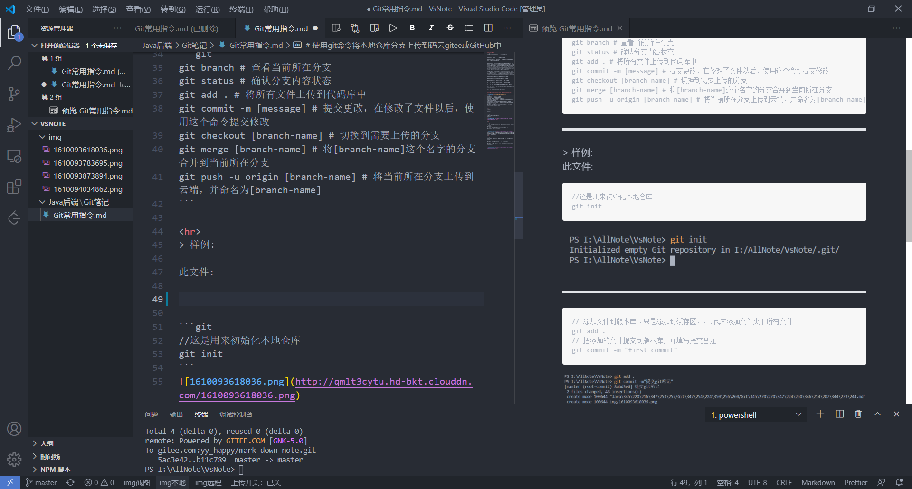
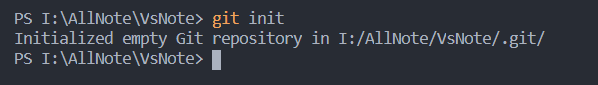
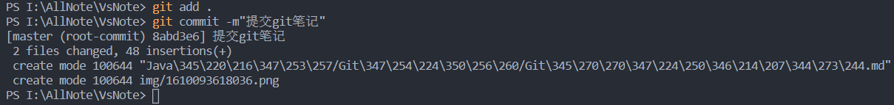
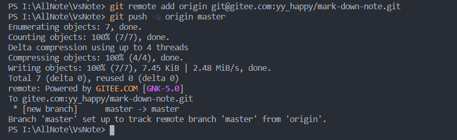

# Git 常用指令
```git
1.$ git clone [address] # 复制代码库到本地

2.$ git add [file] … # 添加文件到代码库中

3.$ git rm [file] … # 删除代码库的文件

4.$ git commit -m [message] # 提交更改，在修改了文件以后，使用这个命令提交修改


5.$ git pull # 从远程同步代码库到本地。（例如：git pull origin master ）------说明：此处的使用origin是因为第三步在建立本地仓库时git init 指令后面没有给本地仓库命名，因此origin为缺省的名字。如果在执行git init时添加了自定义名字，请使用自定义名字。本地仓库的名字没有要求非得和远程仓库名字相同。（此处的使用master是因为远程仓库的master分支，如果想上传到其它分支，此处改为指定分支名称即可）

6.$ git push # 推送代码到远程代码库。（例如：git push -u origin master）------说明：如果没有保存github（码云）的登录账号和密码， 再执行此指令后会提示输入Username和Password，输入正确的github（码云）的登录账号和密码之后就会上传之前提交的代码

7.$ git branch # 查看当前分支。带*是当前分支

8.$ git branch [branch-name] # 新建一个分支

9.$ git branch -d [branch-name] # 删除一个分支

10.$ git checkout [branch-name] # 切换到指定分支

11.$ git log # 查看提交记录（即历史的 commit 记录）

12.$ git status # 当前修改的状态，是否修改了还没提交，或者那些文件未使用

13.$ git reset [log] # 恢复到历史版本
```

# 使用git命令将本地仓库分支上传到码云gitee或GitHub中

在终端中打开文件目录后，**使用以下git命令（注意：[branch-name]是自定义项，表示分支名）:**
```git
git branch # 查看当前所在分支
git status # 确认分支内容状态
git add . # 将所有文件上传到代码库中
git commit -m [message] # 提交更改，在修改了文件以后，使用这个命令提交修改
git checkout [branch-name] # 切换到需要上传的分支
git merge [branch-name] # 将[branch-name]这个名字的分支合并到当前所在分支
git push -u origin [branch-name] # 将当前所在分支上传到云端，并命名为[branch-name]
```

<hr>
> 样例:

此文件:




```git
//这是用来初始化本地仓库
git init
```



<hr>

```git
// 添加文件到版本库（只是添加到缓存区），.代表添加文件夹下所有文件 
git add .
// 把添加的文件提交到版本库，并填写提交备注
git commit -m "first commit" 
```



到目前为止，我们完成了代码库的初始化，但代码是在本地，还没有提交到远程服务器，所以关键的来了，要提交到就远程代码服务器，进行以下两步：
<hr>

```git
git remote add origin 你的远程库地址  // 把本地库与远程库关联

git push -u origin master    // 第一次推送时

git push origin master  // 第一次推送后，直接使用该命令即可推送修改
`(如果报错,需要执行一遍 git pull origin master )---把本地仓库的变化连接到远程仓库主分支`
```




