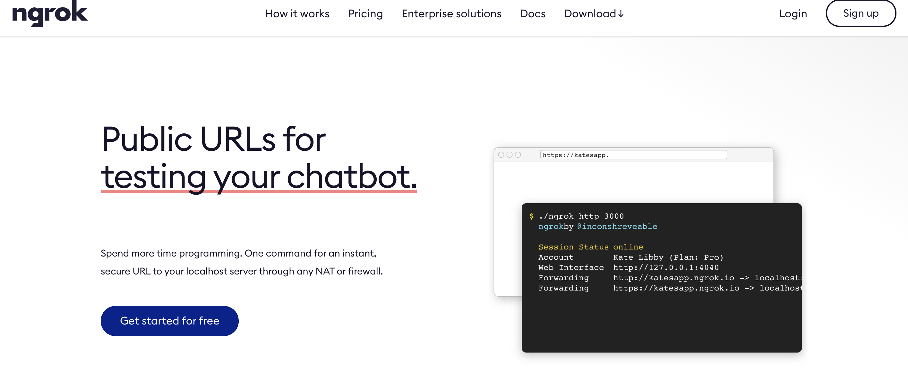
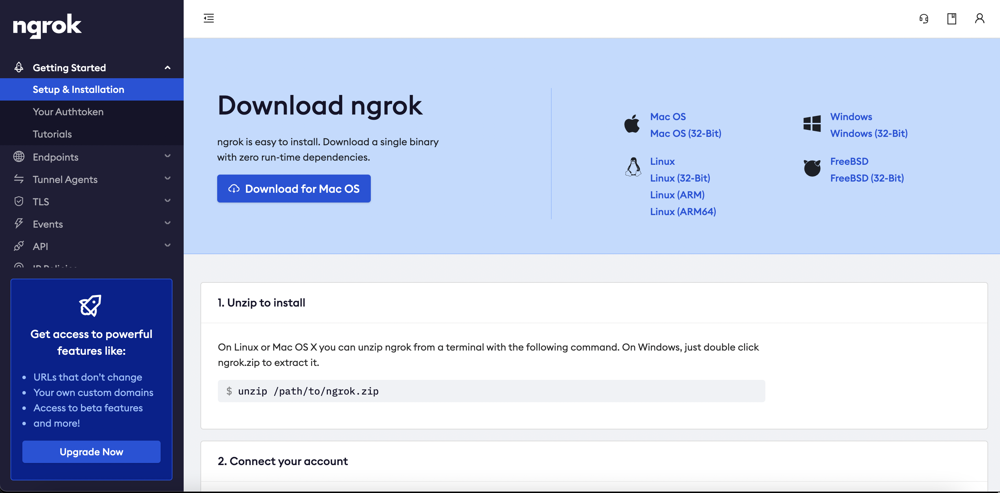
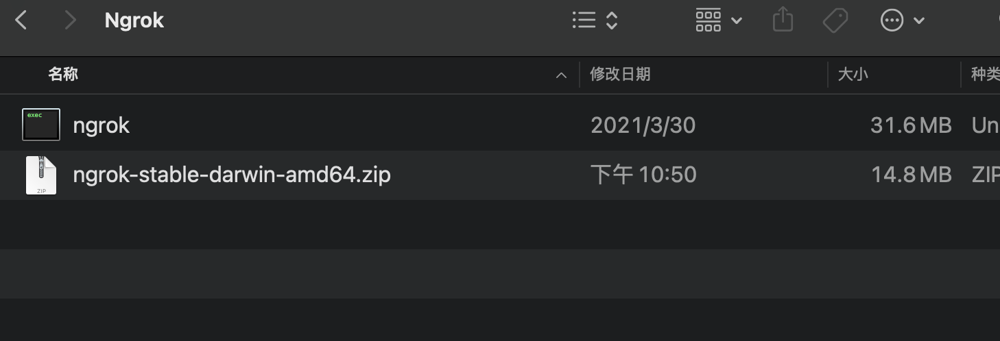
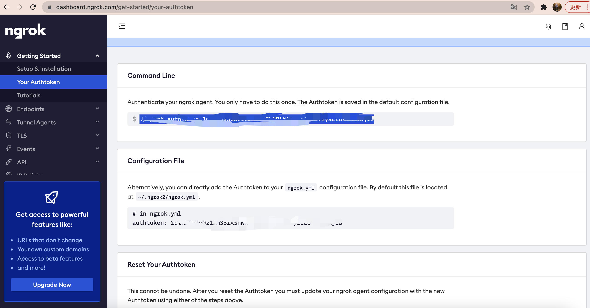
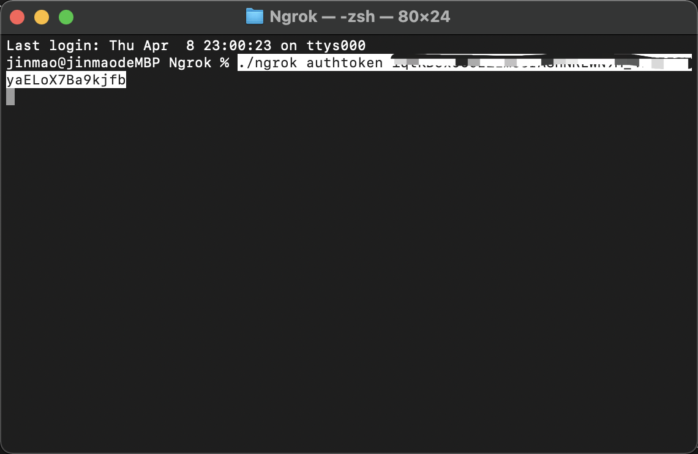
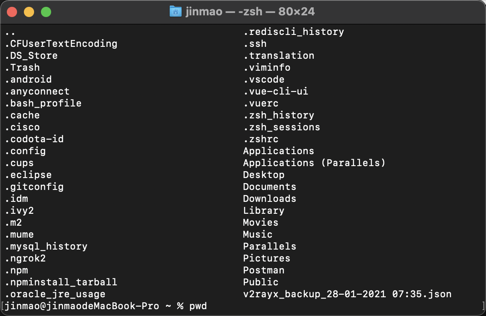
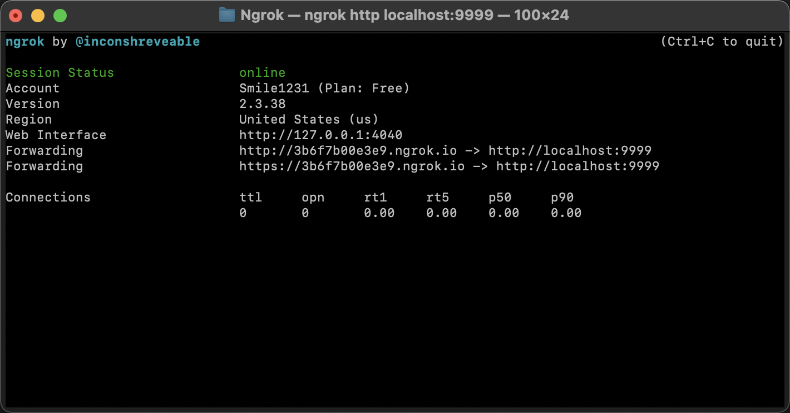

# ``Ngrok`` 内网穿透的使用


一般来说内网穿透在平时用的也会比较多一点，毕竟处于测的时候还是访问不到彼此的资源，比如说看效果之类的。``Ngrok`` 是比较常见的穿透方式

这边就简单介绍一下用法吧

## 官网

首先进入官网网址 [Ngrok网址](https://ngrok.com/),然后选择注册账号之类




注册完成之后就会进入相应的用户界面




点击下载``Ngrok``



这就是下载下来使用的程序


> 然后点击用户界面的``Your Authentoken``



每个用户会对应自己的``authtoken`` ,根据官网的提示进行操作。

由于博主的是``Mac``系统,所以直接打开终端 , 进入到 ``ngrok`` 的项目文件下





```shell
ngrok authtoken 授权码
```
授权码和账户是绑定的，在授权命令运行后，``ngrok``会将授权码保存在``~/.ngrok2/ngrok.yml``中，所以只需要运行一次，以后都可以使用。

这边我们可以使用``ls -a``进行查看




是有``.ngrok2``目录的，说明``ok``

然后再在 ``ngrok``的程序目录下运行相应的开放端口指令即可

```shell
# 例如
./ngrok http localhost:9999
```
就会出现以下





然后 ``http://3b6f7b00e3e9.ngrok.io`` 就是映射了本地的地址，那么外网就可以访问到了，缺点就是有点慢。


