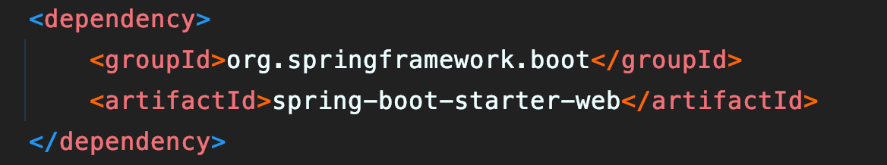
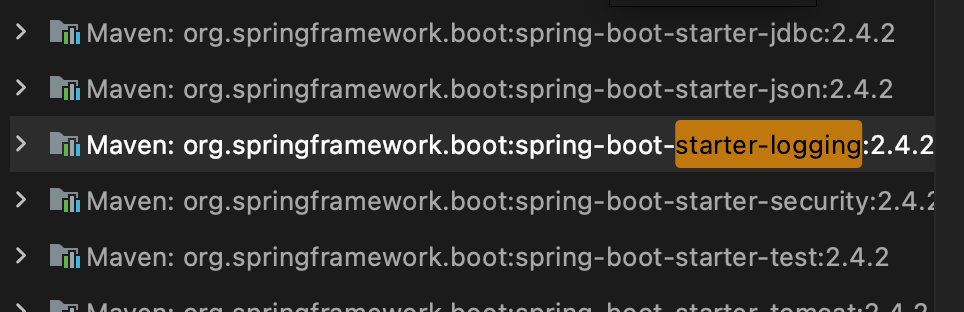
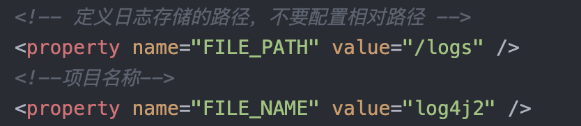

# ``Springboot``使用``log4j2``将日志文件输出到指定文件

## 说明
``Spring Boot``中默认日志工具是``logback``。对于很多习惯使用``log4j``的开发者，``Spring Boot``依然可以很好的支持，只是需要做一些小小的配置。

> 为什么选择``Log4j2``？

1. 性能较强

2. 扩展性强，可以自定义``level``。

3. 支持``kafka``

4. 数据稳定

## 引入``log4j2``依赖
```xml
<dependency>
    <groupId>org.springframework.boot</groupId>
     <artifactId>spring-boot-starter-log4j2</artifactId>
</dependency>
```

此时你需要注意一点，如果你引入了此项依赖




请删除``logback``湘关依赖，这是由于``springboot-web``默认集成的就是logback日志

```xml
<dependency>
   <groupId>org.springframework.boot</groupId>
   <artifactId>spring-boot-starter-web</artifactId>
   <exclusions>
       <exclusion>
           <groupId>org.springframework.boot</groupId>
           <artifactId>spring-boot-starter-logging</artifactId>
       </exclusion>
   </exclusions>
</dependency>
```
所以需要检查一下是否还有``starter-logging``的相关依赖
，如果有，就要务必找出与此相关的依赖并剔除掉，据我所知道的，``Thymeleaf``模版引擎也有``locgback``的相关依赖，所以需要剔除掉




如果你还能在你的依赖中找到这个，说明你的``logback``没有删除干净，看看是不是还有其他依赖包含了.

## 引入``log4j2.xml``配置文件

将以下 ``log4j.xml`` 文件置于 ``resources``目录下即可

```xml
<?xml version="1.0" encoding="UTF-8"?>
<!--Configuration后面的status，这个用于设置log4j2自身内部的信息输出，可以不设置，当设置成trace时，你会看到log4j2内部各种详细输出-->
<!--monitorInterval：Log4j能够自动检测修改配置 文件和重新配置本身，设置间隔秒数-->
<configuration monitorInterval="5">
    <!--日志级别以及优先级排序: OFF > FATAL > ERROR > WARN > INFO > DEBUG > TRACE > ALL -->
    <!--变量配置-->
    <Properties>
        <!-- 格式化输出：%date表示日期，%thread表示线程名，%-5level：级别从左显示5个字符宽度 %msg：日志消息，%n是换行符-->
        <!-- %logger{36} 表示 Logger 名字最长36个字符 -->
        <property name="LOG_PATTERN" value="%date{HH:mm:ss.SSS} [%thread] %-5level %logger{36}  - %msg%n" />
        <!-- 定义日志存储的路径，不要配置相对路径 -->
        <property name="FILE_PATH" value="/logs" /> 
        <!--项目名称-->
        <property name="FILE_NAME" value="log4j2" />
    </Properties>
    <appenders>
        <console name="Console" target="SYSTEM_OUT">
            <!--输出日志的格式-->
            <PatternLayout pattern="${LOG_PATTERN}"/>
            <!--控制台只输出level及其以上级别的信息（onMatch），其他的直接拒绝（onMismatch）-->
            <ThresholdFilter level="info" onMatch="ACCEPT" onMismatch="DENY"/>
        </console>
        <!--文件会打印出所有信息，这个log每次运行程序会自动清空，由append属性决定，适合临时测试用-->
        <File name="Filelog" fileName="${FILE_PATH}/test.log" append="false">
            <PatternLayout pattern="${LOG_PATTERN}"/>
        </File>
        <!-- 这个会打印出所有的info及以下级别的信息，每次大小超过size，则这size大小的日志会自动存入按年份-月份建立的文件夹下面并进行压缩，作为存档-->
        <RollingFile name="RollingFileInfo" fileName="${FILE_PATH}/${FILE_NAME}/info.log" filePattern="${FILE_PATH}/${FILE_NAME}-INFO-%d{yyyy-MM-dd}_%i.log.gz">
            <!--控制台只输出level及以上级别的信息（onMatch），其他的直接拒绝（onMismatch）-->
            <ThresholdFilter level="info" onMatch="ACCEPT" onMismatch="DENY"/>
            <PatternLayout pattern="${LOG_PATTERN}"/>
            <Policies>
                <!--interval属性用来指定多久滚动一次，默认是1 hour-->
                <TimeBasedTriggeringPolicy interval="1"/>
                <SizeBasedTriggeringPolicy size="10MB"/>
            </Policies>
            <!-- DefaultRolloverStrategy属性如不设置，则默认为最多同一文件夹下7个文件开始覆盖-->
            <DefaultRolloverStrategy max="15"/>
        </RollingFile>
        <!-- 这个会打印出所有的warn及以下级别的信息，每次大小超过size，则这size大小的日志会自动存入按年份-月份建立的文件夹下面并进行压缩，作为存档-->
        <RollingFile name="RollingFileWarn" fileName="${FILE_PATH}/${FILE_NAME}/warn.log" filePattern="${FILE_PATH}/${FILE_NAME}-WARN-%d{yyyy-MM-dd}_%i.log.gz">
            <!--控制台只输出level及以上级别的信息（onMatch），其他的直接拒绝（onMismatch）-->
            <ThresholdFilter level="warn" onMatch="ACCEPT" onMismatch="DENY"/>
            <PatternLayout pattern="${LOG_PATTERN}"/>
            <Policies>
                <!--interval属性用来指定多久滚动一次，默认是1 hour-->
                <TimeBasedTriggeringPolicy interval="1"/>
                <SizeBasedTriggeringPolicy size="10MB"/>
            </Policies>
            <!-- DefaultRolloverStrategy属性如不设置，则默认为最多同一文件夹下7个文件开始覆盖-->
            <DefaultRolloverStrategy max="15"/>
        </RollingFile>
        <!-- 这个会打印出所有的error及以下级别的信息，每次大小超过size，则这size大小的日志会自动存入按年份-月份建立的文件夹下面并进行压缩，作为存档-->
        <RollingFile name="RollingFileError" fileName="${FILE_PATH}/${FILE_NAME}/error.log" filePattern="${FILE_PATH}/${FILE_NAME}-ERROR-%d{yyyy-MM-dd}_%i.log.gz">
            <!--控制台只输出level及以上级别的信息（onMatch），其他的直接拒绝（onMismatch）-->
            <ThresholdFilter level="error" onMatch="ACCEPT" onMismatch="DENY"/>
            <PatternLayout pattern="${LOG_PATTERN}"/>
            <Policies>
                <!--interval属性用来指定多久滚动一次，默认是1 hour-->
                <TimeBasedTriggeringPolicy interval="1"/>
                <SizeBasedTriggeringPolicy size="10MB"/>
            </Policies>
            <!-- DefaultRolloverStrategy属性如不设置，则默认为最多同一文件夹下7个文件开始覆盖-->
            <DefaultRolloverStrategy max="15"/>
        </RollingFile>
    </appenders>
    <!--Logger节点用来单独指定日志的形式，比如要为指定包下的class指定不同的日志级别等。-->
    <!--然后定义loggers，只有定义了logger并引入的appender，appender才会生效-->
    <loggers>
        <!--过滤掉spring和mybatis的一些无用的DEBUG信息-->
        <logger name="org.mybatis" level="info" additivity="false">
            <AppenderRef ref="Console"/>
        </logger>
        <!--监控系统信息-->
        <!--若是additivity设为false，则 子Logger 只会在自己的appender里输出，而不会在 父Logger 的appender里输出。-->
        <Logger name="org.springframework" level="info" additivity="false">
            <AppenderRef ref="Console"/>
        </Logger>
        <root level="info">
            <appender-ref ref="Console"/>
            <appender-ref ref="Filelog"/>
            <appender-ref ref="RollingFileInfo"/>
            <appender-ref ref="RollingFileWarn"/>
            <appender-ref ref="RollingFileError"/>
        </root>
    </loggers>
</configuration>
```



其中这两个比较重要，一个是路径，一个是服务名，请修改成你自己的

到这里位置，``log4j2``的配置基本完成，现在去使用它。

第四步：使用``log4j2``将日志输出到指定文件

如果在``xml``里面配置的仅仅只是``/log``，如果你没有配置绝对路径，那么``log4j2``会默认在你项目的根目录创建你指定的日志目录.


