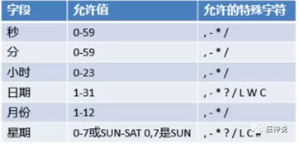
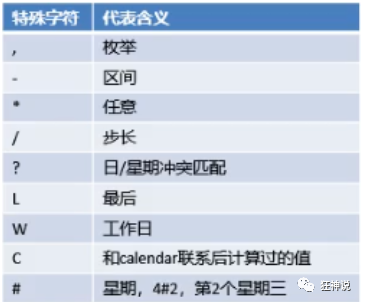

# 定时任务

项目开发中经常需要执行一些定时任务，比如需要在每天凌晨的时候，分析一次前一天的日志信息，Spring为我们提供了异步执行任务调度的方式，提供了两个接口。

- TaskExecutor接口

- TaskScheduler接口

两个注解：

- @EnableScheduling

- @Scheduled

cron表达式：








测试步骤：

1. 创建一个ScheduledService

我们里面存在一个hello方法，他需要定时执行，怎么处理呢？
```
@Service
public class ScheduledService {
   
   //秒   分   时     日   月   周几
   //0 * * * * MON-FRI
   //注意cron表达式的用法；
   @Scheduled(cron = "0 * * * * 0-7")
   public void hello(){
       System.out.println("hello.....");
  }
}
```

2. 这里写完定时任务之后，我们需要在主程序上增加@EnableScheduling 开启定时任务功能

```
@EnableAsync //开启异步注解功能
@EnableScheduling //开启基于注解的定时任务
@SpringBootApplication
public class SpringbootTaskApplication {

   public static void main(String[] args) {
       SpringApplication.run(SpringbootTaskApplication.class, args);
  }

}
```

3. 我们来详细了解下cron表达式；

http://www.bejson.com/othertools/cron/

4. 常用的表达式


```
（1）0/2 * * * * ?   表示每2秒 执行任务
（1）0 0/2 * * * ?   表示每2分钟 执行任务
（1）0 0 2 1 * ?   表示在每月的1日的凌晨2点调整任务
（2）0 15 10 ? * MON-FRI   表示周一到周五每天上午10:15执行作业
（3）0 15 10 ? 6L 2002-2006   表示2002-2006年的每个月的最后一个星期五上午10:15执行作
（4）0 0 10,14,16 * * ?   每天上午10点，下午2点，4点
（5）0 0/30 9-17 * * ?   朝九晚五工作时间内每半小时
（6）0 0 12 ? * WED   表示每个星期三中午12点
（7）0 0 12 * * ?   每天中午12点触发
（8）0 15 10 ? * *   每天上午10:15触发
（9）0 15 10 * * ?     每天上午10:15触发
（10）0 15 10 * * ?   每天上午10:15触发
（11）0 15 10 * * ? 2005   2005年的每天上午10:15触发
（12）0 * 14 * * ?     在每天下午2点到下午2:59期间的每1分钟触发
（13）0 0/5 14 * * ?   在每天下午2点到下午2:55期间的每5分钟触发
（14）0 0/5 14,18 * * ?     在每天下午2点到2:55期间和下午6点到6:55期间的每5分钟触发
（15）0 0-5 14 * * ?   在每天下午2点到下午2:05期间的每1分钟触发
（16）0 10,44 14 ? 3 WED   每年三月的星期三的下午2:10和2:44触发
（17）0 15 10 ? * MON-FRI   周一至周五的上午10:15触发
（18）0 15 10 15 * ?   每月15日上午10:15触发
（19）0 15 10 L * ?   每月最后一日的上午10:15触发
（20）0 15 10 ? * 6L   每月的最后一个星期五上午10:15触发
（21）0 15 10 ? * 6L 2002-2005   2002年至2005年的每月的最后一个星期五上午10:15触发
（22）0 15 10 ? * 6#3   每月的第三个星期五上午10:15触发
```

