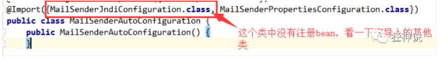
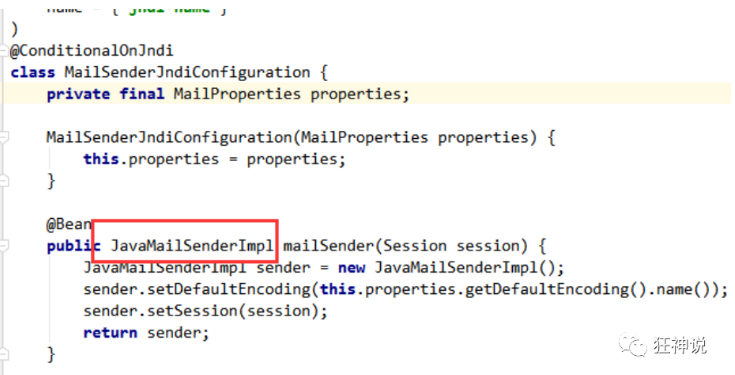
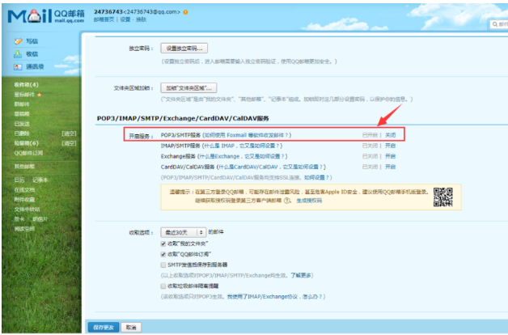

# 邮件任务
邮件发送，在我们的日常开发中，也非常的多，Springboot也帮我们做了支持

- 邮件发送需要引入spring-boot-start-mail

- SpringBoot 自动配置MailSenderAutoConfiguration

- 定义MailProperties内容，配置在application.yml中

- 自动装配JavaMailSender

- 测试邮件发送

测试：

1、引入pom依赖

```
<dependency>
   <groupId>org.springframework.boot</groupId>
   <artifactId>spring-boot-starter-mail</artifactId>
</dependency>
```
> 看它引入的依赖，可以看到 jakarta.mail
```
<dependency>
   <groupId>com.sun.mail</groupId>
   <artifactId>jakarta.mail</artifactId>
   <version>1.6.4</version>
   <scope>compile</scope>
</dependency>
```
2. 查看自动配置类：MailSenderAutoConfiguration



> 这个类中存在bean，JavaMailSenderImpl





> 然后我们去看下配置文件
```
@ConfigurationProperties(
   prefix = "spring.mail"
)
public class MailProperties {
   private static final Charset DEFAULT_CHARSET;
   private String host;
   private Integer port;
   private String username;
   private String password;
   private String protocol = "smtp";
   private Charset defaultEncoding;
   private Map<String, String> properties;
   private String jndiName;
}
```

1. 配置文件：

```
spring.mail.username=24736743@qq.com
spring.mail.password=你的qq授权码
spring.mail.host=smtp.qq.com
# qq需要配置ssl
spring.mail.properties.mail.smtp.ssl.enable=true
```

> 获取授权码：在QQ邮箱中的设置->账户->开启pop3和smtp服务





1. Spring单元测试

```
@Autowired
JavaMailSenderImpl mailSender;

@Test
public void contextLoads() {
   //邮件设置1：一个简单的邮件
   SimpleMailMessage message = new SimpleMailMessage();
   message.setSubject("通知-明天来狂神这听课");
   message.setText("今晚7:30开会");

   message.setTo("24736743@qq.com");
   message.setFrom("24736743@qq.com");
   mailSender.send(message);
}

@Test
public void contextLoads2() throws MessagingException {
   //邮件设置2：一个复杂的邮件
   MimeMessage mimeMessage = mailSender.createMimeMessage();
   MimeMessageHelper helper = new MimeMessageHelper(mimeMessage, true);

   helper.setSubject("通知-明天来狂神这听课");
   helper.setText("<b style='color:red'>今天 7:30来开会</b>",true);

   //发送附件
   helper.addAttachment("1.jpg",new File(""));
   helper.addAttachment("2.jpg",new File(""));

   helper.setTo("24736743@qq.com");
   helper.setFrom("24736743@qq.com");

   mailSender.send(mimeMessage);
}
```