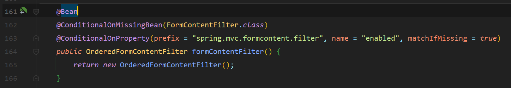
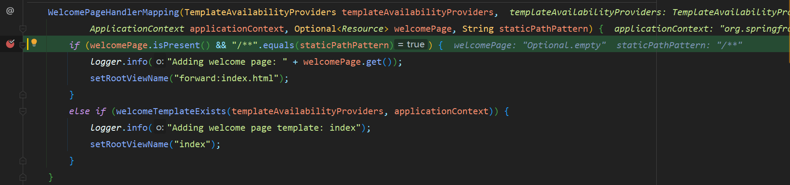

# Web开发


## 1、SpringMVC自动配置概览

Spring Boot provides auto-configuration for Spring MVC that **works well with most applications.(大多场景我们都无需自定义配置)**
The auto-configuration adds the following features on top of Spring’s defaults:
- Inclusion of ``ContentNegotiatingViewResolver`` and ``BeanNameViewResolver`` beans.
  - 内容协商视图解析器和BeanName视图解析器
- Support for serving static resources, including support for WebJars (covered [later in this document](https://docs.spring.io/spring-boot/docs/current/reference/html/spring-boot-features.html#boot-features-spring-mvc-static-content))).
    - 静态资源（包括webjars）
- Automatic registration of ``Converter``, ``GenericConverter``, and ``Formatter`` beans.
    - 自动注册 ``Converter``，``GenericConverter``，``Formatter ``
- Support for ``HttpMessageConverters`` ([covered later in this document](https://docs.spring.io/spring-boot/docs/current/reference/html/spring-boot-features.html#boot-features-spring-mvc-message-converters)).
    - 支持 ``HttpMessageConverters`` （后来我们配合内容协商理解原理）
- Automatic registration of ``MessageCodesResolver`` (covered [later in this document](https://docs.spring.io/spring-boot/docs/current/reference/html/spring-boot-features.html#boot-features-spring-message-codes)).
    - 自动注册 ``MessageCodesResolver`` （国际化用）
- Static ``index.html`` support.
    - 静态index.html 页支持
- Custom ``Favicon`` support (covered [later in this document](https://docs.spring.io/spring-boot/docs/current/reference/html/spring-boot-features.html#boot-features-spring-mvc-favicon)).
    - 自定义 ``Favicon``  
- Automatic use of a ``ConfigurableWebBindingInitializer`` bean (covered [later in this document](https://docs.spring.io/spring-boot/docs/current/reference/html/spring-boot-features.html#boot-features-spring-mvc-web-binding-initializer)).
    - 自动使用 ``ConfigurableWebBindingInitializer`` ，（DataBinder负责将请求数据绑定到JavaBean上）

> If you want to keep those Spring Boot [MVC customizations](https://docs.spring.io/spring/docs/5.2.9.RELEASE/spring-framework-reference/web.html#mvc) and make more MVC customizations (interceptors, formatters, view controllers, and other features), you can add your own ``@Configuration`` class of type ``WebMvcConfigurer`` but **without** ``@EnableWebMvc``.
**不用@EnableWebMvc注解。使用 ``@Configuration`` + ``WebMvcConfigurer`` 自定义规则**

> If you want to provide custom instances of ``RequestMappingHandlerMapping``, ``RequestMappingHandlerAdapter``, or ``ExceptionHandlerExceptionResolver``, and still keep the Spring Boot MVC customizations, you can declare a bean of type ``WebMvcRegistrations`` and use it to provide custom instances of those components.
**声明 ``WebMvcRegistrations`` 改变默认底层组件**

> If you want to take complete control of Spring MVC, you can add your own ``@Configuration`` annotated with ``@EnableWebMvc``, or alternatively add your own ``@Configuration``-annotated ``DelegatingWebMvcConfiguration`` as described in the Javadoc of ``@EnableWebMvc``.
**使用 ``@EnableWebMvc + @Configuration + DelegatingWebMvcConfiguration 全面接管SpringMVC``**

## 2、简单功能分析
### 2.1、静态资源访问
#### 1、静态资源目录

只要静态资源放在类路径下： called ``/static`` (or ``/public`` or ``/resources`` or ``/META-INF/resources``
访问 ： <font color=#B8860B>当前项目根路径/ + 静态资源名</font>

原理： 静态映射``/**``。
请求进来，先去找Controller看能不能处理。不能处理的所有请求又都交给静态资源处理器。静态资源也找不到则响应404页面

<font color=#228B22>改变默认的静态资源路径</font>

```yaml
spring:
  mvc:
    static-path-pattern: /res/**
  resources:
    static-locations: [classpath:/haha/]
```

#### <table><tr><td bgcolor=orange>2、静态资源访问前缀</td></tr></table>

默认没有前缀

```yaml
spring:
  mvc:
    static-path-pattern: /res/**
```
<table><tr><td bgcolor=#9ACD32>当前项目 + static-path-pattern + 静态资源名 = 静态资源文件夹下找 </td></tr></table>

#### 3、webjar

自动映射 ``/webjars/**``

[webjars官网](https://www.webjars.org/)

```yaml
<dependency>
    <groupId>org.webjars</groupId>
    <artifactId>jquery</artifactId>
    <version>3.5.1</version>
</dependency>
```
访问地址：``http://localhost:8080/webjars/jquery/3.5.1/jquery.js``   后面地址要按照依赖里面的包路径

### 2.2 欢迎页支持
- 静态资源路径下  index.html
    - 可以配置静态资源路径
    - 但是不可以配置静态资源的访问前缀。否则导致 index.html不能被默认访问
```yaml
spring:
#  mvc:
#    static-path-pattern: /res/**   这个会导致welcome page功能失效

  resources:
    static-locations: [classpath:/haha/]
```
- controller 能处理``/index``
  
### 2.3、自定义Favicon
favicon-ico 放置在静态资源目录下即可
```yaml
spring:
#  mvc:
#    static-path-pattern: /res/**   这个会导致 Favicon 功能失效
```

### <table><tr><td bgcolor=#FF6347>2.4、静态资源配置原理</table></td></td>
- SpringBoot启动默认加载  xxxAutoConfiguration 类（自动配置类）
- SpringMVC功能的自动配置类 WebMvcAutoConfiguration，生效

<table><tr><td bgcolor=#EE82EE>又到了人见人爱的源码解析时刻</table></td></td>

打开我们的``springboot-autoconfigure``包下的 `` web->servlet->WebMvcAutoConfiguration `` class文件

```java
@Configuration(proxyBeanMethods = false)
@ConditionalOnWebApplication(type = Type.SERVLET)
//已经导入了springMvc的包必然就会有这些类
@ConditionalOnClass({ Servlet.class, DispatcherServlet.class, WebMvcConfigurer.class })
//全面接管SpringMvc
@ConditionalOnMissingBean(WebMvcConfigurationSupport.class)
@AutoConfigureOrder(Ordered.HIGHEST_PRECEDENCE + 10)
@AutoConfigureAfter({ DispatcherServletAutoConfiguration.class, TaskExecutionAutoConfiguration.class,
		ValidationAutoConfiguration.class })
public class WebMvcAutoConfiguration {}
```
- 看看容器中配置了什么
-----------
该 ``HiddenHttpMethodFilter`` 是用来处理Rest风格的请求提交


------------

表单内容过滤器



------------
静态内部类

```java
//说明是个配置类
@Configuration(proxyBeanMethods = false)
@Import(EnableWebMvcConfiguration.class)
//这个注解比较重要
@EnableConfigurationProperties({ WebMvcProperties.class, ResourceProperties.class })
@Order(0)
public static class WebMvcAutoConfigurationAdapter implements WebMvcConfigurer {}
```
``@EnableConfigurationProperties`` 配置文件的相关属性和 xxx进行了绑定. 
> WebMvcProperties==**spring.mvc**


> ResourceProperties==**spring.resources**


然后观察该配置类只有一个有参构造器
```java
public WebMvcAutoConfigurationAdapter(
    ResourceProperties resourceProperties, 
    WebMvcProperties mvcProperties,
    ListableBeanFactory beanFactory, ObjectProvider<HttpMessageConverters> messageConvertersProvider,
    ObjectProvider<ResourceHandlerRegistrationCustomizer> resourceHandlerRegistrationCustomizerProvider,
    ObjectProvider<DispatcherServletPath> dispatcherServletPath,
    ObjectProvider<ServletRegistrationBean<?>> servletRegistrations) {
	this.resourceProperties = resourceProperties;
	this.mvcProperties = mvcProperties;
	this.beanFactory = beanFactory;
	this.messageConvertersProvider = messageConvertersProvider;
	this.resourceHandlerRegistrationCustomizer = resourceHandlerRegistrationCustomizerProvider.getIfAvailable();
	this.dispatcherServletPath = dispatcherServletPath;
	this.servletRegistrations = servletRegistrations;
}
```
<table><tr><td bgcolor=black>
有参构造器所有参数的值都会从容器中确定

``ResourceProperties resourceProperties``；获取和``spring``.``resources``绑定的所有的值的对象

``WebMvcProperties mvcProperties`` 获取和``spring.mvc``绑定的所有的值的对象

``ListableBeanFactory beanFactory`` ``Spring``的``beanFactory``

``HttpMessageConverters`` 找到所有的 ``HttpMessageConverters``

``ResourceHandlerRegistrationCustomizer`` 找到资源处理器的自定义器。=========

``DispatcherServletPath``  

``ServletRegistrationBean``   给应用注册``Servlet``、``Filter``....

</table></td></td>

-------------

视图解析器


-----------

国际化支持


-----------

国际化消息解析


-----------

格式化器


----------

添加资源处理器
**资源处理的默认规则**:
```java
@Override
public void addResourceHandlers(ResourceHandlerRegistry registry) {
  if (!this.resourceProperties.isAddMappings()) {
    logger.debug("Default resource handling disabled");
    return;
  }
  Duration cachePeriod = this.resourceProperties.getCache().getPeriod();
  CacheControl cacheControl = this.resourceProperties.getCache().getCachecontrol().toHttpCacheControl();
  if (!registry.hasMappingForPattern("/webjars/**")) {
   customizeResourceHandlerRegistration(registry.addResourceHandler("/webjars/**")
  		.addResourceLocations("classpath:/META-INF/resources/webjars/")
  		.setCachePeriod(getSeconds(cachePeriod)).setCacheControl(cacheControl));
  }
  String staticPathPattern = this.mvcProperties.getStaticPathPattern();
  if (!registry.hasMappingForPattern(staticPathPattern)) {
     customizeResourceHandlerRegistration(registry.addResourceHandler(staticPathPattern)
  		.addResourceLocations(getResourceLocations(this.resourceProperties.getStaticLocations()))
  		.setCachePeriod(getSeconds(cachePeriod)).setCacheControl(cacheControl));
  }
}
```
打上断点


```java
if (!this.resourceProperties.isAddMappings()) {
  logger.debug("Default resource handling disabled");
  return;
}
```
此处的``resourceProperties``就是上面那个带参构造器从容器中获取的值,而 可以看出上述笔记, ``resourceProperties``与``spring.resources``对应,意思就是获取配置文件中``isAddMappings``的值


默认值为true


由于上面是取反的,所以当``isAddMapping``为``false``时,日志打印为``Default resource handling disabled``静态资源就被禁用了!

我们继续debug往下走,


```java
if (!registry.hasMappingForPattern("/webjars/**")) {
    //如果注册中心中包含``/webjars/``的路劲,就将它映射到 ``classpath:/META-INF/resources/webjars/``路径下面
  customizeResourceHandlerRegistration(registry.addResourceHandler("/webjars/**")
    .addResourceLocations("classpath:/META-INF/resources/webjars/")
    //这边是设置缓存的时间,也是从配置文件中获取
    .setCachePeriod(getSeconds(cachePeriod)).setCacheControl(cacheControl));
}
```

这边也就解释了为什么输入``http://localhost:8080/webjars/jquery/3.5.1/jquery.js``就可以访问到相应的资源了,是做了路径的映射

继续往下debug,
其实是和上面的webjars的映射调用了相同的方法,


如果有``/**``请求,就将他映射到``this.resourceProperties.getStaticLocations()``

点进去查看:


所以默认的访问路径源码都在这边. Debug结束

------------

**欢迎页的处理规则**

继续往下翻源码:

```java
@Bean
public WelcomePageHandlerMapping welcomePageHandlerMapping(

    ApplicationContext applicationContext,
    
    FormattingConversionService mvcConversionService, 
    
    ResourceUrlProvider mvcResourceUrlProvider
    
    )
     {
  	WelcomePageHandlerMapping welcomePageHandlerMapping = new WelcomePageHandlerMapping(
  			new TemplateAvailabilityProviders(applicationContext), applicationContext, getWelcomePage(),
              //从配置文件中获取
  			this.mvcProperties.getStaticPathPattern());
  	welcomePageHandlerMapping.setInterceptors(getInterceptors(mvcConversionService, mvcResourceUrlProvider));
  	welcomePageHandlerMapping.setCorsConfigurations(getCorsConfigurations());
  	return welcomePageHandlerMapping;
}
```
<table><tr><td bgcolor=#FF6347>
``HandlerMapping``: 处理器映射。保存了每一个Handler能处理哪些请求。
</table></td></td>
打断点进行调试:




此处的``staticPathPattern`` 就是``this.mvcProperties.getStaticPathPattern()`` 默认值为``/**``,如果配置文件中有值
```java
if (welcomePage.isPresent() && "/**".equals(staticPathPattern)) {
 logger.info("Adding welcome page: " + welcomePage.get());
 setRootViewName("forward:index.html");
}
```
也就是说,如果想要使用欢迎页功能,yaml中就不能够配置 ``spring.resources.staticPathPattern``的值

-----------

## 3、请求参数处理
#### 3.1、rest使用与原理
- ``@xxxMapping``；
- Rest风格支持（使用HTTP请求方式动词来表示对资源的操作）
- 以前：``/getUser``   获取用户     ``/deleteUser`` 删除用户 ``/editUser``  修改用户  ``/saveUser`` 保存用户
- 现在： ``/user``    GET-获取用户    DELETE-删除用户     PUT-修改用户      POST-保存用户
- 核心``Filter``；``HiddenHttpMethodFilter``
- 用法： 表单``method=post``，隐藏域 ``_method=put``
- ``SpringBoot``配置文件中手动开启``spring.mvc.hiddenmethod.filter.enabled``
- 扩展：如何把``_method`` 这个名字换成我们自己喜欢的。

**解释用法:**
上面说到 ,  ``OrderedHiddenHttpMethodFilter`` ,然后我们尝试点进该类

```java
@Bean
@ConditionalOnMissingBean(HiddenHttpMethodFilter.class)
//这边的注解解释了为什么要在配置文件中 设置 --spring.mvc.hiddenmethod.filter.enabled--的值
@ConditionalOnProperty(prefix = "spring.mvc.hiddenmethod.filter", name = "enabled", matchIfMissing = false)
public OrderedHiddenHttpMethodFilter hiddenHttpMethodFilter() {
	return new OrderedHiddenHttpMethodFilter();
}
```
              | |
              | |
              \ /


然后可以发现该类继承于 ``HiddenHttpMethodFilter`` ,然后我们点进 ``HiddenHttpMethodFilter``

```java
public class HiddenHttpMethodFilter extends OncePerRequestFilter {

 private static final List<String> ALLOWED_METHODS =
			Collections.unmodifiableList(Arrays.asList(HttpMethod.PUT.name(),
					HttpMethod.DELETE.name(), HttpMethod.PATCH.name()));
	/** Default method parameter: {@code _method}. */
	public static final String DEFAULT_METHOD_PARAM = "_method";
	private String methodParam = DEFAULT_METHOD_PARAM;
	/**
	 * Set the parameter name to look for HTTP methods.
	 * @see #DEFAULT_METHOD_PARAM
	 */
	public void setMethodParam(String methodParam) {
		Assert.hasText(methodParam, "'methodParam' must not be empty");
		this.methodParam = methodParam;
	}
	@Override
	protected void doFilterInternal(HttpServletRequest request, HttpServletResponse response, FilterChain filterChain)
			throws ServletException, IOException {

·		HttpServletRequest requestToUse = request;

		if ("POST".equals(request.getMethod()) && request.getAttribute(WebUtils.ERROR_EXCEPTION_ATTRIBUTE) == null) {
			String paramValue = request.getParameter(this.methodParam);
			if (StringUtils.hasLength(paramValue)) {
				String method = paramValue.toUpperCase(Locale.ENGLISH);
				if (ALLOWED_METHODS.contains(method)) {
					requestToUse = new HttpMethodRequestWrapper(request, method);
				}
			}
		}

		filterChain.doFilter(requestToUse, response);
	}
	/**
	 * Simple {@link HttpServletRequest} wrapper that returns the supplied method for
	 * {@link HttpServletRequest#getMethod()}.
	 */
	private static class HttpMethodRequestWrapper extends HttpServletRequestWrapper {

		private final String method;

		public HttpMethodRequestWrapper(HttpServletRequest request, String method) {
			super(request);
			this.method = method;
		}
		@Override
		public String getMethod() {
			return this.method;
		}
	}
}
```
进行打断点调试:

发送put以及delete或者patch请求时,都是默认为POST请求处理

```java
if ("POST".equals(request.getMethod()) && request.getAttribute(WebUtils.ERROR_EXCEPTION_ATTRIBUTE) == null) {
	//this.methodParam = _method 所以是获取name为  _method 的value值
  String paramValue = request.getParameter(this.methodParam);
  if (StringUtils.hasLength(paramValue)) {
  //一致转为大写
  String method = paramValue.toUpperCase(Locale.ENGLISH);
  //ALLOWED_METHODS={HttpMethod.PUT.name(),HttpMethod.DELETE.name(), HttpMethod.PATCH.name()}
  if (ALLOWED_METHODS.contains(method)) {
  //调用 HttpMethodRequestWrapper方法
   requestToUse = new HttpMethodRequestWrapper(request, method);
  }
  }
}
//最后进行放行
filterChain.doFilter(requestToUse, response);
```		
                     | |
              	 | |
                     \ /

```java
private static class HttpMethodRequestWrapper extends HttpServletRequestWrapper {
	//重新定义一个method变量
  private final String method;
  public HttpMethodRequestWrapper(HttpServletRequest request, String method) {
	//调用父级方法
  	super(request);
	//将name 为 _method   的value值赋给 method
  	this.method = method;
  }

  //由于这边重写了 ``ServletRequest``中的getMethod方法,所以在最后method的值就变成了了新的值
  @Override
  public String getMethod() {
  	return this.method;
  }
}
```
**以上就很好的解释了表单提交时,因为form表单只支持``GET``以及``POST``请求,所以都会有一个``input``中``name``的值为``_method``,``value``的值为请求方式**

实例:
记得这只是表单提交采用的简便方式,而且一定要**开启配置文件中的``spring.mvc.hiddenmethod.filter.enabled=true``**
```html
<form action="/user" method="get">
    <input name="_method" type="hidden" value="get">
    <input type="submit"  value="Rest-Get 提交">
</form>
<form action="/user" method="post">
    <input name="_method" type="hidden" value="post">
    <input type="submit"  value="Rest-post 提交">
</form>
<form action="/user" method="post">
    <input name="_method" type="hidden" value="put">
    <input type="submit"  value="Rest-put 提交">
</form>
<form action="/user" method="post">
    <input name="_method" type="hidden" value="delete">
    <input type="submit"  value="Rest-delete 提交">
</form>
```
controller类:
```java
@Controller
@ResponseBody
public class TestController {
  @RequestMapping(value = "/user",method = RequestMethod.GET)
  public String getUser(){
      return "GET-张三";
  }

  @RequestMapping(value = "/user",method = RequestMethod.POST)
  public String saveUser(){
      return "POST-张三";
  }


  @RequestMapping(value = "/user",method = RequestMethod.PUT)
  public String putUser(){
      return "PUT-张三";
  }

  @RequestMapping(value = "/user",method = RequestMethod.DELETE)
  public String deleteUser(){
      return "DELETE-张三";
  }
}
```
**拓展:**
配置相关自定义的``name``的值 

首先要进行``JavaConfig``的配置:
```java

/**
 * @author cy
 * @create 2021-01-19-19:13
 * @Description
 */
@Configuration
public class WebMvc {
  @Bean
  public OrderedHiddenHttpMethodFilter hiddenHttpMethodFilter() {
      OrderedHiddenHttpMethodFilter orderedHiddenHttpMethodFilter = new OrderedHiddenHttpMethodFilter();
      orderedHiddenHttpMethodFilter
      //这边的 methodParam 的值就是对应的name的值
      .setMethodParam("_cy");
      return orderedHiddenHttpMethodFilter;
  }
}
```
前端表单:

```html
<form action="/user" method="post">
    <input name="_cy" type="hidden" value="put">
    <input type="submit"  value="Rest-put 提交">
</form>
```
经过测试是成功的
<table><tr><td bgcolor=#5a8f0b>

**Rest原理（表单提交要使用REST的时候)**
- 表单提交会带上``_method=PUT``
- 请求过来被``HiddenHttpMethodFilter``拦截
- 请求是否正常，并且是``POST``
- 获取到``_method``的值。
- 兼容以下请求；``PUT.DELETE.PATCH``
- 原生``request（post）``，包装模式``requesWrapper``重写了``getMethod``方法，返回的是传入的值。
- 过滤器链放行的时候用``wrapper``。以后的方法调用``getMethod``是调用``requesWrapper``的。
``Rest``使用客户端工具，
- 如``PostMan``直接发送``Put``、``delete``等方式请求，无需``Filter``
</table></tr></td>

```java
spring:
  mvc:
    hiddenmethod:
      filter:
        enabled: true   #开启页面表单的Rest功能
```

#### 3.2 请求映射原理

在``SpringMvc``中,,我们首先想到的就是 ``DispatcherServlet``,他是处理所有请求的开始,

继承树:


我们可以看到 


**↑**箭头说明了重写了父类中的方法
**↓**箭头说明没有重写

``FrameworkServlet``重写了``HttpServlet``中的``do**``方法

该类中的``do**``方法都是同样调用了本类中``processRequest``方法


点进``processRequest``方法:

除去一些赋值代码,核心代码为``try``内的代码:
```java
try {
  //调用本类中的doService方法
  doService(request, response);
}
```
点开``doService``方法:

是一个抽象方法,在其子类中得到实现:


然后我们在``DispatcherServlet``中找到了``doService``的重写,除去一些繁琐的赋值,核心代码为``try'`内:
```java
try {
  doDispatch(request, response);
}
```
点开``doDispatch``**(无限套娃)**:
此处就是较核心的代码
```java
protected void doDispatch(HttpServletRequest request, HttpServletResponse response) throws Exception {
		HttpServletRequest processedRequest = request;
		HandlerExecutionChain mappedHandler = null;
		boolean multipartRequestParsed = false;
		WebAsyncManager asyncManager = WebAsyncUtils.getAsyncManager(request);
		try {
    	ModelAndView mv = null;
    	Exception dispatchException = null;
    	try {
        //检查文件上传
    		processedRequest = checkMultipart(request);
    		multipartRequestParsed = (processedRequest != request);
    		// **找到当前请求使用哪个Handler（Controller的方法）处理
    		mappedHandler = getHandler(processedRequest);
         //HandlerMapping：处理器映射。/xxx->>xxxx
```
点开核心方法``getHandler``:

```java
@Nullable
protected HandlerExecutionChain getHandler(HttpServletRequest request) throws Exception {
  if (this.handlerMappings != null) {
  	for (HandlerMapping mapping : this.handlerMappings) {
  		HandlerExecutionChain handler = mapping.getHandler(request);
  		if (handler != null) {
  			return handler;
  		}
  	}
 }
  return null;
}
```

下面进行打断点进行调试:


**RequestMappingHandlerMapping:** 保存了所有``@RequestMapping`` 和``handler``的映射规则。


**所有的请求映射都在HandlerMapping中。**
- ``SpringBoot``自动配置欢迎页的 ``WelcomePageHandlerMapping`` 。访问 /能访问到``index.html``；
- ``SpringBoot``自动配置了默认 的 ``RequestMappingHandlerMapping``
- 请求进来，挨个尝试所有的``HandlerMapping``看是否有请求信息。
- 如果有就找到这个请求对应的``handler``
- 如果没有就是下一个 ``HandlerMapping``
- 我们需要一些自定义的映射处理，我们也可以自己给容器中放 **``HandlerMapping``**。自定义 **``HandlerMapping``**

点开``mapping.getHanlder()``方法:


进入``getHandlerInternal()``方法:


调用了父类的``getHanlderInternal()``方法,进入

``lookupPath``的值为请求的``url``的拼接:
```java
// lookupPath = "/user"
String lookupPath = getUrlPathHelper().getLookupPathForRequest(request);
```


获取到了请求中的url链接``/user``


再度套娃进入核心方法``lookupHandlerMethod()``:


```java 
// directPathMatches 是返回的映射中 所有的满足要要求的 url 忽略请求方式的返回结果.
List<T> directPathMatches = this.mappingRegistry.getMappingsByUrl(lookupPath);
```


```java
addMatchingMappings(directPathMatches, matches, request);
```
点进``addMatchingMappings``方法:

遍历传递过来的``directPathMatches``传递给``Mapping``,并遍历他,将每一像都进行一遍``getMatchingMapping()``方法


继续调试进入``getMatchingMapping``:


调试进入 ``RequestMappingInfo.getMatchingCondition(request)``,传递的参数只有发送的请求``request``:


调试进入``this.methodsCondition.getMatchingCondition``:


``getMethods()``的值为请求方式:


``getMatchingCondition`` 方法中前两个``if``都不满足条件,所以会调用``matchRequestMethod``,调试进入``matchRequestMethod``:


调试进入``requestMethodConditionCache.get(httpMethodValue)``方法:
直接返回到:


然后直接返回出来:


然后将获取到的值存入到 ``matches`` 数组中


最后会直接调试跳转到``lookupHandlerMethod``中:


异常处理程序:


返回结果:


==差不多这就是所有关于**web发起请求映射**解决处理映射的简单底层原理,还有一些详细的细节没有说==


**所有的请求映射都在HandlerMapping中**
- ``SpringBoot``自动配置欢迎页的 ``WelcomePageHandlerMapping`` 。访问 /能访问到``index.html``；
- ``SpringBoot``自动配置了默认 的 ``RequestMappingHandlerMapping``
- 请求进来，挨个尝试所有的``HandlerMapping``看是否有请求信息。
- 如果有就找到这个请求对应的``handler``
- 如果没有就是下一个 ``HandlerMapping``
- 我们需要一些自定义的映射处理，我们也可以自己给容器中放 **``HandlerMapping``**。自定义 **``HandlerMapping``**

---------------------


