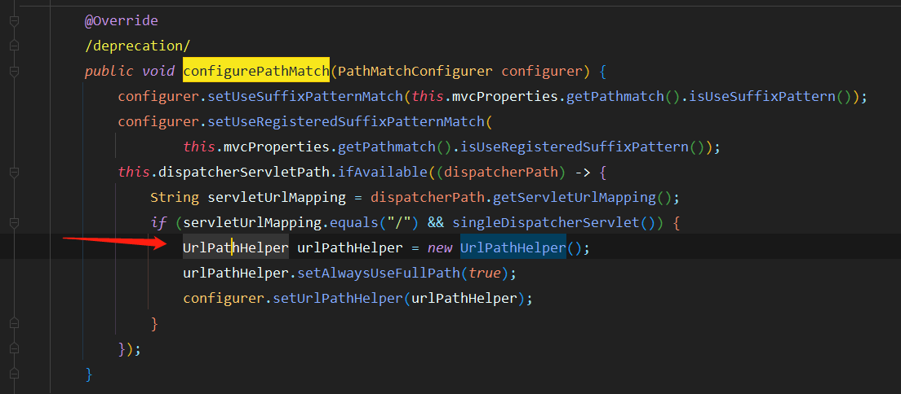
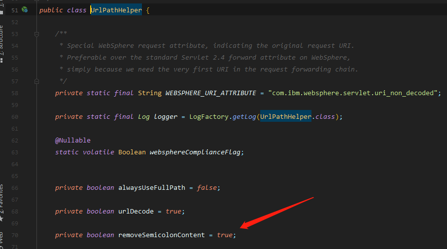
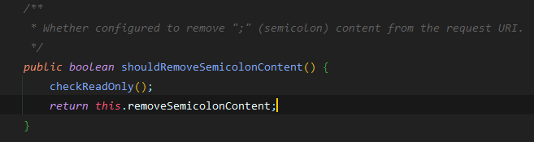
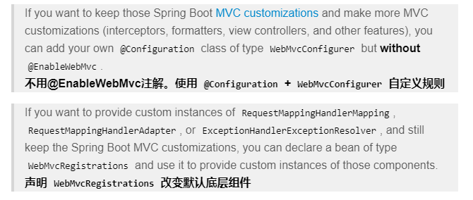
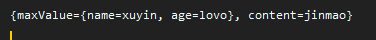

# Controller常用注解
- **``@PathVariable(路径变量)``、**
- **``@RequestHeader(获取请求头)``、**
- **``@RequestParam(获取请求头参数)``、**
- **``@CookieValue(获取cookie值)``、**
- **``@RequestBody(获取请求体)``**
- **``@ModelAttribute/RequestAttribute(获取request域属性)``、**
- **``@MatrixVariable(矩阵变量)``、**

其中 **``@PathVariable(路径变量)``** **``@RequestHeader(获取请求头) ``、** **``@RequestParam(获取请求头参数)``、** **``@MatrixVariable(矩阵变量)``、** ==只需要创建一个``Map<String,String>``就会自动将所有的数据封装进去==

其中 **``@CookieValue(获取cookie值)``** 只需要 创建相应的 ``javax.servlet.http.Cookie``类 ,但是要带上注解的``value``值才能获取相应的``Cookie``值

```java
@RestController
public class ParameterTestController {


    //  car/2/owner/zhangsan
    @GetMapping("/car/{id}/owner/{username}")
    public Map<String,Object> getCar(@PathVariable("id") Integer id,
                                     @PathVariable("username") String name,
                                     @PathVariable Map<String,String> pv,
                                     @RequestHeader("User-Agent") String userAgent,
                                     @RequestHeader Map<String,String> header,
                                     @RequestParam("age") Integer age,
                                     @RequestParam("inters") List<String> inters,
                                     @RequestParam Map<String,String> params,
                                     @CookieValue("_ga") String _ga,
                                     @CookieValue("_ga") Cookie cookie){


        Map<String,Object> map = new HashMap<>();

//        map.put("id",id);
//        map.put("name",name);
//        map.put("pv",pv);
//        map.put("userAgent",userAgent);
//        map.put("headers",header);
        map.put("age",age);
        map.put("inters",inters);
        map.put("params",params);
        map.put("_ga",_ga);
        System.out.println(cookie.getName()+"===>"+cookie.getValue());
        return map;
    }


    @PostMapping("/save")
    public Map postMethod(@RequestBody String content){
        Map<String,Object> map = new HashMap<>();
        map.put("content",content);
        return map;
    }
}
```
**``@MatrixVariable``**注解

==关于开启矩阵变量的过程==

在``WebMvcAutoConfiguration``中,找到``configurePathMatch``方法,点进``UrlPathHelper``(URL路径帮助器)



``UrlPathHelper(URL路径帮助器)``中的``removeSemicolonContent``



了解该值的意义:



```java
/**
	 * Whether configured to remove ";" (semicolon) content from the request URI.
	 */
     // 是否忽略;后面的内容在于该值的确定
	public boolean shouldRemoveSemicolonContent() {
		checkReadOnly();
		return this.removeSemicolonContent;
	}
```
所以是否能够接受到矩阵变量的值,在于``removeSemicolonContent``的值,是否开启了这个功能,默认是关闭的,所以需要自己配置打开.

有两个方案:


==千万不要加``@EnableWebMvc``注解==

 **方案一**:
 实现``WebMvcConfigurer``接口,并重写上述的``configurePathMatch``方法
 ```java
 /**
 * @author cy
 * @create 2021-01-19-19:13
 * @Description
 */
@Configuration
public class WebMvc implements WebMvcConfigurer {
    @Override
    public void configurePathMatch(PathMatchConfigurer configurer) {
        UrlPathHelper urlPathHelper = new UrlPathHelper();
        //将removeSemicolonContent 的值 设置为false
        urlPathHelper.setRemoveSemicolonContent(false);
        configurer.setUrlPathHelper(urlPathHelper);
    }
}
 ```


 **方案二:**
直接使用``@Bean``注解将一个新的``WebMvcConfigurer``注入容器
 ```java
 /**
 * @author cy
 * @create 2021-01-19-19:13
 * @Description
 */
@Configuration
public class WebMvc implements WebMvcConfigurer {
    @Bean
    public WebMvcConfigurer webMvcConfigurer(){
        return new WebMvcConfigurer() {
            @Override
            public void configurePathMatch(PathMatchConfigurer configurer) {
                UrlPathHelper urlPathHelper = new UrlPathHelper();
                urlPathHelper.setRemoveSemicolonContent(false);
                configurer.setUrlPathHelper(urlPathHelper);
            }
        };
    }
}
 ```

 实验代码:
 ```html
 <a href="/matrix/jinmao;name=xuyin,age=lovo">点击链接2试用</a>


 @GetMapping("/matrix/{content}")
    public  Map testMatrixValue(@PathVariable("content") String content ,
                                @MatrixVariable Map<String, String> maxValue
                                ){
        HashMap<String, Object> map = new HashMap<>();
        map.put("content", content);
        map.put("maxValue", maxValue);
        System.out.println(map);
        return map;
    }
 ```

 结果:




```java
 //1、语法： 请求路径：/cars/sell;low=34;brand=byd,audi,yd
    //2、SpringBoot默认是禁用了矩阵变量的功能
    //      手动开启：原理。对于路径的处理。UrlPathHelper进行解析。
    //              removeSemicolonContent（移除分号内容）支持矩阵变量的
    //3、矩阵变量必须有url路径变量才能被解析
    @GetMapping("/cars/{path}")
    public Map carsSell(@MatrixVariable("low") Integer low,
                        @MatrixVariable("brand") List<String> brand,
                        @PathVariable("path") String path){
        Map<String,Object> map = new HashMap<>();
        map.put("low",low);
        map.put("brand",brand);
        map.put("path",path);
        return map;
    }
    // /boss/1;age=20/2;age=10
    @GetMapping("/boss/{bossId}/{empId}")
    public Map boss(@MatrixVariable(value = "age",pathVar = "bossId") Integer bossAge,
                    @MatrixVariable(value = "age",pathVar = "empId") Integer empAge){
        Map<String,Object> map = new HashMap<>();

        map.put("bossAge",bossAge);
        map.put("empAge",empAge);
        return map;
    }
```

