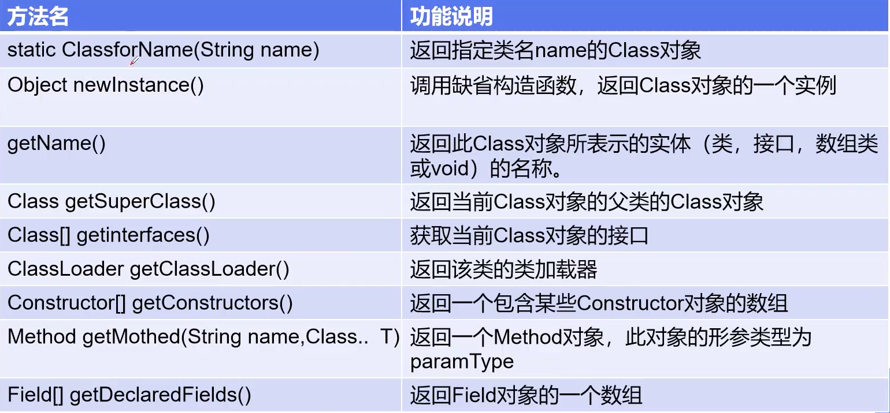
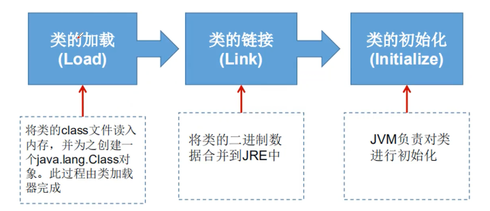
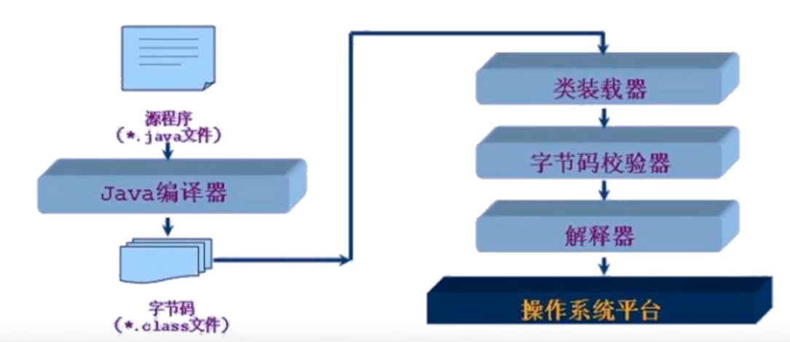
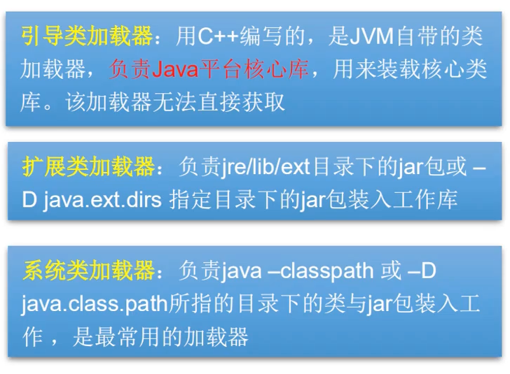
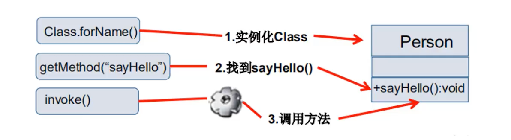
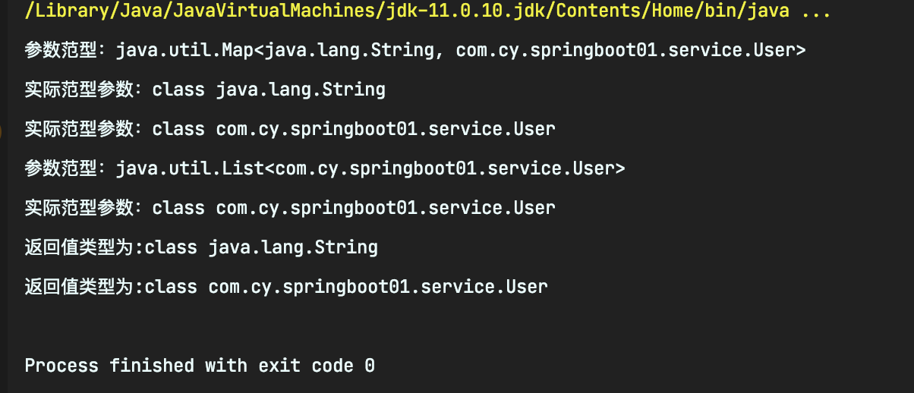

# 反射

## 静态VS动态语言

> 动态语言

- 是一类在运行时可以改变其结构的语言:例如新的函数、对象、甚至代码可以被引进，已有的函数可以被删除或是其他结构上的变化。通俗点说就是在运行时代码可以根据某些条件改变自身结构。
- 主要动态语言: ``Object-C``、 ``C#``、 ``JavaScript``、 ``PHP``、``Python``等。

> 静态语言

- 与动态语言相对应的,运行时结构不可变的语言就是静态语言。如``Java``、 ``C``、``C++``。
- ``Java``不是动态语言，但``Java``可以称之为“准动态语言”。即``Java``有一 定的动态性,我们可以利用反射机制获得类似动态语言的特性。``Java``的动态性让编程的时候更加灵活!


## Java Reflection
1. ``Reflection`` (反射)是``Java``被视为动态语言的关键，反射机制允许程序在执行期借助于``Reflection API``取得任何类的内部信息，并能**直接操作任意对象的内部属性及方法**。
    ```java
    Class C= Class forName("java.lang String")
    ```
2. 加载完类之后,在堆内存的方法区中就产生了一个``Class``类型的对象(一个类只有一个``Class``对象)，这个对象就包含了完整的类的结构信息。我们可以通过这个对象看到类的结构。这个对象就像一-面镜子， 透过这个镜子看到类的结构，所以我们形象的称之为：反射。

## Java反射机制研究及应用
### Java反射机制提供的功能
1. 在运行时判断任意一个对象所属的类
2. 在运行时构造任意一个类的对象
3. 在运行时判断任意一个类所具有的成员变量和方法
4. 在运行时获取泛型信息
5. 在运行时调用任意一个对象的成员变量和方法:
6. 在运行时处理注解
7. 生成动态代理

### Java反射优点和缺点
- 优点：可以实现动态创建对象和编译，体现出很大的灵活性
- 缺点：对性能有影响，使用反射基本上是一种解释操作，我们可以告诉JVM,我们希望做什么并且它满足我们的要求。这类操作总是慢于直接执行相同的操作

### 反射相关的主要API
1. ``java.lang.Class``：代表一个类
2. ``java.lang.reflect.Method`` :代表类的方法
3. ``java.lang.reflect.Field ``:代表类的成员变量
4. ``java.lang.reflect.Constructor ``:代表类的构造器

```java
public class Demo01 {
    public static void main(String[] args) throws ClassNotFoundException {
        /*通过反射获取类的Class对象，
         *一个类只有一个Class对象，所以c1，c2，c3的hashcode相同
         *一个类被加载后，整个类的结构都会被封装在Class对象中
         */
        Class c1 = Class.forName("com.reflection.User");

        System.out.println(c1.getName());//com.reflection.User
        Class c2 = Class.forName("com.reflection.User");
        System.out.println(c2.hashCode());
        Class c3 = Class.forName("com.reflection.User");
        System.out.println(c3.hashCode());
    }
}
//实体类：pojo，entity，只有属性
class User{
    private String name;
    private int age;
    public User(){
    }
    public User(String name,int age){
        this.age = age;
        this.name = name;
    }
    public void setName(String name) {
        this.name = name;
    }
    public String getName() {
        return name;
    }
    public int getAge() {
        return age;
    }
    public void setAge(int age) {
        this.age = age;
    }
    @Override
    public String toString() {
        return "User{" +
                "name='" + name + '\'' +
                ", age=" + age +
                '}';
    }
}
```

### Class类
- 在``Object``类中定义了以下的方法，此方法将被所有子类继承
  ```java
  public final Class getClass()
  ```
- ``Class``本身也是一个类
- ``Class`` 对象只能由系统建立对象
- 一个加载的类在JVM中只会有一 个``Class``实例
- 一个``Class``对象对应的是一个加载到JVM中的一个``.class``文件
- 每个类的实例都会记得自己是由哪个``Class``实例所生成
- 通过``Class``可以完整地得到一个类中的所有被加载的结构
- ``Class``类 是``Reflection``的根源，针对任何你想动态加载、运行的类) 唯有先获得相应的``Class``对象

#### Class类的常用方法



获取class的实例

- 若已知具体的类， 通过类的class属性获取, 该访法最为安全可靠,程序性能最高。
   ```java
     Class class = Person.class;
   ```
- 已知某个类的实例， 调用该实例的getClass()方法获取Class对象
   ```java
     Class class = person.getClass();
   ```
- 已知一 个类的全类名，且该类在类路径下，可通过``Class``类的静态方法``forName()``获取可能抛出``ClassNotFoundException``
   ```java
     Class class = Class forName("com.cy.Demo.Person");
   ```
**提示**
1. 内置基本数据类型可以直接用类名``.Type``

2. 还可以利用``ClassLoader``

```java
public class Demo02 {
    public static void main(String[] args) throws ClassNotFoundException {
        Person s1 = new Student();
        System.out.println("这个人是"+s1.name);
        //方式一：通过对象获取
        Class c1 = s1.getClass();
        System.out.println(c1.hashCode());
        //方式二：通过forname获取
        Class c2 = Class.forName("com.reflection.Student");
        System.out.println(c2.hashCode());
        //通过类名.class获得
        Class c3 = Student.class;
        System.out.println(c3.hashCode());
        //方式四：基本内置类型的包装类都有一个TYPE属性
        Class c4 = Integer.TYPE;
        System.out.println(c4);
        //获得父类类型
        Class c5 = c1.getSuperclass();
        System.out.println(c5);
    }
}
class Person{
    public String name;
    public Person(){}
    public Person(String name){
        this.name = name;
    }
    @Override
    public String toString() {
        return "Person{" +
                "name='" + name + '\'' +
                '}';
    }
}
class Student extends Person{
    public Student(){
        this.name = "Student";
    }
}
class Teacher extends Person{
    public Teacher(){
        this.name = "Teacher";
    }
}
```
> 哪些类型可以有``Class``对象

- ``class``: 外部类成员(成员内部类，静态内部类)，局部内部类，匿名内部类。
- ``interface``: 接口
- ``[]``:数组
- ``enum``:枚举
- ``annotation``:注解``@interface``
- ``primitive type``:基本数据类型
- ``void``

```java
import java.lang.annotation.ElementType;
public class Demo03 {
    public static void main(String[] args) {
        //类 .
        Class c1 = Object.class; 
        //按口
        Class c2 = Comparable.class; 
        //- -维数组
        Class c3 = String[].class; 
        //二维数组
        Class c4 = int[][].class; 
        Class c5 = Override.class; //注解
        Class c6 = ElementType.class; //枚举
        Class c7 = Integer.class; //基本数据类型
        Class c8 = void.class; //void
        Class c9 = Class.class; //Class
        System.out.println(c1);//class java.lang.Object
        System.out.println(c2);//interface java.lang.Comparable
        System.out.println(c3);//class [Ljava.lang.String;
        System.out.println(c4);//class [[I
        System.out.println(c5);//interface java.lang.Override
        System.out.println(c6);//class java.lang.annotation.ElementType
        System.out.println(c7);//class java.lang.Integer
        System.out.println(c8);//void
        System.out.println(c9);//class java.lang.Class
        //只要元素类型与维度一样，就是同一个Class.
        int[] a = new int[10];
        int[] b = new int[100];
        System.out.println(a.getClass().hashCode());//1163157884
        System.out.println(b.getClass().hashCode());//1163157884
    }
}
```

### 类的加载过程

1. 当程序主动使用某个类时，如果该类还未被加载到内存中，则系统会通过如下三个步骤来对该类进行初始化。


2. 类的加载与``ClassLoader``的理解
    1.  **加载:** 将``class``文件字节码内容加载到内存中，并将这些静态数据转换成方法区的运行时数据结构,然后生成一个代表这个类的``java.lang.Class``对象.
    2.  **链接：** 将``Java``类的二进制代码合并到``JVM``的运行状态之中的过程。
        - **验证**:确保加载的类信息符合``JVM``规范，没有安全方面的问题
        - **准备**:正式为类变量``(static)`` 分配内存并设置类变量默认初始值的阶段,这些内存都将在方法区中进行分配。
        - **解析**:虚拟机常量池内的符号引用(常量名)替换为直接引用(地址)的过程。
    3. **初始化:**
        - 执行类构造器``<clinit>()``方法的过程。类构造器``<clinit>()``方法是由编译期自动收集类中所有类变量的赋值动作和静态代码块中的语句合并产生的。(类构造 器是构造类信息的，不是构造该类对象的构造器)。
        - 当初始化一个类的时候，如果发现其父类还没有进行初始化，则需要先触发其父类的初始化。
        - 虚拟机会保证一 个类的 ()方法在多线程环境中被正确加锁和同步。

> 什么时候会发生类的初始化

1. 类的主动引用(一定会发生类的初始化))
    - 当虚拟机启动，先初始化``main``方法所在的类
    - ``new``一个类的对象
    - 调用类的静态成员(除了``final``常量)和静态方法
    - 使用``java.lang.reflect``包的方法对类进行反 射调用
    - 当初始化一个类, 如果其父类没有被初始化，则先会初始化它的父类
2. 类的被动引用(不会发生类的初始化)
    - 当访问一个静态域时，只有真正声明这个域的类才会被初始化。如:当通过子类引用父类的静态变量，不会导致子类初始化
    - 通过数组定义类引用，不会触发此类的初始化
    - 引用常量不会触发此类的初始化(常量在链接阶段就存入调用类的常量池中了)

> 类加载器的作用

1. **类加载的作用:** 将``class``文件字节码内容加载到内存中，并将这些静态数据转换成方法区的运行时数据结构，然后在堆中生成一个代表这个类的``java.lang(Class对象)``作为方法区中类数据的访问入口。
2. **类缓存:** 标准的``JavaSE``类加载器可以按要求查找类,但一旦某企类被加载到类加载器中，它将维持加载(缓存) 一段时间。不过``JVM``垃圾回收机制可以回收这些``Class``对象

3. 类加载器作用是用来把类``(class)``装载进内存的。JVM规范走义了如下类型的类的加载器

4. 双亲委派机制：如果自己定义和``jdk``同名的类，运行时虚拟机会在系统的类加载器中寻找，再去扩展类加载器中寻找，再去根加载器中寻找，如果存在同名的类，会使用根加载器中的类，而不使用自己定义的类
    ```java
    package com.reflection;
    public class Demo06 {
        public static void main(String[] args) throws ClassNotFoundException {
            //获取系统的类加载器
            ClassLoader systemClassLoader = ClassLoader.getSystemClassLoader();
            System.out.println(systemClassLoader);//sun.misc.Launcher$AppClassLoader@18b4aac2
            //获取系统类加载器的父类加载器-->扩展类加载器
            ClassLoader parent = systemClassLoader.getParent();
            System.out.println(parent);//sun.misc.Launcher$ExtClassLoader@4554617c
            //获取扩展类加载器的父类加载器- ->根加载器(C/c++)
            ClassLoader grantparent = parent.getParent();
            System.out.println(grantparent);//null
            //测试当前类是哪个加载器加载的
            ClassLoader classLoader = Class.forName("com.reflection.Demo06").getClassLoader();
            System.out.println(classLoader);//sun.misc.Launcher$AppClassLoader@18b4aac2
            //测试JDK内置的类是谁加载的
            ClassLoader classLoader1 = Class.forName("java.lang.Object").getClassLoader();
            System.out.println(classLoader1);//null
            //如何获得系统类加载器可以加载的路径
            System.out.println(System.getProperty("java.class.path"));
        /*
        * D:\Environment\java\jre\lib\charsets.jar;
        * D:\Environment\java\jre\lib\deploy.jar;
        * D:\Environment\java\jre\lib\ext\access-bridge-64.jar;
        * D:\Environment\java\jre\lib\ext\cldrdata.jar;
        * D:\Environment\java\jre\lib\ext\dnsns.jar;
        * D:\Environment\java\jre\lib\ext\jaccess.jar;
        * D:\Environment\java\jre\lib\ext\jfxrt.jar;
        * D:\Environment\java\jre\lib\ext\localedata.jar;
        * D:\Environment\java\jre\lib\ext\nashorn.jar;
        * D:\Environment\java\jre\lib\ext\sunec.jar;
        * D:\Environment\java\jre\lib\ext\sunjce_provider.jar;
        * D:\Environment\java\jre\lib\ext\sunmscapi.jar;
        * D:\Environment\java\jre\lib\ext\sunpkcs11.jar;
        * D:\Environment\java\jre\lib\ext\zipfs.jar;
        * D:\Environment\java\jre\lib\javaws.jar;
        * D:\Environment\java\jre\lib\jce.jar;
        * D:\Environment\java\jre\lib\jfr.jar;
        * D:\Environment\java\jre\lib\jfxswt.jar;
        * D:\Environment\java\jre\lib\jsse.jar;
        * D:\Environment\java\jre\lib\management-agent.jar;
        * D:\Environment\java\jre\lib\plugin.jar;
        * D:\Environment\java\jre\lib\resources.jar;
        * D:\Environment\java\jre\lib\rt.jar;
        * D:\project\java-design\out\production\design02;
        * D:\IDEA\IntelliJ IDEA 2020.1.1\lib\idea_rt.jar
            */
        }
    }
    ```
## 创建运行时类的对象
### 获取运行时类的完整结构
> 通过反射获取运行时的完整结构 ``Field、Method, Constructor、 Superclass、 Interface、 Annotation``
   - 实现的全部接口
   - 所继承的父类
   - 全部的构造器
   - 全部的方法
   - 全部的``Field``
   - 注解

```java
package com.reflection;

import sun.reflect.misc.MethodUtil;

import java.lang.reflect.Constructor;
import java.lang.reflect.Field;
import java.lang.reflect.Member;
import java.lang.reflect.Method;

//获得类的信息
public class Demo07 {
    public static void main(String[] args) throws ClassNotFoundException, NoSuchFieldException, NoSuchMethodException {
        Class c1 = Class.forName("com.reflection.User");
        //获得包名+类名
        User user = new User();
        Class c2 = user.getClass();
        //获得类的信息
        System.out.println(c1.getName());//获得包名+类名
        System.out.println(c1.getSimpleName());//获得类名
        //获得类的属性
        System.out.println("=======================");
        Field[] fields = c1.getFields();//获取类的公开属性和父类的公开属性
        fields = c1.getDeclaredFields();//获取类的任何属性
        for (Field field : fields) {
            System.out.println(field);
        }
        //获得指定属性的值
        Field name = c1.getDeclaredField("name");
        System.out.println(name);
        //获得类的方法
        System.out.println("=========================");
        Method[] methods = c1.getMethods();//获得本类和父类的所有public方法
        for (Method method : methods) {
            System.out.println("methods " + method);
        }
        System.out.println("=========================");
        Method[] decmethods = c1.getDeclaredMethods();//获得本类的所有方法
        for (Method method : decmethods) {
            System.out.println("decmethods " + method);
        }
        //获得指定方法
        //需要传参数的原因：存在重载，参数可找到指定的方法
        System.out.println("=========================");
        Method getName = c1.getMethod("getName", null);
        Method setName = c1.getMethod("setName", String.class);
        System.out.println(getName);
        System.out.println(setName);
        //获得构造器
        System.out.println("=========================");
        Constructor[] constructors = c1.getConstructors();
        for (Constructor constructor : constructors) {
            System.out.println("getConstructors " + constructor);
        }
        System.out.println("=========================");
        Constructor[] constructors1 = c1.getDeclaredConstructors();
        for (Constructor constructor : constructors1) {
            System.out.println("getDeclaredConstructors " + constructors1);
        }
        //获得指定的构造器
        Constructor getDeclaredConstructor = c1.getDeclaredConstructor(String.class, int.class);
        System.out.println("指定构造器" + getDeclaredConstructor);
    }
}
```

## 有了``Class``对象能做什么?

1. 创建类的对象:调用``Class``对象的``newInstance()``方法
    - 类必须有一个无参数的构造器。
        - 类的构造器的访问权限需要足够

2. 思考?难道没有无参的构造器就不能创建对象了吗?

3. 只要在操作的时候明确的调用类中的构造器,并将参数传递进去之后，才可以实例化操作。步骤如下:
    - 通过``Class``类的``getDeclaredConstructor(Class … parameterTypes)``取得本类的指定形参类型的构造器
    - 向构造器的形参中传递一一个对象数组进去，里面包含了构造器中所需的各个参数。
    - 通过``Constructor``实例化对象

### 调用指定的方法
通过反射，调用类中的方法，通过``Method``类完成。
- 通过``Class``类的``getMethod(String name,Clas…parameterTypes)``方法取得一个``Method``对象，并设置此方法操作时所需要的参数类型。
- 之后使用``Object invoke(Object obj, Object[] args)``进行调用，并向方法中传递要设置的``obj``对象的参数信息。




> **invoke**

- ``Object``对应原方法的返回值，若原方法无返回值，此时返回``null``
- 若原方法若为静态方法，此时形参``object obj``可为``null``
- 若原方法形参列表为空,则``Object[]`` args为``null``
- 若原方法声明为``private``,则需要在调用此``invoke()``方法前，显式调用方法对象的``setAccessible(true)``方法，将可访问``private``的方法。

> **setAccessible**

- ``Method``和``Field``、``Constructor``对象都有``setAccessible()``方法。
- ``setAccessible``作用是启动和禁用访问安全检查的开关。
- 参数值为``true``则指示反射的对象在使用时应该取消``Java``语言访问检查。
- 提高反射的效率。如果代码中必须用反射，而该句代码需要频繁的被调用，那么请设置为``true``,在下面的代码性能比较中可以看出。
- 使得原本无法访问的私有成员也可以访问
- 参数值为``false``则指示反射的对象应该实施``Java``语言访问检查
```java
package com.reflection;

import java.lang.reflect.Constructor;
import java.lang.reflect.Field;
import java.lang.reflect.InvocationTargetException;
import java.lang.reflect.Method;

//动态创建对象，通过反射
public class Demo08 {
    public static void main(String[] args) throws ClassNotFoundException, IllegalAccessException, InstantiationException, NoSuchMethodException, InvocationTargetException, NoSuchFieldException {
        //获得class对象
        Class c1 = Class.forName("com.reflection.User");
        //创建一个对象
        System.out.println("============================");
        User user = (User)c1.newInstance();//本质是调用了类的无参构造器
        System.out.println(user);
        //通过构造器创建对象
        System.out.println("============================");
        Constructor constructor = c1.getDeclaredConstructor(String.class,int.class);
        User user2 = (User)constructor.newInstance("打爆",22);
        System.out.println(user2);
        //通过反射调用普通方法
        //通过反射获取一个方法
        System.out.println("============================");
        Method setName = c1.getDeclaredMethod("setName",String.class);
        //invoke:激活的意思
        //参数：对象，方法的值
        setName.invoke(user,"韩威");
        System.out.println(user.getName());
        System.out.println("============================");
        //通过反射操作属性
        User user3 = (User)c1.newInstance();
        Field name = c1.getDeclaredField("name");
        //不能直接操作私有属性，我们需要关闭程序的安全监测，属性或方法的setAccessible(true)
        name.setAccessible(true);
        name.set(user3,"小宝");
        System.out.println(user3.getName());
    }
}
```
```java
package com.reflection;

import java.lang.reflect.InvocationTargetException;
import java.lang.reflect.Method;

public class Demo09 {
    public static void main(String[] args) throws NoSuchMethodException, IllegalAccessException, InvocationTargetException {
        test1();//5ms
        test2();//4114ms
        test3();//1483ms
    }
    public static void test1(){
        User user = new User();
        long start = System.currentTimeMillis();
        for (int i = 0; i < 1000000000; i++) {
            user.getName();
        }
        long end = System.currentTimeMillis();
        System.out.println(end-start+"ms");
    }
    public static void test2() throws NoSuchMethodException, InvocationTargetException, IllegalAccessException {
        User user = new User();
        Class c1 = user.getClass();
        Method getName = c1.getDeclaredMethod("getName",null);

        long start = System.currentTimeMillis();
        for (int i = 0; i < 1000000000; i++) {
            getName.invoke(user,null);
        }
        long end = System.currentTimeMillis();
        System.out.println(end-start+"ms");
    }
    public static void test3() throws NoSuchMethodException, InvocationTargetException, IllegalAccessException {
        User user = new User();
        Class c1 = user.getClass();
        Method getName = c1.getDeclaredMethod("getName",null);
        getName.setAccessible(true);
        long start = System.currentTimeMillis();
        for (int i = 0; i < 1000000000; i++) {
            getName.invoke(user,null);
        }
        long end = System.currentTimeMillis();
        System.out.println(end-start+"ms");
    }
}
```
### 反射操作泛型

1. ``Java``采用泛型擦除的机制来引入泛型, ``Java``中的泛型仅仅是给编译器``javac``使用的，确保数据的安全性和免去强制类型转换问题,但是, 一旦编译完成,所有和泛型有关的类型全部擦除
2. 为了通过反射操作这些类型, ``Java``新增了``ParameterizedType , GenericArrayType ，TypeVariable和WildcardType``几种类型来代表不能被归一-到``Class``类中的类型但是又和原始类型齐名的类型.
    - ``ParameterizedType ``:表示- -种参数化类型,比如``Collection``
    - ``GenericArrayType`` :表示一种元素类型是参数化类型或者类型变量的数组类型
    - ``TypeVariable`` :是各种类型变量的公共父接口
    - ``WildcardType`` :代表-种通配符类型表达式
```java
/**
 * @author cy
 * @create 2021-02-03-4:51 下午
 * @Description 测试反射机制
 */
public class TestReflection {

    @SneakyThrows
    public static void main(String[] args) {
        Method method = TestReflection.class.getMethod("test01", Map.class, List.class);
        Type[] genericParameterTypes = method.getGenericParameterTypes();
        for (Type genericParameterType : genericParameterTypes) {
            System.out.println("参数范型："+ genericParameterType);
            if(genericParameterType instanceof ParameterizedType){
                Type[] actualTypeArguments = ((ParameterizedType) genericParameterType).getActualTypeArguments();
                for (Type actualTypeArgument : actualTypeArguments) {
                    System.out.println("实际范型参数："+actualTypeArgument);
                }
            }
        }

        Method method2 = TestReflection.class.getMethod("test02", null);
        Type genericReturnType = method2.getGenericReturnType();
        if(genericReturnType instanceof ParameterizedType){
            Type[] actualTypeArguments = ((ParameterizedType) genericReturnType).getActualTypeArguments();
            for (Type actualTypeArgument : actualTypeArguments) {
                System.out.println("返回值类型为:"+actualTypeArgument);
            }
        }

    }
    public void  test01 (Map<String,User> map, List<User> list){
        System.out.println("test01");
    }
    public Map<String, User> test02(){
        System.out.println("test02");
        return null;
    }
}

class User{
    private Integer id;
    private String name;

    public User() {
    }

    public User(Integer id, String name) {
        this.id = id;
        this.name = name;
    }

    public Integer getId() {
        return id;
    }

    public void setId(Integer id) {
        this.id = id;
    }

    public String getName() {
        return name;
    }

    public void setName(String name) {
        this.name = name;
    }

    @Override
    public String toString() {
        return "User{" +
                "id=" + id +
                ", name='" + name + '\'' +
                '}';
    }
}
```
打印结果：



### 反射操作注解

1. ``getAnnotations``
2. ``getAnnotation``

```java
/**
 * @author cy
 * @create 2021-02-03-5:08 下午
 * @Description 反射注解的测试
*/
public class TestAnnotation {

    @SneakyThrows
    public static void main(String[] args) {
        Class<?> c1 = Class.forName("com.cy.springboot01.service.Student");
        //通过反射获取注解
        Annotation[] annotations = c1.getAnnotations();
        for (Annotation annotation : annotations) {
            //@com.cy.springboot01.service.Table(value="db_student")
            System.out.println("Student类上的注解为："+annotation);
        }
        //获取注解中的value值
        Table table = c1.getAnnotation(Table.class);
        String value = table.value();
        System.out.println("Table注解的value值为"+ value);//db_student
        //获取指定类的注解
        Field f = c1.getDeclaredField("name");
        Filed annotation = f.getAnnotation(Filed.class);
        System.out.println(annotation.columnName());//db_name
        System.out.println(annotation.type());//varchar
        System.out.println(annotation.length());//3
    }

}

@Table("db_student")
@Data
@AllArgsConstructor
@NoArgsConstructor
class Student{
    @Filed(columnName = "db_id",type = "int" ,length = 10)
    private int id;
    @Filed(columnName = "db_age",type = "int",length = 10)
    private int age;
    @Filed(columnName = "db_name" ,type = "varchar",length = 3)
    private String name;
}

//类名的注解
@Target(ElementType.TYPE)
@Retention(RetentionPolicy.RUNTIME)
@interface Table{
    String value();
}

@Target(ElementType.FIELD)
@Retention(RetentionPolicy.RUNTIME)
@interface Filed{
    String columnName();
    String type();
    int length();
}
```


