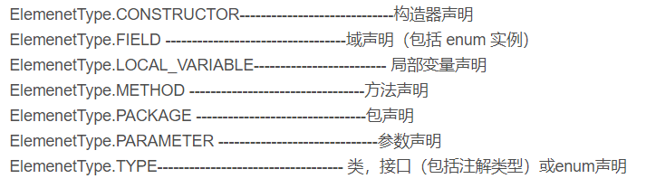
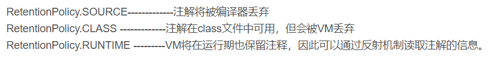

# 关于Java中的注解

## **@Target**
@Target说明了Annotation所修饰的对象范围：Annotation可被用于 packages、types（类、接口、枚举、Annotation类型）、类型成员（方法、构造方法、成员变量、枚举值）、方法参数和本地变量（如循环变量、catch参数）。在Annotation类型的声明中使用了target可更加明晰其修饰的目标。



**作用：用于描述注解的使用范围（即：被描述的注解可以用在什么地方）**

## **@Retention**
@Retention定义了该Annotation被保留的时间长短：某些Annotation仅出现在源代码中，而被编译器丢弃；而另一些却被编译在class文件中；编译在class文件中的Annotation可能会被虚拟机忽略，而另一些在class被装载时将被读取（请注意并不影响class的执行，因为Annotation与class在使用上是被分离的）。使用这个meta-Annotation可以对 Annotation的“生命周期”限制。



　　作用：表示需要在什么级别保存该注释信息，用于描述注解的生命周期（即：被描述的注解在什么范围内有效）

## @Documented

@Documented用于描述其它类型的annotation应该被作为被标注的程序成员的公共API，因此可以被例如javadoc此类的工具文档化。Documented是一个标记注解，没有成员。

## @Inherited

@Inherited 元注解是一个标记注解，@Inherited阐述了某个被标注的类型是被继承的。如果一个使用了@Inherited修饰的annotation类型被用于一个class，则这个annotation将被用于该class的子类。

　　注意：@Inherited annotation类型是被标注过的class的子类所继承。类并不从它所实现的接口继承annotation，方法并不从它所重载的方法继承annotation。

　　当@Inherited annotation类型标注的annotation的Retention是RetentionPolicy.RUNTIME，则反射API增强了这种继承性。如果我们使用java.lang.reflect去查询一个@Inherited annotation类型的annotation时，反射代码检查将展开工作：检查class和其父类，直到发现指定的annotation类型被发现，或者到达类继承结构的顶层。


## 关于自定义注解

使用@interface自定义注解时，自动继承了java.lang.annotation.Annotation接口，由编译程序自动完成其他细节。在定义注解时，不能继承其他的注解或接口。@interface用来声明一个注解，其中的每一个方法实际上是声明了一个配置参数。方法的名称就是参数的名称，返回值类型就是参数的类型（返回值类型只能是基本类型、Class、String、enum）。可以通过default来声明参数的默认值。

**定义注解格式：**

```java　　
public @interface 注解名 {定义体}
```
**解参数的可支持数据类型：**
- 所有基本数据类型（int,float,boolean,byte,double,char,long,short)
- String类型
- Class类型
- enum类型
- Annotation类型
- 以上所有类型的数组

> Annotation类型里面的参数该怎么设定
1. 第一,只能用public或默认(default)这两个访问权修饰.例如,String value();这里把方法设为defaul默认类型；
2. 第二,参数成员只能用基本类型 byte,short,char,int,long,float,double,boolean八种基本数据类型和 String,Enum,Class,annotations等数据类型,以及这一些类型的数组.例如,String value();这里的参数成员就为String;　　
3. 第三,如果只有一个参数成员,最好把参数名称设为"value",后加小括号.例:下面的例子FruitName注解就只有一个参数成员。

**注意以及使用方法：**

1. 使用``@interface``自定义注解时,自动继承了``java.lang .annotation.Annotation``接口
2. 分析：
   - ``@interface``用来声明一个注解,格式: ``public @ interface注解名{定义内容}``
    - 其中的每一个方法实际 上是声明了一个配置参数.
    - 方法的名称就是参数的名称.
    - 返回值类型就是参数的类型(返回值只能是基本类型,``Class`` , ``String`` , ``enum`` ).
    - 可以通过``default``来声明参数的默认值
    - 如果只有一个参数成员, 一般参数名为``value``
    - 注解元素必须要有值，我们定义注解元素时,经常使用空字符串，0作为默认值.

示例：

```java
import java.lang.annotation.*;
public class Demo03 {
    public static void main(String[] args) {
        
    }
    //注解可以显示赋值，如果没有默认值 ，我们就必须给注解赋值
    @MyAnnotation2(name = "赵大宝",age = 12)
    public void test(){}
    @MyAnnotation3("baobao")//参数只有一个，且参数名为value
    public void test1(){}
}
@Target({ElementType.METHOD,ElementType.TYPE})
@Retention(RetentionPolicy.RUNTIME)
@interface MyAnnotation2{
    //注解的参数:参数类型+参数名();
    String name() default "";
    int age() default 0;
    int id() default -1;// 如果默认值为-1,代表不存在。
    String[] schools() default {"清华大学，辽宁大学"}
}
@Target({ElementType.TYPE,ElementType.METHOD})
@Retention(RetentionPolicy.RUNTIME)
@interface MyAnnotation3{
    //只有一个参数时，参数名为value时，使用时不需参数名
    String value();
}
```


## 内置注解

- ``@Override`` : 定义在``java.lang.Override``中,此注释只适用于修辞方法, 表示一个方法声明打算重写超类中的另一个方法声明.
- ``@Deprecated`` :定义在``java.lang.Deprecated``中,此注释可以用于修辞方法,属性,类,表示不鼓励程序员使用这样的元素,通常是因为它很危险或者存在更好的选择.
- ``@SuppressWarnings`` : 定义在``java.lang.SuppressWarnings``中,用来抑制编译时的警告信息，与前两个注释有所不同,你需要添加一-个参数才能正确使用，这些参数都是已经定义好了的,我们选择性的使用就好了.
- ``@SuppressWarnings(“l”)``
- ``@SuppressWarnings(“unchecked”)``
- ``@SuppressWarnings(value={“unchecked”,“deprecation”})``

```java
public class Demo01 extends Object{
    @Override//重写方法
    public String toString() {
        return super.toString();
    }
    @Deprecated//表示弃用方法
    public static void test(){
    }
    @SuppressWarnings("all")//抑制警告
    public static void test01(){
        int age;
    }
    public static void main(String[] args) {
        test();
        test01();
    }
}
```


