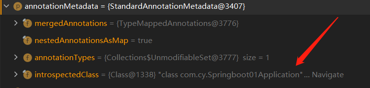
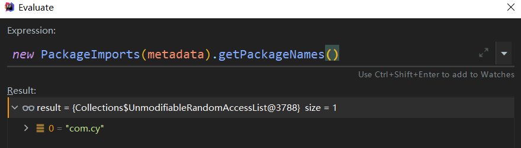
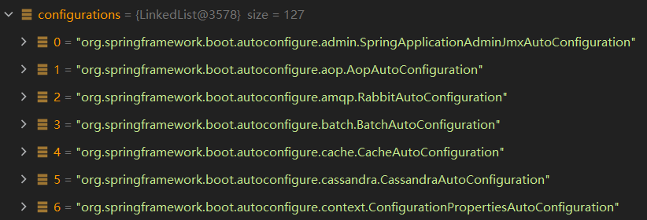
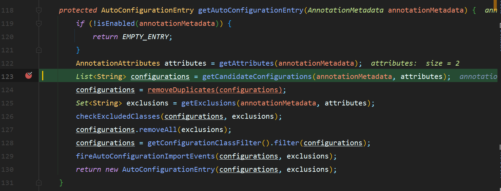
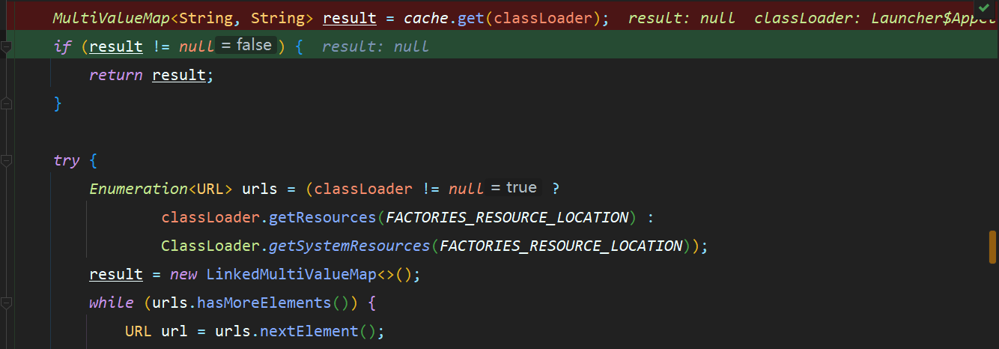
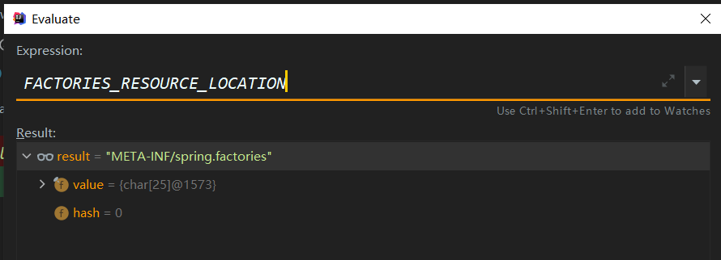
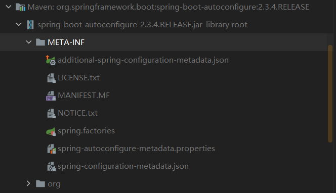
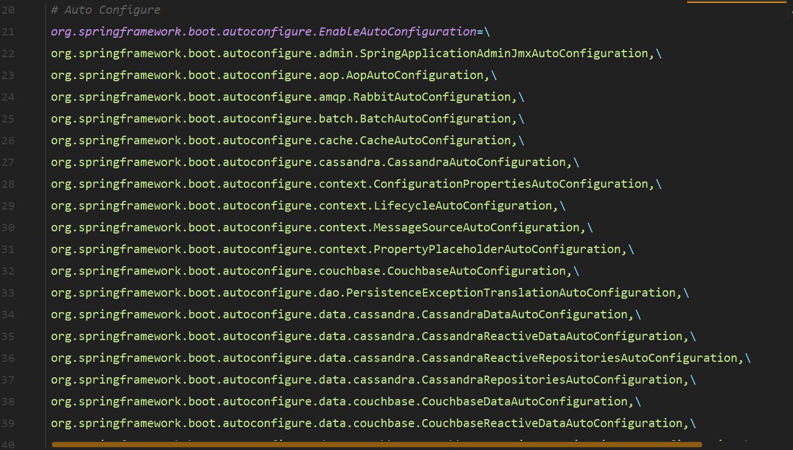

# 自动配置原理入门(启动配置)

## 引导加载自动自动配置类

这是启动程序类
```java
@SpringBootApplication
public class Springboot01Application {

    public static void main(String[] args) {
       SpringApplication.run(Springboot01Application.class, args);
    }
}
```
<hr>

点进注解 @SpringBootApplication,除了一些元注解,有重要的三个注解
``@SpringBootConfiguration``

``@EnableAutoConfiguration``

``@ComponentScan``
```java
@Target(ElementType.TYPE)
@Retention(RetentionPolicy.RUNTIME)
@Documented
@Inherited   // 以上几个都是元注解
@SpringBootConfiguration
@EnableAutoConfiguration
@ComponentScan(excludeFilters = { @Filter(type = FilterType.CUSTOM, classes = TypeExcludeFilter.class),
		@Filter(type = FilterType.CUSTOM, classes = AutoConfigurationExcludeFilter.class) })
public @interface SpringBootApplication {}
```
> @SpringBootConfiguration

点进@SpringBootConfiguration , @Configuration 说明当前是一个配置类
```java
@Target(ElementType.TYPE)
@Retention(RetentionPolicy.RUNTIME)
@Documented
@Configuration
public @interface SpringBootConfiguration {}
```
> @ComponentScan 

指定扫描哪些, Spring 注解

> @EnableAutoConfiguration

```java
@Target(ElementType.TYPE)
@Retention(RetentionPolicy.RUNTIME)
@Documented
@Inherited
@AutoConfigurationPackage
@Import(AutoConfigurationImportSelector.class)
public @interface EnableAutoConfiguration {}
```
<hr>

点进 @AutoConfigurationPackage
```java
@Target(ElementType.TYPE)
@Retention(RetentionPolicy.RUNTIME)
@Documented
@Inherited
@Import(AutoConfigurationPackages.Registrar.class) //给容器导入一个组件
public @interface AutoConfigurationPackage {}
//利用Registrar给容器中导入一系列组件
//将指定的一个包下的所有组件导入进来？Springboot01Application 所在包下
```
<hr>
点进Register类

```java
/**
* {@link ImportBeanDefinitionRegistrar} 存储导入配置中的基本包
* configuration.
*/
static class Registrar implements ImportBeanDefinitionRegistrar, DeterminableImports {
    //  AnnotationMetadata:注解元信息
    @Override
    public void registerBeanDefinitions(AnnotationMetadata metadata, BeanDefinitionRegistry registry) {
        register(registry, new PackageImports(metadata).getPackageNames().toArray(new String[0]));
    }
    @Override
    public Set<Object> determineImports(AnnotationMetadata metadata) {
        return Collections.singleton(new PackageImports(metadata));
    }

}
```
可以通过打断点看出 注解元信息获取的是启动类的




通过计算第一个方法中Register 中的 new PackageImports(metadata).getPackageNames()方法的值



所以可以得出将主程序 Springboot01Application 包下的包 注册进来, **所以SpringBoot 能将主程序 所在包及其下面的所有子包里面的组件都会被默认扫描注册进来 的原理及时这样来的**

> 回到@EnableAutoConfiguration


```java
@Target(ElementType.TYPE)
@Retention(RetentionPolicy.RUNTIME)
@Documented
@Inherited
@AutoConfigurationPackage
@Import(AutoConfigurationImportSelector.class)
public @interface EnableAutoConfiguration {}
```

<hr>

点击 ``@Import(AutoConfigurationImportSelector.class)`` 中的 AutoConfigurationImportSelector进入

有一个方法:
```java
@Override
//需要导入哪些
public String[] selectImports(AnnotationMetadata annotationMetadata) {
  if (!isEnabled(annotationMetadata)) {
  	return NO_IMPORTS;
}
  AutoConfigurationEntry autoConfigurationEntry = getAutoConfigurationEntry(annotationMetadata);
  return StringUtils.toStringArray(autoConfigurationEntry.getConfigurations());
}
```

接下来研究  ``getAutoConfigurationEntry(annotationMetadata)`` 方法(`给容器中批量导入一些组件`)

```java
protected AutoConfigurationEntry getAutoConfigurationEntry(AnnotationMetadata annotationMetadata) {
  if (!isEnabled(annotationMetadata)) {
  	return EMPTY_ENTRY;
}
  AnnotationAttributes attributes = getAttributes(annotationMetadata);
  //此处获得的configuration 在下面将会进行很多操作
  List<String> configurations = getCandidateConfigurations(annotationMetadata, attributes);
  //1.
  configurations = removeDuplicates(configurations);
  //2.
  Set<String> exclusions = getExclusions(annotationMetadata, attributes);
  //3.
  checkExcludedClasses(configurations, exclusions);
  //4.
  configurations.removeAll(exclusions);
  //5.
  configurations = getConfigurationClassFilter().filter(configurations);
  //6.
  fireAutoConfigurationImportEvents(configurations, exclusions);

  return new AutoConfigurationEntry(configurations, exclusions);
}
```
可以看出 `getCandidateConfigurations(annotationMetadata, attributes)`中获得的 configuration 将会进行一系列操作,最后并进行返回,通过打断点查看 configuration中的值:



一共有127个值 ,都是一些 ``**AutoConfiguration``

`List<String> configurations = getCandidateConfigurations(annotationMetadata, attributes)`获取所有需要导入到容器中的配置类

那么是如何获取这些所有的配置类呢,继续打断点:




点进``getCandidateConfigurations``方法中

```java
protected List<String> getCandidateConfigurations(AnnotationMetadata metadata, AnnotationAttributes attributes) {
  List<String> configurations = SpringFactoriesLoader.loadFactoryNames(getSpringFactoriesLoaderFactoryClass(),
  		getBeanClassLoader());
  Assert.notEmpty(configurations, "No auto configuration classes found in META-INF/spring.factories. If you "
  		+ "are using a custom packaging, make sure that file is correct.");
  return configurations;
}
```

可以看到使用`SpringFactoriesLoader.loadFactoryNames`Spring工厂加载器加载

点进``loadFactoryNames``
```java
/**
  * Load the fully qualified class names of factory implementations of the
  * given type from {@value #FACTORIES_RESOURCE_LOCATION}, using the given
  * class loader.
  * @param factoryType the interface or abstract class representing the factory
  * @param classLoader the ClassLoader to use for loading resources; can be
  * {@code null} to use the default
  * @throws IllegalArgumentException if an error occurs while loading factory names
  * @see #loadFactories
*/
public static List<String> loadFactoryNames(Class<?> factoryType, @Nullable ClassLoader classLoader) {
  String factoryTypeName = factoryType.getName();
  return loadSpringFactories(classLoader).getOrDefault(factoryTypeName, Collections.emptyList());
}
```
在点进返回的 `loadSpringFactories`
```java
private static Map<String, List<String>> loadSpringFactories(@Nullable ClassLoader classLoader) {
  MultiValueMap<String, String> result = cache.get(classLoader);
  if (result != null) {
  	return result;
  }
  try {
  	Enumeration<URL> urls = (classLoader != null ?
  			classLoader.getResources(FACTORIES_RESOURCE_LOCATION) :
  			ClassLoader.getSystemResources(FACTORIES_RESOURCE_LOCATION));
  	result = new LinkedMultiValueMap<>();
  	while (urls.hasMoreElements()) {
  		URL url = urls.nextElement();
  		UrlResource resource = new UrlResource(url);
  		Properties properties = PropertiesLoaderUtils.loadProperties(resource);
  		for (Map.Entry<?, ?> entry : properties.entrySet()) {
  			String factoryTypeName = ((String) entry.getKey()).trim();
  			for (String factoryImplementationName : StringUtils.commaDelimitedListToStringArray((String) entry.getValue())) {
  				result.add(factoryTypeName, factoryImplementationName.trim());
  			}
  		}
  	}
  	cache.put(classLoader, result);
  	return result;
  }
  catch (IOException ex) {
  	throw new IllegalArgumentException("Unable to load factories from location [" +
  			FACTORIES_RESOURCE_LOCATION + "]", ex);
  }
}
```
`Map<String, List<String>> loadSpringFactories(@Nullable ClassLoader classLoader)` 得到所有需要加载的配置类,所以只需要研究 该方法即可

打断点进行调试:



`classLoader.getResources(FACTORIES_RESOURCE_LOCATION) :` 加载配置文件:




从`META-INF/spring.factories`位置来加载一个文件,默认扫描我们当前系统里面所有`META-INF/spring.factories`位置的文件

-----

此时我们打开`Library`中的 `spring-boot-autoconfigure-2.3.4.RELEASE.jar `




点开`Spring.factories`文件:




该配置文件刚好127个`autoconfigure`

**虽然我们127个场景的所有自动配置启动的时候默认全部加载。`xxxxAutoConfiguration`
按照条件装配规则（`@Conditional`），最终会按需配置。表现形式为 `@ConditionOnBean`以及`@ConditionOnMissingBean`**


