# SpringDataJpa 的使用

> 1. ``JPA``

``JAP``全称``Java Persistence API``，即``Java``持久化``API``：一套``Sun``公司``Java``官方制定的``ORM ``方案，是规范，``sun``公司自己并没有实现。

``ORM``全称``Object Relational Mapping``，即对象关系映射：在操作数据库之前，先把数据表与实体类关联起来。然后通过实体类对象操作（增删改查）数据库表。所以，``JPA``的作用就是通过对象操作数据库的，不用编写``sql``语句；也可以理解为通过``ORM``将实体对象持久化到数据库中。

> 2. ``Spring Data JPA``

``spirng data jpa``是``spring``提供的一套简化``JPA``开发的框架，按照约定好的【方法命名规则】写``dao``层接口，就可以在不写接口实现的情况下，实现对数据库的访问和操作。同时提供了很多除了``CRUD``之外的功能，如分页、排序、复杂查询等等。

``Spring Data JPA`` 可以理解为 ``JPA`` 规范的再次封装抽象，底层还是使用了 ``Hibernate`` 的 ``JPA`` 技术实现

## 使用 ``Jpa``

这里使用的是``Spring Boot`` 集成``JPA``

### 1. **添加依赖**

```xml
<dependency>
	<groupId>org.springframework.boot</groupId>
	<artifactId>spring-boot-starter-data-jpa</artifactId>
</dependency>
<dependency>
	<groupId>mysql</groupId>
	<artifactId>mysql-connector-java</artifactId>
</dependency>
```
### 2. **相关配置**

``application.yml``的配置

```yaml
spring:
  #连接mysql数据库
  datasource:
    url: jdbc:mysql://localhost:3306/news
    username: root
    password: 123456
    driver-class-name: com.mysql.jdbc.Driver
  jpa:
    hibernate:
      ddl-auto: update
    show-sql: true
```
``ddl-auto：``

- ``create``：每次运行程序时，都会重新创建表，故而数据会丢失
- ``create-drop``：每次运行程序时会先创建表结构，然后待程序结束时清空表
- ``upadte``：每次运行程序，没有表时会创建表，如果对象发生改变会更新表结构，原有数据不会清空，只会更新（推荐使用）
- ``validate``：运行程序会校验数据与数据库的字段类型是否相同，字段不同会报错
- ``none``：禁用``DDL``处理

### 3. **生成实体类(使用``IDEA``自动生成``JPA``实体类)**

> 1. 添加对应的模块


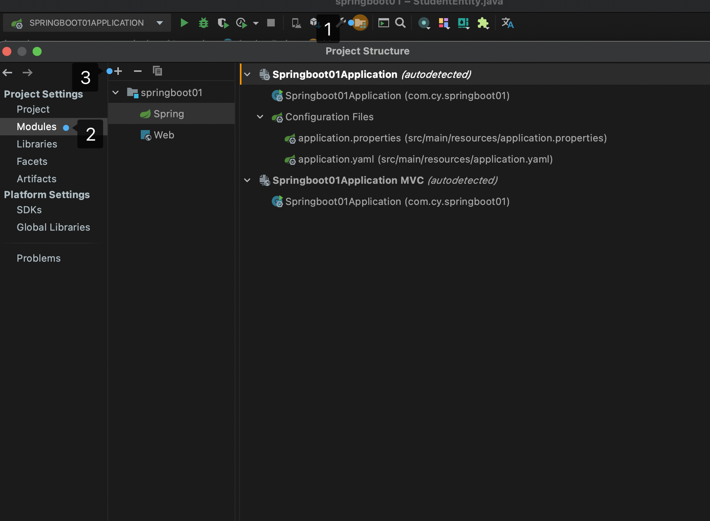


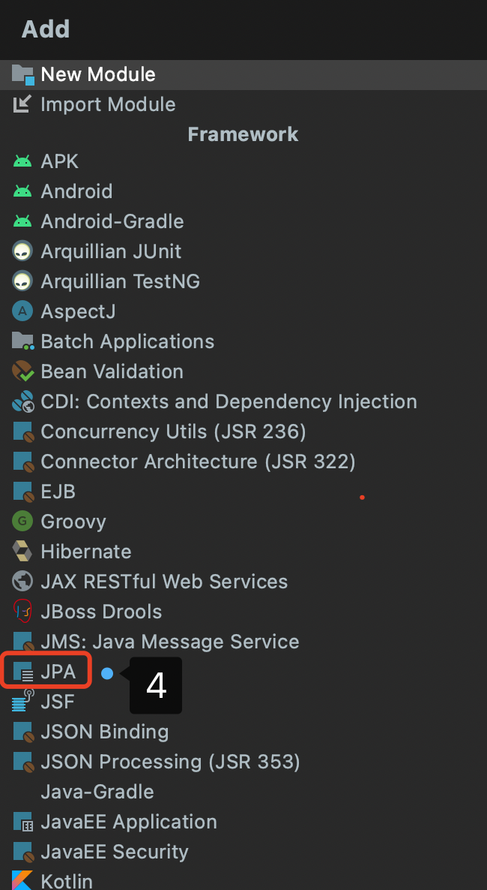

然后``Apply`` 再 ``Ok``


> 2. ``IDEA``中添加``MySql``数据库


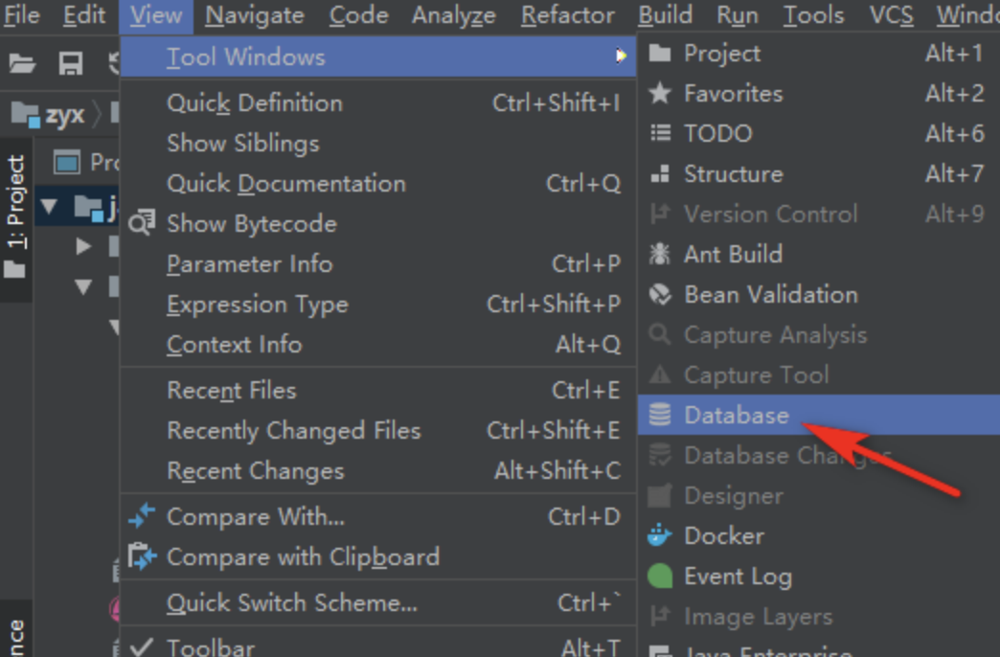


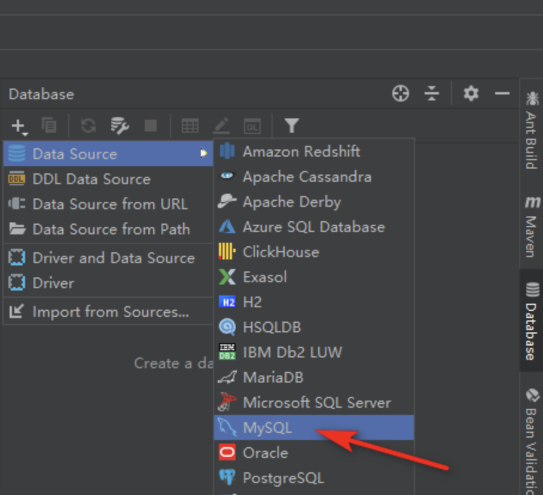


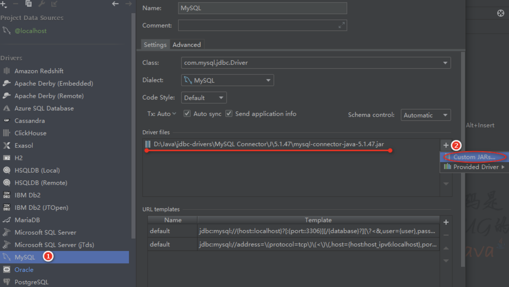


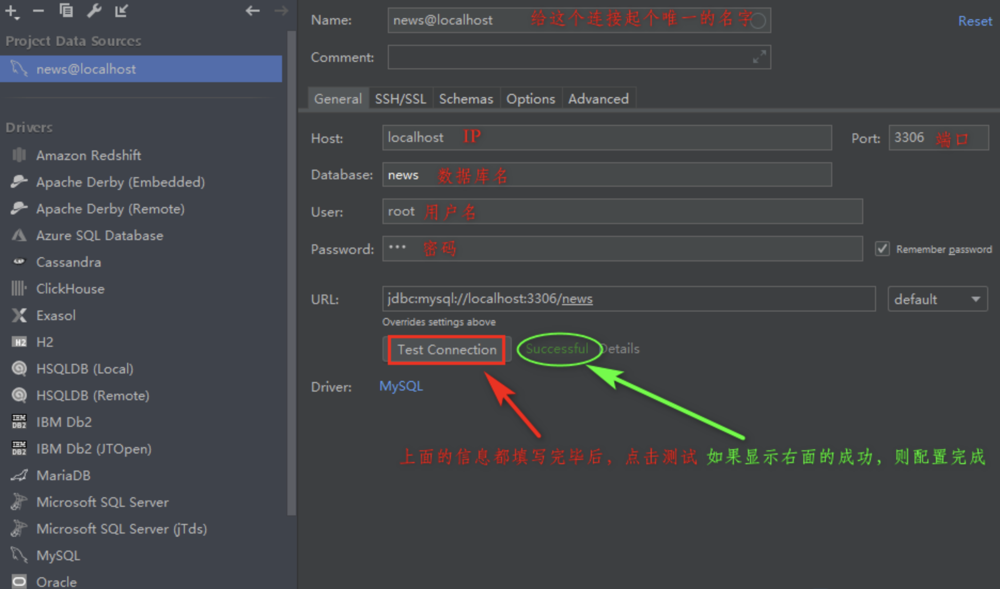

> 3. 生成实体类

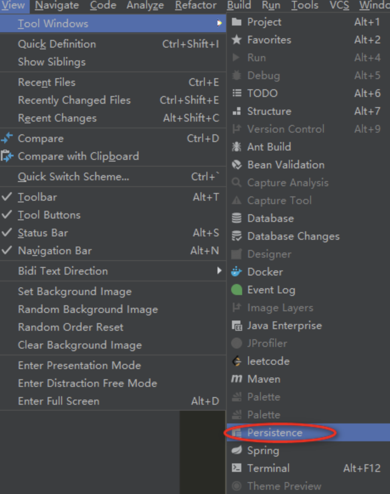


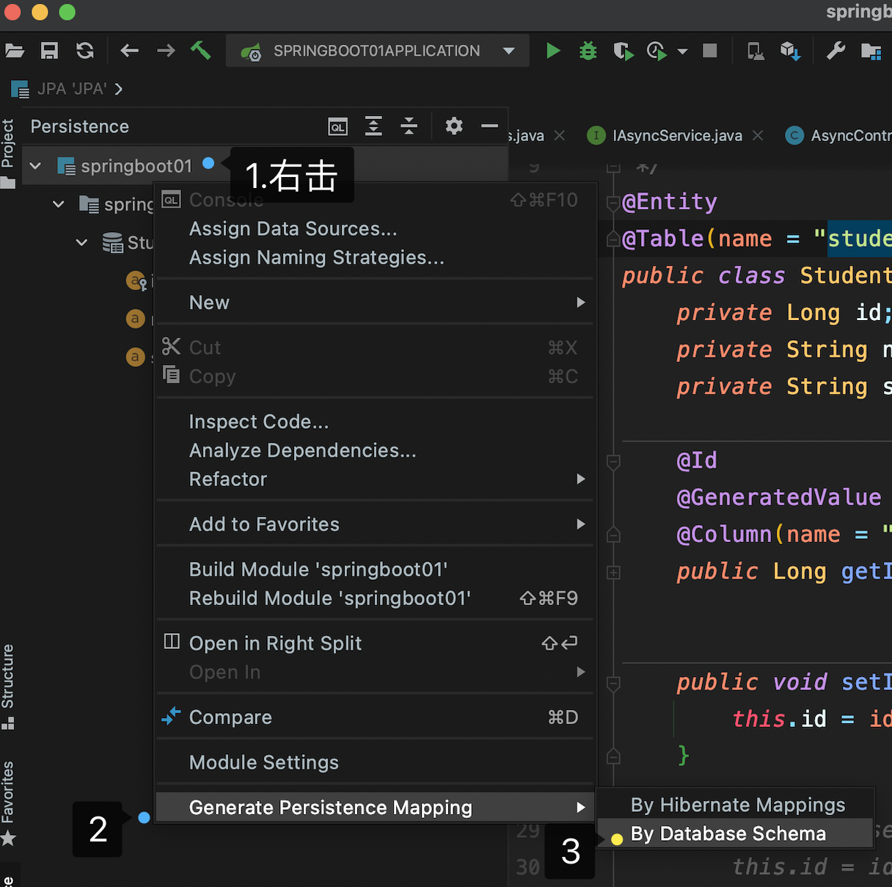


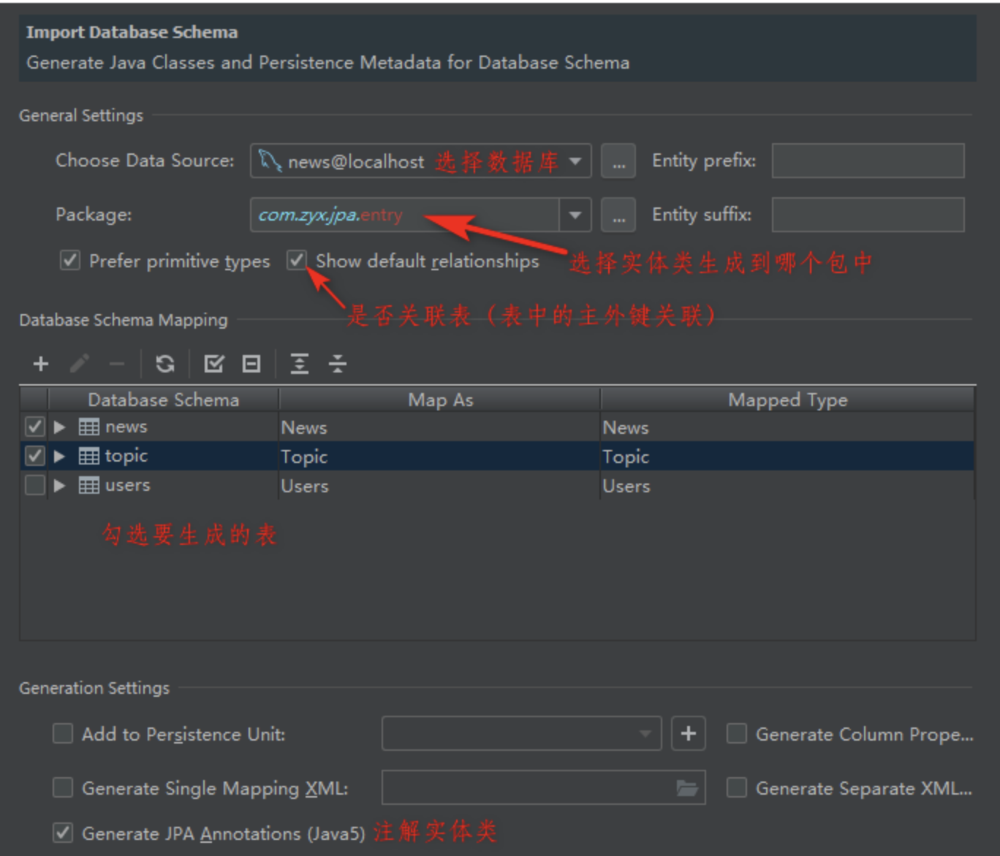

关于 ``import database schema`` 对话框中的一些输入框与多选框的具体含义：

- ``Entry prefix``：生成的 ``entry`` 的公共前缀
- ``Entry suffix``：生成的``entry``的公共后缀，生成``entry`` 的类名为：``prefix`` + 表名 + ``suffix``
- ``perfer perimitive types``：勾选时，数据库中``int``、``byte``等类型字段在``entry``中为基本数据类型；不勾选时，基本数据类型会自动装箱为对应的包装类
- ``show default relationships``：勾选时，``entry``自动加入主外键关联
- ``add to persistence unit``：添加数据库连接信息到``persistence.xml``文件（``JPA``的配置文件，用来映射``PU``(``Persist Unit``)的，作用是映射表和类，里面也可以配置数据库连接信息）中，要指定配置文件的位置
- ``generate column properties``：勾选时，添加数据库表中列的属性，比如``varchar``类型的长度
- ``generate separate XML per entity``：一个实体的注释会生成一个对应的相同作用``XML``表达注释。
- ``generate single mapping xml``：与4二选一，4会生成多个``xml``，而5会把4生成的多个``xml``集中到一个 ``xml``中，只生成一个

> 生成完的实体类中存在的问题

**生成的实体类中 ``setter`` 的返回值类型为：``_Dummy_``**

解决方法：随便注释掉一个字段的 ``setter`` 方法，然后按 ``Alt + Insert``，选择 ``Setter``，``Template``选择为 ``IntelliJ Default``，然后再生成一次实体类即可。


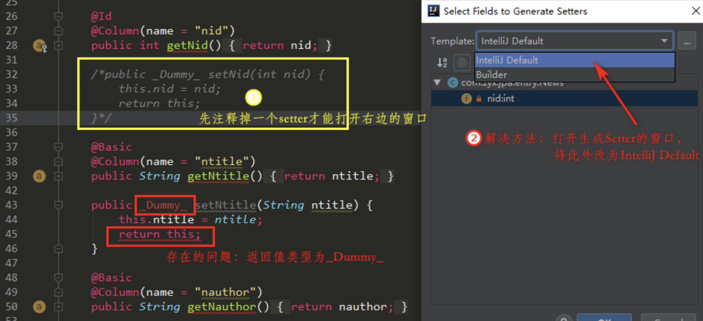

> ``@Column``注解``name``属性报红，没有找到实体类与数据库的映射

解决方法：指定项目对应的数据库


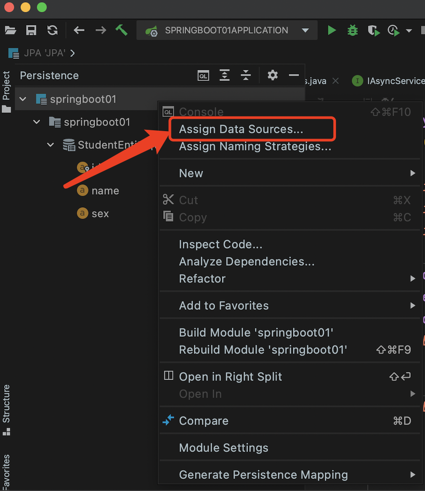


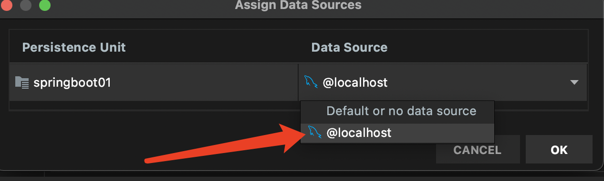


### 4. 实体类注解说明

- ``@Entity``：声明类为实体或表。
- ``@Table``：声明表名。
- ``@Basic``：指定非约束明确的各个字段。
- ``@Embedded``：指定类或它的值是一个可嵌入的类的实例的实体的属性。
- ``@Id``：指定的类的属性，用于识别（一个表中的主键）。
- ``@GeneratedValue``：指定如何标识属性可以被初始化，例如自动、手动、或从序列表中获得的值。
- ``@Transient``：指定的属性，它是不持久的，即：该值永远不会存储在数据库中。
- ``@Column``：用来标识实体类中属性与数据表中字段的对应关系，可以用在属性前或者``getter``前
- ``@SequenceGenerator``：指定在``@GeneratedValue``注解中指定的属性的值。它创建了一个序列。
- ``@TableGenerator``：指定在``@GeneratedValue``批注指定属性的值发生器。它创造了的值生成的表。
- ``@AccessType``：这种类型的注释用于设置访问类型。如果设置``@AccessType（FIELD）``，则可以直接访问变量并且不需要``getter``和``setter``， 但必须为``public``。如果设置``@AccessType（PROPERTY）``，通过``getter``和``setter``方法访问``Entity``的变量。
- ``@JoinColumn``：指定一个实体组织或实体的集合。这是用在多对一和一对多关联。
- ``@UniqueConstraint``： 指定的字段和用于主要或辅助表的唯一约束。
- ``@ColumnResult``：参考使用``select``子句的``SQL``查询中的列名。
- ``@ManyToMany``：定义了连接表之间的多对多一对多的关系。
- ``@ManyToOne``：定义了连接表之间的多对一的关系。
- ``@OneToMany``：定义了连接表之间存在一个一对多的关系。
- ``@OneToOne``：定义了连接表之间有一个一对一的关系。
- ``@NamedQueries``：指定多个命名查询。命名查询实际上就是给查询语句起个名字，执行查询的时候就是直接使用起的这个名字，避免重复写``JPQL``语句
- ``@NamedQuery``：指定一个命名查询


### ``Dao``

#### 1.创建``Dao``层

一个表对应一个dao层接口，该接口要继承 ``org.springframework.data.jpa.repository.JpaRepository<T, ID>`` 接口：

- 第一个泛型：实体类
- 第二个泛型：实体类中``Id``（数据库主键）的类型

```java
public interface IStuDao extends JpaRepository<StudentEntity,Long> {
}
```

``JpaRepository``接口及父接口中已经实现了的常用方法：

- ``getOne(id)``：根据``id``查找
- ``findAll()/findOne()``：查找全部或者一个
- ``findAll(Pageable pageable)``：分页查询，返回``Page``
- ``deleteById(id)``：根据 ``id``删除
- ``repository.save(T entity)``：保存一个实体
- ``repository.save(Iterable<T> entities)``：保存多个实体
- ``repository.saveAndFlush(T entity)``：保存并立即刷新一个实体
- ``count()``：获取数量

#### 2. 方法名查询

``JpaRepository``支持接口规范**方法名查询**。即在接口中定义的查询方法符合它的**命名规则**，就可以不用写``sql``语句。

``dao``层接口中方法定义规范：

- 方法返回值类型跟据情况写，可以是``List``，可以是``void``，也可以是对应的``Entry``等等
- 方法名的命名规范：``find/read/query/count/get/delete + XXBy + 由字段和关键字构成的查询条件``
- 方法中的形参要与方法名的需要的参数一一对应；例如：

```JAVA
//在dao接口中创建了一个方法，该方法的作用从方法名就可以很容易读出来：
//查找用户名（方法名中的UserName）为username（第一个形参）或者Email（方法名中的Email）为email（第二个形参）的用户
User findByUserNameOrEmail(String username, String email);
```

方法名的具体命名规则：

- ``find/read/query/get``均为查询，``delete``为删除，``count``为查询数量。注意：使用方法名的方式修改数据库时，要加事务注解``@Transactional``，否则会报错
- ``XX``的位置可以去重、取查询结果的前``N``个元素，主要用法有：

关键字	| 说明 |	方法名举例
---- | --- | ---
First(N) / Top(N) |	选取查询结果的前N个，N不写默认为1 |	findFirst3By … 或者findTop10By …
All / 不填 |	选取所有的查询结果 |	findAllBy … 或者 findBy …
Distinct |	选取所有去重后的查询结果 |	findDistinctBy …
DistinctFirst(N) / DistinctTop(N) |	选取去重后查询结果的前N个	|findDistinctFirstBy … 或者 findDistinctTop2By …

- 方法名中，``By``后面常用的关键字及用法如下：

关键字 |	方法命名 |	sql where字句
---- | --- | ---
And |	findByNameAndPwd |	where name= ? and pwd =?
Or |	findByNameOrSex	| where name= ? or sex=?
Is, Equals |	findById, findByIdEquals |	where id= ?
Not	| findByNameNot |	where name <> ?
Between |	findByIdBetween |	where id. between ? and ?
LessThan |	findByIdLessThan |	where id < ?
LessThanEquals |	findByIdLessThanEquals |	where id<= ?
GreaterThan |	findByIdGreaterThan |	where id >?
GreaterThanEquals |	findByIdGreaterThanEquals |	where id> = ?
After |	findByIdAfter |	where id > ?
Before |	findByIdBefore |	where id< ?
IsNull |	findByNameIsNull |	where name is null
isNotNull , NotNull	 | findByNameNotNull |	where name is not null
Like |	findByNameLike |	where name like ?
NotLike |	findByNameNotLike |	where name not like ?
Startingwith |	findByNameStartingWith |	where name like '?%”
EndingWith |	findByNameEndingWith |	where name like '%?’
Containing |	findByNameContaining |	where name like ‘%?%’
OrderBy |	findByIdOrderByXDesc |	where id=? order byx desc
In |	findByIdIn(Collection<?> c) |	where id in (?)
NotIn |	findByIdNotIn(Collection<?> c) |	where id not in (?)
True |	findByAaaTue |	where aaa = true
False |	findByAaaFalse |	where aaa = false
IgnoreCase |	findByNameIgnoreCase |	where UPPER(name)=UPPER(3)

- **分页查询的使用**：
  
在查询的方法中，需要传入参数``Pageable`` ，当查询中有多个参数的时候``Pageable``建议做为最后一个参数传入。``PageRequest``是 ``Spring`` 封装的分页实现类，使用的时候需要传入页数、每页条数和排序规则。

```java
public void findAndPage() {
    int page=1, size=10;
    //多字段排序
    Sort sort = Sort.by(Sort.Direction.DESC,"isTop").and(Sort.by(Sort.Direction.ASC,"isEssence"));
    //分页查询
    newsDao.findAll(PageRequest.of(page, size, sort));
}
```

### 自定义``SQL/HQL``查询

其实 ``Spring Data`` 绝大部分的 ``SQL`` 都可以根据方法名定义的方式来实现，但是由于某些原因我们想使用自定义的 ``SQL`` 来查询，``Spring Data`` 也是完美支持的；在 ``SQL`` 的查询方法上面使用``@Query``注解，如涉及到删除和修改还需要加上``@Modifying``。也可以根据需要添加 ``@Transactional``对事务的支持，查询超时的设置等。

- ``@Query中value``属性用来写自定义的``Sql``或者``Hql``，具体使用哪种根据``nativeQuery``属性来指定
- ``@Query中nativeQuery``属性用来指定是否使用原生的``sql``，默认为``false``，即``value``属性使用``Hql``；为``true``时，使用``Sql``
在``sql/hql``中，使用 ``?1、?2……``来占位
- 单独使用``@Query``注解时只能写查询语句，加上``@Modifying``和``@Transactional``注解后，就能写修改语句了，支持使用``hql``的``update/delete``语句和使用``sql``的``insert``语句
- ``@Modifying(clearAutomatically = true)`` 自动清除实体里保存的数据。

```java
//插入语句, 使用原生的sql语句
@Transactional
@Modifying
@Query(value = "insert into user(userName, age) values (?1, ?2)",
       nativeQuery = true)
void saveUser(String userName, Integer age);

//更新语句
@Transactional
@Modifying
@Query("update User u set u.userName = ?1 where u.id = ?2")
int modifyByIdAndUserId(String  userName, Long id);

//删除语句
@Transactional
@Modifying
@Query("delete from User where id = ?1")
void deleteByUserId(Long id);

//hql模糊查询语句
@Query("select u from User u where u.emailAddress like concat('%', ?1, '%')")
User findByEmailAddress(String emailAddress);

//nativeQuery 为true, 直接写sql语句, 原生sql模糊查询加分页
@Query(value = "select * from user where id like %?1%",
       nativeQuery = true)
Page<Users> getAllss(Integer nId, Pageable pageable);//Page底层为ArrayList
```

- 使用原生``sql``语句进行模糊查询时，使用 ``like %?1%``，当使用``hql``进行模糊查询时，使用 ``like concat('%', ?1, '%')``，``concat``为``sql``的字符串拼接函数
- 当使用``Page<T>``来接收分页查询时，会自动查询数据的个数，也可以通过``@Query``中的``countQuery``来指定``sql``语句，``service``层通过``page.getTotalPages()``来获取数据的个数


