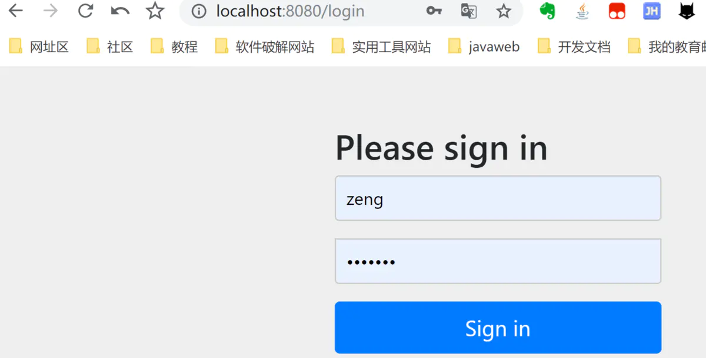

# ``SpringBoot`` + ``SpringSecurity``示例

## 一、相关环境以及依赖

| 框架或者环境   | 版本号 |
| -------------- | ------ |
| springboot     | 2.4.4  |
| springsecurity | 5.4.5  |
| mybatisplus    | 3.4.2  |
| druid          | 1.1.21 |
| commons-lang3  | 3.12.0 |
| fastjson       | 1.2.75 |
| jdk            | 11     |

目录结构：


## 二、数据库建表
```sql
/*
 Navicat MySQL Data Transfer

 Source Server         : 本机
 Source Server Type    : MySQL
 Source Server Version : 80023
 Source Host           : localhost:3306
 Source Schema         : security

 Target Server Type    : MySQL
 Target Server Version : 80023
 File Encoding         : 65001

 Date: 22/03/2021 14:54:02
*/

SET NAMES utf8mb4;
SET FOREIGN_KEY_CHECKS = 0;

-- ----------------------------
-- Table structure for user
-- ----------------------------
DROP TABLE IF EXISTS `user`;
CREATE TABLE `user` (
  `id` int NOT NULL AUTO_INCREMENT,
  `username` varchar(10) DEFAULT NULL,
  `password` varchar(100) CHARACTER SET utf8 COLLATE utf8_general_ci DEFAULT NULL,
  `role` varchar(10) DEFAULT NULL,
  PRIMARY KEY (`id`)
) ENGINE=InnoDB AUTO_INCREMENT=4 DEFAULT CHARSET=utf8;

-- ----------------------------
-- Records of user
-- ----------------------------
BEGIN;
INSERT INTO `user` VALUES (1, 'user', 'user123', 'user');
INSERT INTO `user` VALUES (2, 'admin', 'admin123', 'admin');
COMMIT;

SET FOREIGN_KEY_CHECKS = 1;
```

## 三、``Java``实现

- 1.创建``pojo``实体类
  ```java
  @TableName("user")
  @Data
   public class User implements Serializable {

        @TableId(type = IdType.AUTO)
        private Integer id;
        private String username;
        private String password;
        private String role;
   }
   ```
- 2.创建``mapper``接口
  ```java
  @Mapper
  @Repository
  public interface IUserMapper {
    @Select("select * from user where username = #{username}")
    User getUserInfoByUsername(String username);
  }
  ```
- 3.创建``UserInfoService``
  ```java
  @Service
  public class UserInfoService {
  @Autowired
  private IUserMapper userMapper;

  public User getUserInfoByUsername(String username){
     return userMapper.getUserInfoByUsername(username);
   }
  ```
- 4.创建``HelloController``文件
  ```java
  @RestController
  public class HelloController {
  @Autowired
  private UserInfoService userInfoService;

  @GetMapping("/get-user")
  public User getUser(@RequestParam String username){
    return userInfoService.getUserInfoByUsername(username);
  }
  ```
- 5.配置配置文件``yaml``配置``Mysql``和``MyBatis``
  ```yaml
  server:
    port: 8080
  spring:
    datasource:
      type: com.alibaba.druid.pool.DruidDataSource
      username: root
      password: root
      driver-class-name: com.mysql.cj.jdbc.Driver
      url: jdbc:mysql://localhost:3306/security?serverTimezone=UTC&useUnicode=true&characterEncoding=utf-8&zeroDateTimeBehavior=convertToNull&useSSL=false
  mybatis-plus:
   configuration:
     log-impl: org.apache.ibatis.logging.stdout.StdOutImpl

  ```

以上配置好后，启动项目，访问``localhost:8080/get-user?username=user``，正常获取到用户信息：


<hr/>

下面开始使用``Spring Security``安全验证：

## ``Spring Security``基于数据库认证

### 1.在``pom.xml``中加入``Spring Security``依赖：
```xml
<dependencies>
    <dependency>
        <groupId>org.springframework.boot</groupId>
        <artifactId>spring-boot-starter-jdbc</artifactId>
    </dependency>
    <dependency>
        <groupId>org.springframework.boot</groupId>
        <artifactId>spring-boot-starter-security</artifactId>
    </dependency>
    <dependency>
        <groupId>org.springframework.boot</groupId>
        <artifactId>spring-boot-starter-web</artifactId>
    </dependency>

    <dependency>
        <groupId>mysql</groupId>
        <artifactId>mysql-connector-java</artifactId>
        <scope>runtime</scope>
    </dependency>
    <dependency>
        <groupId>org.projectlombok</groupId>
        <artifactId>lombok</artifactId>
        <optional>true</optional>
    </dependency>
    <dependency>
        <groupId>org.springframework.boot</groupId>
        <artifactId>spring-boot-starter-test</artifactId>
        <scope>test</scope>
    </dependency>
    <dependency>
        <groupId>org.springframework.security</groupId>
        <artifactId>spring-security-test</artifactId>
        <scope>test</scope>
    </dependency>
    <!-- MybatisPlus 核心库 -->
    <dependency>
        <groupId>com.baomidou</groupId>
        <artifactId>mybatis-plus-boot-starter</artifactId>
        <version>3.4.2</version>
    </dependency>
    <!-- 引入阿里数据库连接池 -->
    <dependency>
        <groupId>com.alibaba</groupId>
        <artifactId>druid</artifactId>
        <version>1.1.21</version>
    </dependency>
    <!-- StringUtilS工具 -->
    <dependency>
        <groupId>org.apache.commons</groupId>
        <artifactId>commons-lang3</artifactId>
        <version>3.12.0</version>
    </dependency>
    <!-- JSON工具 -->
    <dependency>
        <groupId>com.alibaba</groupId>
        <artifactId>fastjson</artifactId>
        <version>1.2.75</version>
    </dependency>
</dependencies>
```
### 2.要从数据库读取用户信息进行身份认证，需要新建类实现``UserDetailService``接口重写``loadUserByUsername``方法：
```java
@Component
public class CustomUserDetailsService implements UserDetailsService {

    @Autowired
    private UserInfoService userInfoService;

    /**
     * 需新建配置类注册一个指定的加密方式Bean，或在下一步Security配置类中注册指定
     */
    @Autowired
    private PasswordEncoder passwordEncoder;

    @Override
    public UserDetails loadUserByUsername(String username) throws UsernameNotFoundException {

        //通过用户名从数据库获取用户信息
        User userInfo = userInfoService.getUserInfoByUsername(username);
        if(ObjectUtils.isEmpty(userInfo)){
            throw new UsernameNotFoundException("用户名不存在");
        }

        //得到用户角色
        String role = userInfo.getRole();

        //角色集合
        ArrayList<GrantedAuthority> authorities = new ArrayList<>();

        // 角色必须以`ROLE_`开头，数据库中没有，则在这里加
        authorities.add(new SimpleGrantedAuthority("ROLE_"+role));

        return new org.springframework.security.core.userdetails.User(
                userInfo.getUsername(),
                //密码需要加密
                userInfo.getPassword(),
                authorities
        );
    }
}
```
### 3.创建``Security``的配置类``WebSecurityConfig``继承``WebSecurityConfigurerAdapter``，并重写``configure(auth)``方法：

```java
@Configuration
@EnableWebSecurity
@EnableGlobalMethodSecurity(prePostEnabled = true)
public class WebSecurityConfig extends WebSecurityConfigurerAdapter {

    @Autowired
    private CustomUserDetailsService detailsService;


    @Bean
    public PasswordEncoder passwordEncoder() {
        //使用BCrypt加密
        return new BCryptPasswordEncoder();
    }


    @Override
    protected void configure(AuthenticationManagerBuilder auth) throws Exception {
        auth

            //从数据库中读取的用户进行身份认证
            .userDetailsService(detailsService)
            .passwordEncoder(passwordEncoder());
    }
}
```
上面设置完后，重新启动，在登录页面就可以输入数据库中的用户名/密码了。


## 角色控制
上面设置后，可以使用数据库中的用户名/密码登录，还获取到了用户的角色。通过用户的角色，可以限制用户的请求访问：

### 1.开启方法的访问权限，需要在``WebSecurityConfig``添加``@EnableGlobalMethodSecurity``注解

```java
@Configuration
@EnableWebSecurity
@EnableGlobalMethodSecurity(prePostEnabled = true) // 开启方法级安全验证
public class WebSecurityConfig extends WebSecurityConfigurerAdapter {
    ...
}
```

### 2.修改``HelloController``类，增加方法的权限访问

```java
@RestController
public class HelloController {
    @Autowired
    private UserInfoService userInfoService;

    @GetMapping("/get-user")
    public UserInfo getUser(@RequestParam String username){
        return userInfoService.getUserInfo(username);
    }

    @PreAuthorize("hasAnyRole('user')") // 只能user角色才能访问该方法
    @GetMapping("/user")
    public String user(){
        return "user角色访问";
    }

    @PreAuthorize("hasAnyRole('admin')") // 只能admin角色才能访问该方法
    @GetMapping("/admin")
    public String admin(){
        return "admin角色访问";
    }
}
```
配置完后，重新启动程序，输入地址时，会自动跳转登陆页面,在登录页面中：

输入``user/user123``登录，该用户角色为``user``，可以访问``localhost:8080/user``，不能访问``localhost:8080/admin``；
再重启程序输入``admin/admin123``登录，角色为``admin``，能访问``localhost:8080/admin``，不能访问``localhost:8080/user``。

## 密码加密保存

前面的用户密码都是手动添加的，所以数据库中是明文显示，在实际开发中，都是需要加密保存的。

下面模拟简单注册用户，加密保存密码：

### 1.``IUserMapper``中添加插入用户
```java
@Mapper
@Repository
public interface IUserMapper {
    ...
    @Insert("insert into user(username,password,role) values(#{username},#{password},#{role})")
    int insertUserInfo(User user);
}
```
### 2.``UserInfoService``类中添加插入方法，注意要加密密码
```java
@Service
public class UserInfoService {
    ...
    
    @Autowired
    private PasswordEncoder passwordEncoder;

    ...

    public int insertUser(User userInfo){
        // 加密密码
        userInfo.setPassword(passwordEncoder.encode(userInfo.getPassword()));
        return userMapper.insertUserInfo(userInfo);
    }
}
```
### 3.修改``HelloController``，增加添加用户接口
```java
@RestController
public class HelloController {
    ...
        
    @PostMapping("/add-user")
    public int addUser(@RequestBody User user){
        return userInfoService.insertUser(user);
    }
}
```

配置完后，启动服务，使用``Postman``发送``POST``请求来添加用户：


点击``Send``按钮后，添加失败，不会返回成功``1``，看到红框的状态码显示``401 Unauthorized``，说明无权限，需要登录，但注册用户是不用登录的，所以就需要注册用户的请求无需身份验证：

### 4.修改``WebSecurityConfig``配置类，重写``configure(HttpSecurity http)``方法，配置允许注册用户的请求访问：

```java
@EnableWebSecurity
@EnableGlobalMethodSecurity(prePostEnabled = true)
public class WebSecurityConfig extends WebSecurityConfigurerAdapter {
 ...    
    @Override
    protected void configure(HttpSecurity http) throws Exception {
        http
                .authorizeRequests()
                .antMatchers(HttpMethod.POST, "/add-user").permitAll() // 允许post请求/add-user，而无需认证
                .anyRequest().authenticated() // 所有请求都需要验证
                .and()
                .formLogin() // 使用默认的登录页面
                .and()
                .csrf().disable();// post请求要关闭csrf验证,不然访问报错；实际开发中开启，需要前端配合传递其他参数
    }
}
```

配置允许``POST``请求``/add-user``访问后，再在``Postman``发送请求就可以成功了：


查看数据库数据，添加的用户密码已加密：


使用加密密码登录，需要修改``CustomUserDetailsService``类，之前从数据库拿到明文密码后需要加密，现在数据库里面的密码已经加密了，就不用加密了：

```java
@Component
public class CustomUserDetailsService implements UserDetailsService {
    //@Autowired
    //private PasswordEncoder passwordEncoder;
    ...
    @Override
    public UserDetails loadUserByUsername(String username) throws UsernameNotFoundException {
        ...
        return new User(
                userInfo.getUsername(),
                // 数据库密码已加密，不用再加密
                userInfo.getPassword(),
                authorities
        );
    }
}
```

浏览器访问``localhost:8080/user``，输入``zeng/zeng123``登录即可。

## 密码修改

### 1.``IUserMapper``类中添加更新用户密码操作：
```java
@Mapper
@Repository
public interface IUserMapper {
 ...
 @Update("update user set password = #{newPwd} where username = #{username}")
    int updatePwd(String username, String newPwd);
}
```
### 2.``UserInfoService``类中添加更新密码的操作方法
```java
@Service
public class UserInfoService { 
    ...
    public int updatePwd(String oldPwd, String newPwd){
        // 获取当前登录用户信息(注意：没有密码的)
        UserDetails principal = (UserDetails) SecurityContextHolder.getContext().getAuthentication().getPrincipal();
        String username = principal.getUsername();

        // 通过用户名获取到用户信息（获取密码）
        User userInfo = userMapper.getUserInfoByUsername(username);

        // 判断输入的旧密码是正确
        if(passwordEncoder.matches(oldPwd,userInfo.getPassword())){
            //不要忘记加密新密码
            return userMapper.updatePwd(username,passwordEncoder.encode(newPwd));
        }

        return 0;

    }
}
```
### 3.``HelloController``类增加修改用户密码接口:
```java
@RestController
public class HelloController {    
    @PutMapping("/updatePwd")
    public int updatePwd(@RequestBody Map<String, String> map){
        return userInfoService.updatePwd(map.get("oldPwd"), map.get("newPwd"));
    }
}
```
启动程序，因为需要登录，且修改密码请求方式为``PUT``请求，所以无法使用``Postman``发起请求，可以使用谷歌浏览器的插件``Restlet Client``：

#### 1.先浏览器输入``http://localhost:8080/login``

登录用户``zeng/zeng123``:





#### 2. 在``Restlet Client``中进行``PUT``更新请求：


这里更新后，需要重启后就可以使用新密码登录了。

## 用户角色多对多关系

上面的设置后，能基本实现了身份认证和角色授权了，但还是有一点不足：

我们前面用户表中，用户和角色是绑定一起，用户就只有一个角色了，但实际上，用户可能拥有多个角色，角色拥有多个用户，是多对多的关系，所以需要重新设置用户表和角色表。

### 创建普通项目运行

``IDEA``创建一个 ``Spring Initializr``模块项目，名为``b-database-manytomany-role``，选择``Spring Security``和``web``依赖，其他按需选择``Lombok、MySQL、JDBC``和``MyBatis``。

先按照普通项目创建起来正常访问，在``pom.xml``中，先把``Spring Security``依赖注释

```xml
<!--<dependency>
    <groupId>org.springframework.boot</groupId>
    <artifactId>spring-boot-starter-security</artifactId>
    </dependency>-->
```

### 1. 新建表，主键``id``全部都是自增。

- 用户``user2``表
  ```sql
  CREATE TABLE `user2`  (
  `uid` int(11) NOT NULL AUTO_INCREMENT,
  `username` varchar(255) CHARACTER SET utf8 COLLATE utf8_general_ci NULL DEFAULT NULL,
  `password` varchar(255) CHARACTER SET utf8 COLLATE utf8_general_ci NULL DEFAULT NULL,
  PRIMARY KEY (`uid`) USING BTREE
  ) ENGINE = InnoDB AUTO_INCREMENT = 11 CHARACTER SET = utf8 COLLATE = utf8_general_ci ROW_FORMAT = Dynamic;
  ```
- 角色``role2``表，指定了``2``个角色
  ```sql
  CREATE TABLE `role2`  (
  `rid` int(11) NOT NULL AUTO_INCREMENT,
  `role` varchar(255) CHARACTER SET utf8 COLLATE utf8_general_ci NULL DEFAULT NULL,
  PRIMARY KEY (`rid`) USING BTREE
  ) ENGINE = InnoDB AUTO_INCREMENT = 3 CHARACTER SET = utf8 COLLATE = utf8_general_ci ROW_FORMAT = Dynamic;
  ```
- 用户角色关系``user2_role2``表
  ```sql
  CREATE TABLE `user2_role2`  (
  `id` int(11) NOT NULL AUTO_INCREMENT,
  `uid` int(11) NULL DEFAULT NULL,
  `rid` int(11) NULL DEFAULT NULL,
  PRIMARY KEY (`id`) USING BTREE
  ) ENGINE = InnoDB AUTO_INCREMENT = 10 CHARACTER SET = utf8 COLLATE = utf8_general_ci ROW_FORMAT = Dynamic;
  ```
### 2.初始化数据：

```sql
-- 添加1个用户
INSERT INTO `user2` VALUES (1, 'user', 'user123');

-- 添加2个角色
INSERT INTO `role2` VALUES (1, 'user');
INSERT INTO `role2` VALUES (2, 'admin');

-- 1个用户,拥有2个角色
INSERT INTO `user2_role2` VALUES (1, 1, 1);
INSERT INTO `user2_role2` VALUES (2, 1, 2);
```

使用``Navicat``可视化表的数据结构为：


### 3. 创建``entity``实体类

- ``User``类
```java
@Data
public class User {
    private Integer uid;
    private String username;
    private String password;
}
```
- ``Role``类

```java
@Data
public class Role {
    private Integer rid;
    private String role;
}
```
### 4. 创建DTO类

因为用户和角色是多对多关系，需要在用户中含有角色的对象，角色中含有用户的对象，创建``DTO``类而不再``entity``类中添加，是因为``entity``类属性是和表字段一一对应的，一般不推荐在``entity``类中添加与表字段无关的属性。

新建``dto``包，在包下创建如下类：

- ``UserDTO``类
  ```java
  // 注意，多对多不要用@Data，因为ToString会相互调用，导致死循环
  @Setter
  @Getter
  public class UserDTO extends User {
      private Set<Role> roles;
  }
  ```
- ``RoleDTO``类（目前用不到，可不建）
```java
// 注意，多对多不要用@Data，因为ToString会相互调用，导致死循环
@Setter
@Getter
public class RoleDTO extends Role {
    private Set<User> users;
}
```
### 5.添加``UserMapper``类

```java
@Mapper
@Repository
public interface UserMapper {
    // 查询用户
    UserDTO selectUserByUsername(@Param("username") String username);
}
```
``UserMapper.xml``。因为需要关联查询，所有使用``xml``方式

```xml
<?xml version="1.0" encoding="UTF-8" ?>
<!DOCTYPE mapper PUBLIC "-//mybatis.org//DTD Mapper 3.0//EN" "http://mybatis.org/dtd/mybatis-3-mapper.dtd" >
<mapper namespace="com.example.bdatabasemanytomanyrole.mapper.UserMapper">

    <resultMap id="userRoleMap" type="com.example.bdatabasemanytomanyrole.dto.UserDTO">
        <id property="uid" column="uid"/>
        <result property="username" column="username"/>
        <result property="password" column="password"/>
        <collection property="roles" ofType="com.example.bdatabasemanytomanyrole.dto.RoleDTO">
            <id property="rid" column="rid"/>
            <result property="role" column="role"></result>
        </collection>
    </resultMap>
    <select id="selectUserByUsername" resultMap="userRoleMap">
        select user2.uid, user2.username, user2.password, role2.rid, role2.role
        from user2, user2_role2, role2
        where user2.username=#{username} 
        and user2.uid = user2_role2.uid 
        and user2_role2.rid = role2.rid
    </select>
</mapper>
```
### 6.``UserService``

```java
@Service
public class UserService {
    @Autowired
    private UserMapper userMapper;

    public UserDTO getUser(String username){
        return userMapper.selectUserByUsername(username);
    }
}
```

### 7. ``UserController``

```java
@RestController
public class UserController {
    @Autowired
    private UserService userService;

    @GetMapping("/get-user")
    public UserDTO getUser(@RequestParam String username){
        return userService.getUser(username);
    }
}
```
上面完成后，启动项目，访问``localhost:8080/get-user?username=user``，查询到的用户信息为：


## 引入``Spring Security``安全验证
把``pom.xml``中的``Spring Security``依赖注释去掉：
```xml
<dependency>
    <groupId>org.springframework.boot</groupId>
    <artifactId>spring-boot-starter-security</artifactId>
</dependency>
```
此时，再重新启动程序，访问``localhost:8080/get-user?username=user``时，会跳转到登录页面。此时默认的登录用户名为``user``，密码在启动时打印在控制台。

从数据库中获取用户、密码进行登录：

### 1.添加``MyUserDetailsService.java``，实现``UserDetailsService``，重写``loadUserByUsername``方法：

```java
@Component
public class MyUserDetailsService implements UserDetailsService {
    @Autowired
    private UserService userService;
    
    @Override
    public UserDetails loadUserByUsername(String username) throws UsernameNotFoundException {
        UserDTO user = userService.getUser(username);
        if (user == null) {
            throw new UsernameNotFoundException("用户不存在");
        }
        // 添加用户拥有的多个角色
        List<GrantedAuthority> grantedAuthorities = new ArrayList<>();
        Set<Role> roles = user.getRoles();
        for (Role role : roles) {
            grantedAuthorities.add(new SimpleGrantedAuthority("ROLE_" + role.getRole()));
        }

        return new User(
                user.getUsername(),
             // 数据库中密码没加密，需加密
                new BCryptPasswordEncoder().encode(user.getPassword()),
                grantedAuthorities
        );
    }
}
```
### 2.添加``WebSecurityConfig.java``，继承``WebSecurityConfigurerAdapter``，重写``configure(AuthenticationManagerBuilder auth)``方法：

```java
@EnableWebSecurity
public class WebSecurityConfig extends WebSecurityConfigurerAdapter {
    @Autowired
    private MyUserDetailsService userDetailsService;
    @Bean
    public PasswordEncoder passwordEncoder(){
        return new BCryptPasswordEncoder();
 }        
    @Override
    protected void configure(AuthenticationManagerBuilder auth) throws Exception {
        auth
                .userDetailsService(userDatailService)
                .passwordEncoder(passwordEncoder());
    }
}
```

重新启动，可以使用``user/user123``登录了。

### 查看登录用户信息
要查看登录用户信息，我们可以在``UserController``中添加方法：
```java
@RestController
public class UserController {
    @Autowired
    private UserService userService;

    @GetMapping("/get-user")
    public UserDTO getUser(@RequestParam String username){
        return userService.getUser(username);
    }

    /**
     * 查看登录用户信息
     */
    @GetMapping("/get-auth")
    public Authentication getAuth(){
        return SecurityContextHolder.getContext().getAuthentication();
    }
}
```
重新启动登录后，访问``localhost:8080/get-auth``，返回：


