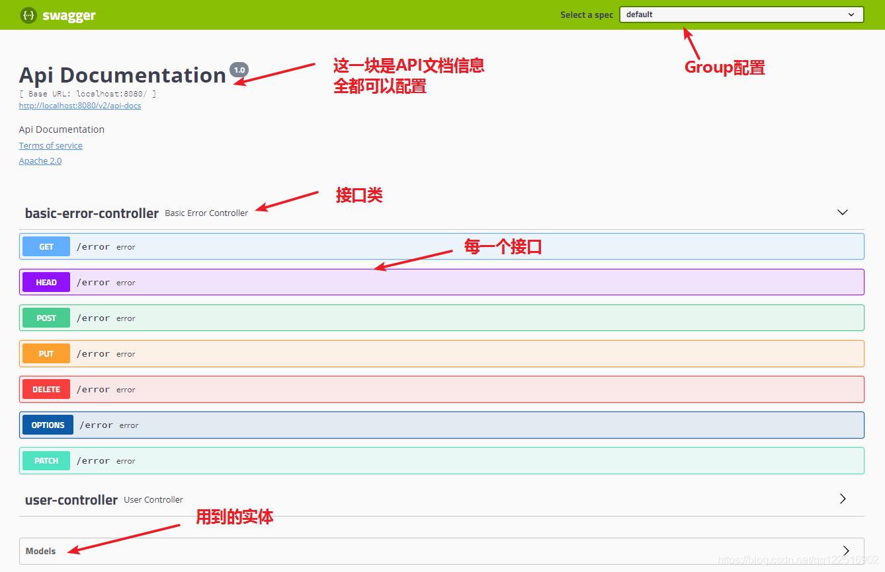
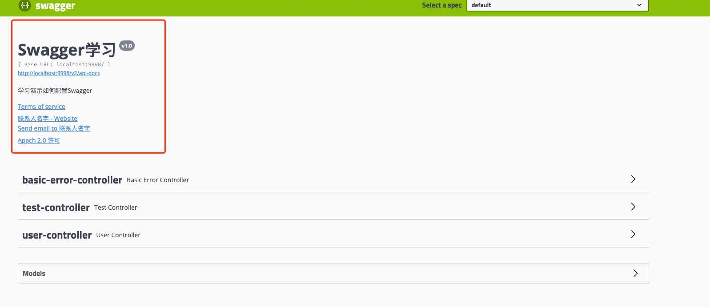
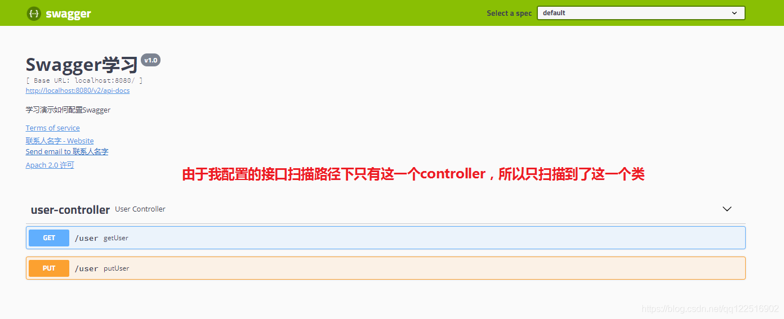
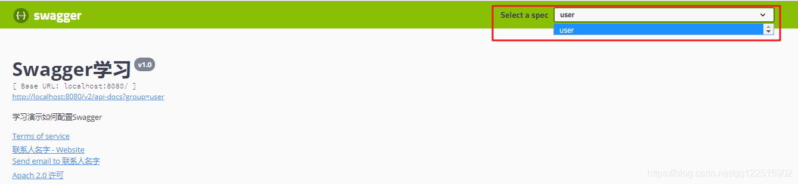
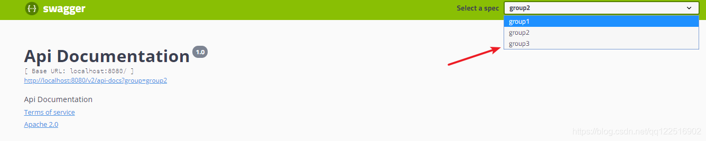
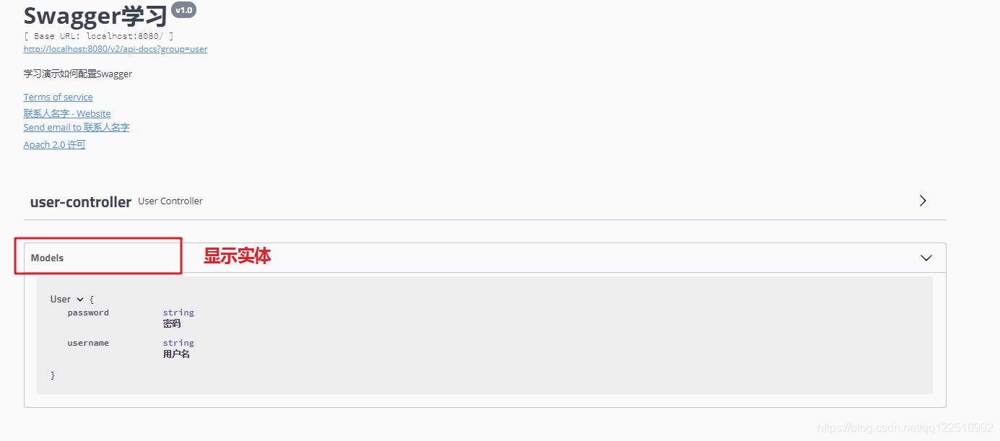
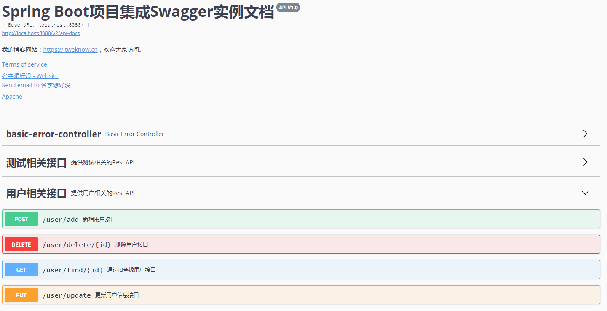
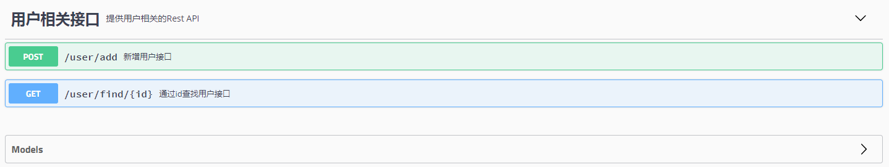
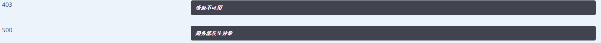

# ``Swagger2.9.2`` 插件的简单使用（``SpringBoot``）

## 1. **添加Web依赖**

```xml
<dependency>
    <groupId>org.springframework.boot</groupId>
    <artifactId>spring-boot-starter-web</artifactId>
</dependency>
```
## 2.**代码准备**
``User``实体类：

```java
@Data
@AllArgsConstructor
@NoArgsConstructor
public class User implements Serializable {
    @TableId(type = IdType.AUTO)
    private int id;
    private String name;
    private String password;
    @Version
    private Integer version;
    @TableLogic
    private Integer deleted;
}
```
``UserController``代码：

```java
@RestController
@RequestMapping("/user")
public class UserController {
    @PostMapping("/add")
    public boolean addUser(@RequestBody User user) {
        return false;
    }
    @GetMapping("/find/{id}")
    public User findById(@PathVariable("id") int id) {
        return new User();
    }
    @PutMapping("/update")
    public boolean update(@RequestBody User user) {
        return true;
    }
    @DeleteMapping("/delete/{id}")
    public boolean delete(@PathVariable("id") int id) {
        return true;
    }
}
```

## 3. **集成 ``Swagger2``**

经过上面的步骤，我们已经拥有了四个接口，分别是:

1. ``/user/add``：新增用户。
2. ``/user/find/{id}``：根据 ``id`` 查询用户。
3. ``/user/update``：更新用户。
4. ``/user/delete/{id}``：根据 ``id`` 删除用户。

下面我们将通过集成 ``Swagger2``，然后为这 4 个 ``Rest API`` 自动生成接口文档。

### 添加``Swagger``依赖

```java
<!-- https://mvnrepository.com/artifact/io.springfox/springfox-swagger2 -->
<dependency>
    <groupId>io.springfox</groupId>
    <artifactId>springfox-swagger2</artifactId>
    <version>2.9.2</version>
</dependency>

<dependency>
    <groupId>io.springfox</groupId>
    <artifactId>springfox-swagger-ui</artifactId>
    <version>2.9.2</version>
</dependency>
```
## 4. ``Java``配置

``Springfox`` 提供了一个 ``Docket`` 对象，让我们可以灵活的配置 ``Swagger`` 的各项属性。下面我们新建一个 ``JavaConfig`` 类，并增加如下内容:

```java
@Component
// 开启Swagger2的自动配置
@EnableSwagger2
public class SwaggerConfig {

    // 配置docket以配置Swagger具体参数
    @Bean
    public Docket docket() {
        return new Docket(DocumentationType.SWAGGER_2);
    }

}
```
上面的配置就已经可以使用``Swagger``了。通过访问``http://localhost:8080/swagger-ui.html``（自己的项目访问路径``/swagger-ui.html``）来访问接口文档就可以了。（自己写几个``Controller``来查看）




大体就是简单实现了，下面是关于复杂细节的配置

## ``Swagger``细节配置

### 1. 配置``API``文档的信息

通过``apiInfo()``属性配置文档信息：

```java
@Component
// 开启Swagger2的自动配置
@EnableSwagger2
public class SwaggerConfig {

    // 配置docket以配置Swagger具体参数
    @Bean
    public Docket docket() {
        return new Docket(DocumentationType.SWAGGER_2).apiInfo(apiInfo());
    }

    private ApiInfo apiInfo() {
        Contact contact = new Contact("联系人名字", "http://xxx.xxx.com/联系人访问链接", "联系人邮箱");
        // public ApiInfo(String title, String description, String version, String termsOfServiceUrl, Contact contact, String ", String licenseUrl, Collection<VendorExtension> vendorExtensions) {
        return new ApiInfo("Swagger学习", // 标题
                "学习演示如何配置Swagger", // 描述
                "v1.0", // 版本
                "http://terms.service.url/组织链接", // 组织链接
                contact, // 联系人信息
                "Apach 2.0 许可", // 许可
                "许可链接", // 许可连接
                new ArrayList<>()); // 扩展
    }

}
```
配置后重启访问可以看到如下：




### 2. 配置要扫描的接口

构建``Docket``时通过``select()``方法配置怎么扫描接口。

```java
@Component
// 开启Swagger2的自动配置
@EnableSwagger2
public class SwaggerConfig {

    // 配置docket以配置Swagger具体参数
    @Bean
    public Docket docket() {
        return new Docket(DocumentationType.SWAGGER_2).apiInfo(apiInfo())
                // 通过.select()方法，去配置扫描接口
                .select()
                // RequestHandlerSelectors配置如何扫描接口
                .apis(RequestHandlerSelectors.basePackage("com.example.swaggerexample.controller")).build();
    }


    private ApiInfo apiInfo() {
        Contact contact = new Contact("联系人名字", "http://xxx.xxx.com/联系人访问链接", "联系人邮箱");
        // public ApiInfo(String title, String description, String version, String termsOfServiceUrl, Contact contact, String ", String licenseUrl, Collection<VendorExtension> vendorExtensions) {
        return new ApiInfo("Swagger学习", // 标题
                "学习演示如何配置Swagger", // 描述
                "v1.0", // 版本
                "http://terms.service.url/组织链接", // 组织链接
                contact, // 联系人信息
                "Apach 2.0 许可", // 许可
                "许可链接", // 许可连接
                new ArrayList<>()); // 扩展
    }

}
```



除了通过包路径配置扫描接口外，还可以通过配置其他方式扫描接口，这里注释一下所有的配置方式：

```java
any() // 扫描所有，项目中的所有接口都会被扫描到
none() // 不扫描接口
withMethodAnnotation(final Class<? extends Annotation> annotation)// 通过方法上的注解扫描，如withMethodAnnotation(GetMapping.class)只扫描get请求
withClassAnnotation(final Class<? extends Annotation> annotation) // 通过类上的注解扫描，如.withClassAnnotation(Controller.class)只扫描有controller注解的类中的接口
basePackage(final String basePackage) // 根据包路径扫描接口
```
### 3. 配置接口扫描过滤

上述方式可以通过具体的类、方法等扫描接口，还可以配置如何通过请求路径配置：
```java
return new Docket(DocumentationType.SWAGGER_2).apiInfo(apiInfo())
                .select()
                .apis(RequestHandlerSelectors.basePackage("com.example.swaggerexample.controller"))
                // 配置如何通过 path过滤 即这里只扫描 请求以 /user开头的接口
    		   .paths(PathSelectors.ant("/user/**"))
                .build();
```
这里的可选值还有：
```java
any() // 任何请求都扫描
none() // 任何请求都不扫描
regex(final String pathRegex) // 通过正则表达式控制，返回true扫描，false不扫描
ant(final String antPattern) // 通过ant()表达式控制，返回true扫描，false不扫描
```
### 4. 配置要忽略的请求参数

可以通过 ``ignoredParameterTypes()`` 方法去配置要忽略的参数：

```java
// 配置docket以配置Swagger具体参数
    @Bean
    public Docket docket() {
        return new Docket(DocumentationType.SWAGGER_2).apiInfo(apiInfo())
            // 配置要忽略的参数
                .ignoredParameterTypes(HttpServletRequest.class) 
                .select()
       .apis(RequestHandlerSelectors.basePackage("com.example.swaggerexample.controller")).build();
    }
```
### 5. 配置是否启动``Swagger``

通过``enable()``方法配置是否启用``swagger``，如果是``false``，``swagger``将不能在浏览器中访问了：

```java
@Bean
public Docket docket() {
    return new Docket(DocumentationType.SWAGGER_2).apiInfo(apiInfo())
            .ignoredParameterTypes(HttpServletRequest.class)
            .enable(false) // 配置是否启用Swagger，如果是false，在浏览器将无法访问
            .select()
            .apis(RequestHandlerSelectors.basePackage("com.example.swaggerexample.controller")).build();
}
```
> 如何动态配置当项目处于``test``、``dev``环境时显示``swagger``，处于``prod``时不显示？

```java
@Bean
public Docket docket(Environment environment) {
    // 设置要显示swagger的环境
    Profiles of = Profiles.of("dev", "test");
    // 判断当前是处于该环境，通过 enable() 接收此参数判断是否要显示
    boolean b = environment.acceptsProfiles(of);

    return new Docket(DocumentationType.SWAGGER_2).apiInfo(apiInfo())
            .ignoredParameterTypes(HttpServletRequest.class)
            .enable(b) // 配置是否启用Swagger，如果是false，在浏览器将无法访问
            .select()
            .apis(RequestHandlerSelectors.basePackage("com.example.swaggerexample.controller")).build();
}
```

### 6. 配置``API``分组

如果没有配置分组，默认是``default``。通过``groupName()``方法即可配置分组：

```java
 @Bean
public Docket docket(Environment environment) {
    return new Docket(DocumentationType.SWAGGER_2).apiInfo(apiInfo())
        .groupName("user") // 配置分组
        // 省略配置....
}
```


如何配置多个分组？

配置多个分组只需要配置多个``docket``即可：

```java
@Bean
public Docket docket1() {
    return new Docket(DocumentationType.SWAGGER_2).groupName("group1");
}
@Bean
public Docket docket2() {
    return new Docket(DocumentationType.SWAGGER_2).groupName("group2");
}
@Bean
public Docket docket3() {
    return new Docket(DocumentationType.SWAGGER_2).groupName("group3");
}
```
如下所示，我们配置了3个组：



### 7.实体配置

比如当前项目中有这么一个实体：

```java
@ApiModel("用户实体")
public class User {
    @ApiModelProperty("用户名")
    private String username;
    @ApiModelProperty("密码")
    private String password;
	// 省略getter/setter
}
```

只要这个实体在**请求接口**的返回值上（即使是泛型），都能映射到实体项中：




注：并不是因为``@ApiModel``这个注解让实体显示在这里了，而是只要出现在接口方法的返回值上的实体都会显示在这里，而``@ApiModel``和``@ApiModelProperty``这两个注解只是为实体添加注释的。

- ``@ApiModel``为类添加注释

- ``@ApiModelProperty``为类属性添加注释

<hr>

- ``@Api``：用在``controller``类，描述``API``接口
- ``@ApiOperation``：描述接口方法
- ``@ApiModel``：描述对象
- ``@ApiModelProperty``：描述对象属性
- ``@ApiImplicitParams``：描述接口参数
- ``@ApiResponses``：描述接口响应
- ``@ApiIgnore``：忽略接口方法


## 8.文档相关描述配置

### 1.通过在控制器类上增加 ``@Api`` 注解，可以给控制器增加描述和标签信息。

给 ``Controller`` 添加描述信息

```java
@Api(tags = "用户相关接口", description = "提供用户相关的 Rest API")
public class UserController
```
### 2. 通过在接口方法上增加 ``@ApiOperation`` 注解来展开对接口的描述，当然这个注解还可以指定很多内容，我们在下面的相关注解说明章节中详细解释。

给接口添加描述信息

```java
@ApiOperation("新增用户接口")
@PostMapping("/add")
public boolean addUser(@RequestBody User user) {
    return false;
}
```
### 3. 实体描述，我们可以通过 ``@ApiModel`` 和 ``@ApiModelProperty`` 注解来对我们 ``API`` 中所涉及到的对象做描述。

给实体类添加描述信息

```java
@ApiModel("用户实体")
public class User {
    @ApiModelProperty("用户 id")
private int id;
}
```

效果：



## 9. 接口过滤

有些时候我们并不是希望所有的 ``Rest API`` 都呈现在文档上，这种情况下 ``Swagger2`` 提供给我们了两种方式配置，一种是基于`` @ApiIgnore ``注解，另一种是在 ``Docket`` 上增加筛选。

### 1.`` @ApiIgnore`` 注解。

如果想在文档中屏蔽掉删除用户的接口``（user/delete）``，那么只需要在删除用户的方法上加上 ``@ApiIgnore`` 即可。

```java
@ApiIgnore
public boolean delete(@PathVariable("id") int id)
```

### 2. 在 ``Docket`` 上增加筛选。``Docket`` 类提供了 ``apis()`` 和 ``paths()`` 两个方法来帮助我们在不同级别上过滤接口

- ``apis()`` ：这种方式我们可以通过指定包名的方式，让 ``Swagger`` 只去某些包下面扫描。
- ``paths()`` ：这种方式可以通过筛选 ``API`` 的 ``url`` 来进行过滤。

在集成 ``Swagger2`` 的章节中我们这两个方法指定的都是扫描所有，没有指定任何过滤条件。如果我们在我们修改之前定义的 ``Docket`` 对象的 ``apis()`` 方法和 ``paths()`` 方法为下面的内容，那么接口文档将只会展示 ``/user/add 和 /user/find/{id}`` 两个接口

使用 ``Docket`` 配置接口筛选

```java
.apis(RequestHandlerSelectors.basePackage("cn.itweknow.sbswagger.controller"))
.paths(Predicates.or(PathSelectors.ant("/user/add"),
        PathSelectors.ant("/user/find/*")))
```
效果：



## 10.自定义相应消息

``Swagger ``允许我们通过 ``Docket`` 的 ``globalResponseMessage()`` 方法全局覆盖 ``HTTP`` 方法的响应消息，但是首先我们得通过 ``Docket`` 的 ``useDefaultResponseMessages`` 方法告诉 ``Swagger`` 不使用默认的 ``HTTP`` 响应消息，假设我们现在需要覆盖所有 ``GET`` 方法的 ``500`` 和 ``403`` 错误的响应消息，我们只需要在 ``SwaggerConfig.java`` 类中的 ``Docket Bean`` 下添加如下内容：

**自定义响应消息**

```java
.useDefaultResponseMessages(false)
.globalResponseMessage(RequestMethod.GET, newArrayList(
new ResponseMessageBuilder()
              .code(500)
              .message("服务器发生异常")
              .responseModel(new ModelRef("Error"))
              .build(),
       new ResponseMessageBuilder()
              .code(403)
              .message("资源不可用")
              .build()
));
```
添加如上面的代码后，如下图所示，您会发现在 ``SwaggerUI``页面展示的所有 ``GET`` 类型请求的 403 以及 500 错误的响应消息都变成了我们自定义的内容。





## 11.相关注解说明

### ``Controller``相关注解

> ``@Api`` 主要属性

注解属性  |	类型  |	描述
---- | --- | ---
tags |	String[] |	控制器标签。
description |	String |	控制器描述（该字段被申明为过期）

<hr>

### 接口相关注解

> ``@ApiOperation``: 可设置对接口的描述。


``@ApiOperation`` 主要属性

注解属性 |	类型 |	描述
---- | --- | ---
value |	String |	接口说明。
notes |	String |	接口发布说明。
tags |	Stirng[] |	标签。
response |	Class<?> |	接口返回类型。
httpMethod |	String |	接口请求方式。

- ``@ApiIgnore:`` ``Swagger`` 文档不会显示拥有该注解的接口。
- ``@ApiImplicitParams:`` 用于描述接口的非对象参数集。 
- ``@ApiImplicitParam:`` 用于描述接口的非对象参数，一般与 
- ``@ApiImplicitParams`` 组合使用。


> ``@ApiImplicitParam`` 主要属性

注解属性 |	描述
---- | ---
paramType |	查询参数类型，实际上就是参数放在那里。取值：path：以地址的形式提交数据，根据 id 查询用户的接口就是这种形式传参；query：Query string 的方式传参；header：以流的形式提交；form：以 Form 表单的形式提交。
dataType |	参数的数据类型。取值：Long 和 String
name |	参数名字。
value |	参数意义的描述。
required |	是否必填。取值：true：必填参数；false：非必填参数。

<hr>

### ``Model`` 相关注解

- ``@ApiModel``: 可设置接口相关实体的描述。
-  ``@ApiModelProperty``: 可设置实体属性的相关描述。

``@ApiModelProperty ``主要属性

注解属性 |	类型 |	描述
---- | --- | ---
value |	String |	字段说明。
name |	String |	重写字段名称。
dataType |	Stirng |	重写字段类型。
required |	boolean |	是否必填。
example |	Stirng |	举例说明。
hidden |	boolean	 | 是否在文档中隐藏该字段。
allowEmptyValue |	boolean	 | 是否允许为空。
allowableValues |	String |	该字段允许的值，当我们 API 的某个参数为枚举类型时，使用这个属性就可以清楚地告诉 API 使用者该参数所能允许传入的值。


