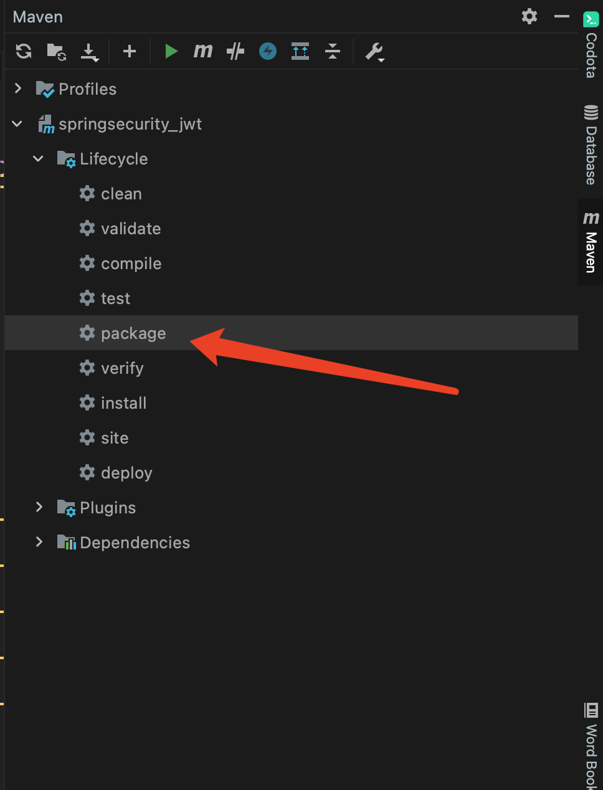
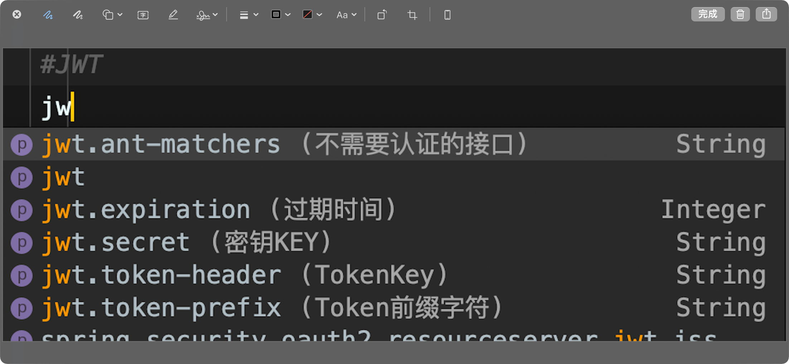

# 关于``springboot``中``yaml``提示的问题

## 自己新建的``config``类

```java
@Getter
@Component
@ConfigurationProperties(prefix = "jwt")
public class JWTConfig {
    /**
     * 密钥KEY
     */
    public static String secret;
    /**
     * TokenKey
     */
    public static String tokenHeader;
    /**
     * Token前缀字符
     */
    public static String tokenPrefix;
    /**
     * 过期时间
     */
    public static Integer expiration;
    /**
     * 不需要认证的接口
     */
    public static String antMatchers;


    public void setSecret(String secret) {
        this.secret = secret;
    }

    public void setTokenHeader(String tokenHeader) {
        this.tokenHeader = tokenHeader;
    }

    public void setTokenPrefix(String tokenPrefix) {
        this.tokenPrefix = tokenPrefix;
    }

    public void setExpiration(Integer expiration) {
        this.expiration = expiration * 1000;
    }

    public void setAntMatchers(String antMatchers) {
        this.antMatchers = antMatchers;
    }
}
```
但是在``yaml``中配置时，却不提示，需要以下两个操作：

### 1. 加入以下来的依赖

```xml
<!--在pom文件中引入如下jar包即可 -->
<dependency>
   <groupId>org.springframework.boot</groupId>
   <artifactId>spring-boot-configuration-processor</artifactId>
   <optional>true</optional>
</dependency>
```

如果还是不提示，第二步操作

### 2. 进行``maven``打包即可




之后再打开``yaml``就可以看到提示了





