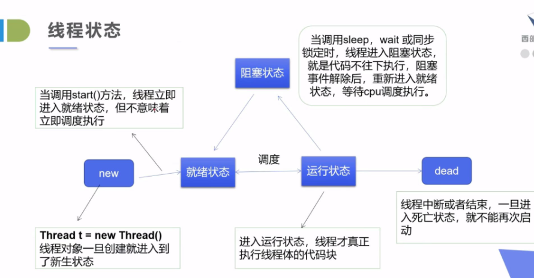
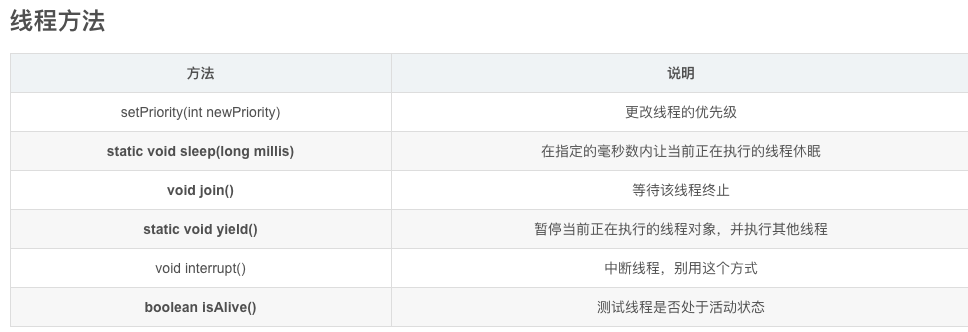
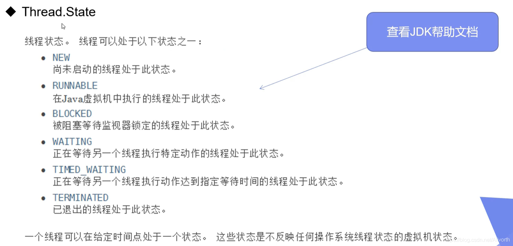
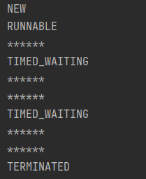
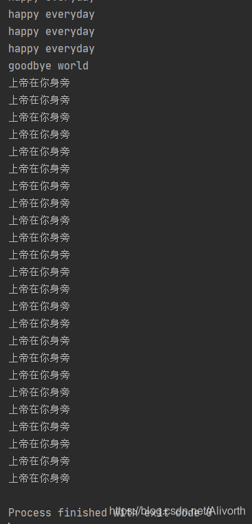
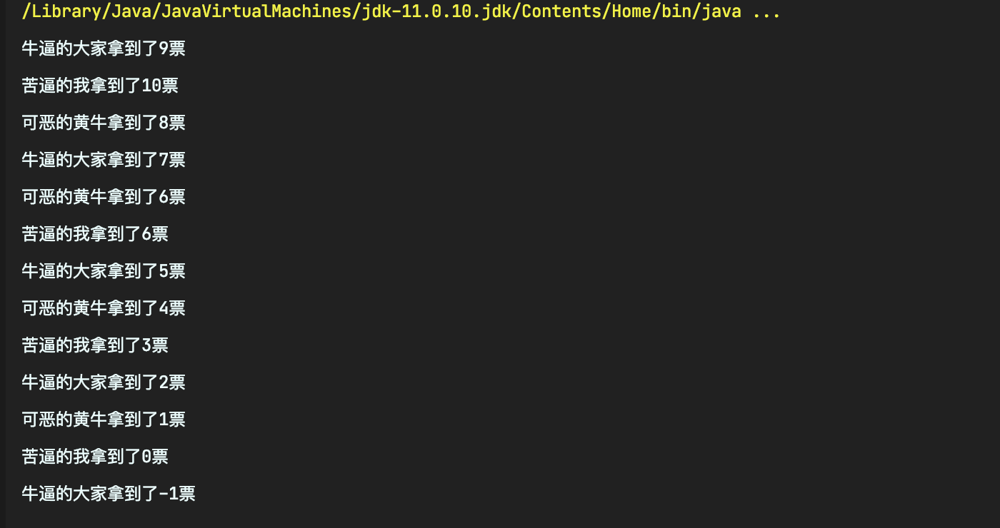
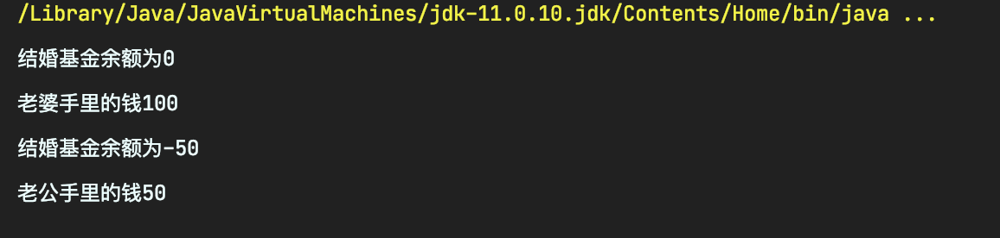
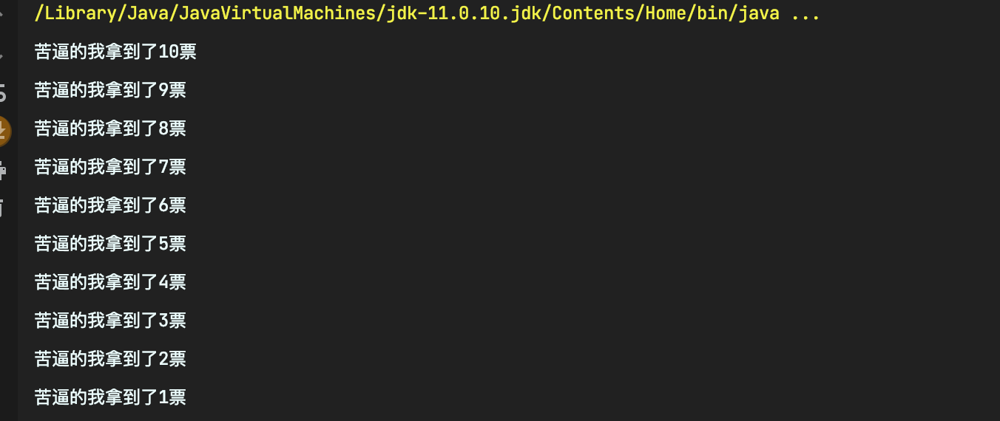

# 多线程笔记

## 核心概念
- 线程就是独立的执行路径；
- 在程序运行时，即使没有自己创建线程，后台也会有多个线程，如主线程，gc线程；
- main()称为主线程，为系统的入口，用于执行整个程序；
- 在一个进程中，如果开辟了多个线程，线程的运行由调度器安排调度，调度器是与操作系统紧密相关的，先后顺序是不能认为干预的；
- 对同一份资源操作时，会存在资源抢夺问题，需要加入并发控制；
- 线程会带来额外的开销，如CPU调度时间，并发控制开销；
- 每个线程在自己的工作内存交互，内存控制不当会造成数据不一致

## 线程实现的三个方式

#### 继承``Thread``类，重写``run``方法

```java
//创建线程方式一：继承Thread类，重写run()方法，调用start()开启线程
public class Test01 extends Thread{
	@Override
	public void run() {
		//run方法线程体
		for (int i = 0; i <20; i++) {
			System.out.println("我在看代码");
		}	
	}
	public static void main(String[] args) {
		//main线程，主线程
		//创建一个线程对象
		Test01 t= new Test01();
        //t.run();     调用run()方法，执行完run方法体再执行main方法体
		//调用start()方法开启线程     同时执行
		t.start();
		for (int i = 0; i < 2000; i++) {
			System.out.println(“我在学多线程"+i);
		}
	}
}
```
**线程开启不一定立即执行，有cpu进行调度**

### 实现``Runnable``接口
```java
public class TestTread implements Runnable {
	//票数
	private int ticketNums = 10;
	@Override
	public void run() {
		while(true){
			if(ticketNums<=0){
				break;
			}		
			//模拟延时
			try {
				Thread.sleep(200);
			} catch (InterruptedException e) {
				e.printStackTrace();
			}		
			System.out.println(Thread.currentThread().getName()+"-->拿到了第"+ticketNums-- +"票");
		}
	}
	public static void main(String[] args) {
		TestTread ticket = new TestTread();
		new Thread(ticket,"小明").start();
		new Thread(ticket,"老师").start();
		new Thread(ticket,"黄牛").start();
	}
}
```
> **小结**：以上两者区别

- 继承Thread类：
    - 子类继承``Thread``类具备多线程能力
    - 启动线程：子类对象.``start()``
    - 不建议使用：避免``OOP``单继承局限性

- 实现``Runnable``接口
    - 实现``Runnable``接口具备多线程能力
    - 启动线程：``new Thread``(子类对象).``start()``
    - 推荐使用：避免单继承局限性，方便同一个对象被多个线程使

### 实现``Callable``接口

> 步骤
- 实现Calleble接口
- 重写call()方法
- 创建执行服务
  >ExecutorService ser = Executors.newFixedThreadPool(线程数);
- 提交执行
  >Future<返回值类型> r = ser.submit(线程名)；
- 获取结果
  >类型 res=r.get();
- 关闭服务
  >ser.shutdownNow();

==总结==：优点：1.可以定义返回值；2.能抛出异常
==​缺点==：相比而言较为麻烦

## 线程停止 -- stop()

### 线程状态



### 线程停止的方法

> 注意点

- 建议线程正常停止——>利用次数，不建议死循环
- 建议使用标志位——>设置一个标志位
- 不要使用``stop``或者``destroy``等过时或者``JDK``不建议使用的方法

```java
public class TestStop implements Runnable{
    //1.设置一个标志位
    private boolean flag = true;
    @Override
    public void run() {
        int i = 0;
        while(flag){
            System.out.println("run...Thread"+ i++);
        }
    }
    
    //2.设置一个公开的方法停止线程，转换标志位
    public void stop(){
        this.flag = false;
    }

    public static void main(String[] args) {
        TestStop stop = new TestStop();
        new Thread(stop).start();

        for (int i = 0; i < 1000; i++) {
            System.out.println("main"+i);
            if(i==900){
                //调用stop方法切换标志位，让线程停止
                stop.stop();
                System.out.println("线程停止了");
            }
        }
    }
}
```

## 线程休眠 -- sleep()

- ``sleep``(时间)指定当前线程阻塞的毫秒数；
- ``sleep``存在异常``InterruptedException``；
- ``sleep``时间达到后线程进入就绪状态；
- ``sleep``可以模拟网络延时，倒计时等；
- 每一个对象都有一个锁，**``sleep``不会释放锁。**

> 例子1：模拟延时：TestThread
模拟网络延时的作用：放大问题的发生性

```java
package com.lmr.practice;

import java.text.SimpleDateFormat;
import java.util.Date;

//模拟倒计时
public class TestSleep2 {

    public static void main(String[] args) {
//        try {
//            tenDown();
//        } catch (InterruptedException e) {
//            e.printStackTrace();
//        }
        //打印系统当前时间
        Date startTime = new Date(System.currentTimeMillis());  //获取系统当前时间
        while(true){
            try {
                Thread.sleep(1000);
                System.out.println(new SimpleDateFormat("HH:mm:ss").format(startTime));
                startTime = new Date(System.currentTimeMillis());  //更新当前时间
            } catch (InterruptedException e) {
                e.printStackTrace();
            }
        }
    }

    public static void tenDown() throws InterruptedException {
        int num = 10;
        while(true){
            Thread.sleep(1000);
            System.out.println(num--);
            if(num<=0){
                break;
            }
        }
    }
}
```

## 线程礼让 -- yield()

- 礼让线程，让当前正在执行的线程暂停，但不阻塞；
- 将线程从运行状态转为就绪状态;
- 让``CPU``重新调度，礼让不一定成功，看``CPU``心情。

## 线程强制执行 -- join()

- ``join``合并线程，待此线程执行完后，再执行其它线程，其它线程阻塞；
- 可以想象成插队

```java
public class TestJoin implements Runnable{
    @Override
    public void run() {
        for (int i = 0; i < 100; i++) {
            System.out.println("线程VIP来了"+i);
        }
    }

    public static void main(String[] args) throws InterruptedException {
        TestJoin testJoin = new TestJoin();
        Thread thread = new Thread(testJoin);

        //主线程
        for (int i = 0; i < 1000; i++) {
            if(i == 200){
                thread.start();
                thread.join(); //插队
            }
            System.out.println("main"+i);
            
        }
    }
}
```

## 方法总结



## 观察线程的状态




样例：

```java
package cn.livorth.state;

public class TestState {
    public static void main(String[] args) {
        Thread thread  = new Thread(()->{
            for (int i = 0; i < 5; i++) {
                try {
                    Thread.sleep(100);
                } catch (InterruptedException e) {
                    e.printStackTrace();
                }
                System.out.println("******");
            }
        });

        //启动前
        Thread.State state = thread.getState();
        System.out.println(state);//NEW

        //启动后
        thread.start();
        state = thread.getState();
        System.out.println(state);//RUNABLE

        //阻塞时与结束时
        while(state != Thread.State.TERMINATED){
            try {
                Thread.sleep(200);
            } catch (InterruptedException e) {
                e.printStackTrace();
            }
            state = thread.getState();
            //TIMED_WAITING或者TERMINATED
            System.out.println(state);
        }
    }
}
```
打印结果： 



## 线程的优先级

- ``Java``提供一个线程调度器来监控程序中启动后进入就绪状态的所有线程，线程调度器按照优先级决定应该调度哪个线程来执行。

- 线程的优先级用数字表示，范围从1~10.
	- ``Thread.MIN_ PRIORITY``= 1;
	- ``Thread.MAX PRIORITY`` = 10;
	- ``Thread.NORM_ PRIORITY``= 5;
- 使用以下方式获取或改变优先级
	- ``getPriority()`` ，``setPriority(int xxx)``

**注意：**

- 先设置优先级再启动
- ``main``方法的默认优先级为5
- 理论上来说优先级越高的越先执行，哪怕他``start``更晚

## 守护线程

- 线程分为用户线程和守护线程
- 虚拟机必须确保*用户线程*执行完毕 （如，``main``）
- 虚拟机不用等待*守护线程*执行完毕 （如，后台记录操作日志，监控内存，垃圾回收……）

```java
//上帝守护你
public class TestDaemon {

    public static void main(String[] args) {
        God god = new God();
        You you = new You();

        Thread thread = new Thread(god);
        thread.setDaemon(true);   //默认false表示是用户线程，正常的线程都是用户线程

        thread.start();  //上帝守护线程启动

        new Thread(you).start();   //你 用户线程启动
    }
}

//上帝
class God implements Runnable{

    @Override
    public void run() {
        while(true){
            System.out.println("上帝保佑你");
        }
    }
}

//你
class You implements Runnable{

    @Override
    public void run() {
        for (int i = 0; i < 36500; i++) {
            System.out.println("你一生都开心的活着");
        }
        System.out.println("=====GoodBye World!======");
    }
}
```
结果：




上帝明明是个死循环，但是进程还是结束了。

因为这里将上帝线程设置为了守护线程，虚拟机不加以考虑


## 线程同步机制

并发：**同一个对象被多个线程**同时操作 （如：上万人同时抢票）

> 处理多线程问题时，多线程访问同一个对象(并发)，并且某些线程还想修改这个对象。这时则需要线程同步。
**线程同步**其实是一种等待机制，多个需要同时访问此对象的线程进入这个**对象的等待池**形成队列，等待前面的线程使用完毕，下一个线程再使用。

> 线程同步的形成条件：**队列+锁**

## 同步方法和同步方法快

◆由于我们可以通过``private``关键字来保证数据对象只能被方法访问,所以我们只需要针对方法提出一套机制,这套机制就是``synchronized``关键字,它包括两种用法:``synchronized``方法和``synchronized``块

​ 同步方法: ``public synchronized void method(int args) }``

◆``synchronized``方法控制对“对象”的访问,每个对象对应一把锁,每个``synchronized``方法都必须获得调用该方法的对象的锁才能执行,否则线程会阻塞，方法一旦执行,就独占该锁,直到该方法返回才释放锁,后面被阻塞的线程才能获得这个锁,继续执行。
缺陷:若将一个大的方法申明为``synchronized``将会影响效率

方法里需要修改的内容才需要锁，否则浪费资源

◆同步块: ``synchronized (Obj){}``

◆``Obj``称之为同步监视器

◆``Obj``可以是任何对象,但是推荐使用共享资源作为同步监视器

◆同步方法中无需指定同步监视器,因为同步方法的同步监视器就是``this`` , 就是这个对象本身,或者是``class``

◆ 同步监视器的执行过程:

	- 第一个线程访问,锁定同步监视器,执行其中代码.
	- 第二个线程访问,发现同步监视器被锁定,无法访问.
	- 第一个线程访问完毕,解锁同步监视器
	- 第二个线程访问， 发现同步监视器没有锁,然后锁定并访问

> **线程不安全的实例**

*1.买票*：
```java
/**
 * @author cy
 * @create 2021-02-03-1:45 下午
 * @Description 测试不安全的买票
 */
public class TestThreadBuyTic {

    public static void main(String[] args) {
        BuyTicket buyTicket = new BuyTicket();
        new Thread(buyTicket,"苦逼的我").start();
        new Thread(buyTicket,"牛逼的大家").start();
        new Thread(buyTicket,"可恶的黄牛").start();
    }

}
class BuyTicket implements Runnable{
    //票
    private int ticketNums = 10;
    //外部停止方式
    boolean flag = true;

    @Override
    @SneakyThrows
    public void run() {
        //买票
        while (true){
            buy();
        }
    }

    public  void buy() throws InterruptedException {
        //判断是否有票
        if(ticketNums <= 0){
            return;
        }
        //模拟延时
            Thread.sleep(100);
        System.out.println(Thread.currentThread().getName()+"拿到了"+ticketNums--+"票");
    }
}
```

测试结果：
结果出现了（-1）: 这是线程不安全的


*2.银行取钱*

```java
/**
 * @author cy
 * @create 2021-02-03-2:03 下午
 * @Description 线程银行取钱不安全实例
 */
public class TestThreadBank {
    public static void main(String[] args) {
        Account account = new Account(100, "结婚基金");

        Drawing lg = new Drawing(account, 50, "老公");
        Drawing lp = new Drawing(account, 100, "老婆");

        lg.start();
        lp.start();


    }
}

//账户
class Account{
    //余额
    int money;
    //卡名
    String name;

    public Account(int money, String name) {
        this.money = money;
        this.name = name;
    }
}
//银行
class Drawing extends Thread{

    //账户
    Account account;
    //取了多少钱
    int drawingMoney;
    //现在手里有多少钱
    int nowMoney;

    public Drawing(Account account, int drawingMoney,String name) {
        super(name);
        this.account = account;
        this.drawingMoney = drawingMoney;
    }
    //取钱
    @Override
    public void run() {
        //判断手里有没有钱
        if(account.money - drawingMoney < 0){
            System.out.println(Thread.currentThread().getName()+"钱不够");
        }
        //sleep 可以放大问题的发生性
        try {
            Thread.sleep(1000);
        } catch (InterruptedException e) {
            e.printStackTrace();
        }
        //卡内余额=余额-你取的钱
        account.money = account.money - drawingMoney;
        //你手里的钱
        nowMoney = nowMoney + drawingMoney;
        System.out.println(account.name+"余额为"+account.money);
        //这两个操作等价
        //System.out.println(this.getName()+Thread.currentThread().getName());
        System.out.println(this.getName()+"手里的钱"+nowMoney);

    }
}
```

结果截图：存款出现了负数



> 把不安全的改成安全的

第一个购买票的实例中，buy()方法添加``synchronized``，这叫**同步方法**
```java
//同步方法，锁的是this
    private synchronized void buy() throws InterruptedException{
        //判断是否有票
        if(ticketNums<=0)
        {
            return;
        }
        //模拟延时
        Thread.sleep(100);
        //买票
        System.out.println(Thread.currentThread().getName()+"拿到了"+ticketNums--+"票");
    }
```
就再也不会出现问题了：


<hr>、
第二个取钱实例，采用**同步块**演示:

```java
 //取钱
    @Override
    public void run() {
        synchronized(account)
        {
            //判断有没有钱
            if(account.money-drawingMoney<0)
            {
                System.out.println(Thread.currentThread().getName()+"钱不够");
                return;
            }
            //sleep可以放大问题的发生性
            try {
                Thread.sleep(1000);
            }catch(Exception e)
            {
                e.printStackTrace();
            }
            //卡内余额=余额-你取的钱
            account.money = account.money-drawingMoney;
            //你手里的钱
            nowMoney = nowMoney + drawingMoney;
            System.out.println(account.name+"余额为"+account.money);
           
            //这两个操作等价
            //System.out.println(this.getName()+Thread.currentThread().getName());
            System.out.println(this.getName()+"手里的钱"+nowMoney);
       
        }
    }
```
结果：


## 死锁

**解释:**

多个线程各自占有一些共享资源,**并且互相等待其他线程占有的资源**才能运行,而导致两个或者多个线程都在等待对方释放资源,都停止执行的情形. 某一个同步块同时拥有**两个以上对象的锁**时,就可能会发生“死锁”的问题.

### Lock（锁🔒）

通过显示定义同步锁对象（Lock）来实现同步

**``ReentrantLock``类实现了``Lock``接口，它拥有与``synchronized``相同的并发性和内存语义，在实现线程安全的控制中，比较常用的是``ReentrantLock``,可以显式加锁、释放锁。**

加锁：``lock.lock()``

解锁：``lock.unlock()``

演示代码:

```java
public class TestLock {

    public static void main(String[] args) {
        TestLock2 testLock = new TestLock2();
        new Thread(testLock, "A").start();
        new Thread(testLock, "B").start();
        new Thread(testLock, "C").start();
    }
}

class TestLock2 implements Runnable{
    int count = 1000;
    //定义lock锁
    private final ReentrantLock lock = new ReentrantLock();
    @Override
    public void run() {
        try {
            Thread.sleep(1000);
        } catch (InterruptedException e) {
            e.printStackTrace();
        }
        while(true)
        {
            try {
                //进入加锁状态
                lock.lock();
                if(count > 0)
                    System.out.println(Thread.currentThread().getName() + "---" +count--);
                else
                    break;
            }
            finally {
                //解锁
                lock.unlock();
            }
        }
    }
}
```
==说明==

在不加锁的情况下，ABC可能会同时操作到count，导致数据紊乱

在加了锁之后，ABC排队操作

## 线程协作

### 生产者消费者模式
生产者与消费者共享一个资源，同时生产者与消费者相互依赖互为条件

	- 生产者访问仓库，往里面放；消费者也要访问，但是只拿

主要是用以下方法达到通信的效果：
- ``wait()``：先释放资源，并开始等待
- ``wait(long timeout)``：释放资源等待timeout秒
- ``notify()``：唤醒一个处于等待状态的线程
- ``notifyAll()``：唤醒同一个对象上所有调用了wait()方法的线程，优先级高的优先调度

解决方式：

1. 管程法
   
	设置一个缓冲区，用户暂存数据
	
	代码演示：

	```java
	//管程法解决
	public class TestPC {
		public static void main(String[] args) {
			//创建缓冲区
			SynContainer container = new  SynContainer();

			//双线程
			new Producer(container).start();
			new Consumer(container).start();
		}
	}

	//生产者
	class Producer extends Thread{
		SynContainer container;

		public Producer(SynContainer container) {
			this.container = container;
		}

		@Override
		public void run() {
			for (int i = 0; i < 100; i++) {
				System.out.println("生产了第" + i + "件产品");
				container.push(new Products(i));
			}
		}
	}

	//消费者
	class Consumer extends Thread{
		SynContainer container;

		public Consumer(SynContainer container) {
			this.container = container;
		}

		@Override
		public void run() {
			for (int i = 0; i < 100; i++) {
				System.out.println("消费了第" + container.pop().id + "件产品");
			}
		}
	}

	//产品
	class Products{
		int id;

		public Products(int id) {
			this.id = id;
		}
	}

	//缓冲区
	class SynContainer{
		Queue<Products> queue = new LinkedList<Products>();
		int count = 0;
		int size = 10;

		//生产者放入产品
		public synchronized void push(Products product)
		{
			//容器满，等待消费者消费
			if(count == size)
			{
				try {
					this.wait();
				} catch (InterruptedException e) {
					e.printStackTrace();
				}
			}

			//没满，我们则需要存入成品,并唤醒消费者
			count++;
			queue.offer(product);
			this.notifyAll();
		}

		//消费者消费产品
		public synchronized Products pop()
		{
			//容器为空，等待生产者生产
			if (count == 0) {
				try {
					this.wait();
				} catch (InterruptedException e) {
					e.printStackTrace();
				}
			}

			//容器有剩，取出物品，并告诉生产者可以生产了
			count--;
			Products productPoll = queue.poll();
			this.notifyAll();
			return productPoll;
		}
	}
	```
2. 信号灯法

	设置一个标记位（类似于容量为1的管程法）
	```java
	//信号灯法解决
	public class TestPC2 {
		public static void main(String[] args) {
			//创建缓冲区
			TheProduct theProduct = new  TheProduct();

			//双线程
			new Producers(theProduct).start();
			new Consumers(theProduct).start();
		}
	}

	//生产者
	class Producers extends Thread{
		TheProduct theProduct;

		public Producers(TheProduct theProduct) {
			this.theProduct = theProduct;
		}

		@Override
		public void run() {
			for (int i = 0; i < 10; i++) {
				theProduct.push("产品" + i);
			}
		}
	}

	//消费者
	class Consumers extends Thread{
		TheProduct theProduct;

		public Consumers(TheProduct container) {
			this.theProduct = container;
		}

		@Override
		public void run() {
			for (int i = 0; i < 10; i++) {
				theProduct.pop();
			}
		}
	}

	//产品
	class TheProduct{
		boolean flag = false;
		String product;
		//生产者生产，消费者等待
		public synchronized void push(String product)
		{
			if(flag)
			{
				try {
					this.wait();
				} catch (InterruptedException e) {
					e.printStackTrace();
				}
			}

			System.out.println("生产者生产了" + product);
			this.product = product;
			this.flag = !this.flag;
			this.notifyAll();

		}

		//消费者消费，生产者等待
		public synchronized void pop()
		{
			if(!flag)
			{
				try {
					this.wait();
				} catch (InterruptedException e) {
					e.printStackTrace();
				}
			}

			System.out.println("消费者消费了" + product);
			this.flag = !this.flag;
			this.notifyAll();
		}
	}
	```

## 线程池

- 背景:经常创建和销毁、使用量特别大的资源，比如并发情况下的线程，对性能影响很大
- 思路:提前创建好多个线程，放入线程池中，使用时直接获取,使用完放回池中，可以避免频繁创建销毁、实现重复利用。类似生活中的公共交通工具
- 好处:
	- 提高响应速度(减少了创建新线程的时间)
	- 降低资源消耗(重复利用线程池中线程，不需要每次都创建)
	- 便于线程管理
		- ``corePoolSize``:核心池的大小
		- ``maximumPoolSize``: 最大线程数
		- ``keepAliveTime``: 线程没有任务时最多保持多长时间后会终止

