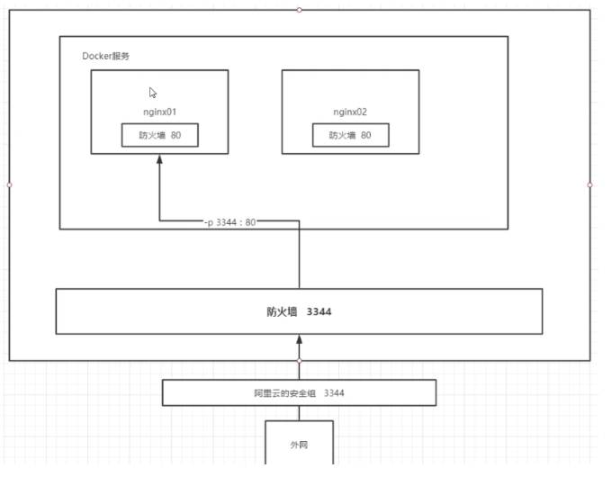

# Docker 安装Nginx


```
#1. 搜索镜像 search 建议大家去docker搜索，可以看到帮助文档
#2. 拉取镜像 pull
#3、运行测试
# -d 后台运行
# --name 给容器命名
# -p 宿主机端口：容器内部端口
➜  ~ docker run -d --name nginx00 -p 82:80 nginx
75943663c116f5ed006a0042c42f78e9a1a6a52eba66311666eee12e1c8a4502
➜  ~ docker ps
CONTAINER ID        IMAGE               COMMAND                  CREATED             STATUS              PORTS                NAMES
75943663c116        nginx               "nginx -g 'daemon of…"   41 seconds ago      Up 40 seconds       0.0.0.0:82->80/tcp   nginx00
➜  ~ curl localhost:82   #测试
<!DOCTYPE html>,,,,

```
> 思考问题：我们每次改动nginx配置文件，都需要进入容器内部？十分的麻烦，要是可以在容器外部提供一个映射路径，达到在容器修改文件名，容器内部就可以自动修改？√数据卷！





