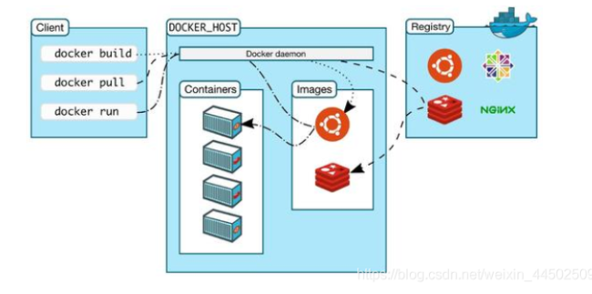
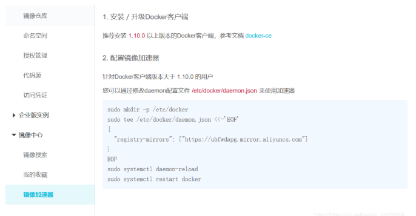
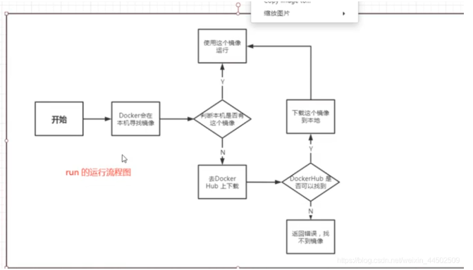

# Docker安装
## Docker的基本组成



 ### 镜像(image):
>docker镜像好比一个模板,可以通过这个模板来创建容器服务,tomcat镜像===>run ==>tomcat01容器(提供服务器)
通过这个镜像可以创建多个容器(最终服务运行或者项目运行就是在容器中的)

### 容器(container):
> Docker利用容器技术,独立运行一个或者一个组应用,通过镜像来创建的启动,停止,删除,基本命令!

### 仓库(repository):
> 仓库就是存放镜像的地方!仓库分为共有仓库和私有仓库Docker Hub(默认是国外的)阿里云… 都有容器服务器(配置镜像加速)


## 安装Docker
> 环境准备

1. 需要会一点点Linux基础
2. CentOS7
3. 使用Xshell连接远程服务器


```
 # 查看系统内核
[root@iZ2zeheduaqlfxyl598si8Z /]# uname -r
3.10.0-1062.18.1.el7.x86_64
```
```
#系统版本
[root@CZP ~]# cat /etc/os-release
NAME="CentOS Linux"
VERSION="7 (Core)"
ID="centos"
ID_LIKE="rhel fedora"
VERSION_ID="7"
PRETTY_NAME="CentOS Linux 7 (Core)"
ANSI_COLOR="0;31"
CPE_NAME="cpe:/o:centos:centos:7"
HOME_URL="https://www.centos.org/"
BUG_REPORT_URL="https://bugs.centos.org/"

CENTOS_MANTISBT_PROJECT="CentOS-7"
CENTOS_MANTISBT_PROJECT_VERSION="7"
REDHAT_SUPPORT_PRODUCT="centos"
REDHAT_SUPPORT_PRODUCT_VERSION="7"
```

> 安装Docker

查看帮助文档


```
# 一, 卸载旧的版本
$ sudo yum remove docker \
                  docker-client \
                  docker-client-latest \
                  docker-common \
                  docker-latest \
                  docker-latest-logrotate \
                  docker-logrotate \
                  docker-engine
                 
# 2, 需要安装的包
yum install -y yum-utils

#3. 设置镜像仓库
yum-config-manager \
    --add-repo \
    https://download.docker.com/linux/centos/docker-ce.repo #默认是国外的

yum-config-manager \
    --add-repo \
    https://mirrors.aliyun.com/docker-ce/linux/centos/docker-ce.repo #推荐使用
#更新yum软件包索引
yum makecache fast
#安装docker    
sudo yum install docker-ce docker-ce-cli containerd.io 
#启动docker
systemctl start docker
#查看docker版本
docker version
```

> 下载镜像  
docker pull [要下载的软件]

> 查看下载的镜像   
 docker images

> 卸载docker
 
```
yum remove docker-ce docker-ce-cli containerd.io

rm -rf /var/lib/docker#docker 默认工作路径

```
> 阿里云配置Docker镜像加速





> 执行命令


```
sudo mkdir -p /etc/docker

sudo tee /etc/docker/daemon.json <<-'EOF'
{
  "registry-mirrors": ["阿里云镜像加速地址"]
}
EOF

sudo systemctl daemon-reload

sudo systemctl restart docker

```





