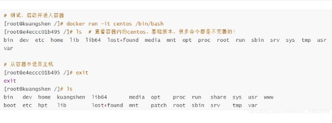
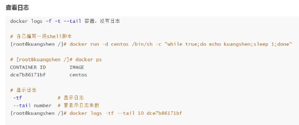
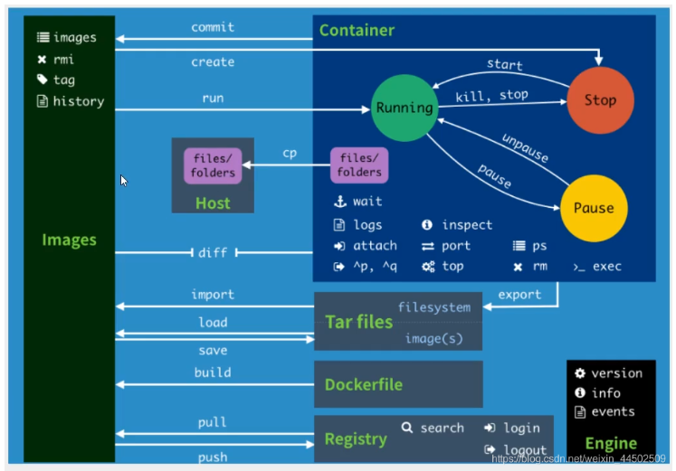
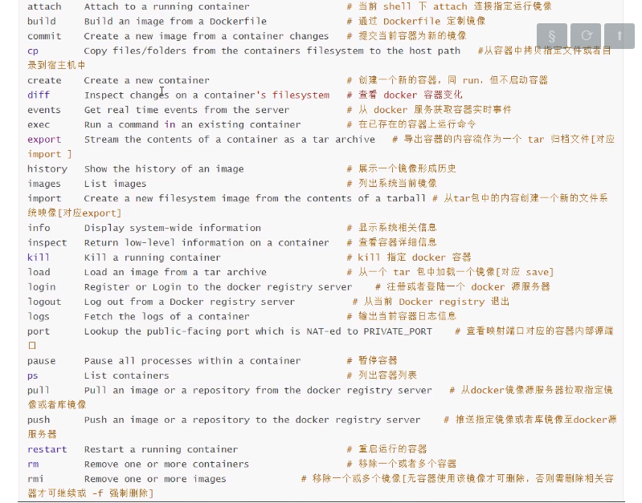
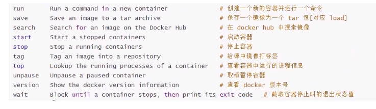

# Docker的常用命令
## 帮助命令

```
docker version #docker版本 
docker info #显示docker的系统信息,包括镜像和容器的数量
docker [命令] --help  #查看某个具体的命令

```

## 镜像命令
> docker images 查看下载的所有镜像


```
# docker images
REPOSITORY                TAG                 IMAGE ID            CREATED             SIZE
mysql                     5.6                 8de95e6026c3        20 hours ago        302MB
redis                     latest              36304d3b4540        12 days ago         104MB
mysql                     latest              30f937e841c8        2 weeks ago         541MB
centos/mysql-57-centos7   latest              f83a2938370c        8 months ago        452MB
# 解释
REPOSITORY 镜像的仓库名
TAG 镜像的标签
IMAGE ID 镜像ID
CREATED 镜像创建时间
SIZE 镜像的大小

#可选项
Options:
  -a, --all             #列出所有镜像
  -q, --quiet           #只显示镜像ID

```
> docker search 搜索镜像


```
[root@CZP ~]# docker search mysql
NAME	DESCRIPTION									STARS	OFFICIAL	AUTOMATED	
mysql	MySQL is a widely used, open-source relation…  9604     [OK]                

#可选项,通过收藏来过滤
--filter=stars=3000 #搜索出来的镜像收藏就是大于3000的

```

> docker pull 下载镜像


```
[root@CZP ~]# docker pull nginx [:tag]
Using default tag: latest #如果不写tag 默认使用最新版本
latest: Pulling from library/nginx
8559a31e96f4: Pull complete  #分层下载,docker image核心 联合文件系统
8d69e59170f7: Pull complete 
3f9f1ec1d262: Pull complete 
d1f5ff4f210d: Pull complete 
1e22bfa8652e: Pull complete 
Digest: sha256:21f32f6c08406306d822a0e6e8b7dc81f53f336570e852e25fbe1e3e3d0d0133 #签名
Status: Downloaded newer image for nginx:latest
docker.io/library/nginx:latest #真实地址

# docker pull nginx 等价于 dicker pull docker.io/library/nginx:latest


#指定版本下载

```

> docker rmi 删除镜像


```
#删除指定的容器
[root@CZP ~]# docker rm -f 8de95e6026c3 
#删除全部的容器
[root@CZP ~]# docker rm -f $(docker -ap) 

```

## 容器命令
> 说明 : 有了镜像才可以创建容器,


```
docker pull [image]

```

> 新建容器并启动


```
docker run  [可选参数] image

#参数说明
--name=""  容器名字 用于区分容器
-d         后台方式运行
-it        使用交互方式运行,进入容器查看内容
-p	       指定容器的端口 -p 80:8080  主机端口:容器端口
-P(大写)    随机指定端口

```





> 列出所有运行的容器


```
# docker ps 命令
	# 列出当前正在运行的容器
-a	# 列出当前正在运行的容器+历史运行过的容器
-n=?# 显示最近创建的容器
-q	# 只显示容器的编号
[root@CZP ~]# docker ps 
CONTAINER ID        IMAGE               COMMAND             CREATED             STATUS              PORTS               NAMES
[root@CZP ~]# docker ps -a 
CONTAINER ID        IMAGE               COMMAND                  CREATED             STATUS                    PORTS               NAMES
919e58ff5521        redis               "docker-entrypoint.s…"   20 hours ago        Exited (0) 16 hours ago                       redis


```

> 退出容器


```
exit #直接容器停止并退出
ctrl + p + q 直接退出容器
```
> 删除容器


```
docker rm 容器id
docker rm -f[递归] $(docker ps -aq) #递归删除所有的容器
docker ps -a | xargs docker rm #递归删除所有的容器

```

> 启动和停止容器的操作

```
docker start 容器id  #启动容器
docker restart 容器id  #重启容器
docker stop 容器id	#停止当前正在运行的容器
docker kill 容器id 	#强制停止当前容器

```
## 常用的其他命令
> 后台启动容器   

```
#命令docker run -d 镜像名

#常见的坑: docker容器后台运行,就必须要有一个前台进程,docker发现没有应用,就会自动停止
#nginx, 容器启动后,发现自己没有提供服务,就会立刻停止,就是没有程序了

```




> 查看容器中进程信息


```
docker top 容器id 
[root@CZP ~]# docker top 63d4c4115212
UID                 PID                 PPID                C                   STIME 
polkitd             2319                2301                0                   12:33 


```

> 查看镜像元数据


```
#命令
docker inspect 容器id


#测试
[root@CZP ~]# docker inspect 63d4c4115212 
[
    {
        "Id": "63d4c41152126cae276b69e1100520f9d6d867f950e488b5488de68181b7870b",
        "Created": "2020-06-10T04:33:13.666827714Z",
        "Path": "docker-entrypoint.sh",
        "Args": [
            "redis-server"
        ],
        "State": {
            "Status": "running",
            "Running": true,
            "Paused": false,
            "Restarting": false,
            "OOMKilled": false,
            "Dead": false,
            "Pid": 2319,
            "ExitCode": 0,
            "Error": "",
            "StartedAt": "2020-06-10T04:33:14.008260846Z",
            "FinishedAt": "0001-01-01T00:00:00Z"
        },
        "Image": "sha256:36304d3b4540c5143673b2cefaba583a0426b57c709b5a35363f96a3510058cd",
        "ResolvConfPath": "/var/lib/docker/containers/63d4c41152126cae276b69e1100520f9d6d867f950e488b5488de68181b7870b/resolv.conf",
        "HostnamePath": "/var/lib/docker/containers/63d4c41152126cae276b69e1100520f9d6d867f950e488b5488de68181b7870b/hostname",
        "HostsPath": "/var/lib/docker/containers/63d4c41152126cae276b69e1100520f9d6d867f950e488b5488de68181b7870b/hosts",
        "LogPath": "/var/lib/docker/containers/63d4c41152126cae276b69e1100520f9d6d867f950e488b5488de68181b7870b/63d4c41152126cae276b69e1100520f9d6d867f950e488b5488de68181b7870b-json.log",
        "Name": "/redis",
        "RestartCount": 0,
        "Driver": "overlay2",
        "Platform": "linux",
        "MountLabel": "",
        "ProcessLabel": "",
        "AppArmorProfile": "",
        "ExecIDs": null,
        "HostConfig": {
            "Binds": null,
            "ContainerIDFile": "",
            "LogConfig": {
                "Type": "json-file",
                "Config": {}
            },
            "NetworkMode": "default",
            "PortBindings": {
                "6379/tcp": [
                    {
                        "HostIp": "",
                        "HostPort": "6379"
                    }
                ]
            },
            "RestartPolicy": {
                "Name": "no",
                "MaximumRetryCount": 0
            },
            "AutoRemove": false,
            "VolumeDriver": "",
            "VolumesFrom": null,
            "CapAdd": null,
            "CapDrop": null,
            "Capabilities": null,
            "Dns": [],
            "DnsOptions": [],
            "DnsSearch": [],
            "ExtraHosts": null,
            "GroupAdd": null,
            "IpcMode": "private",
            "Cgroup": "",
            "Links": null,
            "OomScoreAdj": 0,
            "PidMode": "",
            "Privileged": false,
            "PublishAllPorts": false,
            "ReadonlyRootfs": false,
            "SecurityOpt": null,
            "UTSMode": "",
            "UsernsMode": "",
            "ShmSize": 67108864,
            "Runtime": "runc",
            "ConsoleSize": [
                0,
                0
            ],
            "Isolation": "",
            "CpuShares": 0,
            "Memory": 0,
            "NanoCpus": 0,
            "CgroupParent": "",
            "BlkioWeight": 0,
            "BlkioWeightDevice": [],
            "BlkioDeviceReadBps": null,
            "BlkioDeviceWriteBps": null,
            "BlkioDeviceReadIOps": null,
            "BlkioDeviceWriteIOps": null,
            "CpuPeriod": 0,
            "CpuQuota": 0,
            "CpuRealtimePeriod": 0,
            "CpuRealtimeRuntime": 0,
            "CpusetCpus": "",
            "CpusetMems": "",
            "Devices": [],
            "DeviceCgroupRules": null,
            "DeviceRequests": null,
            "KernelMemory": 0,
            "KernelMemoryTCP": 0,
            "MemoryReservation": 0,
            "MemorySwap": 0,
            "MemorySwappiness": null,
            "OomKillDisable": false,
            "PidsLimit": null,
            "Ulimits": null,
            "CpuCount": 0,
            "CpuPercent": 0,
            "IOMaximumIOps": 0,
            "IOMaximumBandwidth": 0,
            "MaskedPaths": [
                "/proc/asound",
                "/proc/acpi",
                "/proc/kcore",
                "/proc/keys",
                "/proc/latency_stats",
                "/proc/timer_list",
                "/proc/timer_stats",
                "/proc/sched_debug",
                "/proc/scsi",
                "/sys/firmware"
            ],
            "ReadonlyPaths": [
                "/proc/bus",
                "/proc/fs",
                "/proc/irq",
                "/proc/sys",
                "/proc/sysrq-trigger"
            ]
        },
        "GraphDriver": {
            "Data": {
                "LowerDir": "/var/lib/docker/overlay2/db63749d3abd5e587a88360e27fc9b5b0db7069b45e2bd8c48c75e25eba89100-init/diff:/var/lib/docker/overlay2/30d298e0d46edd68a8cbb588247384b9516d1140f5ca592b7f0b1c04618111f0/diff:/var/lib/docker/overlay2/af6963cd652870740eec10549b2a6c8f08b94edb3a3cea1a42d727026bb6d5a0/diff:/var/lib/docker/overlay2/af514c78199cdcfb30194921b892782dacbe1a3f439167f2f434b2f5a55ab5c3/diff:/var/lib/docker/overlay2/b1e020f1a03a66483794af0cf20d59e8dfa471f692ecaa145398d30500370a2a/diff:/var/lib/docker/overlay2/e55685d1f4ea504c3df5c3cbe822ab000f6412d3eff50b6b8ba097fb551ad922/diff:/var/lib/docker/overlay2/df78a0d3f0dbc449650ce5605d67ff45e93dbadc4fe93d2b7552203a31ab46a8/diff",
                "MergedDir": "/var/lib/docker/overlay2/db63749d3abd5e587a88360e27fc9b5b0db7069b45e2bd8c48c75e25eba89100/merged",
                "UpperDir": "/var/lib/docker/overlay2/db63749d3abd5e587a88360e27fc9b5b0db7069b45e2bd8c48c75e25eba89100/diff",
                "WorkDir": "/var/lib/docker/overlay2/db63749d3abd5e587a88360e27fc9b5b0db7069b45e2bd8c48c75e25eba89100/work"
            },
            "Name": "overlay2"
        },
        "Mounts": [
            {
                "Type": "volume",
                "Name": "f544b94e9e0129e7f438b851edbfc94a82c96e6fdda44179d38e20f800878a6a",
                "Source": "/var/lib/docker/volumes/f544b94e9e0129e7f438b851edbfc94a82c96e6fdda44179d38e20f800878a6a/_data",
                "Destination": "/data",
                "Driver": "local",
                "Mode": "",
                "RW": true,
                "Propagation": ""
            }
        ],
        "Config": {
            "Hostname": "63d4c4115212",
            "Domainname": "",
            "User": "",
            "AttachStdin": false,
            "AttachStdout": false,
            "AttachStderr": false,
            "ExposedPorts": {
                "6379/tcp": {}
            },
            "Tty": false,
            "OpenStdin": false,
            "StdinOnce": false,
            "Env": [
                "PATH=/usr/local/sbin:/usr/local/bin:/usr/sbin:/usr/bin:/sbin:/bin",
                "GOSU_VERSION=1.12",
                "REDIS_VERSION=6.0.4",
                "REDIS_DOWNLOAD_URL=http://download.redis.io/releases/redis-6.0.4.tar.gz",
                "REDIS_DOWNLOAD_SHA=3337005a1e0c3aa293c87c313467ea8ac11984921fab08807998ba765c9943de"
            ],
            "Cmd": [
                "redis-server"
            ],
            "Image": "36304d3b4540",
            "Volumes": {
                "/data": {}
            },
            "WorkingDir": "/data",
            "Entrypoint": [
                "docker-entrypoint.sh"
            ],
            "OnBuild": null,
            "Labels": {}
        },
        "NetworkSettings": {
            "Bridge": "",
            "SandboxID": "5f8321169dfd067e45f2921d73984d0d76e953cd642d93990d1ed8a3227ad53f",
            "HairpinMode": false,
            "LinkLocalIPv6Address": "",
            "LinkLocalIPv6PrefixLen": 0,
            "Ports": {
                "6379/tcp": [
                    {
                        "HostIp": "0.0.0.0",
                        "HostPort": "6379"
                    }
                ]
            },
            "SandboxKey": "/var/run/docker/netns/5f8321169dfd",
            "SecondaryIPAddresses": null,
            "SecondaryIPv6Addresses": null,
            "EndpointID": "33eafd9f86d5e7a3b29ed09fe75d8eb27e0227a07607960550dfef7f620a6872",
            "Gateway": "172.18.0.1",
            "GlobalIPv6Address": "",
            "GlobalIPv6PrefixLen": 0,
            "IPAddress": "172.18.0.2",
            "IPPrefixLen": 16,
            "IPv6Gateway": "",
            "MacAddress": "02:42:ac:12:00:02",
            "Networks": {
                "bridge": {
                    "IPAMConfig": null,
                    "Links": null,
                    "Aliases": null,
                    "NetworkID": "228826a97a0b066a01811c098e4c4985804598571b9c8d9ad4205a0ee75c8b5b",
                    "EndpointID": "33eafd9f86d5e7a3b29ed09fe75d8eb27e0227a07607960550dfef7f620a6872",
                    "Gateway": "172.18.0.1",
                    "IPAddress": "172.18.0.2",
                    "IPPrefixLen": 16,
                    "IPv6Gateway": "",
                    "GlobalIPv6Address": "",
                    "GlobalIPv6PrefixLen": 0,
                    "MacAddress": "02:42:ac:12:00:02",
                    "DriverOpts": null
                }
            }
        }
    }

```
> 进入当前正在运行的容器


```
#我们通常容器都是使用后台方式运行的,需要进入容器,修改一些配置

#命令
docker exec -it 容器id  bashshell 默认命令行

docker attach 容器id
#docker exec # 进入容器后开启一个新的终端,可以在里面操作(常用)
#docker attach # 进入容器正在执行的终端,不会启动新的进程

```

> 从容器内拷贝文件到主机上


```
docker cp 容器id: 容器内路径 目的主机路径

```
## 小结










