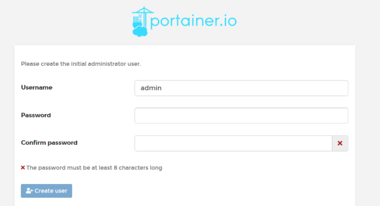
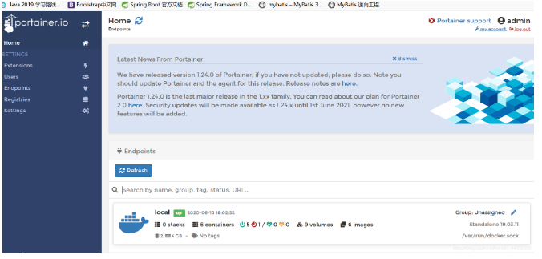

# 可视化

> portainer

```
docker run -d -p 8080:9000 \
--restart=always -v /var/run/docker.sock:/var/run/docker.sock --privileged=true portainer/portainer

```
> 什么是portainer?

Docker图形化界面管理工具! 提供一个后台面板供我们操作


```
docker run -d -p 8080:9000 \
--restart=always -v /var/run/docker.sock:/var/run/docker.sock --privileged=true portainer/portainer

```
> 访问测试: 外网: 8088 http://外网ip:8088/





> 进入之后的面板





