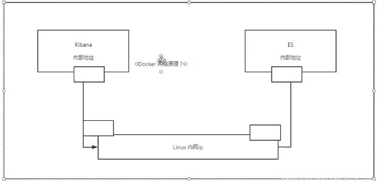

# 部署es+kibana


```
# es 暴露的端口很多！
# es 的数据一般需要放置到安全目录！挂载
# --net somenetwork ? 网络配置

# 启动elasticsearch
docker run -d --name elasticsearch -p 9200:9200 -p 9300:9300 -e "discovery.type=single-node" elasticsearch:7.6.2
# 测试一下es是否成功启动
➜  ~ curl localhost:9200
{
  "name" : "d73ad2f22dd3",
  "cluster_name" : "docker-cluster",
  "cluster_uuid" : "atFKgANxS8CzgIyCB8PGxA",
  "version" : {
    "number" : "7.6.2",
    "build_flavor" : "default",
    "build_type" : "docker",
    "build_hash" : "ef48eb35cf30adf4db14086e8aabd07ef6fb113f",
    "build_date" : "2020-03-26T06:34:37.794943Z",
    "build_snapshot" : false,
    "lucene_version" : "8.4.0",
    "minimum_wire_compatibility_version" : "6.8.0",
    "minimum_index_compatibility_version" : "6.0.0-beta1"
  },
  "tagline" : "You Know, for Search"
}
➜  ~ docker stats # 查看docker容器使用内存情况

CONTAINER ID        NAME                CPU %               MEM USAGE / LIMIT   MEM %               NET I/O             BLOCK I/O           PIDS
bd4094db247f        elasticsearch       1.57%               1.226GiB / 3.7GiB   33.13%              0B / 0B             0B / 0B             42
94b00b6f6172        tomcat              0.18%               78.58MiB / 3.7GiB   2.07%               1.69kB / 2.47kB     0B / 0B             37
d458bc50a808        nginx01             0.00%               1.883MiB / 3.7GiB   0.05%               5.22kB / 6.32kB     0B / 0B             3
63d4c4115212        redis               0.14%               9.637MiB / 3.7GiB   0.25%               10.8kB / 14.2kB     0B / 0B             7


```


```
#elasticsearch十分占用内存,需要修改配置文件 -e 限制其启动的内存
docker run -d --name elasticsearch -p 9200:9200 -p 9300:9300 -e ES_JAVA_OPTS= 
"-Xms64m -Xmx 512m"  elasticsearch:7.6.2

```


```

[root@CZP ~]# curl localhost:9200
{
  "name" : "bd4094db247f",
  "cluster_name" : "docker-cluster",
  "cluster_uuid" : "U3TfPp1rQ6uitn0WMh6pRQ",
  "version" : {
    "number" : "7.6.2",
    "build_flavor" : "default",
    "build_type" : "docker",
    "build_hash" : "ef48eb35cf30adf4db14086e8aabd07ef6fb113f",
    "build_date" : "2020-03-26T06:34:37.794943Z",
    "build_snapshot" : false,
    "lucene_version" : "8.4.0",
    "minimum_wire_compatibility_version" : "6.8.0",
    "minimum_index_compatibility_version" : "6.0.0-beta1"
  },
  "tagline" : "You Know, for Search"
}


```


> docker和kibana如何连接





