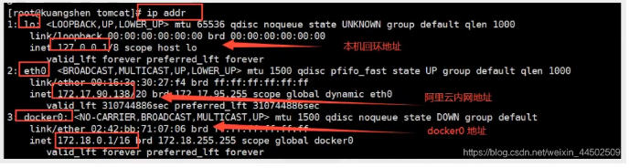
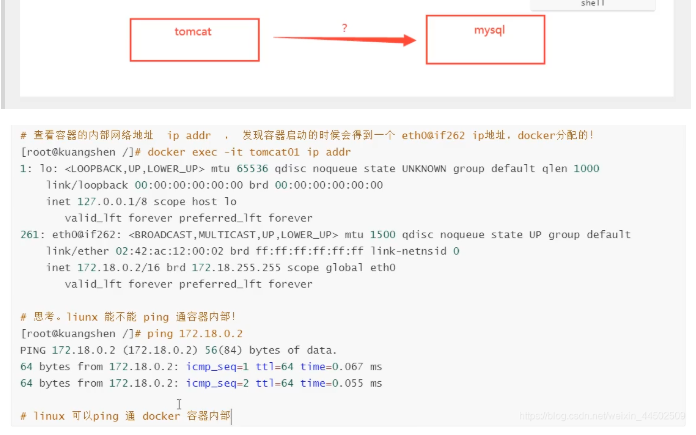
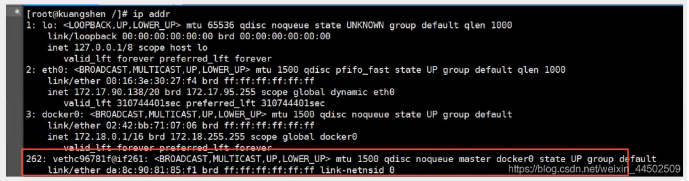

# Docker网络
理解docker0

==测试==




三个网络
> 问题: docker 是如何处理容器网络访问的?



> 原理

1. 我们每启动一个docker容器,docker就会给docker容器分配一个ip,我们只要安装了docker,就会有一个网卡docker0,桥接模式,使用的技术是evth-pair技术!

再次测试 ip addr





1. 再启动一个容器


>  我们发现这个容器带来网卡, 都是一对对的
 evth-pair 就是一对虚拟机设备接口,他们都是成对出现的,一端连着协议,一端彼此相连
 正因为有这个特性,veth-pair 充当桥梁,连接各种虚拟网络设备的
 openStac,Docker容器之间的连接,OVS的连接,都是使用 evth-pair 技术

3. 我们来测试一下


结论: tomcat01和tomcat02是共用的一个路由器,docker0

所有的容器不指定网络的情况下,都是docker0路由的,docker会给我们的容器分配一个默认的可用IP

> 小结

Docker 使用的是Linux的桥接,宿主机中是一个Docker容器的网桥,docker0


Docker中所有的网络接口都是虚拟的,虚拟的转发效率高

只要容器删除,对应网桥的一对就没了


## –link

> 思考一个场景,我们编写了一个微服务,database url=ip: 项目不重启,数据库IP换掉了,我们希望可以通过名字来访问服务


```
[root@CZP ~]# docker exec -it tomcat02 ping tomcat01
ping: tomcat01: Name or service not known

# 如何可以解决呢?


# 通过 --link 就可以解决网络问题
[root@CZP ~]# docker exec -it tomcat03 ping tomcat02
PING tomcat02 (172.18.0.4) 56(84) bytes of data.
64 bytes from tomcat02 (172.18.0.4): icmp_seq=1 ttl=64 time=0.128 ms
64 bytes from tomcat02 (172.18.0.4): icmp_seq=2 ttl=64 time=0.097 ms
64 bytes from tomcat02 (172.18.0.4): icmp_seq=3 ttl=64 time=0.091 ms
64 bytes from tomcat02 (172.18.0.4): icmp_seq=4 ttl=64 time=0.109 ms
64 bytes from tomcat02 (172.18.0.4): icmp_seq=5 ttl=64 time=0.097 ms
64 bytes from tomcat02 (172.18.0.4): icmp_seq=6 ttl=64 time=0.096 ms
64 bytes from tomcat02 (172.18.0.4): icmp_seq=7 ttl=64 time=0.092 ms
64 bytes from tomcat02 (172.18.0.4): icmp_seq=8 ttl=64 time=0.094 ms
64 bytes from tomcat02 (172.18.0.4): icmp_seq=9 ttl=64 time=0.102 ms
^C
--- tomcat02 ping statistics ---
9 packets transmitted, 9 received, 0% packet loss, time 1007ms
rtt min/avg/max/mdev = 0.091/0.100/0.128/0.015 ms

# 反向是否可以ping通吗
[root@CZP ~]# docker exec -it tomcat02 ping tomcat03
```
```
/etc/hosts  配置端口和域名的绑定
```


本地探究 – link 就是我们在host配置中增加了一个172.18.0.3 tomcat02 312857784cd4

我们现在玩Docker已经不建议使用–link了!

自定义网络,不使用docker0!

docker0问题: 它不支持容器名连接访问!


## 自定义网络
> 查看所有的docker网络


### 网络模式

- bridge : 桥接 docker 大桥

- none: 不配置网络

- host: 和宿主机共享网络

- container: 容器内网络联通

### 测试

```
# 直接启动的命令 --net brodge,默认docker0
docker run -d -P --name tomcat01 --net bridge tomcat

# docker0的特点: 默认的,域名是不能访问的, --link可以打通连接

# 自定义

[root@CZP ~]# docker network create --help

Usage:	docker network create [OPTIONS] NETWORK

Create a network

Options:
      --attachable           Enable manual container attachment
      --aux-address map      Auxiliary IPv4 or IPv6 addresses used by Network driver (default map[])
      --config-from string   The network from which copying the configuration
      --config-only          Create a configuration only network
  -d, --driver string        Driver to manage the Network (default "bridge")
      --gateway strings      IPv4 or IPv6 Gateway for the master subnet
      --ingress              Create swarm routing-mesh network
      --internal             Restrict external access to the network
      --ip-range strings     Allocate container ip from a sub-range
      --ipam-driver string   IP Address Management Driver (default "default")
      --ipam-opt map         Set IPAM driver specific options (default map[])
      --ipv6                 Enable IPv6 networking
      --label list           Set metadata on a network
  -o, --opt map              Set driver specific options (default map[])
      --scope string         Control the network's scope
      --subnet strings       Subnet in CIDR format that represents a network segment

[root@CZP ~]# docker network create --driver bridge --subnet 192.168.0.0/16 --gateway 192.168.0.1 mynet
677fae13a48c634dc03c56641b9ba31354846d31a196fdcb92c9ef6ddff73150
[root@CZP ~]# docker network ls
NETWORK ID          NAME                DRIVER              SCOPE
228826a97a0b        bridge              bridge              local
c3b4884cd4db        host                host                local
677fae13a48c        mynet               bridge              local
35885200f93d        none                null                local
```

> 我们自己的网络就创建好了


```
[root@CZP ~]#  docker run -d -P --name tomcat-net-01 --net mynet tomcat:9.0
336dd072ca17ac1adf514c44c8dcbd3358146d6d60667f3a0f99dbbb3e305f09
[root@CZP ~]#  docker run -d -P --name tomcat-net-02 --net mynet tomcat:9.0
2cea3bb29350ae99ce26c1bf6f8d1f2dcfb25bf8042193263ce275308e9eb42d
[root@CZP ~]# docker network inspect mynet
[
   {
       "Name": "mynet",
       "Id": "677fae13a48c634dc03c56641b9ba31354846d31a196fdcb92c9ef6ddff73150",
       "Created": "2020-06-14T16:49:14.554786193+08:00",
       "Scope": "local",
       "Driver": "bridge",
       "EnableIPv6": false,
       "IPAM": {
           "Driver": "default",
           "Options": {},
           "Config": [
               {
                   "Subnet": "192.168.0.0/16",
                   "Gateway": "192.168.0.1"
               }
           ]
       },
       "Internal": false,
       "Attachable": false,
       "Ingress": false,
       "ConfigFrom": {
           "Network": ""
       },
       "ConfigOnly": false,
       "Containers": {
           "2cea3bb29350ae99ce26c1bf6f8d1f2dcfb25bf8042193263ce275308e9eb42d": {
               "Name": "tomcat-net-02",
               "EndpointID": "ebff8e9ef22bd3d66d0de4229d1f3a3c610785b23005294f60f96f3089d52c3d",
               "MacAddress": "02:42:c0:a8:00:03",
               "IPv4Address": "192.168.0.3/16",
               "IPv6Address": ""
           },
           "336dd072ca17ac1adf514c44c8dcbd3358146d6d60667f3a0f99dbbb3e305f09": {
               "Name": "tomcat-net-01",
               "EndpointID": "69451bb0c95ed27d207cd2bade9c57fd2625c245b8b8cb3e5d0dea530a368683",
               "MacAddress": "02:42:c0:a8:00:02",
               "IPv4Address": "192.168.0.2/16",
               "IPv6Address": ""
           }
       },
       "Options": {},
       "Labels": {}
   }
]

```

> 现在不使用–link也可以ping名字了,推荐使用这种网络


```
[root@CZP ~]# docker exec tomcat-net-01 ping tomcat-net-02
PING tomcat-net-02 (192.168.0.3) 56(84) bytes of data.
64 bytes from tomcat-net-02.mynet (192.168.0.3): icmp_seq=1 ttl=64 time=0.080 ms
64 bytes from tomcat-net-02.mynet (192.168.0.3): icmp_seq=2 ttl=64 time=0.096 ms
64 bytes from tomcat-net-02.mynet (192.168.0.3): icmp_seq=3 ttl=64 time=0.086 ms
^C
[root@CZP ~]# 

```

> 好处: 不同的集群使用不同的集群,保证集群之间是安全和健康的


## 网络联通


> 测试打通 tomcat01到tomcat-net-01
 连通之后就是将 tomcat01 放到了mynet网络下
 一个容器两个ip   阿里云: 公网ip 私网ip


这样容器之间就可以ping通了

## 实战 redis集群部署


```
# 创建网卡
docker network create --subnet 172.38.0.0/16 redis

# 通过脚本创建六个redis配置
for port in $(seq 1 6);\
do \
mkdir -p /mydata/redis/node-${port}/conf
touch /mydata/redis/node-${port}/conf/redis.conf
cat << EOF >> /mydata/redis/node-${port}/conf/redis.conf
port 6379
bind 0.0.0.0
cluster-enabled yes
cluster-config-file nodes.conf
cluster-node-timeout 5000
cluster-announce-ip 172.38.0.1${port}
cluster-announce-port 6379
cluster-announce-bus-port 16379
appendonly yes
EOF
done


# 通过脚本运行六个redis
for port in $(seq 1 6);\
do \
docker run -p 637${port}:6379 -p 1637${port}:16379 --name redis-${port} \
-v /mydata/redis/node-${port}/data:/data \
-v /mydata/redis/node-${port}/conf/redis.conf:/etc/redis/redis.conf \
-d --net redis --ip 172.38.0.1${port} redis:5.0.9-alpine3.11 redis-server /etc/redis/redis.conf 
done

#停止redis并删除容器
for port in $(seq 1 6);\
do \
docker stop redis-${port}; \
docker rm redis-${port};
done

docker exec -it redis-1 /bin/sh #redis默认没有bash
redis-cli --cluster create 172.38.0.11:6379 172.38.0.12:6379 172.38.0.13:6379 172.38.0.14:6379 172.38.0.15:6379 172.38.0.16:6379  --cluster-replicas 1

```
集群搭建成功


