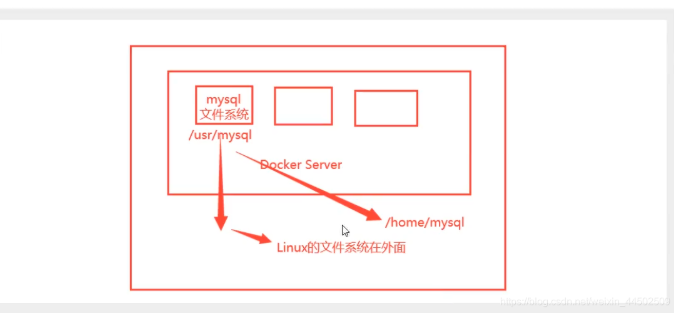
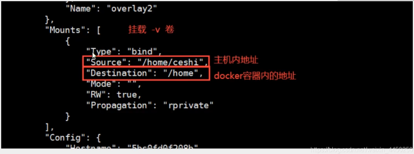
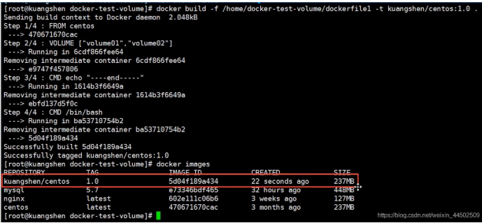
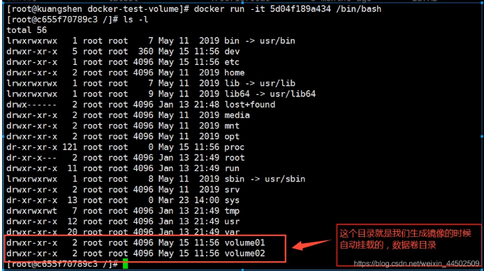
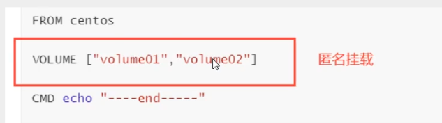
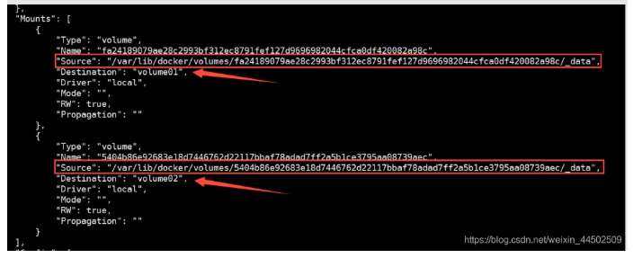
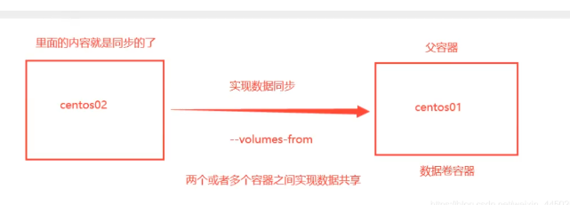
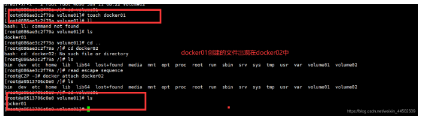
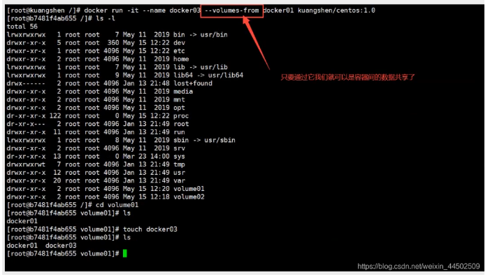
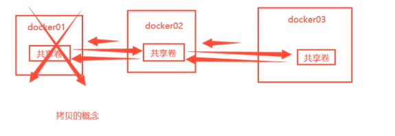

# 容器数据卷
## 什么叫容器数据卷
### docker理念回顾
将应用和环境打包成一个镜像!

如果数据都在容器中,那么我们容器删除,数据就会丢失! 需求: ==数据可以持久化==

> MYSQL, 容器删了,删库跑路! 需求: mysql数据可以存储在本地!

容器之间可以有一个数据共享的技术! Docker 容器中产生的数据,同步到本地!

这就是卷技术! 目录的挂载,将容器内的目录挂载到Linux上面!




==总结一句话: 容器的持久化和同步操作! 容器间也可以数据共享的!==

## 使用数据卷

> 方式一: 直接使用命令来挂载 -v

```shell
docker run -it -v 主机目录: 容器内目录  -p 主机端口: 容器端口

#测试
[root@jinmao jm]# docker run -it -v /home/ceshi:/home centos /bin/bash
# 启动起来我们可以使用 docker inspect 容器id
```
```shell
#将宿主机的/root/test挂载到tomcat的/home目录
[root@CZP ~]# docker run -d -p 9999:8080 -v /root/test:/home --name="tomcat01"  1b6b1fe7261e
015001911b67f5e357b93c6bb05ebaf07aebe4f3abc455f9aa439afd83b9af78
[root@CZP ~]# docker ps
CONTAINER ID        IMAGE                 COMMAND                  CREATED             STATUS              PORTS                                            NAMES
015001911b67        1b6b1fe7261e          "catalina.sh run"        16 seconds ago      Up 15 seconds       0.0.0.0:9999->8080/tcp                           tomcat01
db186da947d7        portainer/portainer   "/portainer"             17 hours ago        Up 17 hours         0.0.0.0:8088->9000/tcp                           interesting_shockley
bd4094db247f        elasticsearch:7.6.2   "/usr/local/bin/dock…"   18 hours ago        Up 17 hours         0.0.0.0:9200->9200/tcp, 0.0.0.0:9300->9300/tcp   elasticsearch
94b00b6f6172        tomcat:9.0            "catalina.sh run"        18 hours ago        Up 18 hours         0.0.0.0:8080->8080/tcp                           tomcat
d458bc50a808        nginx                 "/docker-entrypoint.…"   18 hours ago        Up 18 hours         0.0.0.0:80->80/tcp                               nginx01
63d4c4115212        36304d3b4540          "docker-entrypoint.s…"   22 hours ago        Up 22 hours         0.0.0.0:6379->6379/tcp                           redis

#进入tomcat内部
[root@CZP test]# docker exec -it tomcat01 /bin/bash
root@015001911b67:/usr/local/tomcat# cd /home
#在home目录创建b.java
root@015001911b67:/home# touch b.java
root@015001911b67:/home# read escape sequence
[root@CZP test]# cd /root/test
[root@CZP test]# ll
total 0
-rw-r--r-- 1 root root 0 Jun 11 11:03 b.java #b.java显示挂载成功
```




## 实战: 安装Mysql
思考: mysql的数据持久化的问题, data目录

```shell
#获取镜像
[root@CZP ~]# docker pull mysql:5.7


# 运行容器,需要做数据挂载! # 安装启动mysql,需要配置密码,这是官方的
# 官方测试: docker run --name some-mysql -e MYSQL_ROOT_PASSWORD=密码 -d mysql:tag

#启mysql
-d  后台运行
-p  端口映射
-v  端口映射
-e  环境配置
--name 容器名

[root@CZP czp]# docker run -d -p 3306:3306 -v /usr/czp/mysql/conf:/etc/mysql/conf.d -v /home/mysql/data:/var/lib/mysql -e MYSQL_ROOT_PASSWORD=sa --name mysql mysql:5.7

# 启动成功之后,我们在本地使用sqlyog来连接测试一下

#sqlyog-连接到服务器的端口 ---服务器端口和容器端口映射,这个时候我们就可以连接上了
```

假设我们将容器删除


发现,我们挂载到本地的数据卷依旧没有丢失,这就实现了容器数据持久化功能

## 具名挂载和匿名挂载
```shell
# 匿名挂载
-v 容器内路径!
docker -run -P -name nginx01 -v /etc/nginx nginx

#查看所有的卷的情况
[root@CZP data]# docker volume ls

local               2c04226b82b31e3cddb80b5fffa17685883ff8c256024525b3a65b07b8281110

#这里发现,这种就是匿名挂载, 我们在 -v只写了容器内的路径,没有写容器外的路径


#具名挂载
[root@CZP data]# docker run -d -p 9099:80 -v nginxConfig:/etc/nginx 2622e6cca7eb
bd7ebf502166e5569ea3fb5eddaf41f4ff9a70df62b9143861dd702ae8c1cb31
[root@CZP data]# docker volume ls
DRIVER              VOLUME NAME
local               nginxConfig
# 通过 -v 卷名:容器内路径
# 查看一下这个卷

```


所有的docker容器内的卷,没有指定目录的情况下都是在/var/lib/docker/volumes/卷名/_data

我们通过具名挂载可以方便的找到一个卷,大多数情况在使用的’具名挂载’

```shell
# 如何确定是具名挂载还是匿名挂载,还是指定路径挂载
-v 容器内路径 #匿名挂载
-v 卷名:容器内路径 #具名挂载
-v 宿主机路径 : 容器内路径 #指定路径挂载

```

扩展:

```shell
#通过 -v  容器内路径: ro rw 改变读写权限
ro read only
read and write

#一旦设置了容器权限,容器对挂载出来的内容就有限定了!
docker -run -P -name nginx01 -v /etc/nginx:ro nginx
docker -run -P -name nginx01 -v /etc/nginx:rw nginx
ro : 只要看到ro就说明这个路径只能通过宿主机来改变,容器内部无法操作

```
### 初始Dockerfile

Dockerfile就是用来构建Dockerfile镜像的文件! 命令脚本!

```shell
# 创建一个dockerfile文件,名字可以随机 建议 dockerfile
# 文件中的内容

FROM centos

VOLUME ["volume01","volume02"]

CMD echo "---end---"
CMD /bin/hash

```








这个卷和外部一定有一个同步的目录




查看一下卷挂载的路径




测试一下刚才的文件是否同步出去了

这种方式我们未来使用的十分多,因为我们通常会构建自己的镜像!

假设构建镜像时没有挂载卷,要手动镜像挂载 -v 卷名: 容器内路径

## 数据卷容器
两个Mysql同步数据!




```shell
#启动三个容器,通过我们刚才自己的镜像启动

```






```shell
#测试: 可以删除docker01,查看一下docker02和docker03是否还可以访问这个文件
#测试依旧可以访问

```



### 结论:

容器之间配置信息的传递,数据卷容器的生命周期一直持续到没有人使用为止

但是一旦你持久化到了本地,这个时候,本地的数据是不会删除的


