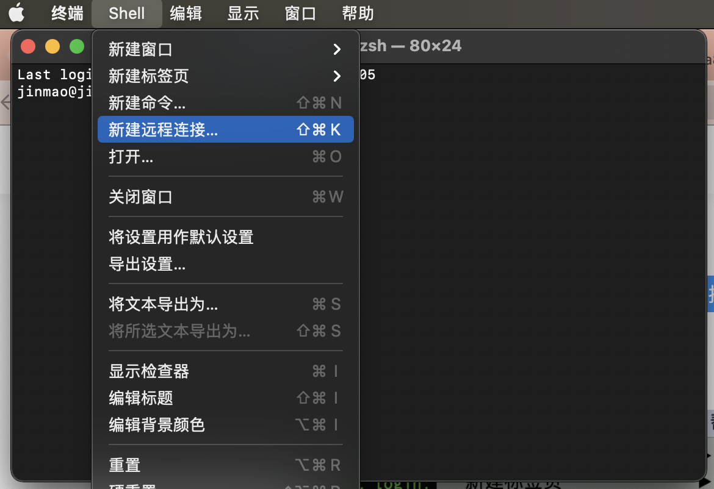
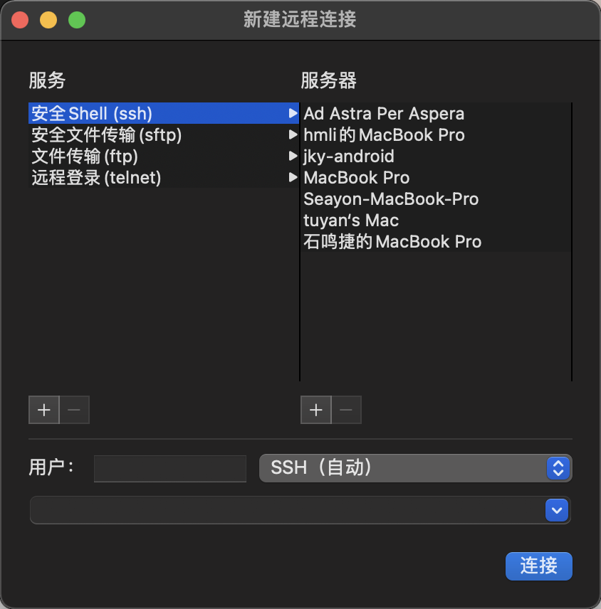
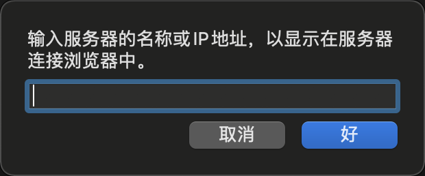
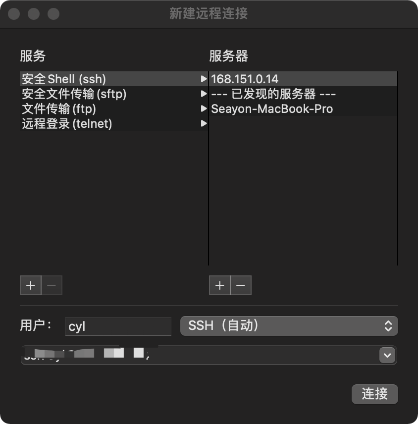
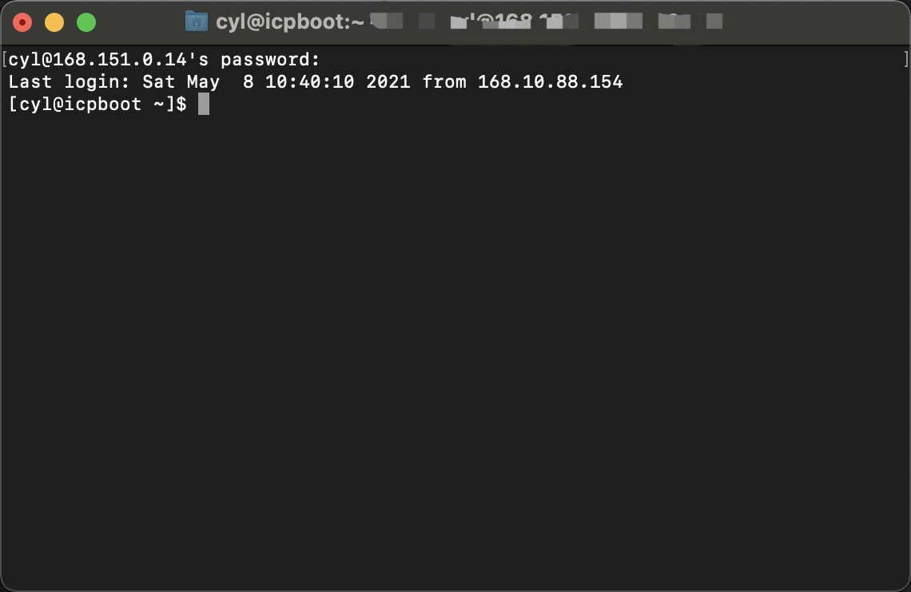

# ``Mac``连接 ``ssh``服务器

## 使用终端

在终端输入``ssh -p 端口号 服务器用户名@ip`` （例如``ssh -p 22 admin@119.20.35.61``）回车，到这有可能会让你输入yes或者no来确认是否连接，输入yes回车，然后就会让你输入用户密码。

输入密码即可。

## 用``shell``连接

- 第一步：打开``Mac``的终端
- 第二步：在终端的``Shell``菜单中选择新建远程连接，或者在程序坞中右键终端图标，选择新建远程连接

