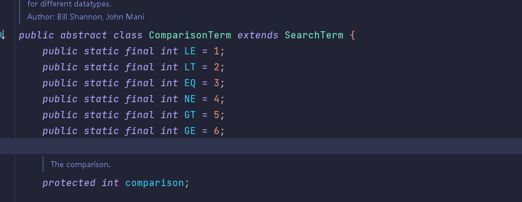

# ``SpringBoot javax``获取邮件内容，删除邮件、根据时间段筛选邮件，筛选时间段+未读邮件

首先需要导入依赖,由于公司使用的是``Gradle``,其实本质也和``maven``差不多

```Gradle
implementation group: 'org.apache.commons', name: 'commons-lang3', version: '3.11'
//邮件
implementation group: 'javax.mail', name: 'javax.mail-api', version: '1.5.5'
implementation group: 'com.sun.mail', name: 'javax.mail', version: '1.5.5'
```

## [原文链接](https://www.cnblogs.com/chenyanbin/p/14631905.html)

将分为两个方案 ``pop3``和``imap``:

> pop3与imap区别#

1. ``pop3``允许电子邮件客户端请求下载指定邮件服务器上指定用户的邮件信息，但是在用户的客户端所做的任何操作都是不会反馈到服务器上的，也就是说，你已读了邮件在邮件服务器上的状态还是未读取的，这在很多情况下对用户来说是不方便的。这是因为pop3协议是单向协议

2. ``IAMP``协议，双向协议，用户在客户端的操作可以实时的反馈到服务器上，用户对邮件的任何操作，服务器也会做出相应的操作。

    - 同时：``IMAP``还可以指定下载邮件的某些内容。
    - 所以``POP3``协议无法获取邮件状态(已读或未读)
    - ``IMAP``协议不支持 中文主题 或 中文内容 邮件过滤,而``POP3``完全支持

**同时,``Imap``关于时间筛选只能精确到日,也就是说只能默认搜索当天的所有邮件,因此,在``Imap``的协议下,想要锁定时间搜索只能另寻僻静了**
## 筛选条件#
　　``JavaMail``在``javax.mail.search``包中定义了一个用于创建搜索条件的``SearchTerm``类，应用程序创建``SearchTerm``类的实例对象后，就可以调用``Folder.Search(SearchTerm st)``方法搜索邮件夹中符合搜索条件的所有邮件。``SearchTerm``是一个抽象类，``JavaMail``提供了``22``个实现子类以帮助应用程序创建不同的搜索条件，这``22``个类可分为两大类型，如下所示：

1. 用于创建逻辑组合关系的类
   - ``AND``条件（``AndTerm``类）
   -  ``OR``条件（``OrTerm``类）
   -  ``NOT``条件（``NotTerm``类）
   -  ``Comparison``条件（``ComparisonTerm``类）
2. 用于创建具体搜索条件的类

   -  ``DATE``条件（``SentDateTerm、ReceivedDateTerm类``）
   -  ``CONTENT``条件（``BodyTerm``类）
   -  ``HEADER``条件（``FromStringTerm、RecipientStringTerm、SubjectTerm``类等）
下面通过实现来说明以上类的用法及含义：


- 搜索发件人为“智联招聘“，而且邮件正文包含``“Java工程师“``的所有邮件
```java
SearchTerm andTerm = new AndTerm( new FromStringTerm("智联招聘"), new BodyTerm("java工程师"));
Message[] messages = folder.search(andTerm); 
```
- 搜索发件人为“智联招聘“或主题包含“最新职位信息“的所有邮件
```java
SearchTerm orTerm = new OrTerm( new FromStringTerm("智联招聘"), new SubjectTerm("最新职位信息"));

Message[] messages = folder.search(orTerm); 
```
- 搜索周一到今天收到的的所有邮件
```java
Calendar calendar = Calendar.getInstance();  
calendar.set(Calendar.DAY_OF_WEEK, calendar.get(Calendar.DAY_OF_WEEK - (Calendar.DAY_OF_WEEK - 1)) - 1); 
Date mondayDate = calendar.getTime(); 
SearchTerm comparisonTermGe = new SentDateTerm(ComparisonTerm.GE, mondayDate); 
SearchTerm comparisonTermLe = new SentDateTerm(ComparisonTerm.LE, new Date()); 
SearchTerm comparisonAndTerm = new AndTerm(comparisonTermGe, comparisonTermLe); 
Message[] messages = folder.search(comparisonAndTerm); 
```
- 搜索大于或等``100KB``的所有邮件
```java
int mailSize = 1024 * 100; SearchTerm intComparisonTerm = new SizeTerm(IntegerComparisonTerm.GE, mailSize); 
Message[] messages = folder.search(intComparisonTerm); 
```
``ComparisonTerm``类常用于日期和数字比较中，它使用六个常量``EQ（＝）、GE（>=）、GT（>）、LE（<=）、LT（<）、NE（!=）``来表示六种不同的比较操作。

 ```java
//如果需要在取得邮件数后将邮件置为已读则这里需要使用READ_WRITE,否则READ_ONLY就可以
    inbox.open(Folder.READ_WRITE); 
    // Message messages[] = inbox.getMessages(); //获取所有邮件

    //建立搜索条件FlagTerm，这里FlagTerm继承自SearchTerm，也就是说除了获取未读邮
    //件的条件还有很多其他条件同样继承了SearchTerm的条件类，像根据发件人，主题搜索等，
    // 还有复杂的逻辑搜索类似：
    //     
    //    SearchTerm orTerm = new OrTerm(   
    //            new FromStringTerm(from),   
    //            new SubjectTerm(subject)   
    //            ); 
    //  

    FlagTerm ft = new FlagTerm(new Flags(Flags.Flag.SEEN), false); //false代表未读，true代表已读

    /**
    * Flag 类型列举如下
    * Flags.Flag.ANSWERED 邮件回复标记，标识邮件是否已回复。
    * Flags.Flag.DELETED 邮件删除标记，标识邮件是否需要删除。
    * Flags.Flag.DRAFT 草稿邮件标记，标识邮件是否为草稿。
    * Flags.Flag.FLAGGED 表示邮件是否为回收站中的邮件。
    * Flags.Flag.RECENT 新邮件标记，表示邮件是否为新邮件。
    * Flags.Flag.SEEN 邮件阅读标记，标识邮件是否已被阅读。
    * Flags.Flag.USER 底层系统是否支持用户自定义标记，只读。
    */
```
## ``pop3``

```java
import javax.mail.*;
import javax.mail.internet.InternetAddress;
import javax.mail.internet.MimeMessage;
import javax.mail.internet.MimeMultipart;
import javax.mail.internet.MimeUtility;
import java.io.*;
import java.text.SimpleDateFormat;
import java.util.Date;
import java.util.Properties;

public class StoreMail {
    final static String USER = "543210188@qq.com"; // 用户名
    final static String PASSWORD = "xxxxx"; // 密码
    public final static String MAIL_SERVER_HOST = "smtp.qq.com"; // 邮箱服务器

    public static void main(String[] args) throws Exception {
        // 创建一个有具体连接信息的Properties对象
        Properties prop = new Properties();
        prop.setProperty("mail.debug", "true");
        prop.setProperty("mail.store.protocol", "pop3");

        prop.setProperty("mail.pop3.host", MAIL_SERVER_HOST);
        // 1、创建session
        Session session = Session.getInstance(prop);
        // 2、通过session得到Store对象
        Store store = session.getStore();
        // 3、连上邮件服务器
        store.connect(MAIL_SERVER_HOST, USER, PASSWORD);
        // 4、获得邮箱内的邮件夹
        Folder folder = store.getFolder("inbox");
        //只读
        //folder.open(Folder.READ_ONLY);
        //读写
        folder.open(Folder.READ_WRITE);
        // 获得邮件夹Folder内的所有邮件Message对象
        Message[] messages = folder.getMessages();
        // 解析所有邮件
        for (int i = 0, count = messages.length; i < count; i++) {
            MimeMessage msg = (MimeMessage) messages[i];
            System.out.println("------------------解析第" + msg.getMessageNumber() + "封邮件-------------------- ");
            System.out.println("主题: " + getSubject(msg));
            System.out.println("发件人: " + getFrom(msg));
            System.out.println("收件人：" + getReceiveAddress(msg, null));
            System.out.println("发送时间：" + getSentDate(msg, null));
            System.out.println("是否已读：" + isSeen(msg));
            System.out.println("邮件优先级：" + getPriority(msg));
            System.out.println("是否需要回执：" + isReplySign(msg));
            System.out.println("邮件大小：" + msg.getSize() * 1024 + "kb");
            boolean isContainerAttachment = isContainAttachment(msg);
            System.out.println("是否包含附件：" + isContainerAttachment);
            if (isContainerAttachment) {
                saveAttachment(msg, "f:\\mailTest\\"+msg.getSubject() + "_"+i+"_"); //保存附件
            }
            if (i == 2) {
                //删除邮件
                msg.setFlag(Flags.Flag.DELETED, true);
                System.out.println("删除");
            }
            StringBuffer content = new StringBuffer(30);
            getMailTextContent(msg, content);
            System.out.println("邮件正文：" + content);
            System.out.println("------------------第" + msg.getMessageNumber() + "封邮件解析结束-------------------- ");
            System.out.println();

        }
        // 5、关闭
        folder.close(true);
        store.close();
    }

    /**
     * 删除邮件
     *
     * @param messages 要解析的邮件列表
     */
    public static void deleteMessage(Message... messages) throws MessagingException, IOException {
        if (messages == null || messages.length < 1)
            throw new MessagingException("未找到要解析的邮件!");

        // 解析所有邮件
        for (int i = 0, count = messages.length; i < count; i++) {

            /**
             *   邮件删除
             */
            Message message = messages[i];
            String subject = message.getSubject();
            // set the DELETE flag to true
            message.setFlag(Flags.Flag.DELETED, true);
            System.out.println("Marked DELETE for message: " + subject);


        }
    }

    /**
     * 获得邮件主题
     *
     * @param msg 邮件内容
     * @return 解码后的邮件主题
     */
    public static String getSubject(MimeMessage msg) throws UnsupportedEncodingException, MessagingException {
        return MimeUtility.decodeText(msg.getSubject());
    }

    /**
     * 获得邮件发件人
     *
     * @param msg 邮件内容
     * @return 姓名 <Email地址>
     * @throws MessagingException
     * @throws UnsupportedEncodingException
     */
    public static String getFrom(MimeMessage msg) throws MessagingException, UnsupportedEncodingException {
        String from = "";
        Address[] froms = msg.getFrom();
        if (froms.length < 1)
            throw new MessagingException("没有发件人!");

        InternetAddress address = (InternetAddress) froms[0];
        String person = address.getPersonal();
        if (person != null) {
            person = MimeUtility.decodeText(person) + " ";
        } else {
            person = "";
        }
        from = person + "<" + address.getAddress() + ">";

        return from;
    }

    /**
     * 根据收件人类型，获取邮件收件人、抄送和密送地址。如果收件人类型为空，则获得所有的收件人
     * <p>Message.RecipientType.TO  收件人</p>
     * <p>Message.RecipientType.CC  抄送</p>
     * <p>Message.RecipientType.BCC 密送</p>
     *
     * @param msg  邮件内容
     * @param type 收件人类型
     * @return 收件人1 <邮件地址1>, 收件人2 <邮件地址2>, ...
     * @throws MessagingException
     */
    public static String getReceiveAddress(MimeMessage msg, Message.RecipientType type) throws MessagingException {
        StringBuffer receiveAddress = new StringBuffer();
        Address[] addresss = null;
        if (type == null) {
            addresss = msg.getAllRecipients();
        } else {
            addresss = msg.getRecipients(type);
        }

        if (addresss == null || addresss.length < 1)
            throw new MessagingException("没有收件人!");
        for (Address address : addresss) {
            InternetAddress internetAddress = (InternetAddress) address;
            receiveAddress.append(internetAddress.toUnicodeString()).append(",");
        }

        receiveAddress.deleteCharAt(receiveAddress.length() - 1); //删除最后一个逗号

        return receiveAddress.toString();
    }

    /**
     * 获得邮件发送时间
     *
     * @param msg 邮件内容
     * @return yyyy年mm月dd日 星期X HH:mm
     * @throws MessagingException
     */
    public static String getSentDate(MimeMessage msg, String pattern) throws MessagingException {
        Date receivedDate = msg.getSentDate();
        if (receivedDate == null)
            return "";

        if (pattern == null || "".equals(pattern))
            pattern = "yyyy年MM月dd日 E HH:mm ";

        return new SimpleDateFormat(pattern).format(receivedDate);
    }

    /**
     * 判断邮件中是否包含附件
     *
     * @return 邮件中存在附件返回true，不存在返回false
     * @throws MessagingException
     * @throws IOException
     */
    public static boolean isContainAttachment(Part part) throws MessagingException, IOException {
        boolean flag = false;
        if (part.isMimeType("multipart/*")) {
            MimeMultipart multipart = (MimeMultipart) part.getContent();
            int partCount = multipart.getCount();
            for (int i = 0; i < partCount; i++) {
                BodyPart bodyPart = multipart.getBodyPart(i);
                String disp = bodyPart.getDisposition();
                if (disp != null && (disp.equalsIgnoreCase(Part.ATTACHMENT) || disp.equalsIgnoreCase(Part.INLINE))) {
                    flag = true;
                } else if (bodyPart.isMimeType("multipart/*")) {
                    flag = isContainAttachment(bodyPart);
                } else {
                    String contentType = bodyPart.getContentType();
                    if (contentType.indexOf("application") != -1) {
                        flag = true;
                    }

                    if (contentType.indexOf("name") != -1) {
                        flag = true;
                    }
                }

                if (flag) break;
            }
        } else if (part.isMimeType("message/rfc822")) {
            flag = isContainAttachment((Part) part.getContent());
        }
        return flag;
    }

    /**
     * 判断邮件是否已读
     *
     * @param msg 邮件内容
     * @return 如果邮件已读返回true, 否则返回false
     * @throws MessagingException
     */
    public static boolean isSeen(MimeMessage msg) throws MessagingException {
        return msg.getFlags().contains(Flags.Flag.SEEN);
    }

    /**
     * 判断邮件是否需要阅读回执
     *
     * @param msg 邮件内容
     * @return 需要回执返回true, 否则返回false
     * @throws MessagingException
     */
    public static boolean isReplySign(MimeMessage msg) throws MessagingException {
        boolean replySign = false;
        String[] headers = msg.getHeader("Disposition-Notification-To");
        if (headers != null)
            replySign = true;
        return replySign;
    }

    /**
     * 获得邮件的优先级
     *
     * @param msg 邮件内容
     * @return 1(High):紧急  3:普通(Normal)  5:低(Low)
     * @throws MessagingException
     */
    public static String getPriority(MimeMessage msg) throws MessagingException {
        String priority = "普通";
        String[] headers = msg.getHeader("X-Priority");
        if (headers != null) {
            String headerPriority = headers[0];
            if (headerPriority.indexOf("1") != -1 || headerPriority.indexOf("High") != -1)
                priority = "紧急";
            else if (headerPriority.indexOf("5") != -1 || headerPriority.indexOf("Low") != -1)
                priority = "低";
            else
                priority = "普通";
        }
        return priority;
    }

    /**
     * 获得邮件文本内容
     *
     * @param part    邮件体
     * @param content 存储邮件文本内容的字符串
     * @throws MessagingException
     * @throws IOException
     */
    public static void getMailTextContent(Part part, StringBuffer content) throws MessagingException, IOException {
        //如果是文本类型的附件，通过getContent方法可以取到文本内容，但这不是我们需要的结果，所以在这里要做判断
        boolean isContainTextAttach = part.getContentType().indexOf("name") > 0;
        if (part.isMimeType("text/*") && !isContainTextAttach) {
            content.append(part.getContent().toString());
        } else if (part.isMimeType("message/rfc822")) {
            getMailTextContent((Part) part.getContent(), content);
        } else if (part.isMimeType("multipart/*")) {
            Multipart multipart = (Multipart) part.getContent();
            int partCount = multipart.getCount();
            for (int i = 0; i < partCount; i++) {
                BodyPart bodyPart = multipart.getBodyPart(i);
                getMailTextContent(bodyPart, content);
            }
        }
    }

    /**
     * 保存附件
     *
     * @param part    邮件中多个组合体中的其中一个组合体
     * @param destDir 附件保存目录
     * @throws UnsupportedEncodingException
     * @throws MessagingException
     * @throws FileNotFoundException
     * @throws IOException
     */
    public static void saveAttachment(Part part, String destDir) throws UnsupportedEncodingException, MessagingException,
            FileNotFoundException, IOException {
        if (part.isMimeType("multipart/*")) {
            Multipart multipart = (Multipart) part.getContent();    //复杂体邮件
            //复杂体邮件包含多个邮件体
            int partCount = multipart.getCount();
            for (int i = 0; i < partCount; i++) {
                //获得复杂体邮件中其中一个邮件体
                BodyPart bodyPart = multipart.getBodyPart(i);
                //某一个邮件体也有可能是由多个邮件体组成的复杂体
                String disp = bodyPart.getDisposition();
                if (disp != null && (disp.equalsIgnoreCase(Part.ATTACHMENT) || disp.equalsIgnoreCase(Part.INLINE))) {
                    InputStream is = bodyPart.getInputStream();
                    saveFile(is, destDir, decodeText(bodyPart.getFileName()));
                } else if (bodyPart.isMimeType("multipart/*")) {
                    saveAttachment(bodyPart, destDir);
                } else {
                    String contentType = bodyPart.getContentType();
                    if (contentType.indexOf("name") != -1 || contentType.indexOf("application") != -1) {
                        saveFile(bodyPart.getInputStream(), destDir, decodeText(bodyPart.getFileName()));
                    }
                }
            }
        } else if (part.isMimeType("message/rfc822")) {
            saveAttachment((Part) part.getContent(), destDir);
        }
    }

    /**
     * 读取输入流中的数据保存至指定目录
     *
     * @param is       输入流
     * @param fileName 文件名
     * @param destDir  文件存储目录
     * @throws FileNotFoundException
     * @throws IOException
     */
    private static void saveFile(InputStream is, String destDir, String fileName)
            throws FileNotFoundException, IOException {
        BufferedInputStream bis = new BufferedInputStream(is);
        BufferedOutputStream bos = new BufferedOutputStream(
                new FileOutputStream(new File(destDir + fileName)));
        int len = -1;
        while ((len = bis.read()) != -1) {
            bos.write(len);
            bos.flush();
        }
        bos.close();
        bis.close();
    }

    /**
     * 文本解码
     *
     * @param encodeText 解码MimeUtility.encodeText(String text)方法编码后的文本
     * @return 解码后的文本
     * @throws UnsupportedEncodingException
     */
    public static String decodeText(String encodeText) throws UnsupportedEncodingException {
        if (encodeText == null || "".equals(encodeText)) {
            return "";
        } else {
            return MimeUtility.decodeText(encodeText);
        }
    }
}
```
## 根据时间筛选 (目前看来只支持``POP3``)
```java
DateTerm dateTerm = new DateTerm(3, new Date(1617869155000L)) {
    @Override
    public boolean match(Message msg) {
        try {
            Date receivedDate = msg.getReceivedDate();
            return this.date.before(msg.getSentDate());
        } catch (MessagingException e) {
            e.printStackTrace();
        }
        return false;
    }
};
Message[] messages = folder.search(dateTerm);
```
``new DateTerm``第一个参数，对应关系如下

  

## ``imap``

```java
import javax.mail.*;
import javax.mail.internet.InternetAddress;
import javax.mail.internet.MimeMessage;
import javax.mail.internet.MimeMultipart;
import javax.mail.internet.MimeUtility;
import javax.mail.search.*;
import java.io.*;
import java.text.SimpleDateFormat;
import java.util.Date;
import java.util.Properties;

public class StoreMail {
    final static String USER = "543210188@qq.com"; // 用户名
    final static String PASSWORD = "xxxxx"; // 密码
    public final static String MAIL_SERVER_HOST = "smtp.qq.com"; // 邮箱服务器

    public static void main(String[] args) throws Exception {
        // 创建一个有具体连接信息的Properties对象
        Properties prop = new Properties();
        prop.setProperty("mail.debug", "true");
        prop.setProperty("mail.store.protocol", "imap");
        prop.setProperty("mail.pop3.host", MAIL_SERVER_HOST);
        // 1、创建session
        Session session = Session.getInstance(prop);
        // 2、通过session得到Store对象
        Store store = session.getStore();
        // 3、连上邮件服务器
        store.connect(MAIL_SERVER_HOST, USER, PASSWORD);
        // 4、获得邮箱内的邮件夹
        Folder folder = store.getFolder("inbox");
        //只读
        //folder.open(Folder.READ_ONLY);
        //读写
        folder.open(Folder.READ_WRITE);
        // 获得邮件夹Folder内的所有邮件Message对象
        //1617869155000  =====> 2021-04-08 16:05:55
        DateTerm dateTerm = new DateTerm(3, new Date(1617869155000L)) {
            @Override
            public boolean match(Message msg) {
                try {
                    return this.date.before(msg.getSentDate());
                } catch (MessagingException e) {
                    e.printStackTrace();
                }
                return false;
            }
        };
        // FlagTerm ft = new FlagTerm(new Flags(Flags.Flag.SEEN), false); //false代表未读，true代表已读
        FlagTerm flagTerm = new FlagTerm(new Flags(Flags.Flag.SEEN), false);
        AndTerm andTerm = new AndTerm(dateTerm, flagTerm);
        //根据条件过滤
        Message[] messages = folder.search(andTerm);
        //Message[] messages = folder.getMessages();
        // 解析所有邮件
        for (int i = 0, count = messages.length; i < count; i++) {
            MimeMessage msg = (MimeMessage) messages[i];
            System.out.println("------------------解析第" + msg.getMessageNumber() + "封邮件-------------------- ");
            System.out.println("主题: " + getSubject(msg));
            System.out.println("发件人: " + getFrom(msg));
            System.out.println("收件人：" + getReceiveAddress(msg, null));
            System.out.println("发送时间：" + getSentDate(msg, null));
            System.out.println("是否已读：" + isSeen(msg));
            System.out.println("邮件优先级：" + getPriority(msg));
            System.out.println("是否需要回执：" + isReplySign(msg));
            System.out.println("邮件大小：" + msg.getSize() * 1024 + "kb");
            boolean isContainerAttachment = isContainAttachment(msg);
            System.out.println("是否包含附件：" + isContainerAttachment);
            //设置当前邮件状态为已读
            msg.setFlag(Flags.Flag.SEEN, true);
            StringBuffer content = new StringBuffer(30);
            getMailTextContent(msg, content);
            System.out.println("邮件正文：" + content);
            System.out.println("------------------第" + msg.getMessageNumber() + "封邮件解析结束-------------------- ");
            System.out.println();

        }
        // 5、关闭
        folder.close(true);
        store.close();
    }

    /**
     * 删除邮件
     *
     * @param messages 要解析的邮件列表
     */
    public static void deleteMessage(Message... messages) throws MessagingException, IOException {
        if (messages == null || messages.length < 1)
            throw new MessagingException("未找到要解析的邮件!");

        // 解析所有邮件
        for (int i = 0, count = messages.length; i < count; i++) {

            /**
             *   邮件删除
             */
            Message message = messages[i];
            String subject = message.getSubject();
            // set the DELETE flag to true
            message.setFlag(Flags.Flag.DELETED, true);
            System.out.println("Marked DELETE for message: " + subject);


        }
    }

    /**
     * 获得邮件主题
     *
     * @param msg 邮件内容
     * @return 解码后的邮件主题
     */
    public static String getSubject(MimeMessage msg) throws UnsupportedEncodingException, MessagingException {
        return MimeUtility.decodeText(msg.getSubject());
    }

    /**
     * 获得邮件发件人
     *
     * @param msg 邮件内容
     * @return 姓名 <Email地址>
     * @throws MessagingException
     * @throws UnsupportedEncodingException
     */
    public static String getFrom(MimeMessage msg) throws MessagingException, UnsupportedEncodingException {
        String from = "";
        Address[] froms = msg.getFrom();
        if (froms.length < 1)
            throw new MessagingException("没有发件人!");

        InternetAddress address = (InternetAddress) froms[0];
        String person = address.getPersonal();
        if (person != null) {
            person = MimeUtility.decodeText(person) + " ";
        } else {
            person = "";
        }
        from = person + "<" + address.getAddress() + ">";

        return from;
    }

    /**
     * 根据收件人类型，获取邮件收件人、抄送和密送地址。如果收件人类型为空，则获得所有的收件人
     * <p>Message.RecipientType.TO  收件人</p>
     * <p>Message.RecipientType.CC  抄送</p>
     * <p>Message.RecipientType.BCC 密送</p>
     *
     * @param msg  邮件内容
     * @param type 收件人类型
     * @return 收件人1 <邮件地址1>, 收件人2 <邮件地址2>, ...
     * @throws MessagingException
     */
    public static String getReceiveAddress(MimeMessage msg, Message.RecipientType type) throws MessagingException {
        StringBuffer receiveAddress = new StringBuffer();
        Address[] addresss = null;
        if (type == null) {
            addresss = msg.getAllRecipients();
        } else {
            addresss = msg.getRecipients(type);
        }

        if (addresss == null || addresss.length < 1)
            throw new MessagingException("没有收件人!");
        for (Address address : addresss) {
            InternetAddress internetAddress = (InternetAddress) address;
            receiveAddress.append(internetAddress.toUnicodeString()).append(",");
        }

        receiveAddress.deleteCharAt(receiveAddress.length() - 1); //删除最后一个逗号

        return receiveAddress.toString();
    }

    /**
     * 获得邮件发送时间
     *
     * @param msg 邮件内容
     * @return yyyy年mm月dd日 星期X HH:mm
     * @throws MessagingException
     */
    public static String getSentDate(MimeMessage msg, String pattern) throws MessagingException {
        Date receivedDate = msg.getSentDate();
        if (receivedDate == null)
            return "";

        if (pattern == null || "".equals(pattern))
            pattern = "yyyy年MM月dd日 E HH:mm ";

        return new SimpleDateFormat(pattern).format(receivedDate);
    }

    /**
     * 判断邮件中是否包含附件
     *
     * @return 邮件中存在附件返回true，不存在返回false
     * @throws MessagingException
     * @throws IOException
     */
    public static boolean isContainAttachment(Part part) throws MessagingException, IOException {
        boolean flag = false;
        if (part.isMimeType("multipart/*")) {
            MimeMultipart multipart = (MimeMultipart) part.getContent();
            int partCount = multipart.getCount();
            for (int i = 0; i < partCount; i++) {
                BodyPart bodyPart = multipart.getBodyPart(i);
                String disp = bodyPart.getDisposition();
                if (disp != null && (disp.equalsIgnoreCase(Part.ATTACHMENT) || disp.equalsIgnoreCase(Part.INLINE))) {
                    flag = true;
                } else if (bodyPart.isMimeType("multipart/*")) {
                    flag = isContainAttachment(bodyPart);
                } else {
                    String contentType = bodyPart.getContentType();
                    if (contentType.indexOf("application") != -1) {
                        flag = true;
                    }

                    if (contentType.indexOf("name") != -1) {
                        flag = true;
                    }
                }

                if (flag) break;
            }
        } else if (part.isMimeType("message/rfc822")) {
            flag = isContainAttachment((Part) part.getContent());
        }
        return flag;
    }

    /**
     * 判断邮件是否已读
     *
     * @param msg 邮件内容
     * @return 如果邮件已读返回true, 否则返回false
     * @throws MessagingException
     */
    public static boolean isSeen(MimeMessage msg) throws MessagingException {
        return msg.getFlags().contains(Flags.Flag.SEEN);
    }

    /**
     * 判断邮件是否需要阅读回执
     *
     * @param msg 邮件内容
     * @return 需要回执返回true, 否则返回false
     * @throws MessagingException
     */
    public static boolean isReplySign(MimeMessage msg) throws MessagingException {
        boolean replySign = false;
        String[] headers = msg.getHeader("Disposition-Notification-To");
        if (headers != null)
            replySign = true;
        return replySign;
    }

    /**
     * 获得邮件的优先级
     *
     * @param msg 邮件内容
     * @return 1(High):紧急  3:普通(Normal)  5:低(Low)
     * @throws MessagingException
     */
    public static String getPriority(MimeMessage msg) throws MessagingException {
        String priority = "普通";
        String[] headers = msg.getHeader("X-Priority");
        if (headers != null) {
            String headerPriority = headers[0];
            if (headerPriority.indexOf("1") != -1 || headerPriority.indexOf("High") != -1)
                priority = "紧急";
            else if (headerPriority.indexOf("5") != -1 || headerPriority.indexOf("Low") != -1)
                priority = "低";
            else
                priority = "普通";
        }
        return priority;
    }

    /**
     * 获得邮件文本内容
     *
     * @param part    邮件体
     * @param content 存储邮件文本内容的字符串
     * @throws MessagingException
     * @throws IOException
     */
    public static void getMailTextContent(Part part, StringBuffer content) throws MessagingException, IOException {
        //如果是文本类型的附件，通过getContent方法可以取到文本内容，但这不是我们需要的结果，所以在这里要做判断
        boolean isContainTextAttach = part.getContentType().indexOf("name") > 0;
        if (part.isMimeType("text/*") && !isContainTextAttach) {
            content.append(part.getContent().toString());
        } else if (part.isMimeType("message/rfc822")) {
            getMailTextContent((Part) part.getContent(), content);
        } else if (part.isMimeType("multipart/*")) {
            Multipart multipart = (Multipart) part.getContent();
            int partCount = multipart.getCount();
            for (int i = 0; i < partCount; i++) {
                BodyPart bodyPart = multipart.getBodyPart(i);
                getMailTextContent(bodyPart, content);
            }
        }
    }

    /**
     * 保存附件
     *
     * @param part    邮件中多个组合体中的其中一个组合体
     * @param destDir 附件保存目录
     * @throws UnsupportedEncodingException
     * @throws MessagingException
     * @throws FileNotFoundException
     * @throws IOException
     */
    public static void saveAttachment(Part part, String destDir) throws UnsupportedEncodingException, MessagingException,
            FileNotFoundException, IOException {
        if (part.isMimeType("multipart/*")) {
            Multipart multipart = (Multipart) part.getContent();    //复杂体邮件
            //复杂体邮件包含多个邮件体
            int partCount = multipart.getCount();
            for (int i = 0; i < partCount; i++) {
                //获得复杂体邮件中其中一个邮件体
                BodyPart bodyPart = multipart.getBodyPart(i);
                //某一个邮件体也有可能是由多个邮件体组成的复杂体
                String disp = bodyPart.getDisposition();
                if (disp != null && (disp.equalsIgnoreCase(Part.ATTACHMENT) || disp.equalsIgnoreCase(Part.INLINE))) {
                    InputStream is = bodyPart.getInputStream();
                    saveFile(is, destDir, decodeText(bodyPart.getFileName()));
                } else if (bodyPart.isMimeType("multipart/*")) {
                    saveAttachment(bodyPart, destDir);
                } else {
                    String contentType = bodyPart.getContentType();
                    if (contentType.indexOf("name") != -1 || contentType.indexOf("application") != -1) {
                        saveFile(bodyPart.getInputStream(), destDir, decodeText(bodyPart.getFileName()));
                    }
                }
            }
        } else if (part.isMimeType("message/rfc822")) {
            saveAttachment((Part) part.getContent(), destDir);
        }
    }

    /**
     * 读取输入流中的数据保存至指定目录
     *
     * @param is       输入流
     * @param fileName 文件名
     * @param destDir  文件存储目录
     * @throws FileNotFoundException
     * @throws IOException
     */
    private static void saveFile(InputStream is, String destDir, String fileName)
            throws FileNotFoundException, IOException {
        BufferedInputStream bis = new BufferedInputStream(is);
        BufferedOutputStream bos = new BufferedOutputStream(
                new FileOutputStream(new File(destDir + fileName)));
        int len = -1;
        while ((len = bis.read()) != -1) {
            bos.write(len);
            bos.flush();
        }
        bos.close();
        bis.close();
    }

    /**
     * 文本解码
     *
     * @param encodeText 解码MimeUtility.encodeText(String text)方法编码后的文本
     * @return 解码后的文本
     * @throws UnsupportedEncodingException
     */
    public static String decodeText(String encodeText) throws UnsupportedEncodingException {
        if (encodeText == null || "".equals(encodeText)) {
            return "";
        } else {
            return MimeUtility.decodeText(encodeText);
        }
    }
}
```


