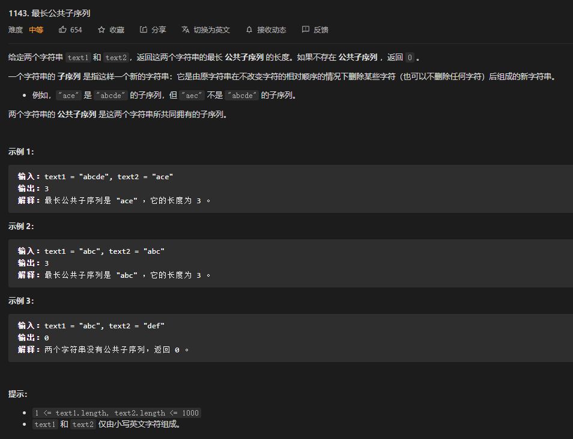
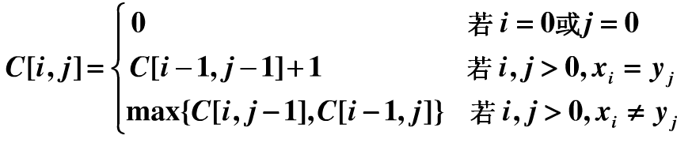
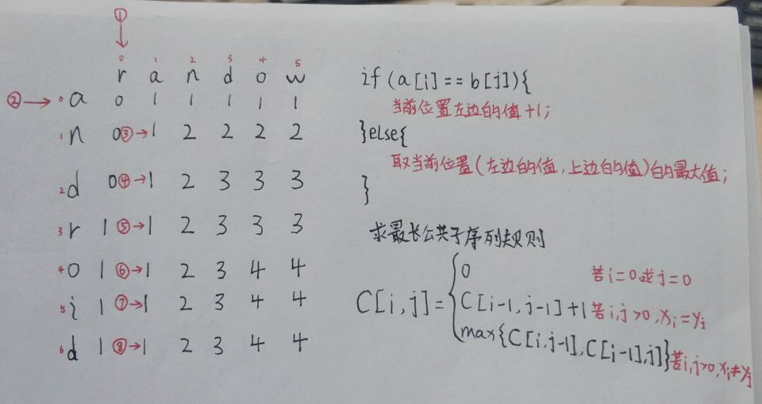

# 动态规划算法

## 什么是动态规划

动态规划的大致思路是把一个复杂的问题转化成一个分阶段逐步递推的过程，从简单的初始状态一步一步递推，最终得到复杂问题的最优解。

> 基本思想与策略编辑:

由于动态规划解决的问题多数有重叠子问题这个特点，为减少重复计算，对每一个子问题只解一次，将其不同阶段的不同状态保存在一个二维数组中

1. <font color="red">**拆分问题**</font>:根据问题的可能性把问题划分成通过递推或者递归一步一步实现。关键就是这个步骤,动态规划有一类问题就是从后往前推到,有时候我们很容易知道 : 如果只有一种情况时,最佳的选择应该怎么做.然后根据这个最佳选择往前一步推导,得到前一步的最佳选择

2. <font color="blue">定义问题状态和状态之间的关系：</font>用一种量化的形式表现出来,类似于高中学的推导公式,因为这种式子很容易用程序写出来,也可以说对程序比较亲和(也就是最后所说的状态转移方程式)

3. 动态规划算法的基本思想与分治法类似，也是将待求解的问题分解为若干个子问题（阶段），按顺序求解子阶段，<font color="white">前一子问题的解，为后一子问题的求解提供了有用的信息。</font>在求解任一子问题时，列出各种可能的局部解，通过决策保留那些有可能达到最优的局部解，丢弃其他局部解。依次解决各子问题，最后一个子问题就是初始问题的解。

**我的理解是**：比如我们找到最优解,我们应该讲最优解保存下来,为了往前推导时能够使用前一步的最优解,在这个过程中难免有一些相比于最优解差的解,此时我们应该放弃,只保存最优解,

这样我们每一次都把最优解保存了下来,大大降低了时间复杂度。
<hr/>

动态规划解决问题的过程分为两步：

1. 寻找状态转移方程式

2. 利用状态转移方程式自底向上求解问题

## 动态规划原理

- 使用条件：可分为多个相关子问题，子问题的解被重复使用
- `Optimal substructure（优化子结构）`：
   -  一个问题的优化解包含了子问题的优化解
   -  缩小子问题集合，只需那些优化问题中包含的子问题，降低实现复杂性
   -  我们可以自下而上的
- `Subteties（重叠子问题）`：在问题的求解过程中，很多子问题的解将被多次使用。
- **动态规划算法的设计步骤：**
    - 分析优化解的结构
    - 递归地定义最优解的代价
    - 自底向上地计算优化解的代价保存之，并获取构造最优解的信息
    - 根据构造最优解的信息构造优化解
- 动态规划特点：
    - 把原始问题划分成一系列子问题；
    - 求解每个子问题仅一次，并将其结果保存在一个表中，以后用到时直接存取，不重复计算，节省计算时间
    - 自底向上地计算。
    - 整体问题最优解取决于子问题的最优解（状态转移方程）（将子问题称为状态，最终状态的求解归结为其他状态的求解


## 经典例题

### 最长公共子序列（`longest-common-subsequence, LCS`） 

[`LeetCode`](https://leetcode-cn.com/problems/longest-common-subsequence/)

  

(1) 子序列：一个序列`X ＝ x1x2...xn`,中任意删除若干项，剩余的序列叫做`A`的一个子序列。也可以认为是从序列`A`按原顺序保留任意若干项得到的序列。
      例如：对序列 `1,3,5,4,2,6,8,7`来说，序列`3,4,8,7` 是它的一个子序列。对于一个长度为`n`的序列，它一共有`2^n` 个子序列，有`(2^n – 1)`个非空子序列。在这里需要提醒大家，子序列不是子集，它和原始序列的元素顺序是相关的。

(2) 公共子序列：如果序列`Z`既是序列`X`的子序列，同时也是序列Y的子序列，则称它为序列`X`和序列`Y`的公共子序列。空序列是任何两个序列的公共子序列。

(3) 最长公共子序列：`X`和`Y`的公共子序列中长度最长的（包含元素最多的）叫做`X`和`Y`的最长公共子序列。

这个问题如果用穷举法时间，最终求出最长公共子序列时，时间复杂度是`Ο（2mn）`，是指数级别的复杂度，对于长序列是不适用的。因此我们使用动态规划法来求解。
### 刻画最长公共子序列问题的最优子结构  

设`X=x1x2…xm`和`Y=y1y2…yn`是两个序列，`Z=z1z2…zk`是这两个序列的一个最长公共子序列。

1. 如果`xm=yn`，那么`zk=xm=yn`，且`Zk-1`是`Xm-1`，`Yn-1`的一个最长公共子序列；

2. 如果`xm≠yn`，那么`zk≠xm`，意味着`Z`是`Xm-1`，`Y`的一个最长公共子序列；

3. 如果`xm≠yn`，那么`zk≠yn`，意味着`Z`是`X`，`Yn-1`的一个最长公共子序列。

从上面三种情况可以看出，两个序列的`LCS`包含两个序列的前缀的`LCS`。因此，`LCS`问题具有最优子结构特征。

### 递归的定义最优质

从最优子结构可以看出，如果`xm=yn`，那么我们应该求解`Xm-1`，`Yn-1`的一个`LCS`，并且将`xm=yn`加入到这个`LCS`的末尾，这样得到的一个新的`LCS`就是所求。

如果`xm≠yn`，我们需要求解两个子问题，分别求`Xm-1`，`Y`的一个`LCS`和`X`，`Yn-1`的一个`LCS`。两个`LCS`中较长者就是`X`和`Y`的一个`LCS`。

可以看出`LCS`问题具有重叠子问题性质。为了求`X`和`Y`的一个`LCS`，我们需要分别求出`Xm-1`，`Y`的一个`LCS`和`X`，`Yn-1`的一个`LCS`，这几个字问题又包含了求出`Xm-1`，`Yn-1`的一个`LCS`的子子问题。（有点绕了。。。晕没晕。。。。）

根据上面的分析，我们可以得出下面的公式；
  

### 计算最优的解
 根据上面的，我们很容易就可以写出递归计算`LCS`问题的程序，通过这个程序我们可以求出各个子问题的`LCS`的值，此外，为了求解最优解本身，我们好需要一个表`dp，dp[i，j]`记录使`C[i，j]`取值的最优子结构。
### 数组的填表过程

  

```java
public class LCS {
    public int findLCS(String A, String B) {
        int n = A.length();
        int m = B.length();
        //返回一个字符数组，该字符数组中存放了当前字符串中的所有字符
        //返回的是字符数组char[]a
        char[] a = A.toCharArray();
        char[] b = B.toCharArray();
        //创建一个二维矩阵，用来推到公共子序列
        int[][] dp = new int[n][m];
        for (int i = 0; i < n; i++) {
            //如果找到第一列其中一个字符等于第一行第一个字符
            if (a[i] == b[0]) {
                //找到第一列与第一行b[0]的相等的值，把其变成1
                dp[i][0] = 1;
                //并将其后面的字符都变成1
                for (int j = i + 1; j < n; j++) {
                    dp[j][0] = 1;
                }
                break;
            }
        }

        for (int i = 0; i < m; i++) {
            //如果找到第一列其中一个字符等于第一行第一个字符
            if (b[i] == a[0]) {
                //则把第一列后面的字符都变成1
                dp[0][i] = 1;
                for (int j = i + 1; j < m; j++) {
                    dp[0][j] = 1;
                }
                break;
            }
        }
        //从1开始是因为横向和纵向下标为0的都遍历过了
        for (int i = 1; i < n; i++) {
            for (int j = 1; j < m; j++) {
                //横向和纵向有相等的值
                if (a[i] == b[j]) {
                    //当前位置左边的值+1
                    dp[i][j] = dp[i - 1][j - 1] + 1;
                } else {
                    //取当前位置（左边的值，上边的值）的最大值
                    dp[i][j] = Math.max(dp[i][j - 1], dp[i - 1][j]);
                }
            }
        }

        for (int i = 0; i < n - 1; i++) {
            for (int j = 0; j < m; j++) {
                System.out.print(dp[i][j] + "  ");
            }
            System.out.println();
        }
        return dp[n - 1][m - 1];
    }

    public static void main(String[] args) {
        LCS lcs = new LCS();
        int findLCS = lcs.findLCS("android", "random");
        System.out.println("最长子序列长度：" + findLCS);
    }
}
```


