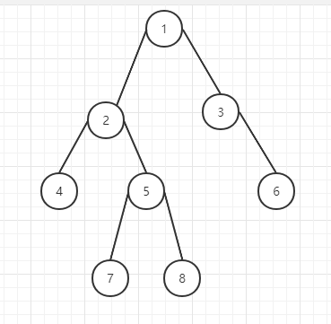
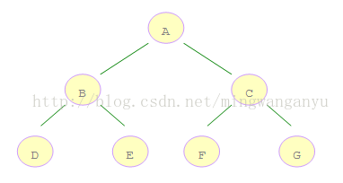
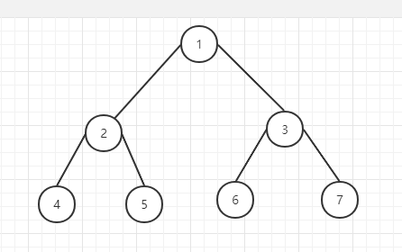

# 二叉树遍历（前序、中序、后序、层次遍历）


二叉树是一种非常重要的数据结构，很多其它数据结构都是基于二叉树的基础演变而来的。对于二叉树，有深度遍历和广度遍历，深度遍历有前序、中序以及后序三种遍历方法，广度遍历即我们平常所说的层次遍历。因为树的定义本身就是递归定义，因此采用递归的方法去实现树的三种遍历不仅容易理解而且代码很简洁，而对于广度遍历来说，需要其他数据结构的支撑，比如堆了。所以，对于一段代码来说，可读性有时候要比代码本身的效率要重要的多。

四种主要的遍历思想为：

前序遍历：根结点 ---> 左子树 ---> 右子树

中序遍历：左子树---> 根结点 ---> 右子树

后序遍历：左子树 ---> 右子树 ---> 根结点

层次遍历：只需按层次遍历即可

例如，求下面二叉树的各种遍历


  

```
前序遍历：1  2  4  5  7  8  3  6 

中序遍历：4  2  7  5  8  1  3  6

后序遍历：4  7  8  5  2  6  3  1

层次遍历：1  2  3  4  5  6  7  8
```
## 1. 前序遍历

1. 根据上文提到的遍历思路, `根结点 ---> 左子树 ---> 右子树`，很容易写出递归版本：
   ```java
    public void preOrderTraverse1(TreeNode root) {
		if (root != null) {
			System.out.print(root.val+"  ");
			preOrderTraverse1(root.left);
			preOrderTraverse1(root.right);
		}
	}
   ```
2. 现在讨论非递归的版本：
   
    根据前序遍历的顺序，优先访问根结点，然后在访问左子树和右子树。所以，对于任意结点`node`，第一部分即直接访问之，之后在判断左子树是否为空，不为空时即重复上面的步骤，直到其为空。若为空，则需要访问右子树。注意，在访问过左孩子之后，需要反过来访问其右孩子，所以，需要**栈**这种数据结构的支持。对于任意一个结点`node`，具体步骤如下：

    a) 访问之，并把结点`node`入栈，当前结点置为左孩子；

    b) 判断结点`node`是否为空，若为空，则取出栈顶结点并出栈，将右孩子置为当前结点；否则重复``a)`` 步直到当前结点为空或者栈为空（可以发现栈中的结点就是为了访问右孩子才存储的）

    代码如下:
    ```java
     public void preOrderTraverse2(TreeNode root) {
		LinkedList<TreeNode> stack = new LinkedList<>();
		TreeNode pNode = root;
		while (pNode != null || !stack.isEmpty()) {
			if (pNode != null) {
				System.out.print(pNode.val+"  ");
				stack.push(pNode);
				pNode = pNode.left;
			} else { //pNode == null && !stack.isEmpty()
				TreeNode node = stack.pop();
				pNode = node.right;
			}
		}
	}
    ```

## 2. 中序遍历

1. 根据上文提到的遍历思路：`左子树 ---> 根结点 ---> 右子树`，很容易写出递归版本：
    ```java
     public void inOrderTraverse1(TreeNode root) {
		if (root != null) {
			inOrderTraverse1(root.left);
			System.out.print(root.val+"  ");
			inOrderTraverse1(root.right);
		}
	}
    ```
2. 非递归实现，有了上面前序的解释，中序也就比较简单了，相同的道理。只不过访问的顺序移到出栈时。代码如下：
   ```java
    public void inOrderTraverse2(TreeNode root) {
		LinkedList<TreeNode> stack = new LinkedList<>();
		TreeNode pNode = root;
		while (pNode != null || !stack.isEmpty()) {
			if (pNode != null) {
				stack.push(pNode);
				pNode = pNode.left;
			} else { //pNode == null && !stack.isEmpty()
				TreeNode node = stack.pop();
				System.out.print(node.val+"  ");
				pNode = node.right;
			}
		}
	}
   ```
## 3. 后续遍历

1. 根据上文提到的遍历思路：`左子树 ---> 右子树 ---> 根结点`，很容易写出递归版本：
    ```java
     public void postOrderTraverse1(TreeNode root) {
		if (root != null) {
			postOrderTraverse1(root.left);
			postOrderTraverse1(root.right);
			System.out.print(root.val+"  ");
		}
	}
    ```

## 4. 层次遍历

层次遍历的代码比较简单，只需要一个队列即可，先在队列中加入根结点。之后对于任意一个结点来说，在其出队列的时候，访问之。同时如果左孩子和右孩子有不为空的，入队列。代码如下：

```java
public void levelTraverse(TreeNode root) {
    if (root == null) {
        return;
    }
    LinkedList<TreeNode> queue = new LinkedList<>();
    queue.offer(root);
    while (!queue.isEmpty()) {
        TreeNode node = queue.poll();
        System.out.print(node.val+"  ");
        if (node.left != null) {
            queue.offer(node.left);
        }
        if (node.right != null) {
            queue.offer(node.right);
        }
    }
}
```
# 二叉树的深度优先遍历（`DFS`）与广度优先遍历（`BFS`）
二叉树的深度优先遍历（`DFS`）与广度优先遍历（`BFS`）

- **深度优先遍历**：从根节点出发，沿着左子树方向进行纵向遍历，直到找到叶子节点为止。然后回溯到前一个节点，进行右子树节点的遍历，直到遍历完所有可达节点为止。

- **广度优先遍历**：从根节点出发，在横向遍历二叉树层段节点的基础上纵向遍历二叉树的层次。

  

```
DFS:ABDECFG

BFS:ABCDEFG
```

- `DFS`实现：

    数据结构：栈

    父节点入栈，父节点出栈，先右子节点入栈，后左子节点入栈。递归遍历全部节点即可

- `BFS`实现：

    数据结构：队列

    父节点入队，父节点出队列，先左子节点入队，后右子节点入队。递归遍历全部节点即可


  

深度优先搜索的步骤为：
```
（1）、首先节点 1 进栈，节点1在栈顶；

（2）、然后节点1出栈，访问节点1，节点1的孩子节点3进栈，节点2进栈；

（3）、节点2在栈顶，然后节点2出栈，访问节点2

（4）、节点2的孩子节点5进栈，节点4进栈

（5）、节点4在栈顶，节点4出栈，访问节点4，

（6）、节点4左右孩子为空，然后节点5在栈顶，节点5出栈，访问节点5；

（7）、节点5左右孩子为空，然后节点3在站顶，节点3出栈，访问节点3；

（8）、节点3的孩子节点7进栈，节点6进栈

（9）、节点6在栈顶，节点6出栈，访问节点6；

（10）、节点6的孩子为空，这个时候节点7在栈顶，节点7出栈，访问节点7

（11）、节点7的左右孩子为空，此时栈为空，遍历结束。
```
广度优先遍历：广度优先遍历是连通图的一种遍历策略，因为它的思想是从一个顶点V0开始，辐射状地优先遍历其周围较广的区域故得名。

根据广度优先遍历的特点我们利用Java数据结构队列Queue来实现。

广度优先搜索的步骤为：
```
（1）、节点1进队，节点1出队，访问节点1

（2）、节点1的孩子节点2进队，节点3进队。

（3）、节点2出队，访问节点2，节点2的孩子节点4进队，节点5进队；

（4）、节点3出队，访问节点3，节点3的孩子节点6进队，节点7进队；

（5）、节点4出队，访问节点4，节点4没有孩子节点。

（6）、节点5出队，访问节点5，节点5没有孩子节点。

（7）、节点6出队，访问节点6，节点6没有孩子节点。

（8）、节点7出队，访问节点7，节点7没有孩子节点，结束。
 ```

## 5. 深度优先遍历

其实深度遍历就是上面的前序、中序和后序。但是为了保证与广度优先遍历相照应，也写在这。代码也比较好理解，其实就是前序遍历，代码如下：
```java
public void depthOrderTraverse(TreeNode root) {
    if (root == null) {
        return;
    }
    LinkedList<TreeNode> stack = new LinkedList<>();
    stack.push(root);
    while (!stack.isEmpty()) {
        TreeNode node = stack.pop();
        System.out.print(node.val+"  ");
        if (node.right != null) {
            stack.push(node.right);
        }
        if (node.left != null) {
            stack.push(node.left);
        }
    }
}
```
## 6. 广度优先遍历
```java
public void depthFirstSearch(TreeNode nodeHead) {
    if(nodeHead==null) {
        return;
    }
    Stack<TreeNode> myStack=new Stack<>();
    myStack.add(nodeHead);
    while(!myStack.isEmpty()) {
        TreeNode node=myStack.pop();    //弹出栈顶元素
        System.out.print(node.data+" ");
        if(node.rightNode!=null) {
            myStack.push(node.rightNode);    //深度优先遍历，先遍历左边，后遍历右边,栈先进后出
        }
        if(node.leftNode!=null) {
            myStack.push(node.leftNode);
        }
    }
}
```


