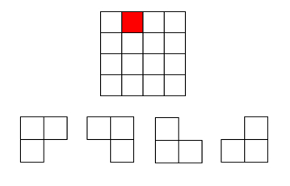

# 分治算法

## 定义

将原问题划分成`n`个规模较小，并且结构与原问题相似的子问题，递归地解决这些子问题，然后再合并其结果，就得到原问题的解

## 分治策略
“分而治之”，大问题能够拆成相似的小问题，记住这些小问题需要具有相似性。而后将小问题的每个解合成为大问题的解。所以说大问题如何拆，小问题如何合并才是这个算法最主要的一个思想。实际上很多算法如贪心算法，动态规划等等都是要求把大问题拆成小问题。而分治算法的重要一点就是要适用于能够重新把小问题的解合并为大问题的解。

## 使用分治算法的前提条件

- 原问题与分解成的小问题具有相同的模式；
- 原问题分解成的子问题可以独立求解，子问题之间没有相关性，**这一点是分治算法跟动态规划的明显区别；**
- 具有分解终止条件，也就是说，当问题足够小时，可以直接求解；
- 可以将子问题合并成原问题，而这个合并操作的复杂度不能太高，否则就起不到减小算法总体复杂度的效果了

## 每一次递归都会涉及三个操作

- **分解**：将原问题分解成一系列子问题；
- **解决**：递归地求解各个子问题，若子问题足够小，则直接求解；
- **合并**：将子问题的结果合并成原问题

## 分治法适用条件

1. 该问题的规模缩小到一定程度就可以很容易解决；

2. 该问题可以分解为若干个规模较小的相同问题，这里注意是最优子结构性质；

3. 利用该问题分解出的子问题的解可以合并为该问题的解；

4. 该问题所分解出的各个子问题是相互独立的，即子问题之间不包含公共子问题；

　　**对于很多算法而言，第一条往往是必要的，因为数据量一旦大起来，问题往往复杂度上升的特别快。这里就需要将这个大问题分解为小问题。小问题处理起来更加方便。第二、三条的才是分治思想的核心，因为很多时候我们会采用递归的方式进行解决，所以在大问题分解为小问题的时候需要保证小问题之间的相同性。单单分解为小问题之后还不能算完成，必须要能够将小问题的解合并为这个问题的最终解才能算真正用到了分治的思想。最后一条也是最关键的，各个子问题之间必须要保证独立性，即不互相影响。如果相互之间有影响，这时候我们采用的是动态规划就更加好一点。**

## 经典例题

其实算法的思想不用讲太多，能够化为几句话是最好的，下面就举几个例子来看看分治算法：

> 例题一：二分查找，给定一个按照升序排好的数组`array`，要在这个数组中找出一个特定的元素`x`；
当我们遇到一个问题，完全可以在心里问自己下面四个问题：

　　1、当前问题能不能切分？

　　答：能切分，因为数组按照升序来排列。所以当x大于某个元素array[mid]时，x一定在array[mid]的右边。以此再来切分。每次切一半

　　2、分解出来的子问题相同吗？

　　答：相同，每个子问题的数据集都是父问题的1/2倍。并且每次只比较子问题的中间的数据

　　3、子问题的解能合并为父问题的解吗？

　　答：不需要合并，子问题的解即为父问题的解。

　　4、子问题之间相互独立吗？

　　答：独立，子问题只是判断，不需要和父问题有很强的关联性（这里可以参考一下动态规划算法，就能理解子问题之间怎么判断是独立的）

## 总结

分治算法只是一种思想，不是一个具体的套路，只能说在碰见具体问题时我们能够从这个思路去思考，切分问题？合并问题？子问题之间影响关联大不大？这些都是具体问题具体考虑。还有很多很多题目是用了分治算法。也可以多刷刷题

## 循环赛日常表
设有`n=2^k`个运动员，要进行网球循环赛。现在要设计一个满足以下要求的比赛日程表

（1）每个选手必须与其他`n-1`个选手各赛一场

（2）每个选手一天只能赛一次

（3）循环赛一共进行`n-1`天

将比赛日程表设计成`n`行`n`列，表中除了第一列，其他`n-1`列才是我们要的，数组下标行列都从`0`开始，第i行j列代表第`（i+1）`位选手在第j天的对手：

  

以8个选手为例子

  

①我们先初始化第一行各个数为`1~8`（`2~8`为：第`1`天 — 第`7`天）；

②因为是递归，那么要填8x8的左下角和右下角，分别需要知道它的右上角和左上角

③而`8x8`的盒子它的左上角是一个`4x4`的盒子，要填`4x4`的左下角和右下角，也分别需要知道它的右上角和左上角

④现在递归到`4x4`的盒子的左上角，是一个`2x2`的盒子，它不需要递归了，直接沿对角线填左下角和右下角的数字，也就是上面的图②

⑤可以看到，经过上面的②③步，我们左上角4x4的盒子，它的·右上角和左上角已经知道了，那就可以沿对角线填它的左下角和右下角了，所以出现了图④

⑥其他的依次类推

通俗易懂地讲，就是**如果你想填一个大的，你得先得出它左上角和右上角两个盒子 ， 再沿对角线分别抄到右下角和左下角。 而为了得出它左上角和右上角，就需要递归了**

```java
public class SportsSchedule {
    public void scheduleTable(int[][] table, int n) {
        if (n == 1) {
            table[0][0] = 1;
        } else {
        /* 填充左上区域矩阵
            n值的变化：8  4  2  1
            m值的变化：4  2  1  1  */
            int m = n / 2;
            scheduleTable(table, m);
            //填充右上区域矩阵
            for (int i = 0; i < m; i++) {
                for (int j = m; j < n; j++) {
                    table[i][j] = table[i][j - m] + m;
                }
            }
            //填充左下区域矩阵
            for (int i = m; i < n; i++) {
                for (int j = 0; j < m; j++) {
                    table[i][j] = table[i - m][j] + m;
                }
            }
            //填充右下区域矩阵
            for (int i = m; i < n; i++) {
                for (int j = m; j < n; j++) {
                    table[i][j] = table[i - m][j - m];
                }
            }
        }
    }

    public static void main(String[] args) {
        int[][] table = new int[8][8];
        int n = 8;
        SportsSchedule schedule = new SportsSchedule();
        schedule.scheduleTable(table, n);
        int c = 0;
        //打印二维数组
        for (int i = 0; i < n; i++) {
            for (int j = 0; j < n; j++) {
                System.out.print(table[i][j] + " ");
                c++;//每打印一个数，c++
                if (c % n == 0) {//说明打印一行了
                    System.out.println();//换行
                }
            }
        }
    }
}
```

## `L`型骨牌棋盘覆盖

### 问题描述

在一个`2^k×2^k `个方格组成的棋盘中，恰有一个方格与其他方格不同，称该方格为一特殊方格（特殊点），且称该棋盘为一特殊棋盘。在棋盘覆盖问题中，要用图示的4种不同形态的L型骨牌覆盖给定的特殊棋盘上除特殊方格以外的所有方格，且任何`2`个`L`型骨牌不得重叠覆盖。

  

### 解题思路

> 分析 

当`k>0`时，将`2^k×2^k` 棋盘分割为`4`个`2^k-1×2^k-1` 子棋盘`(a)`所示。特殊方格必位于`4`个较小子棋盘之一中，其余`3`个子棋盘中无特殊方格。为了将这`3`个无特殊方格的子棋盘转化为特殊棋盘，可以用一个`L`型骨牌覆盖这`3`个较小棋盘的会合处，如 `(b)`所示，从而将原问题转化为`4`个较小规模的棋盘覆盖问题。递归地使用这种分割，直至棋盘简化为棋盘`1×1`。

  

> 实现：
 
每次都对分割后的四个小方块进行判断，判断特殊方格是否在里面。这里的判断的方法是每次先记录下整个大方块的左上角方格的行列坐标，然后再与特殊方格坐标进行比较，就可以知道特殊方格是否在该块中。如果特殊方块在里面，这直接递归下去求即可，如果不在，这根据分割的四个方块的不同位置，把右下角、左下角、右上角或者左上角的方格标记为特殊方块，然后继续递归。在递归函数里，还要有一个变量subSize来记录边的方格数，每次对方块进行划分时，边的方格数都会减半，这个变量是为了方便判断特殊方格的位置。

>  覆盖步骤如图：

  

>  代码实现:
```java
package cn.itcast.recursion;

public class ChessBoradProblem {
    private int[][] board;//棋盘
    private int specialRow;//特殊点行下标
    private int specialCol;//特殊点列下标
    private int size;//矩阵大小
    private int type = 0;//骨牌类型，1,2,3,4  因为是用数字表示的，所以用int

    public ChessBoradProblem(int specialRow, int specialCol, int size) {
        this.specialRow = specialRow;
        this.specialCol = specialCol;
        this.size = size;
        board = new int[size][size];
    }

    /**
     * @param specialRow 特殊点的行下标
     * @param specialCol 特殊点的列下标
     * @param leftRow    分割成4个后每个矩阵的左边的起点行下标
     * @param leftCol    分割成4个后每个矩阵的左边起点列下标
     * @param size       矩阵的宽或者高
     */

    //相对于四个方格中右上的方格，左边起点的leftRow不一定是0了
    private void ChessBoard(int specialRow, int specialCol, int leftRow, int leftCol, int size) {
        if (size == 1) {
            return;
        }

        int subSize = size / 2;
        type = type % 4 + 1;//不断+1，超过4就取模
        int n = type;

        //假设特殊点在左上角，然后行和列都小于一半
        if (specialRow < leftRow + subSize && specialCol < leftCol + subSize) {
            ChessBoard(specialRow, specialCol, leftRow, leftCol, subSize);
        } else {
            //不在左上角，左上角矩阵的右下角就是特殊点
            board[leftRow + subSize - 1][leftCol + subSize - 1] = n;
            ChessBoard(leftRow + subSize - 1, leftRow + subSize - 1, leftRow, leftCol, subSize);
        }

        //特殊点在右上方，行小于一半，列大于一半
        if (specialRow < leftRow + subSize && specialCol >= leftCol + subSize) {
            ChessBoard(specialRow, specialCol, leftRow, leftCol + subSize, subSize);
        } else {
            board[leftRow + subSize - 1][leftCol + subSize] = n;
            ChessBoard(leftRow + subSize - 1, leftCol + subSize, leftRow, leftCol + subSize, subSize);
        }

        //特殊点在左下方
        if (specialRow >= leftRow + subSize && specialCol < leftCol + subSize) {
            ChessBoard(specialRow, specialCol, leftRow + subSize, leftCol, subSize);
        } else {
            board[leftRow + subSize][leftCol + subSize - 1] = n;
            ChessBoard(leftRow + subSize, leftCol + subSize - 1, leftRow + subSize, leftCol, subSize);
        }

        //特殊点在右下方
        if (specialRow >= leftRow + subSize && specialCol >= leftCol + subSize) {
            ChessBoard(specialRow, specialCol, leftRow + subSize, leftCol + subSize, subSize);
        } else {
            board[leftRow + subSize][leftCol + subSize] = n;
            ChessBoard(leftRow + subSize, leftCol + subSize, leftRow + subSize, leftCol + subSize, subSize);
        }
    }


    public void printBoard(int specialRow, int specialCol, int size) {
        ChessBoard(specialRow, specialCol, 0, 0, size);
        printResult();
    }

    private void printResult() {
        for (int i = 0; i < size; i++) {
            for (int j = 0; j < size; j++) {
                System.out.print(board[i][j] + " ");//注意：print
            }
            System.out.println();
        }
    }


public static void main(String[] args) {
        int N = 4;//矩阵大小
        //选取特殊点
        int specialRow = 0;
        int specialCol = 1;
        ChessBoradProblem boradProblem = new ChessBoradProblem(specialRow, specialCol, N);
        boradProblem.printBoard(specialRow, specialCol, N);
    }
}
```


