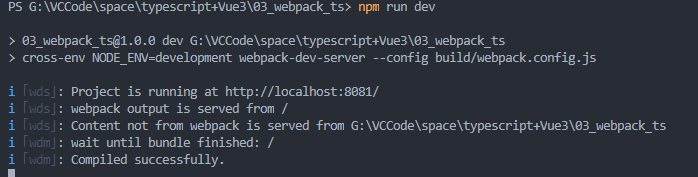
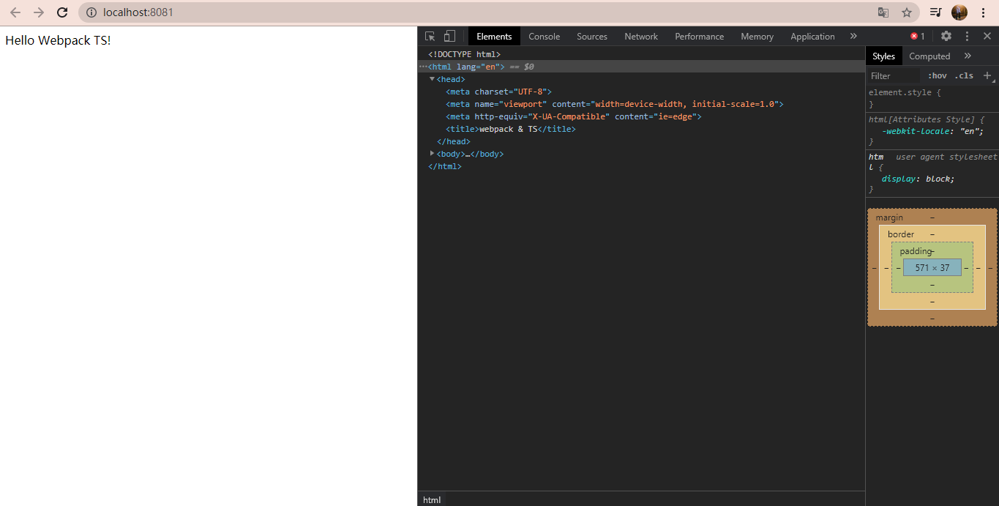
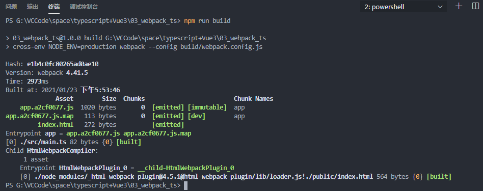
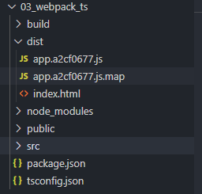

# Ts配置Webpack笔记

## 安装 Node.js 淘宝镜像加速器（cnpm）

==首先电脑是已经要满足安装了Node.js才可以==

由于不是很专业的前端,然后又学习了一些简单的``npm``指令:
```node
$ npm -v          #显示版本，检查npm 是否正确安装。
 
$ npm install express   #安装express模块
 
$ npm install -g express  #全局安装express模块
 
$ npm list         #列出已安装模块
 
$ npm show express     #显示模块详情
 
$ npm update        #升级当前目录下的项目的所有模块
 
$ npm update express    #升级当前目录下的项目的指定模块
 
$ npm update -g express  #升级全局安装的express模块
 
$ npm uninstall express  #删除指定的模块
```

> 因为配置了 cnpm 下载速度会快很多

```node
# -g 就是全局安装 (Node Package Manager)
npm install cnpm -g

# 若安装失败，则将源npm源换成淘宝镜像
# 因为npm安装插件是从国外服务器下载，受网络影响大
npm config set registry https://registry.npm.taobao.org

# 然后再执行
npm install cnpm -g
```
**安装的位置:``C:\Users\Administrator\AppData\Roaming\npm``**

然后就可以使用 ``cnpm``啦

## Ts中配置WebPack 

### 初始化

```node
// 会在目录下面生成一个 package.json 文件
PS G:\VCCode\space\typescript+Vue3\03_webpack_ts> npm init -y
//Wrote to G:\VCCode\space\typescript+Vue3\03_webpack_ts\package.json:
//{
// "name": "03_webpack_ts",
//  "version": "1.0.0",
//  "main": "index.js",
//  "scripts": {
//    "test": "echo \"Error: no test specified\" && exit 1"
//  },
//  "author": "",
//  "license": "ISC"
//}
```
```node
//会在目录下生成一个 tsconfig.json 文件
PS G:\VCCode\space\typescript+Vue3\03_webpack_ts> tsc --init
// message TS6071: Successfully created a tsconfig.json file.
```
### 下载依赖

```node
//安装Ts包
PS G:\VCCode\space\typescript+Vue3\03_webpack_ts> cnpm install -D typescript
// webPack-cli 是对内容进行编译使用的(安装特定版本是为了兼容问题)
// webpack-dev-server 是用来启用开发服务器的 
PS G:\VCCode\space\typescript+Vue3\03_webpack_ts>  cnpm install -D webpack@4.41.5 webpack-cli@3.3.10 webpack-dev-server@3.10.2
//  html-webpack-plugin  是用来打包 html 文件的 
// clean-webpack-plugin  是用来清除之前打包的js文件之类的
//  ts-loader  针对 Ts文件进行编译处理的
//  cross-env 涉及跨编译台的命令
PS G:\VCCode\space\typescript+Vue3\03_webpack_ts> cnpm install -D html-webpack-plugin clean-webpack-plugin ts-loader cross-env
```
> 关于 - S , -D , -g 参数的说明

```node
npm install module_name -S    即    npm install module_name –save    写入dependencies
npm install module_name -D    即    npm install module_name –save-dev 写入devDependencies
npm install module_name -g 	全局安装(命令行使用)
npm install module_name 		本地安装(将安装包放在 ./node_modules 下)
```
### 测试案例素材文件以及配置

#### **入口:src/main.ts**

``src``目录主要用来放置源码

```TypeScript
// import './01_helloworld'

document.write('Hello Webpack TS!')
```

#### index页面: public/index.html

``public``目录主要用来放置静态``html``文件

```html
<!DOCTYPE html>
<html lang="en">
<head>
  <meta charset="UTF-8">
  <meta name="viewport" content="width=device-width, initial-scale=1.0">
  <meta http-equiv="X-UA-Compatible" content="ie=edge">
  <title>webpack & TS</title>
</head>
<body>
</body>
</html
```
#### build/webpack.config.js

```js
const {CleanWebpackPlugin} = require('clean-webpack-plugin')
const HtmlWebpackPlugin = require('html-webpack-plugin')
const path = require('path')

const isProd = process.env.NODE_ENV === 'production' // 是否生产环境

function resolve (dir) {
  return path.resolve(__dirname, '..', dir)
}

module.exports = {
    // 是生产环境还是开发环境
  mode: isProd ? 'production' : 'development',
  //主入口目录
  entry: {
    app: './src/main.ts'
  },
    //打包后的内容输出目录
  output: {
      //放在dist 目录下
    path: resolve('dist'),
    //以上面的 app 文件为开头
    filename: '[name].[contenthash:8].js'
  },

  module: {
    rules: [
      {
        test: /\.tsx?$/,
        //使用 ts-loader 包 对 src 下的ts以及tsx文件进行编译操作
        use: 'ts-loader',
        include: [resolve('src')]
      }
    ]
  },

  plugins: [
      //会把 dist 下的 之前打包的 js清除掉
    new CleanWebpackPlugin({
    }),
    //此处针对 当前public 下的 html 进行打包
    new HtmlWebpackPlugin({
      template: './public/index.html'
    })
  ],

  resolve: {
      //对扩展名进行处理的 , 比如说 引入.ts文件不需要写拓展名
    extensions: ['.ts', '.tsx', '.js']
  },
    //使用sourceMap ,将来代码哪一行出现了错误 将会出现提示
  devtool: isProd ? 'cheap-module-source-map' : 'cheap-module-eval-source-map',

//启动项目之后进行的一些配置
  devServer: {
    host: 'localhost', // 主机名
    stats: 'errors-only', // 打包日志输出输出错误信息
    port: 8081,
    //浏览器中自动打开
    open: true
  },
}
```
### 配置打包命令

在生成的``package.json``文件中,替换掉``test``标签:
```js
"scripts": {
    //cross-env 的作用是跨平台 
    //因为有些指令只能够在 linux 中被识别 
    // dev 开发环境
    // bulid 生产环境 
    "dev": "cross-env NODE_ENV=development webpack-dev-server --config build/webpack.config.js",
    "build": "cross-env NODE_ENV=production webpack --config build/webpack.config.js"
  },
```
### 运行与打包
```npm
//运行
npm run dev
//打包
npm run build
```
#### 运行效果:







#### 打包效果



已经生成了``dist``目录以及相应的文件




## 主要需要注意的就是 ``webpack`` 包之类的 版本问题就okk了

