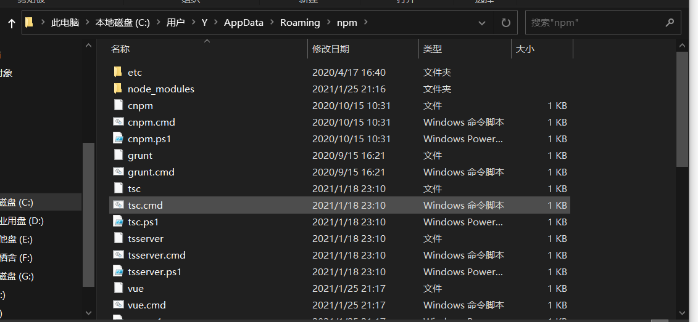
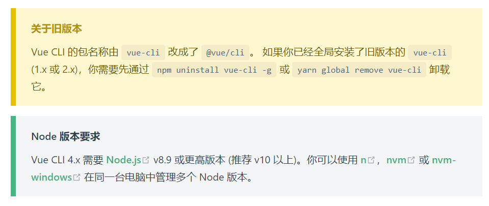
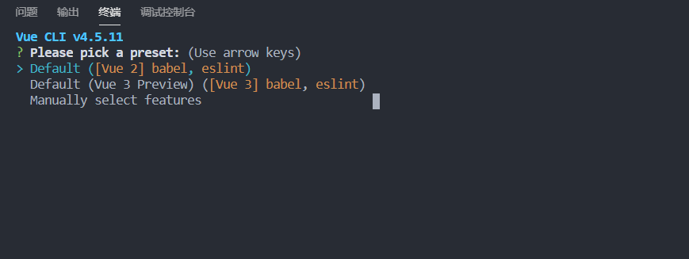
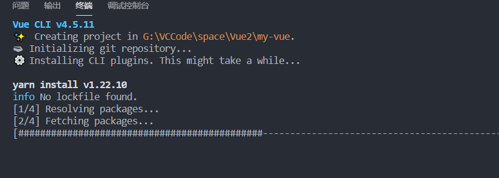
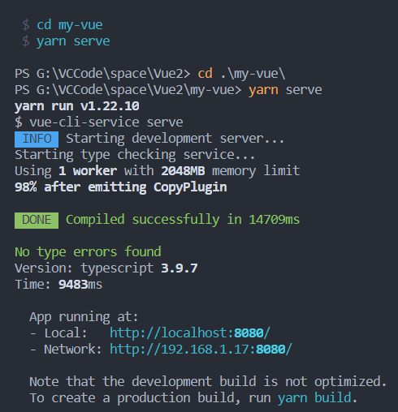
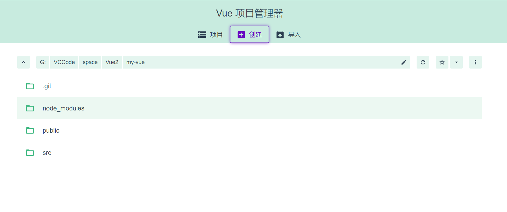

# ``Vue-Cli``+``WebPack``介绍以及使用

``vue-cli`` 官方提供的一个脚手架,用于快速生成一个 ``vue`` 的项目模板;
 预先定义好的目录结构及基础代码，就好比咱们在创建 ``Maven`` 项目时可以选择创建一个骨架项目，这个骨架项目就是脚手架,我们的开发更加的快速;
主要的功能:
-  统一的目录结构
-  本地调试
-  热部署
-  单元测试
-  集成打包上线


> 需要的环境

``Node.js`` : http://nodejs.cn/download/
安装就无脑下一步就好,安装在自己的环境目录下

Git : https://git-scm.com/downloads
镜像:https://npm.taobao.org/mirrors/git-for-windows/

确认``nodejs``安装成功:
``cmd`` 下输入 ``node -v``,查看是否能够正确打印出版本号即可!
``cmd`` 下输入 ``npm -v``,查看是否能够正确打印出版本号即可!
这个``npm``,就是一个软件包管理工具,就和``linux``下的``apt``软件安装差不多!
安装 ``Node.js`` 淘宝镜像加速器（``cnpm``）
这样子的话,下载会快很多~
在命令台输入:
```node
# -g 就是全局安装
npm install cnpm -g
# 或使用如下语句解决 npm 速度慢的问题
npm install --registry=https://registry.npm.taobao.org
```
安装的位置:``C:\Users\Administrator\AppData\Roaming\npm``




## 安装 ``vue-cli``

以下皆为狂神版本,但感觉有点问题
<hr>
```sh
#在命令台输入
cnpm install vue-cli -g
#查看是否安装成功
vue list
```
## 第一个 ``vue-cli`` 应用程序

创建一个``Vue``项目,我们随便建立一个空的文件夹在电脑上
创建一个基于 ``webpack`` 模板的 ``vue``应用程序
```sh
#这里的 myvue 是项目名称，可以根据自己的需求起名
vue init webpack myvue
```
一路都选择``no``即可;
初始化并运行

```sh
cd myvue
npm install
npm run dev
```
<hr>

[官网方法使用Vue-Cli创建项目链接](https://cli.vuejs.org/zh/guide/creating-a-project.html#vue-create)

### 安装



> 可以使用下列任一命令安装这个新的包：
```sh
npm install -g @vue/cli
# OR
yarn global add @vue/cli
```

安装之后，你就可以在命令行中访问 ``vue`` 命令。你可以通过简单运行 ``vue``，看看是否展示出了一份所有可用命令的帮助信息，来验证它是否安装成功。

你还可以用这个命令来检查其版本是否正确：
```node
vue --version
```

### 升级
如需升级全局的 ``Vue CLI`` 包，请运行：

```sh
npm update -g @vue/cli

#或者
yarn global upgrade --latest @vue/cli
```

### 项目依赖

上面列出来的命令是用于升级全局的 ``Vue CLI``。如需升级项目中的 ``Vue CLI`` 相关模块（以 ``@vue/cli-plugin-`` 或 ``vue-cli-plugin-`` 开头），请在项目目录下运行 ``vue upgrade：``

```sh
用法： upgrade [options] [plugin-name]

（试用）升级 Vue CLI 服务及插件

选项：
  -t, --to <version>    升级 <plugin-name> 到指定的版本
  -f, --from <version>  跳过本地版本检测，默认插件是从此处指定的版本升级上来
  -r, --registry <url>  使用指定的 registry 地址安装依赖
  --all                 升级所有的插件
  --next                检查插件新版本时，包括 alpha/beta/rc 版本在内
  -h, --help            输出帮助内容
```
### 官网使用``Vue-Cli`创建项目
> **vue create**

```sh
vue create hello-world
```

<table><tr><td bgcolor="#CCCCCC	">
警告:
如果你在 Windows 上通过 minTTY 使用 Git Bash，交互提示符并不工作。你必须通过 winpty vue.cmd create hello-world 启动这个命令。不过，如果你仍想使用 vue create hello-world，则可以通过在 ~/.bashrc 文件中添加以下行来为命令添加别名。 alias vue='winpty vue.cmd' 你需要重新启动 Git Bash 终端会话以使更新后的 bashrc 文件生效。
</table></tr></td>

> 你会被提示选取一个 preset。你可以选默认的包含了基本的 Babel + ESLint 设置的 preset，也可以选“手动选择特性”来选取需要的特性。




>这个默认的设置非常适合快速创建一个新项目的原型，而手动设置则提供了更多的选项，它们是面向生产的项目更加需要的。

一路``enter``:






项目就算是创建完成了


> ``vue create`` 命令有一些可选项，你可以通过运行以下命令进行探索：

```sh
vue create --help
```

```sh
用法：create [options] <app-name>
创建一个由 `vue-cli-service` 提供支持的新项目
选项：

  -p, --preset <presetName>       忽略提示符并使用已保存的或远程的预设选项
  -d, --default                   忽略提示符并使用默认预设选项
  -i, --inlinePreset <json>       忽略提示符并使用内联的 JSON 字符串预设选项
  -m, --packageManager <command>  在安装依赖时使用指定的 npm 客户端
  -r, --registry <url>            在安装依赖时使用指定的 npm registry
  -g, --git [message]             强制 / 跳过 git 初始化，并可选的指定初始化提交信息
  -n, --no-git                    跳过 git 初始化
  -f, --force                     覆写目标目录可能存在的配置
  -c, --clone                     使用 git clone 获取远程预设选项
  -x, --proxy                     使用指定的代理创建项目
  -b, --bare                      创建项目时省略默认组件中的新手指导信息
  -h, --help                      输出使用帮助信息
```
> **使用图形化界面**

你也可以通过 ``vue ui`` 命令以图形化界面创建和管理项目：

```sh
vue ui
```
上述命令会打开一个浏览器窗口，并以图形化界面将你引导至项目创建的流程。



> **拉取 2.x 模板 (旧版本)**

``Vue CLI >= 3`` 和旧版使用了相同的 ``vue`` 命令，所以 ``Vue CLI 2 (vue-cli)`` 被覆盖了。如果你仍然需要使用旧版本的 ``vue init`` 功能，你可以全局安装一个桥接工具：

```sh
npm install -g @vue/cli-init
# `vue init` 的运行效果将会跟 `vue-cli@2.x` 相同
vue init webpack my-project
```

### CLI 服务

在一个 ``Vue CLI`` 项目中，``@vue/cli-service`` 安装了一个名为 ``vue-cli-service`` 的命令。你可以在 ``npm scripts`` 中以 ``vue-cli-service``、或者从终端中以 ``./node_modules/.bin/vue-cli-service`` 访问这个命令。

这是你使用默认 ``preset`` 的项目的 ``package.json：``

```json
{
  "scripts": {
      "serve": "vue-cli-service serve",
      "build": "vue-cli-service build",
      "lint": "vue-cli-service lint"
    }
}
```
你可以通过 ``npm`` 或 ``Yarn`` 调用这些 ``script``：

```sh
npm run serve
# OR
yarn serve
```
> **``vue-cli-service serve``**

```sh
用法：vue-cli-service serve [options] [entry]

选项：

  --open    在服务器启动时打开浏览器
  --copy    在服务器启动时将 URL 复制到剪切版
  --mode    指定环境模式 (默认值：development)
  --host    指定 host (默认值：0.0.0.0)
  --port    指定 port (默认值：8080)
  --https   使用 https (默认值：false)
```

``vue-cli-service serve`` 命令会启动一个开发服务器 (基于 ``webpack-dev-server``) 并附带开箱即用的模块热重载 ``(Hot-Module-Replacement)``。

除了通过命令行参数，你也可以使用 ``vue.config.js`` 里的 ``devServer`` 字段配置开发服务器。

命令行参数 ``[entry]`` 将被指定为唯一入口，而非额外的追加入口。尝试使用 ``[entry]`` 覆盖 ``config.pages`` 中的 ``entry`` 将可能引发错误

> **``vue-cli-service build``**

```sh
用法：vue-cli-service build [options] [entry|pattern]

选项：

  --mode        指定环境模式 (默认值：production)
  --dest        指定输出目录 (默认值：dist)
  --modern      面向现代浏览器带自动回退地构建应用
  --target      app | lib | wc | wc-async (默认值：app)
  --name        库或 Web Components 模式下的名字 (默认值：package.json 中的 "name" 字段或入口文件名)
  --no-clean    在构建项目之前不清除目标目录
  --report      生成 report.html 以帮助分析包内容
  --report-json 生成 report.json 以帮助分析包内容
  --watch       监听文件变化
```

``vue-cli-service build`` 会在 ``dist/`` 目录产生一个可用于生产环境的包，带有 ``JS/CSS/HTML`` 的压缩，和为更好的缓存而做的自动的 ``vendor chunk splitting``。它的 ``chunk manifest`` 会内联在 ``HTML`` 里。

这里还有一些有用的命令参数：
- ``--modern`` 使用现代模式构建应用，为现代浏览器交付原生支持的 ``ES2015`` 代码，并生成一个兼容老浏览器的包用来自动回退。
- ``--target`` 允许你将项目中的任何组件以一个库或 ``Web Components`` 组件的方式进行构建。更多细节请查阅构建目标。
- ``--report`` 和 ``--report-json`` 会根据构建统计生成报告，它会帮助你分析包中包含的模块们的大小。

> **``vue-cli-service inspect``**

```sh
用法：vue-cli-service inspect [options] [...paths]

选项：

  --mode    指定环境模式 (默认值：development)
```

你可以使用 ``vue-cli-service inspect`` 来审查一个 ``Vue CLI`` 项目的 ``webpack config``。更多细节请查阅审查 [webpack config](https://cli.vuejs.org/zh/guide/webpack.html#%E5%AE%A1%E6%9F%A5%E9%A1%B9%E7%9B%AE%E7%9A%84-webpack-config)。


