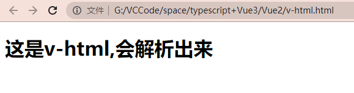
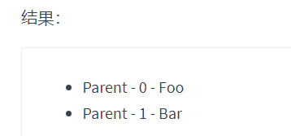
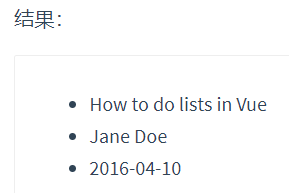
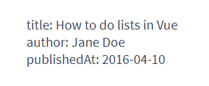
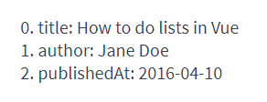

# Vue语法

## el挂载点以及data数据项

> el挂载点

```html
<!DOCTYPE html>
<html lang="en">

<head>
  <meta charset="UTF-8">
  <meta name="viewport" content="width=device-width, initial-scale=1.0">
  <meta http-equiv="X-UA-Compatible" content="ie=edge">
  <title>el:挂载点</title>
</head>

<body id="body">
  {{ message }}
  <h2 id="app" class="app">
    {{ message }}
    <span> {{ message }} </span>
  </h2>
  <!-- 开发环境版本，包含了有帮助的命令行警告 -->
  <script src="https://cdn.jsdelivr.net/npm/vue/dist/vue.js"></script>
  <script>
    var app = new Vue({
       el:"#app",
      // el:".app",
      // el:"div",
      //el:"#body",
      data:{
        message:"黑马程序员"
      }
    })
  </script>
</body>
</html>
```
==不能够把``el``挂载到``body``标签中==

> data 数据对象

```html
<!DOCTYPE html>
<html lang="en">

<head>
    <meta charset="UTF-8">
    <meta name="viewport" content="width=device-width, initial-scale=1.0">
    <meta http-equiv="X-UA-Compatible" content="ie=edge">
    <title>data:数据对象</title>
</head>

<body>
    <div id="app">
        {{ message }}
        <h2> {{ school.name }} {{ school.mobile }}</h2>
        <ul>
            <li>{{ campus[0] }}</li>
            <li>{{ campus[3] }}</li>
        </ul>
    </div>
    <!-- 开发环境版本，包含了有帮助的命令行警告 -->
    <script src="https://cdn.jsdelivr.net/npm/vue/dist/vue.js"></script>
    <script>
        var app = new Vue({
            el:"#app",
            data:{
                message:"你好 小黑!",
                school:{
                    name:"黑马程序员",
                    mobile:"400-618-9090"
                },
                campus:["北京校区","上海校区","广州校区","深圳校区"]
            }
        })
    </script>
</body>

</html>
```


## 相关基本语法

### **v-text**

> **设置标签的文本值(textContent)**

```html
<!DOCTYPE html>
<html lang="en">

<head>
    <meta charset="UTF-8">
    <meta name="viewport" content="width=device-width, initial-scale=1.0">
    <meta http-equiv="X-UA-Compatible" content="ie=edge">
    <title>v-text指令</title>
</head>

<body>
    <div id="app">
        <h2 v-text="message+'!'">深圳</h2>
        <h2 v-text="info+'!'">深圳</h2>
        <h2>{{ message +'!'}}深圳</h2>
    </div>
    <!-- 开发环境版本，包含了有帮助的命令行警告 -->
    <script src="https://cdn.jsdelivr.net/npm/vue/dist/vue.js"></script>
    <script>
        var app = new Vue({
            el:"#app",
            data:{
                message:"黑马程序员!!!",
                info:"前端与移动教研部"
            }
        })
    </script>
</body>

</html>
```
**==``v-text``是有替换作用的==**

### **v-html**

设置标签的 ``innerHtml``

```html
<!DOCTYPE html>
<html lang="en">
<head>
    <meta charset="UTF-8">
    <meta name="viewport" content="width=device-width, initial-scale=1.0">
    <title>Document</title>
</head>
<body>
    
    <div id="app">
        <p v-html="content"></p>
    </div>

    <script src="https://cdn.jsdelivr.net/npm/vue/dist/vue.js"></script>

    <script>
        var app = new Vue({
            el:"#app",
            data:{
                content: "<h1 style='backgroundcolor:blue;'>这是v-html,会解析出来</h1>"
            }
        })
    </script>
</body>
</html>
```
效果:



### **v-on**

**为元素绑定事件**

```html
<!-- 完整语法 -->
<a v-on:click="doSomething">...</a>

<!-- 缩写 -->
<a @click="doSomething">...</a>

<!-- 动态参数的缩写 (2.6.0+) -->
<a @[event]="doSomething"> ... </a>
```
实例:
```html
<!DOCTYPE html>
<html lang="en">
<head>
    <meta charset="UTF-8">
    <meta name="viewport" content="width=device-width, initial-scale=1.0">
    <title>V-on</title>
</head>
<body>
    <div id="app">
        <input type="button" value="单击v-on" @click="dolt"> 
        <input type="button" value="双击v-on" @dblclick="testText(food)"> 
        <h2 @click="testText">{{ food }}</h2>
    </div>
    <script src="https://cdn.jsdelivr.net/npm/vue/dist/vue.js"></script>
    <script>
        var app = new Vue({
            el:"#app",
            data:{
                food: "这是测试"
            },
            methods:{
                dolt:()=>{
                    alert("做IT!!!");
                },
                testText:(a)=>{
                    console.log(a);
                }
            }
        })
    </script>
</body>
</html>
```
#### ``v-on``补充

==主要是事件修饰符==

- ``.stop`` - 调用 ``event.stopPropagation()``。
- ``.prevent`` - 调用 ``event.preventDefault()``。
- ``.capture`` - 添加事件侦听器时使用 ``capture`` 模式。
- ``.self`` - 只当事件是从侦听器绑定的元素本身触发时才触发回调。
- ``.{keyCode | keyAlias}`` - 只当事件是从特定键触发时才触发回调。
- ``.native`` - 监听组件根元素的原生事件。
- ``.once`` - 只触发一次回调。
- ``.left`` - (2.2.0) 只当点击鼠标左键时触发。
- ``.right`` - (2.2.0) 只当点击鼠标右键时触发。
- ``.middle`` - (2.2.0) 只当点击鼠标中键时触发。
- ``.passive`` - (2.3.0) 以 ``{ passive: true }`` 模式添加侦听器

```html
<!-- 方法处理器 -->
<button v-on:click="doThis"></button>
<!-- 动态事件 (2.6.0+) -->
<button v-on:[event]="doThis"></button>

<!-- 内联语句 -->
<button v-on:click="doThat('hello', $event)"></button>

<!-- 缩写 -->
<button @click="doThis"></button>

<!-- 动态事件缩写 (2.6.0+) -->
<button @[event]="doThis"></button>

<!-- 停止冒泡 -->
<button @click.stop="doThis"></button>

<!-- 阻止默认行为 -->
<button @click.prevent="doThis"></button>

<!-- 阻止默认行为，没有表达式 -->
<form @submit.prevent></form>

<!--  串联修饰符 -->
<button @click.stop.prevent="doThis"></button>

<!-- 键修饰符，键别名 -->
<input @keyup.enter="onEnter">

<!-- 键修饰符，键代码 -->
<input @keyup.13="onEnter">

<!-- 点击回调只会触发一次 -->
<button v-on:click.once="doThis"></button>

<!-- 对象语法 (2.4.0+) -->
<button v-on="{ mousedown: doThis, mouseup: doThat }"></button>
```


### **v-show**

**根据表达值的真假,切换元素的显示和隐藏**

```html
<!DOCTYPE html>
<html lang="en">
  <head>
    <meta charset="UTF-8" />
    <meta name="viewport" content="width=device-width, initial-scale=1.0" />
    <meta http-equiv="X-UA-Compatible" content="ie=edge" />
    <title>v-show指令</title>
  </head>
  <body>
    <div id="app">
      <input type="button" value="切换显示状态" @click="changeIsShow">
      <input type="button" value="累加年龄" @click="addAge">
      
      =18" src="./img/monkey.gif" alt="">
    </div>
    <!-- 1.开发环境版本，包含了有帮助的命令行警告 -->
    <script src="https://cdn.jsdelivr.net/npm/vue/dist/vue.js"></script>
    <script>
      var app = new Vue({
        el:"#app",
        data:{
          isShow:false,
          age:17
        },
        methods: {
          changeIsShow:function(){
            this.isShow = !this.isShow;
          },
          addAge:function(){
            this.age++;
          }
        },
      })
    </script>
  </body>
</html>
```

### **v-if**

**根据表达值的真假,切换元素的显示和隐藏**

```html
<!DOCTYPE html>
<html lang="en">

<head>
    <meta charset="UTF-8">
    <meta name="viewport" content="width=device-width, initial-scale=1.0">
    <meta http-equiv="X-UA-Compatible" content="ie=edge">
    <title>v-if指令</title>
</head>
<body>
    <div id="app">
        <input type="button" value="切换显示" @click="toggleIsShow">
        <p v-if="isShow">黑马程序员</p>
        <p v-show="isShow">黑马程序员 - v-show修饰</p>
        <h2 v-if="temperature>=35">热死啦</h2>
    </div>
    <!-- 开发环境版本，包含了有帮助的命令行警告 -->
    <script src="https://cdn.jsdelivr.net/npm/vue/dist/vue.js"></script>
    <script>
        var app = new Vue({
            el:"#app",
            data:{
                isShow:false,
                temperature:20
            },
            methods: {
                toggleIsShow:function(){
                    this.isShow = !this.isShow;
                }
            },
        })
    </script>
</body>

</html>
```
### **v-bind**

**设置元素的属性**

动态地绑定一个或多个 attribute，或一个组件 prop 到表达式。

在绑定 class 或 style attribute 时，支持其它类型的值，如数组或对象。可以通过下面的教程链接查看详情。

在绑定 prop 时，prop 必须在子组件中声明。可以用修饰符指定不同的绑定类型。

没有参数时，可以绑定到一个包含键值对的对象。注意此时 class 和 style 绑定不支持数组和对象。

```html
<!-- 绑定一个 attribute -->


<!-- 动态 attribute 名 (2.6.0+) -->
<button v-bind:[key]="value"></button>

<!-- 缩写 -->


<!-- 动态 attribute 名缩写 (2.6.0+) -->
<button :[key]="value"></button>

<!-- 内联字符串拼接 -->


<!-- class 绑定 -->
<div :class="{ red: isRed }"></div>
<div :class="[classA, classB]"></div>
<div :class="[classA, { classB: isB, classC: isC }]">

<!-- style 绑定 -->
<div :style="{ fontSize: size + 'px' }"></div>
<div :style="[styleObjectA, styleObjectB]"></div>

<!-- 绑定一个全是 attribute 的对象 -->
<div v-bind="{ id: someProp, 'other-attr': otherProp }"></div>

<!-- 通过 prop 修饰符绑定 DOM attribute -->
<div v-bind:text-content.prop="text"></div>

<!-- prop 绑定。“prop”必须在 my-component 中声明。-->
<my-component :prop="someThing"></my-component>

<!-- 通过 $props 将父组件的 props 一起传给子组件 -->
<child-component v-bind="$props"></child-component>

<!-- XLink -->
<svg><a :xlink:special="foo"></a></svg>
```
### **v-for**

**根据数据生成列表结构**

>我们可以用 ``v-for`` 指令基于一个数组来渲染一个列表。``v-for`` 指令需要使用 ``item in items`` 形式的特殊语法，其中 ``items`` 是源数据数组，而 ``item`` 则是被迭代的数组元素的别名。

```html
<ul id="example-1">
  <li v-for="item in items" :key="item.message">
    {{ item.message }}
  </li>
</ul>
var example1 = new Vue({
  el: '#example-1',
  data: {
    items: [
      { message: 'Foo' },
      { message: 'Bar' }
    ]
  }
})

//结果为
· Foo
· Bar
```
>在 v-for 块中，我们可以访问所有父作用域的 property。v-for 还支持一个可选的第二个参数，即当前项的索引。

```html
<ul id="example-2">
  <li v-for="(item, index) in items">
    {{ parentMessage }} - {{ index }} - {{ item.message }}
  </li>
</ul>
var example2 = new Vue({
  el: '#example-2',
  data: {
    parentMessage: 'Parent',
    items: [
      { message: 'Foo' },
      { message: 'Bar' }
    ]
  }
})
```



>你也可以用 of 替代 in 作为分隔符，因为它更接近 JavaScript 迭代器的语法：

```html
<div v-for="item of items"></div>
```

#### ``v-for``使用对象

> 你也可以用 ``v-for`` 来遍历一个对象的 ``property``。

```html
<ul id="v-for-object" class="demo">
  <li v-for="value in object">
    {{ value }}
  </li>
</ul>
new Vue({
  el: '#v-for-object',
  data: {
    object: {
      title: 'How to do lists in Vue',
      author: 'Jane Doe',
      publishedAt: '2016-04-10'
    }
  }
})
```



>你也可以提供第二个的参数为 property 名称 (也就是键名)：

```html
<div v-for="(value, name) in object">
  {{ name }}: {{ value }}
</div>
```



> 还可以用第三个参数作为索引：

```html
<div v-for="(value, name, index) in object">
  {{ index }}. {{ name }}: {{ value }}
</div>
```





### **v-model**

**获取和设置表单元素的值(双向数据绑定)**

```html
<!DOCTYPE html>
<html lang="en">
<head>
    <meta charset="UTF-8">
    <meta name="viewport" content="width=device-width, initial-scale=1.0">
    <meta http-equiv="X-UA-Compatible" content="ie=edge">
    <title>v-model指令</title>
</head>
<body>
    <div id="app">
        <input type="button" value="修改message" @click="setM">
        <input type="text" v-model="message" @keyup.enter="getM">
        <h2>{{ message }}</h2>
    </div>
    <!-- 开发环境版本，包含了有帮助的命令行警告 -->
    <script src="https://cdn.jsdelivr.net/npm/vue/dist/vue.js"></script>
    <script>
        var app = new Vue({
            el:"#app",
            data:{
                message:"黑马程序员"
            },
            methods: {
                getM:function(){
                    alert(this.message);
                },
                setM:function(){
                    this.message ="酷丁鱼";
                }
            },
        })
    </script>
</body>
</html>
```
- ==``v-model``指令的作用是便捷的设置和获取表单元素的值==
- 绑定的数据会和表单元素值相关联
- 绑定的数据<->表达元素的值

## **axios**

### 关于使用

```js
//使用npm 安装
$ npm install axios
//使用bower
$ bower install axios
//使用cdn
<script src="https://unpkg.com/axios/dist/axios.min.js"></script>
```

### 关于请求

**发送``Get``请求**
```js
//发送Get请求
// 为给定 ID 的 user 创建请求
axios.get('/user?ID=12345')
  .then(function (response) {
    console.log(response);
  })
  .catch(function (error) {
    console.log(error);
  });

// 上面的请求也可以这样做
axios.get('/user', {
    params: {
      ID: 12345
    }
  })
  .then(function (response) {
    console.log(response);
  })
  .catch(function (error) {
    console.log(error);
  });
```
**发送``POST``请求**
```js
axios.post('/user', {
    firstName: 'Fred',
    lastName: 'Flintstone'
  })
  .then(function (response) {
    console.log(response);
  })
  .catch(function (error) {
    console.log(error);
  });
```
**执行多个并发请求**

```js
function getUserAccount() {
  return axios.get('/user/12345');
}

function getUserPermissions() {
  return axios.get('/user/12345/permissions');
}

axios.all([getUserAccount(), getUserPermissions()])
  .then(axios.spread(function (acct, perms) {
    // 两个请求现在都执行完成
}));
```

## axios API

**可以通过向 ``axios`` 传递相关配置来创建请求**

> axios(config)

```js
// 发送 POST 请求
axios({
  method: 'post',
  url: '/user/12345',
  data: {
    firstName: 'Fred',
    lastName: 'Flintstone'
  }
});


// 获取远端图片
axios({
  method:'get',
  url:'http://bit.ly/2mTM3nY',
  responseType:'stream'
})
  .then(function(response) {
  response.data.pipe(fs.createWriteStream('ada_lovelace.jpg'))
});
```

> axios(url[, config])

```js
// 发送 GET 请求（默认的方法）
axios('/user/12345');
```

### 别名

```js
//请求方法别名
axios.request(config)
axios.get(url[, config])
axios.delete(url[, config])
axios.head(url[, config])
axios.options(url[, config])
axios.post(url[, data[, config]])
axios.put(url[, data[, config]])
axios.patch(url[, data[, config]])

//并发
axios.all(iterable)
axios.spread(callback)

```
**创建实例**

**axios.create([config])**
```js
const instance = axios.create({
  baseURL: 'https://some-domain.com/api/',
  timeout: 1000,
  headers: {'X-Custom-Header': 'foobar'}
});
```

**实例方法**
```js
axios#request(config)
axios#get(url[, config])
axios#delete(url[, config])
axios#head(url[, config])
axios#options(url[, config])
axios#post(url[, data[, config]])
axios#put(url[, data[, config]])
axios#patch(url[, data[, config]])
```

### 请求配置

```js
{
   // `url` 是用于请求的服务器 URL
  url: '/user',

  // `method` 是创建请求时使用的方法
  method: 'get', // default

  // `baseURL` 将自动加在 `url` 前面，除非 `url` 是一个绝对 URL。
  // 它可以通过设置一个 `baseURL` 便于为 axios 实例的方法传递相对 URL
  baseURL: 'https://some-domain.com/api/',

  // `transformRequest` 允许在向服务器发送前，修改请求数据
  // 只能用在 'PUT', 'POST' 和 'PATCH' 这几个请求方法
  // 后面数组中的函数必须返回一个字符串，或 ArrayBuffer，或 Stream
  transformRequest: [function (data, headers) {
    // 对 data 进行任意转换处理
    return data;
  }],

  // `transformResponse` 在传递给 then/catch 前，允许修改响应数据
  transformResponse: [function (data) {
    // 对 data 进行任意转换处理
    return data;
  }],

  // `headers` 是即将被发送的自定义请求头
  headers: {'X-Requested-With': 'XMLHttpRequest'},

  // `params` 是即将与请求一起发送的 URL 参数
  // 必须是一个无格式对象(plain object)或 URLSearchParams 对象
  params: {
    ID: 12345
  },

   // `paramsSerializer` 是一个负责 `params` 序列化的函数
  // (e.g. https://www.npmjs.com/package/qs, http://api.jquery.com/jquery.param/)
  paramsSerializer: function(params) {
    return Qs.stringify(params, {arrayFormat: 'brackets'})
  },

  // `data` 是作为请求主体被发送的数据
  // 只适用于这些请求方法 'PUT', 'POST', 和 'PATCH'
  // 在没有设置 `transformRequest` 时，必须是以下类型之一：
  // - string, plain object, ArrayBuffer, ArrayBufferView, URLSearchParams
  // - 浏览器专属：FormData, File, Blob
  // - Node 专属： Stream
  data: {
    firstName: 'Fred'
  },

  // `timeout` 指定请求超时的毫秒数(0 表示无超时时间)
  // 如果请求话费了超过 `timeout` 的时间，请求将被中断
  timeout: 1000,

   // `withCredentials` 表示跨域请求时是否需要使用凭证
  withCredentials: false, // default

  // `adapter` 允许自定义处理请求，以使测试更轻松
  // 返回一个 promise 并应用一个有效的响应 (查阅 [response docs](#response-api)).
  adapter: function (config) {
    /* ... */
  },

 // `auth` 表示应该使用 HTTP 基础验证，并提供凭据
  // 这将设置一个 `Authorization` 头，覆写掉现有的任意使用 `headers` 设置的自定义 `Authorization`头
  auth: {
    username: 'janedoe',
    password: 's00pers3cret'
  },

   // `responseType` 表示服务器响应的数据类型，可以是 'arraybuffer', 'blob', 'document', 'json', 'text', 'stream'
  responseType: 'json', // default

  // `responseEncoding` indicates encoding to use for decoding responses
  // Note: Ignored for `responseType` of 'stream' or client-side requests
  responseEncoding: 'utf8', // default

   // `xsrfCookieName` 是用作 xsrf token 的值的cookie的名称
  xsrfCookieName: 'XSRF-TOKEN', // default

  // `xsrfHeaderName` is the name of the http header that carries the xsrf token value
  xsrfHeaderName: 'X-XSRF-TOKEN', // default

   // `onUploadProgress` 允许为上传处理进度事件
  onUploadProgress: function (progressEvent) {
    // Do whatever you want with the native progress event
  },

  // `onDownloadProgress` 允许为下载处理进度事件
  onDownloadProgress: function (progressEvent) {
    // 对原生进度事件的处理
  },

   // `maxContentLength` 定义允许的响应内容的最大尺寸
  maxContentLength: 2000,

  // `validateStatus` 定义对于给定的HTTP 响应状态码是 resolve 或 reject  promise 。如果 `validateStatus` 返回 `true` (或者设置为 `null` 或 `undefined`)，promise 将被 resolve; 否则，promise 将被 rejecte
  validateStatus: function (status) {
    return status >= 200 && status < 300; // default
  },

  // `maxRedirects` 定义在 node.js 中 follow 的最大重定向数目
  // 如果设置为0，将不会 follow 任何重定向
  maxRedirects: 5, // default

  // `socketPath` defines a UNIX Socket to be used in node.js.
  // e.g. '/var/run/docker.sock' to send requests to the docker daemon.
  // Only either `socketPath` or `proxy` can be specified.
  // If both are specified, `socketPath` is used.
  socketPath: null, // default

  // `httpAgent` 和 `httpsAgent` 分别在 node.js 中用于定义在执行 http 和 https 时使用的自定义代理。允许像这样配置选项：
  // `keepAlive` 默认没有启用
  httpAgent: new http.Agent({ keepAlive: true }),
  httpsAgent: new https.Agent({ keepAlive: true }),

  // 'proxy' 定义代理服务器的主机名称和端口
  // `auth` 表示 HTTP 基础验证应当用于连接代理，并提供凭据
  // 这将会设置一个 `Proxy-Authorization` 头，覆写掉已有的通过使用 `header` 设置的自定义 `Proxy-Authorization` 头。
  proxy: {
    host: '127.0.0.1',
    port: 9000,
    auth: {
      username: 'mikeymike',
      password: 'rapunz3l'
    }
  },

  // `cancelToken` 指定用于取消请求的 cancel token
  // （查看后面的 Cancellation 这节了解更多）
  cancelToken: new CancelToken(function (cancel) {
  })
}
```
### 响应结构

**某个请求的响应包含以下信息**
```js
{
  // `data` 由服务器提供的响应
  data: {},

  // `status` 来自服务器响应的 HTTP 状态码
  status: 200,

  // `statusText` 来自服务器响应的 HTTP 状态信息
  statusText: 'OK',

  // `headers` 服务器响应的头
  headers: {},

   // `config` 是为请求提供的配置信息
  config: {},
 // 'request'
  // `request` is the request that generated this response
  // It is the last ClientRequest instance in node.js (in redirects)
  // and an XMLHttpRequest instance the browser
  request: {}
}
```
**使用 ``then`` 时，你将接收下面这样的响应 :**

```js
axios.get('/user/12345')
  .then(function(response) {
    console.log(response.data);
    console.log(response.status);
    console.log(response.statusText);
    console.log(response.headers);
    console.log(response.config);
  });
```


