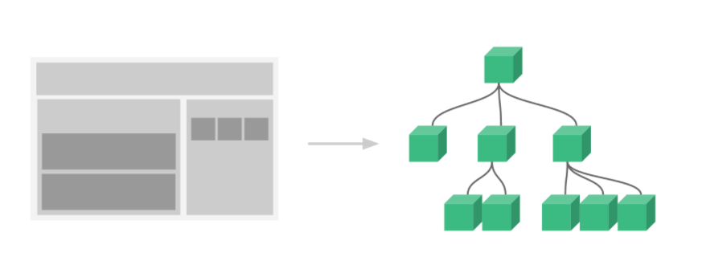

# Vue属性

## 创建Vue实例

> 每个 Vue 应用都是通过用 Vue 函数创建一个新的 Vue 实例开始的：

```js
var vm = new Vue({
  // 选项
})
```
### 实例选项/数据

#### **data**

- 类型：``Object`` | ``Function``
- 限制：组件的定义只接受 ``function``

**实例:**
```js
var data = { a: 1 }

// 直接创建一个实例
var vm = new Vue({
  data: data
})
vm.a // => 1
vm.$data === data // => true

// Vue.extend() 中 data 必须是函数
var Component = Vue.extend({
  data: function () {
    return { a: 1 }
  }
})
```
注意，如果你为 data property 使用了箭头函数，则 this 不会指向这个组件的实例，不过你仍然可以将其实例作为函数的第一个参数来访问

```js
data: vm => ({ a: vm.myProp })
```
#### **props**

- 类型：``Array<string> | Object``

- 详细：
``props`` 可以是数组或对象，用于接收来自父组件的数据。``props`` 可以是简单的数组，或者使用对象作为替代，对象允许配置高级选项，如类型检测、自定义验证和设置默认值。
你可以基于对象的语法使用以下选项：
    - ``type``：可以是下列原生构造函数中的一种：``String``、``Number``、``Boolean``、``Array``、``Object``、``Date``、``Function``、``Symbol``、任何自定义构造函数、或上述内容组成的数组。会检查一个 ``prop`` 是否是给定的类型，否则抛出警告。``Prop` 类型的更多信息在此。
    - ``default：any``
为该 ``prop`` 指定一个默认值。如果该 ``prop`` 没有被传入，则换做用这个值。对象或数组的默认值必须从一个工厂函数返回。
    - ``required：Boolean``
定义该 ``prop`` 是否是必填项。在非生产环境中，如果这个值为 ``truthy`` 且该 prop 没有被传入的，则一个控制台警告将会被抛出。
    - ``validator：Function``
自定义验证函数会将该 ``prop`` 的值作为唯一的参数代入。在非生产环境下，如果该函数返回一个 ``falsy`` 的值 (也就是验证失败)，一个控制台警告将会被抛出。你可以在这里查阅更多 ``prop`` 验证的相关信息。

**示例:**
```js
// 简单语法
Vue.component('props-demo-simple', {
  props: ['size', 'myMessage']
})
// 对象语法，提供验证
Vue.component('props-demo-advanced', {
  props: {
    // 检测类型
    height: Number,
    // 检测类型 + 其他验证
    age: {
      type: Number,
      default: 0,
      required: true,
      validator: function (value) {
        return value >= 0
      }
    }
  }
})
```
#### **propsData**

- 类型：``{ [key: string]: any }``
- 限制：只用于 ``new`` 创建的实例中。
- 详细：创建实例时传递 ``props``。主要作用是方便测试。

**实例:**

```js
var Comp = Vue.extend({
  props: ['msg'],
  template: '<div>{{ msg }}</div>'
})

var vm = new Comp({
  propsData: {
    msg: 'hello'
  }
})
```

#### **computed**

- 类型：``{ [key: string]: Function | { get: Function, set: Function } }``
- 详细：
计算属性将被混入到``Vue`` 实例中。所有 ``getter`` 和 ``setter`` 的 ``this`` 上下文自动地绑定为 ``Vue`` 实例。
注意如果你为一个计算属性使用了箭头函数，则 ``this`` 不会指向这个组件的实例，不过你仍然可以将其实例作为函数的第一个参数来访问。

```js
computed: {
  aDouble: vm => vm.a * 2
}
```
计算属性的结果会被缓存，除非依赖的响应式 property 变化才会重新计算。注意，如果某个依赖 (比如非响应式 property) 在该实例范畴之外，则计算属性是**不会被更新**的。

**示例：**
```js
var vm = new Vue({
  data: { a: 1 },
  computed: {
    // 仅读取
    aDouble: function () {
      return this.a * 2
    },
    // 读取和设置
    aPlus: {
      get: function () {
        return this.a + 1
      },
      set: function (v) {
        this.a = v - 1
      }
    }
  }
})
vm.aPlus   // => 2
vm.aPlus = 3
vm.a       // => 2
vm.aDouble // => 4
```
#### **methods**

- 类型：``{ [key: string]: Function }``
- 详细：
``methods`` 将被混入到 ``Vue`` 实例中。可以直接通过 ``VM`` 实例访问这些方法，或者在指令表达式中使用。方法中的 ``this`` 自动绑定为 ``Vue`` 实例。

<table><tr><td bgcolor="#66CC00	">
注意，不应该使用箭头函数来定义 method函数

(例如 plus: () => this.a++)。
理由是箭头函数绑定了父级作用域的上下文，所以 this 将不会按照期望指向 Vue 实例，this.a 将是 undefined。</table></tr></td>

**实例:**
```js
var vm = new Vue({
  data: { a: 1 },
  methods: {
    plus: function () {
      this.a++
    }
  }
})
vm.plus()
vm.a // 2
```
#### **watch**

- 类型：``{ [key: string]: string | Function | Object | Array }``
- 详细：一个对象，键是需要观察的表达式，值是对应回调函数。值也可以是方法名，或者包含选项的对象。``Vue`` 实例将会在实例化时调用 ``$watch()``，遍历 ``watch`` 对象的每一个 ``property``。

**实例**

```js
var vm = new Vue({
  data: {
    a: 1,
    b: 2,
    c: 3,
    d: 4,
    e: {
      f: {
        g: 5
      }
    }
  },
  watch: {
    a: function (val, oldVal) {
      console.log('new: %s, old: %s', val, oldVal)
    },
    // 方法名
    b: 'someMethod',
    // 该回调会在任何被侦听的对象的 property 改变时被调用，不论其被嵌套多深
    c: {
      handler: function (val, oldVal) { /* ... */ },
      deep: true
    },
    // 该回调将会在侦听开始之后被立即调用
    d: {
      handler: 'someMethod',
      immediate: true
    },
    // 你可以传入回调数组，它们会被逐一调用
    e: [
      'handle1',
      function handle2 (val, oldVal) { /* ... */ },
      {
        handler: function handle3 (val, oldVal) { /* ... */ },
        /* ... */
      }
    ],
    // watch vm.e.f's value: {g: 5}
    'e.f': function (val, oldVal) { /* ... */ }
  }
})
vm.a = 2 // => new: 2, old: 1
```

**注意，不应该使用箭头函数来定义 ``watcher`` 函数 (例如 ``searchQuery: newValue => this.updateAutocomplete(newValue))``。理由是箭头函数绑定了父级作用域的上下文，所以 this 将不会按照期望指向 ``Vue`` 实例，``this.updateAutocomplete`` 将是 ``undefined``。**

### 实例选项/Dom

#### **el**

- 类型：``string | Element``
- 限制：只在用 new 创建实例时生效。
- 详细：提供一个在页面上已存在的 ``DOM`` 元素作为 ``Vue`` 实例的挂载目标。可以是 ``CSS`` 选择器，也可以是一个 ``HTMLElement`` 实例。
在实例挂载之后，元素可以用 ``vm.$el`` 访问。
如果在实例化时存在这个选项，实例将立即进入编译过程，否则，需要显式调用 ``vm.$mount()`` 手动开启编译。

<table><tr><td bgcolor="#66CC00	">
提供的元素只能作为挂载点。不同于 Vue 1.x，所有的挂载元素会被 Vue 生成的 DOM 替换。因此不推荐挂载 root 实例到 html 或者 body 上。
<hr>
如果 render 函数和 template property 都不存在，挂载 DOM 元素的 HTML 会被提取出来用作模板，此时，必须使用 Runtime + Compiler 构建的 Vue 库。</table></tr></td>


#### **template**

- 类型：``string``
- 详细：一个字符串模板作为 ``Vue`` 实例的标识使用。模板将会替换挂载的元素。挂载元素的内容都将被忽略，除非模板的内容有分发插槽。
如果值以 # 开始，则它将被用作选择符，并使用匹配元素的 ``innerHTML`` 作为模板。常用的技巧是用 ``<script type="x-template">`` 包含模板。

<table><tr><td bgcolor="#66CC00	">
出于安全考虑，你应该只使用你信任的 Vue 模板。避免使用其他人生成的内容作为你的模板。
<hr>
如果 Vue 选项中包含渲染函数，该模板将被忽略。
</table></tr></td>


#### **render**

- 类型：(createElement: () => VNode) => VNode
- 详细：字符串模板的代替方案，允许你发挥 JavaScript 最大的编程能力。该渲染函数接收一个 ``createElement`` 方法作为第一个参数用来创建 ``VNode``。
<table><tr><td bgcolor="#66CC00	">
如果组件是一个函数组件，渲染函数还会接收一个额外的 context 参数，为没有实例的函数组件提供上下文信息。
<hr>
Vue 选项中的 render 函数若存在，则 Vue 构造函数不会从 template 选项或通过 el 选项指定的挂载元素中提取出的 HTML 模板编译渲染函数。
</table></tr></td>

#### **renderError**

- 类型：(createElement: () => VNode, error: Error) => VNode
- 详细：**只在开发者环境下工作。**
当 ``render`` 函数遭遇错误时，提供另外一种渲染输出。其错误将会作为第二个参数传递到 ``renderError``。这个功能配合 ``hot-reload`` 非常实用。

**实例:**
```js
new Vue({
  render (h) {
    throw new Error('oops')
  },
  renderError (h, err) {
    return h('pre', { style: { color: 'red' }}, err.stack)
  }
}).$mount('#app')
```

### 选项/生命周期钩子

> 所有的生命周期钩子自动绑定 ``this`` 上下文到实例中，因此你可以访问数据，对 ``property`` 和方法进行运算。这意味着你不能使用箭头函数来定义一个生命周期方法 (例如 ``created: () => this.fetchTodos())``。这是因为箭头函数绑定了父上下文，因此 ``this`` 与你期待的 ``Vue`` 实例不同，``this.fetchTodos`` 的行为未定义。


#### **beforeCreate**

- 类型：``Function``
- 详细：在实例初始化之后，数据观测 ``(data observer)`` 和 ``event/watcher`` 事件配置之前被调用。

#### **created**

- 类型：``Function``
- 详细：在实例创建完成后被立即调用。在这一步，实例已完成以下的配置：数据观测 ``(data observer)``，``property`` 和方法的运算，``watch/event`` 事件回调。然而，挂载阶段还没开始，``$el property`` 目前尚不可用。

#### **beforeMount**

- 类型：``Function``
- 详细：在挂载开始之前被调用：相关的 ``render`` 函数首次被调用。
**该钩子在服务器端渲染期间不被调用。**

#### **mounted**

- 类型：``Function``
- 详细：
    - 实例被挂载后调用，这时 ``el`` 被新创建的 ``vm.$el`` 替换了。如果根实例挂载到了一个文档内的元素上，当 ``mounted`` 被调用时 ``vm.$el`` 也在文档内。

    - 注意 ``mounted`` 不会保证所有的子组件也都一起被挂载。如果你希望等到整个视图都渲染完毕，可以在 ``mounted`` 内部使用 ``vm.$nextTick：``
  
  ```js
  mounted: function () {
  this.$nextTick(function () {
    // Code that will run only after the
    // entire view has been rendered
   })
  }
  ```
### **选项/资源**

#### **``Component``**

> 关于组件的使用补充:

##### **实例:**

```js
// 定义一个名为 button-counter 的新组件
Vue.component('button-counter', {
  data: function () {
    return {
      count: 0
    }
  },
  template: '<button v-on:click="count++">You clicked me {{ count }} times.</button>'
})
```
组件是可复用的 ``Vue`` 实例，且带有一个名字：在这个例子中是 ``<button-counter>``。我们可以在一个通过 ``new Vue`` 创建的 ``Vue`` 根实例中，把这个组件作为自定义元素来使用：

```html
<div id="components-demo">
  <button-counter></button-counter>
</div>
```
**因为组件是可复用的 ``Vue`` 实例，所以它们与 ``new Vue`` 接收相同的选项，例如 ``data、computed、watch、methods`` 以及生命周期钩子等。仅有的例外是像 ``el`` 这样根实例特有的选项。**

##### **==data 必须是一个函数==**

当我们定义这个 ``<button-counter>`` 组件时，你可能会发现它的 data 并不是像这样直接提供一个对象：
```js
data: {
  count: 0
}
```
取而代之的是，**一个组件的 ``data`` 选项必须是一个函数**，因此每个实例可以维护一份被返回对象的独立的拷贝：

```js
data: function () {
  return {
    count: 0
  }
}
```
##### **组件的组织**

通常一个应用会以一棵嵌套的组件树的形式来组织：



例如，你可能会有页头、侧边栏、内容区等组件，每个组件又包含了其它的像导航链接、博文之类的组件。

为了能在模板中使用，这些组件必须先注册以便 ``Vue`` 能够识别。这里有两种组件的注册类型：**全局注册**和**局部注册**。至此，我们的组件都只是通过 ``Vue.component`` 全局注册的：

```js
Vue.component('my-component-name', {
  // ... options ...
})
```
全局注册的组件可以用在其被注册之后的任何 (通过 ``new Vue``) 新创建的 ``Vue`` 根实例，也包括其组件树中的所有子组件的模板中。

到目前为止，关于组件注册你需要了解的就这些了，如果你阅读完本页内容并掌握了它的内容，我们会推荐你再回来把**[组件注册](#zujianzhuce)**读完。

##### <span id="zujianzhuce">组件注册</span>

> 全局注册略

> 局部注册

全局注册往往是不够理想的。比如，如果你使用一个像 ``webpack``这样的构建系统，全局注册所有的组件意味着即便你已经不再使用一个组件了，它仍然会被包含在你最终的构建结果中。这造成了用户下载的 ``JavaScript`` 的无谓的增加。

在这些情况下，你可以通过一个普通的 ``JavaScript`` 对象来定义组件：

```js
var ComponentA = { /* ... */ }
var ComponentB = { /* ... */ }
var ComponentC = { /* ... */ }
```
然后在 ``components`` 选项中定义你想要使用的组件：
```js
new Vue({
  el: '#app',
  components: {
    'component-a': ComponentA,
    'component-b': ComponentB
  }
})
```
对于 ``components`` 对象中的每个 ``property`` 来说，其 ``property`` 名就是自定义元素的名字，其 ``property`` 值就是这个组件的选项对象。

注意**局部注册的组件在其子组件中不可用**。例如，如果你希望 ``ComponentA`` 在 ``ComponentB`` 中可用，则你需要这样写：

```js
var ComponentA = { /* ... */ }

var ComponentB = {
  components: {
    'component-a': ComponentA
  },
  // ...
}
```
或者如果你通过 ``Babel`` 和 ``webpack`` 使用 ``ES2015`` 模块，那么代码看起来更像：
```js
import ComponentA from './ComponentA.vue'

export default {
  components: {
    ComponentA
  },
  // ...
}
```
##### **通过 Prop 向子组件传递数据**

早些时候，我们提到了创建一个博文组件的事情。问题是如果你不能向这个组件传递某一篇博文的标题或内容之类的我们想展示的数据的话，它是没有办法使用的。这也正是 ``prop`` 的由来。

``Prop`` 是你可以在组件上注册的一些自定义 ``attribute``。当一个值传递给一个 ``prop attribute`` 的时候，它就变成了那个组件实例的一个 ``property``。为了给博文组件传递一个标题，我们可以用一个 ``props`` 选项将其包含在该组件可接受的 ``prop`` 列表中：

```js
Vue.component('blog-post', {
  props: ['title'],
  template: '<h3>{{ title }}</h3>'
})
```
一个组件默认可以拥有任意数量的``prop``，任何值都可以传递给任何 ``prop``。在上述模板中，你会发现我们能够在组件实例中访问这个值，就像访问 ``data`` 中的值一样。

一个 ``prop`` 被注册之后，你就可以像这样把数据作为一个自定义 ``attribute`` 传递进来：

```js
<blog-post title="My journey with Vue"></blog-post>
<blog-post title="Blogging with Vue"></blog-post>
<blog-post title="Why Vue is so fun"></blog-post>
```
结果:


然而在一个典型的应用中，你可能在 ``data`` 里有一个博文的数组：

```js
new Vue({
  el: '#blog-post-demo',
  data: {
    posts: [
      { id: 1, title: 'My journey with Vue' },
      { id: 2, title: 'Blogging with Vue' },
      { id: 3, title: 'Why Vue is so fun' }
    ]
  }
})
```
并想要为每篇博文渲染一个组件：

```js
<blog-post
  v-for="post in posts"
  v-bind:key="post.id"
  v-bind:title="post.title"
></blog-post>
```

看起来当组件变得越来越复杂的时候，我们的博文不只需要标题和内容，还需要发布日期、评论等等。为每个相关的信息定义一个 ``prop`` 会变得很麻烦：

```js
<blog-post
  v-for="post in posts"
  v-bind:key="post.id"
  v-bind:title="post.title"
  v-bind:content="post.content"
  v-bind:publishedAt="post.publishedAt"
  v-bind:comments="post.comments"
></blog-post>
```
所以是时候重构一下这个 ``<blog-post>`` 组件了，让它变成接受一个单独的 ``post`` ``prop``：

```js
<blog-post
  v-for="post in posts"
  v-bind:key="post.id"
  v-bind:post="post"
></blog-post>


Vue.component('blog-post', {
  props: ['post'],
  template: `
    <div class="blog-post">
      <h3>{{ post.title }}</h3>
      <div v-html="post.content"></div>
    </div>
  `
})
```
==现在，不论何时为 ``post`` 对象添加一个新的 ``property``，它都会自动地在 ``<blog-post>`` 内可用==。


