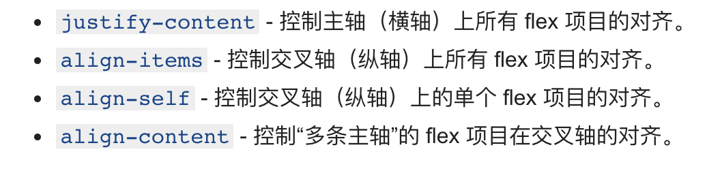
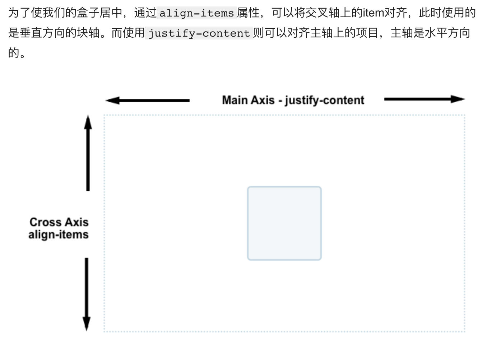
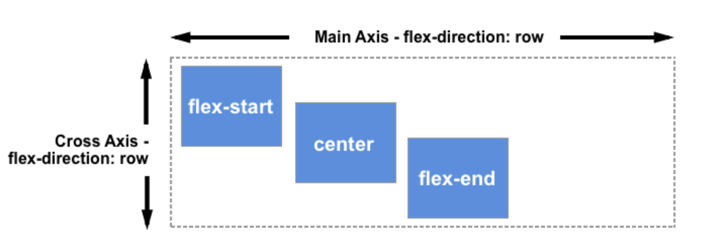
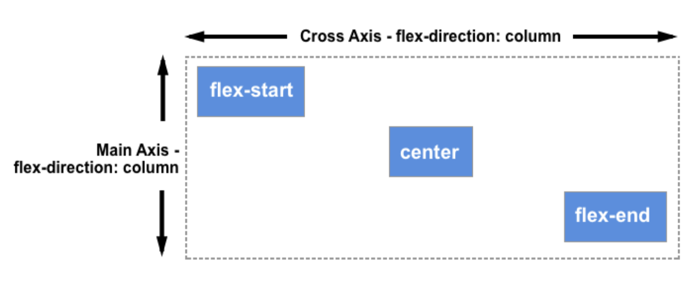

# Css样式

[CSS菜鸟学习链接](https://www.runoob.com/cssref/css-reference.html)

> **opacity**

```css
透明度 
value	规定不透明度。从 0.0 （完全透明）到 1.0（完全不透明）。
```

> **text-align**

value | 解释
---|---
left|	把文本排列到左边。默认值：由浏览器决定。
right|	把文本排列到右边。
center|	把文本排列到中间。
justify|	实现两端对齐文本效果。
inherit	|规定应该从父元素继承 text-align 属性的值。

> **overflow**

这个属性定义溢出元素内容区的内容会如何处理。如果值为 scroll，不论是否需要，用户代理都会提供一种滚动机制。因此，有可能即使元素框中可以放下所有内容也会出现滚动条。

值	|描述
---|---
visible|	默认值。内容不会被修剪，会呈现在元素框之外。
hidden	|内容会被修剪，并且其余内容是不可见的。
scroll	|内容会被修剪，但是浏览器会显示滚动条以便查看其余的内容。
auto	|如果内容被修剪，则浏览器会显示滚动条以便查看其余的内容。
inherit	|规定应该从父元素继承 overflow 属性的值。

> **border-collapse**

border-collapse 属性设置表格的边框是否被合并为一个单一的边框，还是象在标准的 HTML 中那样分开显示。

值 |	说明
---|---
collapse  |如果可能，边框会合并为一个单一的边框。会忽略 border-spacing 和 empty-cells 属性
separate|	默认值。边框会被分开。不会忽略 border-spacing 和 empty-cells 属性
inherit |	规定应该从父元素继承 border-collapse 属性的值

> **vertical-align**

vertical-align 属性设置一个元素的垂直对齐方式。

该属性定义行内元素的基线相对于该元素所在行的基线的垂直对齐。允许指定负长度值和百分比值。这会使元素降低而不是升高。在表单元格中，这个属性会设置单元格框中的单元格内容的对齐方式。

值	|描述
---|---
baseline|	默认。元素放置在父元素的基线上。
sub	|垂直对齐文本的下标。
super	|垂直对齐文本的上标
top|	把元素的顶端与行中最高元素的顶端对齐
text-top|	把元素的顶端与父元素字体的顶端对齐
middle|	把此元素放置在父元素的中部。
bottom	|使元素及其后代元素的底部与整行的底部对齐。
text-bottom|	把元素的底端与父元素字体的底端对齐。
length	|将元素升高或降低指定的高度，可以是负数。
%	|使用 "line-height" 属性的百分比值来排列此元素。允许使用负值。
inherit	|规定应该从父元素继承 vertical-align 属性的值。

> **border-color**

例子
```
border-color属性设置一个元素的四个边框颜色。此属性可以有一到四个值。

实例:

border-color:红，绿，蓝,粉红色;

上边框是红色
右边框是绿色
底部边框是蓝
左边框是粉红色

border-color：红，绿，蓝;

上边框是红色
左，右边框是绿色
底部边框是蓝

border-color：红，绿;

顶部和底部边框是红色
左右边框是绿色

border-color：红色;

所有四个边框是红色
```

值	|说明
---|---
color|	指定背景颜色。在CSS颜色值查找颜色值的完整列表
transparent|	指定边框的颜色应该是透明的。这是默认
inherit	|指定边框的颜色，应该从父元素继承


> **justify-content**

justify-content 用于设置或检索弹性盒子元素在主轴（横轴）方向上的对齐方式。

提示：使用 align-content 属性对齐交叉轴上的各项（垂直）。

值|	描述
---|---|
flex-start|	默认值。项目位于容器的开头。|
flex-end|	项目位于容器的结尾。|
center|	项目位于容器的中心。|
space-between	|项目位于各行之间留有空白的容器内。|	
space-around|	项目位于各行之前、之间、之后都留有空白的容器内。|
initial	|设置该属性为它的默认值。请参阅 initial。|	
inherit	|从父元素继承该属性。请参阅 inherit。


> **float**

值|	描述
---|---|
left | 元素向左浮动
right | 元素向右浮动
none | 默认值,元素不浮动,并会显示其在文本出现的位置
inherit | 规定应该从父元素中继承属性的值


**方便理解 ,上图**


==**敲黑板最重要的是结合demo理解以下两句话**==

float:left 应该理解为：在自己本身的位置上脱离文档流，元素从包含框的右边缘向左移动，直到碰到包含框的左边缘或者其他浮动元素框停下，当空间不足以绘制自己则另起一行。

float:right 应该理解为：在自己本身的位置上脱离文档流， 元素从包含框的左边缘向右移动，直到碰到包含框的右边缘或者其他浮动元素的框停下，当空间不足以绘制自己则另起一行。

> **position**

这个属性定义建立元素布局所用的定位机制。任何元素都可以定位，不过绝对或固定元素会生成一个块级框，而不论该元素本身是什么类型。相对定位元素会相对于它在正常流中的默认位置偏移。

值 |描述
---|---
absolute | 生成绝对定位的元素，相对于static定位以外的第一个父元素进行定位。元素的位置通过 "left", "top", "right" 以及 "bottom" 属性进行规定。
fixed	| 生成绝对定位的元素，相对于浏览器窗口进行定位。元素的位置通过 "left", "top", "right" 以及 "bottom" 属性进行规定。
relative	| 生成相对定位的元素，相对于其正常位置进行定位。因此，"left:20" 会向元素的 LEFT 位置添加 20 像素。
static	 | 默认值。没有定位，元素出现在正常的流中（忽略 top, bottom, left, right或者z-index声明）。inherit	规定应该从父元素继承 position 属性的值。


> **padding(内边距)**

Padding属性，可以有一到四个值。

- padding:25px 50px 75px 100px;

    上填充为25px 
    
    右填充为50px
    
    下填充为75px
    
    左填充为100px
    
- padding:25px 50px 75px;

    上填充为25px

    左右填充为50px
    
    下填充为75px
    
    
 - padding:25px 50px;

    上下填充为25px
    
    左右填充为50px
    
 - padding:25px;
 
    所有的填充都是25px

## 对齐弹性容器中的弹性项目





- ``justify-content`` - 控制主轴（横轴）上所有 ``flex`` 项目的对齐。
- ``align-items`` - 控制交叉轴（纵轴）上所有 ``flex`` 项目的对齐。
- ``align-self`` - 控制交叉轴（纵轴）上的单个 ``flex`` 项目的对齐。
- ``align-content`` - 控制“多条主轴”的 ``flex`` 项目在交叉轴的对齐。





> align-items

``align-itema: flex-start`` --- ``flex`` 项目的开始端的对齐

``align-items: flex-end `` --- ``flex``项目的结束端对齐

``align-items: center`` --- ``flex`` 项目居中对齐

``align-items: stretch`` --- ``flex`` 项目撑满 ``flex`` 容器

``align-items: baseline`` --- ``flex`` 项目的基线对齐


> ``align-self`` 用于对齐单个``flex`` 子项

``align-items`` 属性是给所有 ``flex``项目统一设置 ``align-self`` 的对齐属性。这意味着你能给单个 ``flex`` 项目明确地声明 ``align-self`` 属性。``align-self`` 拥有 ``align-items`` 的所有属性值，另外还有一个 ``auto`` 能重置自身的值为 ``align-items`` 定义的值。

> 改变主轴方向








> 轴对齐内容—— ``align-content``属性

```js
/*align-content不采用左右值 */
align-content: center;     /* 将项目放置在中点 */
align-content: start;      /* 最先放置项目 */
align-content: end;        /* 最后放置项目 */
align-content: flex-start; /* 从起始点开始放置flex元素 */
align-content: flex-end;   /* 从终止点开始放置flex元素 */

/* 默认对齐 */
align-content: normal;

/*基线对齐*/
align-content: baseline;
align-content: first baseline;
align-content: last baseline;

/* 分布式对齐 */
align-content: space-between; /* 均匀分布项目
                                 第一项与起始点齐平，
                                 最后一项与终止点齐平 */
align-content: space-around;  /* 均匀分布项目
                                 项目在两端有一半大小的空间*/
align-content: space-evenly;  /* 均匀分布项目
                                 项目周围有相等的空间 */
align-content: stretch;       /* 均匀分布项目
                                 拉伸‘自动’-大小的项目以充满容器 */

/* 溢出对齐 */
align-content: safe center;
align-content: unsafe center;

/* 全局属性 */
align-content: inherit; /* 继承 */
align-content: initial;  /* 初始值 */
align-content: unset; /* 未设置 */
```

> letter-spacing

这个用过不少次，主要是表示字体之间的间距大小


