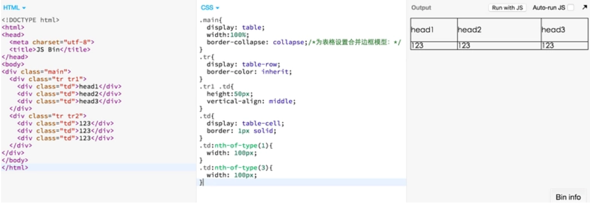

# Display属性

## **display所有属性**

```css
/* CSS 1 */
display: none;
display: inline;
display: block;
display: list-item;
/* CSS 2.1 */
display: inline-block;
display: table;
display: inline-table;
display: table-cell;
display: table-column;
display: table-column-group;
display: table-footer-group;
display: table-header-group;
display: table-row;
display: table-row-group;
display: table-caption;
/* CSS 2.1 */
/* CSS 3 */
display: inline-list-item;
display: flex;
display: box;
display: inline-flex;

display: grid;
display: inline-grid;
display: ruby;
display: ruby-base;
display: ruby-text;
display: ruby-base-container;
display: ruby-text-container;
/* CSS 3 */
/* Experimental values */
display: contents;
display: run-in;
/* Experimental values */
/* Global values */
display: inherit;
display: initial;
display: unset;

```
下面就display的重要属性进行讲解，并配合一些相关的例子


## 基本属性

### display: none

none 是 CSS 1 就提出来的属性，将元素设置为none的时候既不会占据空间，也无法显示，相当于该元素不存在。

该属性可以用来改善重排与重绘，同时我也经常用它来做模态窗等效果。

### display: inline

inline也是 CSS 1 提出的属性，它主要用来设置行内元素属性，设置了该属性之后设置高度、宽度都无效，同时text-align属性设置也
无效，但是设置了line-height会让inline元素居中

同时从上图可以看到两个inline标签之间出现了奇怪的间隔，改间隔的原因是div换行产生的换行空白，解决办法

- 将两个inline标签写到一行

```js
<body>
  <div class="test">123</div><div class="test">123</div>
</body>
```
- 或者使用一点技巧

```js
<!DOCTYPE html>
<html>
<head>
  <meta charset="utf-8">
  <title>JS Bin</title>
</head>
<body>
  <div class="main">
    <div class="test">zhan</div>
    <div class="test">123</div>
  </div>

</body>
</html>


html{
  -webkit-text-size-adjust:none;/* 使用webkit的私有属性，让字体大小不受设备终端的调整，可定义字体大小小于12px */
}
.main{
  font-size:0;
  *word-spacing:-1px;/* 使用word-spacing 修复 IE6、7 中始终存在的 1px 空隙，减少单词间的空白（即字间隔） */
}
.test{
  display:inline;
  width: 10000px;
  height:10000px;
  border:1px solid;
  font-size:12px;

  letter-spacing: normal;/* 设置字母、字间距为0 */ 
  word-spacing: normal; /* 设置单词、字段间距为0 */
}
```
实测chome49浏览器只用设置父元素的font-size为0即可。

``目前有很多原生的元素都是inline的，span、a、label、input、 img、 strong 和em就是典型的行内元素元素。
链接：http://www.css88.com/archives...``

### display: block

设置元素为块状元素，如果不指定宽高，默认会继承父元素的宽度，并且独占一行，即使宽度有剩余也会独占一行，高度一般以子元素撑开的高度为准，当然也可以自己设置宽度和高度。

> 在设计的过程中有时需要设计一个div宽高都是整个屏幕，整个时候宽度很好设置，可是高度一般很难设置，因为页面一般都是可以滚动的，所以高度一般可变，所以这个时候可以使用一个小技巧，如下。


```js
<!DOCTYPE html>
<html>
<head>
  <meta charset="utf-8">
  <title>JS Bin</title>
</head>
<body>
  <div class="main">
  </div>
</body>
</html>

html{
  height: 100%;
}
body{
  height: 100%;
  padding: 0;
  margin:0;
}
.main{
  background: red;
  width: 100%;
  height: 100%;
}
```
``基本原理：div继承的是父元素body的高度，body是继承html的高度，html是继承的浏览器屏幕的高度。``

### display: list-item

此属性默认会把元素作为列表显示，要完全模仿列表的话还需要加上 list-style-position，list-style-type


```js
<!DOCTYPE html>
<html>
<head>
  <meta charset="utf-8">
  <title>JS Bin</title>
</head>
<body>
<div>
  <span>111111</span>
  <span>222222</span>
  <span>333333</span>
</div>
</body>
</html>
```


```css
div{
  padding-left:30px;
}

span{ 
  display:list-item;
  list-style:disc outside none;
}
```
效果如下:


通过上面样式设置，就能仿出一个类似的列表，一定要在div上加padding，因为默认的列表之前的·在box外面

### display: inline-block

inline-block为 CSS 2.1 新增的属性。 **inline-block既具有block的宽高特性又具有inline的同行元素特性。** 通过inline-block结合text-align: justify 还可以实现固定宽高的列表两端对齐布局，如下例子：

```html
<!DOCTYPE html>
<html>
<head>
  <meta charset="utf-8">
  <title>JS Bin</title>
</head>
<body>
<div class="main">
  <div class="col col1">111111</div>
  <div class="col col2">222222</div>
  <div class="col col3">333333</div>
  <div class="col col1">111111</div>
  <div class="col col2">222222</div>
  <div class="col col3">333333</div>
  <div class="col fix">&nbsp;</div>
  <div class="col fix">&nbsp;</div>
  <div class="col fix">&nbsp;</div>
  <div class="col fix">&nbsp;</div>
  <div class="col fix">&nbsp;</div>
</div>
</body>
</html>
```


```css
body{
  margin:0;
  padding:0; 
}
.main{
//实现两端对齐文本效果。
  text-align:justify;
}
.col{ 
  display: inline-block;
  margin-top:10px;
  width:100px;
  height: 100px;
  text-align: center;
  line-height: 100px;
  color: #fff;
}
.col1{
  background: red;
}
.col2{
  background: green;
}
.col3{
  background: blue;
}
.fix{
  height:0; 
  padding:0; 
  overflow:hidden;
}
```
效果:
<<<<<<< HEAD


=======

>>>>>>> 50df5b390647c1c598c68eb9b26559437a66aa35

``text-align: justify 属性会使行内元素两端对齐，但是要求这些行内元素总宽度至少占满一行，所以在总宽度不足一行的时候这个属性没用，因此在最后需要加上一些占位符。``

==Tip: inline-block会形成一个BFC==


### display: table

table 此元素会作为块级表格来显示（类似table），表格前后带有换行符。CSS表格能够解决所有那些我们在使用绝对定位和浮动定位进行多列布局时所遇到的问题。例如，display:table的CSS声明能够让一个HTML元素和它的子节点像table元素一样。使用基于表格的CSS布局，使我们能够轻松定义一个单元格的边界、背景等样式， **而不会产生因为使用了table那样的制表标签所导致的语义化问题。**

利用table的特性，我们能够轻易的实现三栏布局，并且能够兼容IE8，如下是使用table属性，实现三栏布局的例子：


```html
<!DOCTYPE html>
<html>
<head>
  <meta charset="utf-8">
  <title>JS Bin</title>
</head>
<body>
<div class="main">
  <div class="tr tr1">
    <div class="td">head1</div>
    <div class="td">head2</div>
    <div class="td">head3</div>
  </div>
  <div class="tr tr2">
    <div class="td">123</div>
    <div class="td">123</div>
    <div class="td">123</div>
  </div>
</div>
</body>
</html>
```


```css
.main{
  display: table;
  width:100%;
  border-collapse: collapse;/*为表格设置合并边框模型：*/
}
.tr{
  display: table-row;
  border-color: inherit;
}
.tr1 .td{
  height:50px;
  vertical-align: middle;
}
.td{
  display: table-cell;
  border: 1px solid;
}
.td:nth-of-type(1){
  width: 100px;
}
.td:nth-of-type(3){
  width: 100px;
}
```
效果:





**CSS2.1表格模型中的元素，可能不会全部包含在除HTML之外的文档语言中。这时，那些“丢失”的元素会被模拟出来，从而使得表格模型能够正常工作。所有的表格元素将会自动在自身周围生成所需的匿名table对象，使其符合table/inline-table、table-row、table-cell的三层嵌套关系。**

所以在一般情况下我们也可以不写外面的table-row元素以及table元素。

### display: inline-list-item

我在MDN上面看到有这个属性，但是我实际尝试发现这个属性是不能使用的，在 http://caniuse.com/#search=in... 上面也没有找到这个元素的兼容性，所以应该是不能使用的，支持度全无。

### **display: flex(重要)**

flex是一种弹性布局属性
**注意，设为Flex布局以后，子元素的float、clear和vertical-align属性将失效。**
主要属性有两大类：容器属性和项目的属性

- #### 容器属性
值 |  解释
---|---
flex-direction | 属性决定主轴的方向（即项目的排列方向）。
flex-wrap| 默认情况下，项目都排在一条线（又称"轴线"）上。flex-wrap属性定义，如果一条轴线排不下，如何换行。
flex-flow|属性是flex-direction属性和flex-wrap属性的简写形式，默认值为row nowrap。
justify-content|属性定义了项目在主轴上的对齐方式。
align-items |属性定义项目在交叉轴上如何对齐。
align-content| 属性定义了多根轴线的对齐方式。如果项目只有一根轴线，该属性不起作用。

- #### 项目属性

 值 | 解释
--- | ---
order|定义项目的排列顺序。数值越小，排列越靠前，默认为0。
flex-grow  |定义项目的放大比例，默认为0，即如果存在剩余空间，也不放大。
flex-shrink | 属性定义了项目的缩小比例，默认为1，即如果空间不足，该项目将缩小。
flex-basis |属性定义了在分配多余空间之前，项目占据的主轴空间（main size）。浏览器根据这个属性，计算主轴是否有多余空间。它的默认值为auto，即项目的本来大小。
flex |属性是flex-grow, flex-shrink 和flex-basis的简写，默认值为0 1 auto。后两个属性可选。
align-self:| 属性允许单个项目有与其他项目不一样的对齐方式，可覆盖align-items属性。默认值为auto，表示继承父元素的align-items属性，如果没有父元素，则等同于stretch。

以上关于flex的基础知识基本是从阮一峰老师那copy过来的，有兴趣的同学，可以到阮一峰老师的博客深入阅读

http://www.ruanyifeng.com/blo...

http://www.ruanyifeng.com/blo...

- #### 实例：实现一个固定宽度但内容可变的列表
目前我有一个需求，有一个列表页，左侧固定，右侧固定，总宽度固定，但是左侧的内容可能会增加，右侧的内容也可能会增加，要求平时一行展示，增加的时候两行展示，左侧两行，右侧还是一行，并且都居中。

先上效果图，不然可能会迷糊：


为了实现上述效果，代码如下


```html
<!DOCTYPE html>
<html>
<head>
  <meta charset="utf-8">
  <title>JS Bin</title>
</head>
<body>
  <div class="main">
    <ul>
      <li>
        <span class="col1">累积的分为：123</span>
        <div class="col2">
          <span>123</span>
          <span>x 10</span>
          <button>submit</button>
        </div>
      </li>
      <li>
        <span class="col1">累积的分为：1234</span>
        <div class="col2">
          
          <span class="col2-span">x 10</span>
          <button>submit</button>
        </div>
      </li>
    </ul>
  </div>
</body>
</html>
```

```css
.main{
  height: 200px;
  width: 300px;
  border: 1px solid;
}
ul{
  padding: 0px;
  margin-top: 10px;
}
li{
  display: flex;
  justify-content: space-between;
  align-items: center;
  padding: 10px 0;
  margin-bottom: 10px;
  border: 1px solid;
}
button{
  height: 20px;
  vertical-align: middle;
  border:0;
  background: green;
  outline:none;
}
img{
  width:30px;
  vertical-align: middle;
}
.col2-span{
  vertical-align: middle;
}
.col1{
  width: 130px;
  padding-left:8px;
}
.col2{
  padding-right: 8px;
  vertical-align: middle;
}
```
### display: -webkit-box

由于某X5浏览器某些版本还不支持最新版的flex布局，所以为了保证良好的运行，建议还是使用display: box，box和flex布局的主要差别如下:

- #### 容器属性
值 | 解释
---|---:
display: box |该显示样式的新值可将此元素及其直系子代加入弹性框模型中。Flexbox 模型只适用于直系子代。
box-orient| 值：horizontal | vertical | inherit


框的子代是如何排列的？还有两个值：inline-axis（真正的默认值）和 block-axis，但是它们分别映射到水平和垂直方向。
值 | 解释
---|---
box-pack 值：start | end | center | justify

设置沿 box-orient 轴的框排列方式。因此，如果 box-orient 是水平方向，就会选择框的子代的水平排列方式，反之亦然。
值 | 解释
---|---
box-align | 值：start | end | center | baseline | stretch

基本上而言是 box-pack 的同级属性。设置框的子代在框中的排列方式。如果方向是水平的，该属性就会决定垂直排列，反之亦然。

- #### 项目属性
值 | 解释
---|---
box-flex| 值：0 | 任意整数

该子代的弹性比。弹性比为 1 的子代占据父代框的空间是弹性比为 2 的同级属性的两倍。其默认值为 0，也就是不具有弹性。

用box改造上述例子
基本只修改了容器元素li的属性，如下所示:

```css
li{
  display: -webkit-box;
  -webkit-box-orient:horizontal;
  -webkit-box-pack: justify;
  -webkit-box-align: center;
  padding: 10px 0;
  margin-bottom: 10px;
  border: 1px solid;
}
```
### display: inline-flex

我发现在chrome条件下设置了inline-flex，其子元素全部变成了inline模式，设置flex并没有什么用，不知道是不是我写的有问题，目前没找到这个属性的用法


```
<!DOCTYPE html>
<html>
<head>
  <meta charset="utf-8">
  <title>JS Bin</title>
</head>
<body>
  <div class="main">
    <div class="sp1">123</div>
    <div class="sp1">123</div>
  </div>
</body>
</html>
```


```
.main{
  display: -webkit-inline-flex;
  justify-content: center;
}
.sp1{
  flex:1;
}
```

### 其他
以下属性是实验性质的，支持度都很低，不建议使用，知道就行。
值 | 解释
---|---
run-in:| 此元素会根据上下文作为块级元素或内联元素显示；
grid | 栅格模型，类似block
inline-grid | 栅格模型，类似inline-block
ruby, ruby-base, ruby-text, ruby-base-container, ruby-text-container| 
contents |


