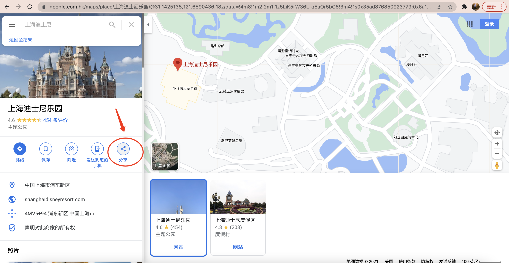
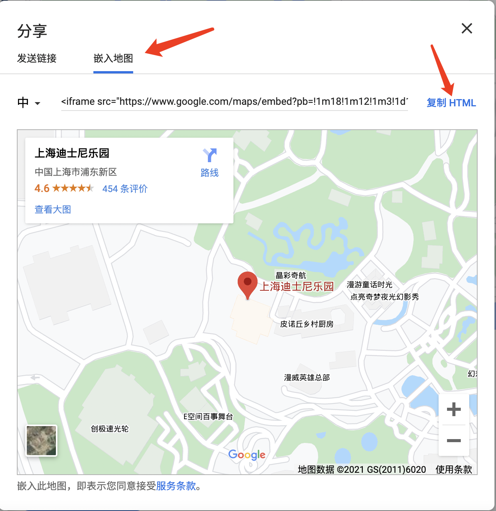

# ``html``页面插入百度谷歌地图,``react``中插入百度地图

## ``Google``地图

1. 在谷歌地图中 ``http://www.google.cn/maps/``

输入地址，搜索到指定地点之后，点击“共享”按钮




2. 然后使用嵌入地图



3. 将复制的``HTML``代码粘贴到相应位置，根据自己需求修改宽高

```html
<div class="contact-map">   
    <iframe class="contact-map-size" src="https://www.google.com/maps/embed?pb=!1m18!1m12!1m3!1d3392.8449822382095!2d119.92011513973418!3d31.747432000000007!2m3!1f0!2f0!3f0!3m2!1i1024!2i768!4f13.1!3m3!1m2!1s0x35b46cf8c886febb%3A0x54a85cdf7ef32ab9!2z5rGf6IuP55CG5bel5a2m6Zmi55S15rCU5L-h5oGv5bel56iL5a2m6Zmi!5e0!3m2!1szh-CN!2sus!4v1617931666774!5m2!1szh-CN!2sus"   allowfullscreen="" loading="lazy"></iframe>
</div>
```


