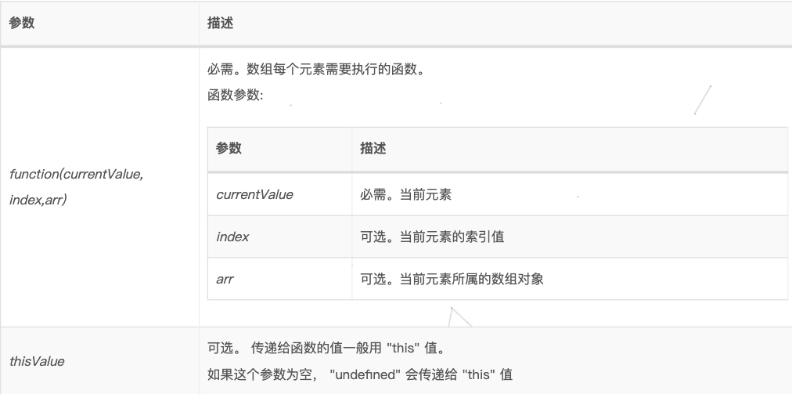

# ``js``中的``some、find、findindex、includes、filter``的使用

> 类似于``foreach``的方法
为什么把这类方法归到一起讲，因为我在使用的过程中发现其实这些方法的用法和参数其实都是一样的，底层应该都是和``foreach``差不多，差别只是在于返回的东西不一样，那么再来看看这些方法的差别以及用法。

- 语法
``array.方法名(function(currentValue, index, arr),thisValue)``
 
- 参数
  
    

以上是这些方法共同的基本的语法以及参数

那么再来看看这些方法的不同点

## ``forEach()``
``forEach()`` 方法用于调用数组的每个元素，并将元素传递给回调函数。

注意: ``forEach()`` 对于空数组是不会执行回调函数的。

> 也就是说 ``forEach()`` 这个方法是没有任何限制的，回调函数最终返回的值是完全由自己决定的，也就是说其实后面介绍到的所有的方法其实也都可以通过``forEach()``来实现相同的功能，只不过要自己写更多的代码量。
``forEach()``可以通过``return``来提前退出循环，同时返回相应的值

## ``map()``
``map()`` 方法返回一个新数组，数组中的元素为原始数组元素调用函数处理后的值。

``map()`` 方法按照原始数组元素顺序依次处理元素。

- 注意： ``map()`` 不会对空数组进行检测。

- 注意： ``map()`` 不会改变原始数组。

> ``map``和``foreach``很像，差别就在于``map``所得到的所有符合条件的结果都会通过一个数组来返回。在我们需要将结果放到一个数组中的时候直接使用``map``就会更加的方便。

> 在``map()``中``return``无论如何都会返回一个数组，可以通过``return``来对原数组进行操作返回一个新数组
```js
    var arr = [1, 2, 3, 4, 5, 6, 7, 8, 9];
    console.log(arr.map(item => {
    return true;     //[[true, true, true, true, true, true, true, true, true]]
}));

    console.log(arr.map(item => {
    return item*2;     //[2, 4, 6, 8, 10, 12, 14, 16, 18]
}));
```
## ``some()``
``some()`` 方法用于检测数组中的元素是否满足指定条件（函数提供）。

``some()`` 方法会依次执行数组的每个元素：

如果有一个元素满足条件，则表达式返回``true`` , 剩余的元素不会再执行检测。
如果没有满足条件的元素，则返回``false``。
注意： ``some()`` 不会对空数组进行检测。
注意： ``some()`` 不会改变原始数组。

也就是说``some``并不一定会遍历完数组中全部的元素，当遍历到由符合条件的元素时就会返回``true``并终止，否则返回``false``，所以也就可以通过利用此特性来对数组中特定一部分的元素进行操作。
```js
var arr = [1, 2, 3, 4, 5, 6, 7, 8, 9];
console.log(arr.some(item => {
            // 通过some可以对数组中符合要求的之前的元素进行操作
            console.log(item);
            return item > 5;  //可以通过return来设置返回值的条件
}));
```

示例：

```js
//读取缓存是否收藏
// || 意思为强转为 数组格式
let collect = wx.getStorageSync("collect")||[];
// 使用 some 遍历数组 判断 是否有id的值相等，只要有一个相等的 ， isCollect 都为true
let isCollect = collect.some(v=>v.id === this.data.courseDetails.id);
```
**还有一个相对的方法叫做 ``every()`` ,条件时数组中所有的元素都满足条件。**


## ``find()

``find()`` 方法返回通过测试（函数内判断）的数组的第一个元素的值。

``find()`` 方法为数组中的每个元素都调用一次函数执行：

- 当数组中的元素在测试条件时返回 ``true`` 时, ``find()`` 返回符合条件的元素，之后的值不会再调用执行函数。
- 如果没有符合条件的元素返回 ``undefined``
  
    注意: ``find()`` 对于空数组，函数是不会执行的。

注意: ``find()`` 并没有改变数组的原始值。
```js
var arr = [1, 2, 3, 4, 5, 6, 7, 8, 9];
console.log(arr.find(item => {
    // 通过find也可以对数组中符合要求的之前的元素进行操作
    console.log(item);
    return item>5;
}));
```

## ``findIndex()``
``findIndex()`` 方法返回传入一个测试条件（函数）符合条件的数组第一个元素位置。

``findIndex()`` 方法为数组中的每个元素都调用一次函数执行：

- 当数组中的元素在测试条件时返回 ``true`` 时, ``findIndex()`` 返回符合条件的元素的索引位置，之后的值不会再调用执行函数。
- 如果没有符合条件的元素返回`` -1``

    注意: ``findIndex()`` 对于空数组，函数是不会执行的。

注意: ``findIndex()`` 并没有改变数组的原始值。

> 与``find``方法类似，区别只在于这个方法返回的时元素在数组中的索引。
```js
var arr = [1, 2, 3, 4, 5, 6, 7, 8, 9];
console.log(arr.findIndex(item => {
    console.log(item);
    return item>5;          
}));
```

示例：

```js
// || 意思为强转为 数组格式
let collect = wx.getStorageSync("collect")||[];
// 使用findIndex遍历, 返回 数组中和 目标id 相等的 索引
let index = collect.findIndex(v=>v.id === this.data.courseDetails.id) ;
```

## ``filter()``
``filter()`` 方法创建一个新的数组，新数组中的元素是通过检查指定数组中符合条件的所有元素。

注意： ``filter()`` 不会对空数组进行检测。

注意： ``filter()`` 不会改变原始数组。

> 这个方法与``map``方法类似，``map``方法没有返回的条件，而这个方法可以直接通过``return``来设置过滤条件。
```js
var arr = [1, 2, 3, 4, 5, 6, 7, 8, 9];
console.log(arr.filter(item => {
    return item >2
}));
```

## ``includes()``
这个方法是``es6``中新增的一个方法，可以用来判断一个数组或者是字符串中是否包含某一元素，如果是返回 ``true``，否则``false``。

语法:
- ``arr.includes(searchElement)``
- ``arr.includes(searchElement, fromIndex)``

参数:
- ``searchElement`` 必须。需要查找的元素值。
- ``fromIndex`` 可选。从该索引处开始查找 ``searchElement``。如果为负值，则按升序从 ``array.length + fromIndex ``的索引开始搜索。默认为`` 0``。
```js
var arr = [1, 2, 3, 4, 5, 6, 7, 8, 9];
console.log(arr.includes(5)); //true
```


