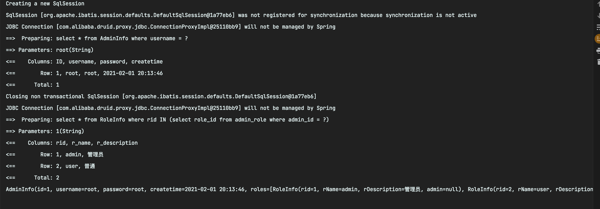

# MyBatis实现多表联查（配置文件实现以及注解实现）

# 复习``Mybatis``注解

- ``@Insert``：实现新增，代替了 ``<insert></insert>``
- ``@Delete``：实现删除，代替了 ``<delete></delete>``
- ``@Update``：实现更新，代替了 ``<update></update>``
- ``@Select``：实现查询，代替了 ``<select></select>``
- ``@Result``：实现结果集封装，代替了`` <result></result>``
- ``@Results``：可以与``@Result`` 一起使用，封装多个结果集，代替了 ``<resultMap></resultMap>``
- ``@One``：实现一对一结果集封装，代替了 ``<association></association>``
- ``@Many``：实现一对多结果集封装，代替了 ``<collection></collection>``

## 注解实现``CRUD``

```java
public interface UserMapper {
​
    /**
     * 查询用户
     */
    @Select("select * from user")
    List<User> findAll();
​
    /**
     * 添加用户
     */
    @Insert("insert into user(username,birthday,sex,address) values(#{username},#{birthday},#{sex},#{address})")
    void save(User user);
​
    /**
     * 更新用户
     */
    @Update("update user set username=#{username}, birthday=#{birthday}, sex=#{sex} where id = #{id}")
    void update(User user);
​
    /**
     * 删除用户
     */
    @Delete("delete from user where id = #{id}")
    void delete(Integer id);
}
```

## 使用注解实现复杂映射开发
在映射文件中通过配置 ``<resultMap>、<association>、<collection>`` 来实现复杂关系映射。

使用注解开发后，可以使用`` @Results、@Result，@One、@Many ``注解组合完成复杂关系的配置。

- ``@Results``：

    - 代替的是标签 ``<resultMap>`` 该注解中可以使用单个 ``@Result`` 注解，也可也使用 ``@Result`` 聚合。
    - 使用格式 - ``@Results`` ``({@Result ()`` , ``@Result() }) ``或 ``@Results`` ``(@Result () )``
- ``@Result：``

    - 代替了 ``<id>`` 标签和 ``<result>`` 标签
    - ``@Result`` 中属性介绍：``column`` - 数据库的列名，``property`` - 需要装配的属性名，``one`` - 需要使用的 ``@One`` 注解 ``@Result(one=@One) ()``，``many`` - 需要使用的 ``@Many`` 注解 ``@Result (many=@many) ()``
- ``@One （一对一）``：

    - 代替了 ``<association>`` 标签，是多表查询的关键，在注解中用来指定子查询返回单一对象。
    - ``@One`` 属性介绍：``select`` - 指定用来多表查询的 ``SQL Mapper``，使用格式 - ``@Result(column="", property="", one=@One(select=""))``
- ``@Many（一对多）``：

    - 代替了 ``<collection> ``标签，是多表查询的关键，在注解中用来指定子查询返回对象集合。
    - 使用格式 - ``@Result(property="", column="", many=@Many(select=""))``


> 数据库准备

创建数据库``mybatis2``，建立``student、class、student_class``三张表

```sql
DROP TABLE IF EXISTS `class`;
CREATE TABLE `class`  (
  `class_id` int(11) NOT NULL AUTO_INCREMENT,
  `class_name` varchar(255) CHARACTER SET utf8 COLLATE utf8_general_ci NULL DEFAULT NULL,
  PRIMARY KEY (`class_id`) USING BTREE
) ENGINE = InnoDB AUTO_INCREMENT = 4 CHARACTER SET = utf8 COLLATE = utf8_general_ci ROW_FORMAT = Compact;

-- ----------------------------
-- Records of class
-- ----------------------------
INSERT INTO `class` VALUES (1, '一班');
INSERT INTO `class` VALUES (2, '二班');
INSERT INTO `class` VALUES (3, '三班');

-- ----------------------------
-- Table structure for student
-- ----------------------------
DROP TABLE IF EXISTS `student`;
CREATE TABLE `student`  (
  `id` int(5) NOT NULL AUTO_INCREMENT,
  `name` varchar(255) CHARACTER SET utf8 COLLATE utf8_general_ci NULL DEFAULT NULL,
  `sex` varchar(255) CHARACTER SET utf8 COLLATE utf8_general_ci NULL DEFAULT NULL,
  PRIMARY KEY (`id`) USING BTREE
) ENGINE = InnoDB AUTO_INCREMENT = 6 CHARACTER SET = utf8 COLLATE = utf8_general_ci ROW_FORMAT = Compact;

-- ----------------------------
-- Records of student
-- ----------------------------
INSERT INTO `student` VALUES (1, '张三', '男');
INSERT INTO `student` VALUES (2, '李四', '女');
INSERT INTO `student` VALUES (3, '王五', '男');
INSERT INTO `student` VALUES (4, '王麻子', '女');
INSERT INTO `student` VALUES (5, ' 赵六', '男');

-- ----------------------------
-- Table structure for student_class
-- ----------------------------
DROP TABLE IF EXISTS `student_class`;
CREATE TABLE `student_class`  (
  `sid` int(11) NOT NULL,
  `cid` int(11) NOT NULL
) ENGINE = InnoDB CHARACTER SET = utf8 COLLATE = utf8_general_ci ROW_FORMAT = Compact;

-- ----------------------------
-- Records of student_class
-- ----------------------------
INSERT INTO `student_class` VALUES (1, 2);
INSERT INTO `student_class` VALUES (2, 2);
INSERT INTO `student_class` VALUES (4, 4);
INSERT INTO `student_class` VALUES (3, 3);
INSERT INTO `student_class` VALUES (5, 3);

SET FOREIGN_KEY_CHECKS = 1;
```

> 创建实体类

``Student`` 实体类

```java
public class Student {
    private int id;
    private String name;
    private String sex;

    //学生所在的班级
    private Class sClass;

    //getter/setter/toString【已省略】
}
```

``Class`` 实体类

```java
public class Class {
    private int class_id;
    private String class_name;

    private List<Student> students;

    //getter/setter/toString
 
}
```

``Student`` 和 ``Class`` 的中间表

```java
public class Student_Class {
    private int sid;
    private int cid;

    //getter/setter/toString

}
```

一个样例结果实体类

```java
public class StudentClass {
    private int id;
    private String name;
    private String sex;
    private int class_id;
    private String class_name;

    //getter/setter/toString

}
```

``StudentMapper`` 接口

```java
public interface StudentDao {
    //获取某学生的学号、姓名以及某学生所在的班级名  一对一关联查询  一个学生对应一个班级
    List<Student> findByName(String studentName);

    List<StudentClass> findByName2(String studentName);

    //获取指定班级下的所有学生 【班级编号、班级名、学生姓名、性别】 一对多关联查询 一个班级对应多个学生
    List<Class> findAllStudent(int cid);
}
```

> 创建主约束文件``SqlMapConfig.xml``

```xml
<?xml version="1.0" encoding="UTF-8"?>
<!DOCTYPE configuration
        PUBLIC "-//mybatis.org//DTD Config 3.0//EN"
        "http://mybatis.org/dtd/mybatis-3-config.dtd">
<!-- mybatis的主配置文件 -->
<configuration>
    <!-- 配置环境 -->
    <environments default="mysql">
        <!-- 配置mysql的环境-->
        <environment id="mysql">
            <!-- 配置事务的类型-->
            <transactionManager type="JDBC"></transactionManager>
            <!-- 配置数据源（连接池） -->
            <dataSource type="POOLED">
                <!-- 配置连接数据库的4个基本信息 -->
                <property name="driver" value="com.mysql.jdbc.Driver"/>
                <property name="url" value="jdbc:mysql://localhost:3306/mybatis2?useUnicode=true&characterEncoding=utf8"/>
                <property name="username" value="root"/>
                <property name="password" value="root"/>
            </dataSource>
        </environment>
    </environments>

    <!-- 配置映射文件的位置 -->
    <mappers>
        <package name="com.mapper"></package>
    </mappers>
</configuration>
```


## 一对一查询实现

### 使用``xml``配置文件的方式实现

```xml
<?xml version="1.0" encoding="UTF-8"?>
<!--mybaits头约束 -->
<!DOCTYPE mapper
        PUBLIC "-//mybatis.org//DTD Mapper 3.0//EN"
        "http://mybatis.org/dtd/mybatis-3-mapper.dtd">
<!--配置约束-->
<mapper namespace="com.dao.StudentDao">

    <!--1.获取学生编号、姓名、对应的班级名称-->
    <!-- 可以显示指出列名，如果用"*"代替，则mybatis会自动匹配resultMap中提供的列名 -->
    <select id="findByName" parameterType="String" resultMap="studentClassMap">
        select a.id,a.name,b.class_name from student a,class b,
        student_class c where a.id=c.sid and b.class_id = c.cid and a.name=#{name}
    </select>

    <!--resultMap中的type表示返回什么类型的对象-->
    <resultMap id="studentClassMap" type="com.domain.Student">
        <!--主键字段-->
        <!--property表示com.domain.Student的字段,coloum为表中的字段，进行配置映射-->
        <id property="id" column="id"/>
        <!--非主键字段-->
        <result property="name" column="name"/>
        <!--association字面意思关联，这里只专门做一对一关联； property表示是com.domain.Student的属性名称
        javaType表示该属性是什么类型对象-->
        <association property="sClass" javaType="com.domain.Class">
            <!-- property 表示com.domain.Class中的属性； column 表示表中的列名 -->
            <result property="class_name" column="class_name"/>
        </association>
    </resultMap>

</mapper>
```

第二种方式实现：

```xml
 <!--第二种方式，新建一个类，类似于视图-->
    <select id="findByName2" parameterType="String" resultType="com.domain.StudentClass">
         select * from student a,class b,
        student_class c where a.id=c.sid and b.class_id = c.cid and a.name=#{name}
    </select>
```
### 注解实现


```java
//获取某学生的学号、姓名以及某学生所在的班级名  一对一关联查询  一个学生对应一个班级
@Select("select s.id,s.name from student s where name = #{studentName}")
@Results({@Result(id = true,property = "id" ,column = "id"),
             // property 为实体类中字段名
             // column 为 数据库中表字段名
             // javaType 为结果封装的类型 
             // one = @one 表示一对一
              @Result(property = "name",column = "name"),
              @Result(property = "sClass",column = "id", javaType = Class.class,one = @One(select = "com.cy.springboot01.mapper.IStudent_classMapper.getClassBySid",fetchType = FetchType.LAZY))
})
List<Student> findByName(String studentName);
```
班级``Mapper``层：
```java
@Repository
public interface IClassMapper extends BaseMapper<Class>{
    @Select("select * from class where class_id IN (select cid from student_class where sid = #{sid})")
    @Results({
            @Result(id = true,property = "class_id",column = "class_id"),
            @Result(property = "class_name",column = "class_name")
    })
    Class getClassBySid(@Param("sid") Integer sid);
}
```

**注意点：** 一定要在``springBoot``的启动类上加上``mapperScan`` 注解，或者 在接口层添加 ``@Mapper ``注解将其注入容器。

测试:
```java
@Test
void contextLoads() {
    List<Student> students = studentMapper.findByName("李四");
    for (Student student : students) {
        System.out.println(student);
    }
}
```
结果：


## 一对多查询实现

```java
    //获取指定班级下的所有学生 【班级编号、班级名、学生姓名、性别】 一对多关联查询 一个班级对应多个学生
    List<Class> findAllStudentByCid(int cid);
```

### 使用``xml``配置实现

```xml
        <!--type 为该map 封装实体类的类型-->
<resultMap id="getClassStudent" type="com.domain.Class">
  <id property="class_id" column="class_id"/>
  <result property="class_name" column="class_name"/>
  <!-- property表示集合类型属性名称，ofType表示集合中的对象是什么类型 -->
  <collection property="students" ofType="com.domain.Student">
      <id property="id" column="id"/>
      <result property="name" column="name"/>
      <result property="sex" column="sex"/>
  </collection>
</resultMap>

<select id="findAllStudentByCid" parameterType="int" resultMap="getClassStudent">
      select * from class a left join student_class b on a.class_id=b.cid
      left join student c on b.sid = c.id where a.class_id = #{cid}
</select>
```

### 使用注解实现

```java

//Class 类
 @TableId("class_id")
    private int cid;
    @TableField(value = "class_name")
    private String cname;

    private List<Student> students;

 // student
 @TableId(value = "id",type = IdType.AUTO)
    private int id;
    private String name;
    private String sex;

    //学生所在的班级
    private Class sClass;

//=====================================================


//获取指定班级下的所有学生 【班级编号、班级名、学生姓名、性别】 一对多关联查询 一个班级对应多个学生
    @Select("select * from class where class_id = #{cid}")
    @Results({
            @Result(id = true,property = "cid",column = "class_id"),
            @Result(property = "cname" , column = "class_name"),
                            //这边的column 为 传递过去的值
            @Result(property = "students" , column = "class_id" ,
            //由于是一对多，所以会返回多个Student类 ， 所以这边一定要是List类型
            javaType = List.class,
                    many = @Many(select = "com.cy.springboot01.mapper.IStudentMapper.findAllStudent",fetchType = FetchType.LAZY)
            )
    })
    List<Class> findAllStudentByCid(@Param("cid") Integer cid);

    //===============================================
//获取指定班级下的所有学生 【班级编号、班级名、学生姓名、性别】 一对多关联查询 一个班级对应多个学生
    @Select("select * from student where id IN (select sid from student_class where cid = #{cid})")
    List<Student> findAllStudent(int cid);
```

测试：


结果：


## 多对多查询实现

多对多查询这边采用 用户和角色的例子进行展示

``xml``配置实现代码如下

```java
// UserInfo 表实体类
@TableId(value = "ID")
    private Integer id;

    private String username;

    private String password;

    private String createtime;

    //多对多，一个用户可能拥有多个角色
    @TableField(exist = false)//是否为数据库字段
    private List<RoleInfo> roles;

//===================================================

//RoleInfo 实体类

@TableId(value = "rid")
    private Integer rid;
    private String rName;
    private String rDescription;

    @TableField(exist = false)
    private List<UserInfo> user;

//===================================================

//根据 用户名查询对应的包含的角色信息

// 映射层

@Repository
public interface IUserInfoMapper extends BaseMapper<UserInfo> {
    UserInfo findAllByUsername(String username);
}

//==================================================
```
``xml``配置文件：

```xml
<mapper namespace="com.zys.mapper.IUserInfoMapper">
    <!--type 是指返回什么类型的对象-->
    <resultMap id="getAllByName" type="com.zys.pojo.po.UserInfoInfo">
        <!--主键字段-->
        <!--property表示com.domain.Student的字段,column为表中的字段，进行配置映射-->
        <id property="id" column="ID"/>
        <!-- 非主键字段 -->
        <result property="username" column="username"/>
        <result property="password" column="password"/>
        <!-- 多对多关联映射：collection , property表示集合类型属性名称，
        JavaType是用来指定pojo中属性的类型，而ofType指定的是 映射到list集合属性中pojo的类型 -->
        <collection property="roles" javaType="java.util.List" ofType="com.zys.pojo.po.RoleInfo"  fetchType="lazy">
            <id property="rid" column="rid"/>
            <result property="rName" column="r_name"/>
            <result property="rDescription" column="r_description"/>
        </collection>
    </resultMap>

    <select id="findAllByUsername" parameterType="string" resultMap="getAllByName" >
        SELECT a.ID,a.username,a.`password`, b.r_name,b.r_description,b.rid
        FROM AdminInfo a , RoleInfo b , admin_role c
        where a.ID = c.admin_id AND b.rid = c.role_id AND  a.username = #{username}
        ;
    </select>
</mapper>
```

注解实现 ：

```java
@Select("select * from UserInfo where username = #{username} ")
    @Results({
            @Result(id = true,property = "id" ,column = "ID"),
            @Result(property = "username",column = "username"),
            @Result(property = "password" ,column = "password"),
            @Result(property = "createtime",column = "createtime"),
            @Result(property = "roles" , column = "ID",javaType = List.class,
                    many = @Many(select = "com.zys.mapper.IRoleInfoMapper.findRoleInfosByAdminName",fetchType = FetchType.LAZY)
            )
    })
    UserInfo findAllByUsername(String username);


    //================================

    //findRoleInfosByAdminName

    @Select("select * from RoleInfo where rid IN (select role_id from admin_role where admin_id = #{username})")
    List<RoleInfo> findRoleInfosByAdminName(String username);
```
测试：


结果：





这就是``Mybatis``的常见的多表联查方式，由于之前已经学习过很多次，但是只要一段时间不用就会遗忘，所以这次很详细的记载了笔记，仅供参考！！


