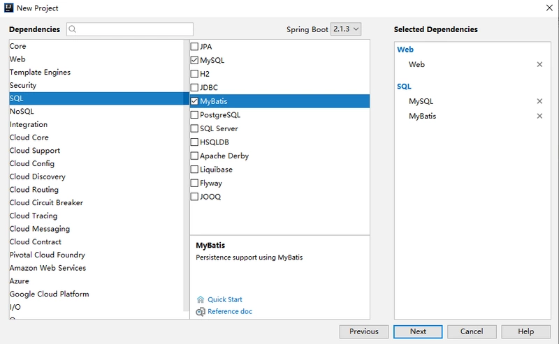
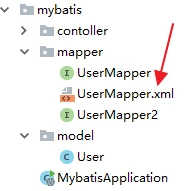
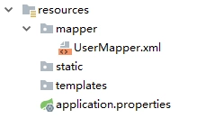

# SpringBoot整合MyBatis

## 工程创建

- 导入Web模块
- 导入Mysql以及Mybatis依赖



> 创建成功后，添加Druid依赖，并且锁定MySQL驱动版本，完整的依赖如下：

```xml
<dependency>
    <groupId>org.springframework.boot</groupId>
    <artifactId>spring-boot-starter-web</artifactId>
</dependency>
<dependency>
    <groupId>org.mybatis.spring.boot</groupId>
    <artifactId>mybatis-spring-boot-starter</artifactId>
    <version>2.0.0</version>
</dependency>
<dependency>
    <groupId>com.alibaba</groupId>
    <artifactId>druid-spring-boot-starter</artifactId>
    <version>1.2.4</version>
</dependency>
<dependency>
    <groupId>mysql</groupId>
    <artifactId>mysql-connector-java</artifactId>
    <scope>runtime</scope>
</dependency>
```
如此，工程就算是创建成功了。读者注意，``MyBatis``和``Druid``依赖的命名和其他库的命名不太一样，是属于``xxx-spring-boot-stater``模式的，这表示该``starter``是由第三方提供的。

## 基本用法
``MyBatis``的使用和``JdbcTemplate``基本一致，首先也是在``application.properties``中配置数据库的基本信息：
```properties
spring.datasource.url=jdbc:mysql:///test01?useUnicode=true&characterEncoding=utf-8
spring.datasource.username=root
spring.datasource.password=root
spring.datasource.type=com.alibaba.druid.pool.DruidDataSource
```

配置完成后，``MyBatis``就可以创建``Mapper``来使用了，例如我这里直接创建一个``UserMapper2``，如下：
```java
public interface UserMapper2 {
    @Select("select * from user")
    List<User> getAllUsers();

    @Results({
            @Result(property = "id", column = "id"),
            @Result(property = "username", column = "u"),
            @Result(property = "address", column = "a")
    })
    @Select("select username as u,address as a,id as id from user where id=#{id}")
    User getUserById(Long id);

    @Select("select * from user where username like concat('%',#{name},'%')")
    List<User> getUsersByName(String name);

    @Insert({"insert into user(username,address) values(#{username},#{address})"})
    @SelectKey(statement = "select last_insert_id()", keyProperty = "id", before = false, resultType = Integer.class)
    Integer addUser(User user);

    @Update("update user set username=#{username},address=#{address} where id=#{id}")
    Integer updateUserById(User user);

    @Delete("delete from user where id=#{id}")
    Integer deleteUserById(Integer id);
}
```
这里是通过全注解的方式来写``SQL``，不写XML文件，``@Select、@Insert、@Update``以及``@Delete``四个注解分别对应``XML``中的``select、insert、update``以及``delete``标签，``@Results``注解类似于``XML``中的``ResultMap``映射文件``getUserById``方法给查询结果的字段取别名主要是向小伙伴们演示下``@Results``注解的用法），另外使用``@SelectKey``注解可以实现主键回填的功能，即当数据插入成功后，插入成功的数据``id``会赋值到``use``对象的``id``属性上。

``UserMapper2``创建好之后，还要配置``mapper``扫描，有两种方式，一种是直接在``UserMapper2``上面添加``@Mapper``注解，这种方式有一个弊端就是所有的``Mapper``都要手动添加，要是落下一个就会报错，还有一个一劳永逸的办法就是直接在启动类上添加``Mapper``扫描，如下：
```java
@SpringBootApplication
@MapperScan(basePackages = "org.sang.mybatis.mapper")
public class MybatisApplication {
    public static void main(String[] args) {
        SpringApplication.run(MybatisApplication.class, args);
    }
}
```

好了，做完这些工作就可以去测试``Mapper``的使用了。

## ``mapper``映射

当然，开发者也可以在``XML``中写``SQL``，例如创建一个``UserMapper``，如下：
```java
public interface UserMapper {
    List<User> getAllUser();

    Integer addUser(User user);

    Integer updateUserById(User user);

    Integer deleteUserById(Integer id);
}
```
然后创建``UserMapper.xml``文件，如下：
```xml
<?xml version="1.0" encoding="UTF-8" ?>
<!DOCTYPE mapper
        PUBLIC "-//mybatis.org//DTD Mapper 3.0//EN"
        "http://mybatis.org/dtd/mybatis-3-mapper.dtd">
<mapper namespace="org.sang.mybatis.mapper.UserMapper">
    <select id="getAllUser" resultType="org.sang.mybatis.model.User">
        select * from t_user;
    </select>
    <insert id="addUser" parameterType="org.sang.mybatis.model.User">
        insert into user (username,address) values (#{username},#{address});
    </insert>
    <update id="updateUserById" parameterType="org.sang.mybatis.model.User">
        update user set username=#{username},address=#{address} where id=#{id}
    </update>
    <delete id="deleteUserById">
        delete from user where id=#{id}
    </delete>
</mapper>
```
将接口中方法对应的``SQL``直接写在``XML``文件中。

那么这个``UserMapper.xml``到底放在哪里呢？有两个位置可以放，第一个是直接放在``UserMapper``所在的包下面：




放在这里的``UserMapper.xml``会被自动扫描到，但是有另外一个``Maven``带来的问题，就是``java``目录下的``xml``资源在项目打包时会被忽略掉，所以，如果``UserMapper.xml``放在包下，需要在``pom.xml``文件中再添加如下配置，避免打包时``java``目录下的``XML``文件被自动忽略掉：

```xml
<build>
    <resources>
        <resource>
            <directory>src/main/java</directory>
            <includes>
                <include>**/*.xml</include>
            </includes>
        </resource>
        <resource>
            <directory>src/main/resources</directory>
        </resource>
    </resources>
</build>
```
当然，``UserMapper.xml``也可以直接放在``resources``目录下，这样就不用担心打包时被忽略了，但是放在``resources``目录下，又不能自动被扫描到，需要添加额外配置。例如我在``resources``目录下创建``mapper``目录用来放``mapper``文件，如下：





此时在``application.properties``中告诉``mybatis``去哪里扫描``mapper``：
```properties
mybatis.mapper-locations=classpath:mapper/*.xml
```
如此配置之后，``mapper``就可以正常使用了。注意第二种方式不需要在``pom.xml``文件中配置文件过滤。

## 原理分析

在``SSM``整合中，开发者需要自己提供两个``Bean``，一个``SqlSessionFactoryBean``，还有一个是``MapperScannerConfigurer``，在``Spring Boot``中，这两个东西虽然不用开发者自己提供了，但是并不意味着这两个``Bean``不需要了，在``org.mybatis.spring.boot.autoconfigure.MybatisAutoConfiguration``类中，我们可以看到``Spring Boot``提供了这两个``Bean``，部分源码如下：

```java
@org.springframework.context.annotation.Configuration
@ConditionalOnClass({ SqlSessionFactory.class, SqlSessionFactoryBean.class })
@ConditionalOnSingleCandidate(DataSource.class)
@EnableConfigurationProperties(MybatisProperties.class)
@AutoConfigureAfter(DataSourceAutoConfiguration.class)
public class MybatisAutoConfiguration implements InitializingBean {

  @Bean
  @ConditionalOnMissingBean
  public SqlSessionFactory sqlSessionFactory(DataSource dataSource) throws Exception {
    SqlSessionFactoryBean factory = new SqlSessionFactoryBean();
    factory.setDataSource(dataSource);
    return factory.getObject();
  }
  @Bean
  @ConditionalOnMissingBean
  public SqlSessionTemplate sqlSessionTemplate(SqlSessionFactory sqlSessionFactory) {
    ExecutorType executorType = this.properties.getExecutorType();
    if (executorType != null) {
      return new SqlSessionTemplate(sqlSessionFactory, executorType);
    } else {
      return new SqlSessionTemplate(sqlSessionFactory);
    }
  }
  @org.springframework.context.annotation.Configuration
  @Import({ AutoConfiguredMapperScannerRegistrar.class })
  @ConditionalOnMissingBean(MapperFactoryBean.class)
  public static class MapperScannerRegistrarNotFoundConfiguration implements InitializingBean {

    @Override
    public void afterPropertiesSet() {
      logger.debug("No {} found.", MapperFactoryBean.class.getName());
    }
  }
}
```
从类上的注解可以看出，当当前类路径下存在``SqlSessionFactory、 SqlSessionFactoryBean``以及``DataSource``时，这里的配置才会生效，``SqlSessionFactory``和``SqlTemplate``都被提供了。

## 关于调用存储过程（Mysql）

实例：
采用的是``xml``配置的方式

``Mapper``层：
```java
/**
 * @author cy
 * @create 2021-02-02-4:40 下午
 * @Description 操作UserInfo表的映射接口
 */
@Transactional
@Repository
public interface IUserInfoMapper extends BaseMapper<UserInfo> {

    /**
     * 添加微信用户，这里是调用了mysql的存储过程
     * @param userInfo
     * @return
     */
    Integer addUser(UserInfo userInfo);
}
```
``mapper.xml``配置：

调用存储过程：

- ``statementType``一定要申明为``CALLABLE``

- ``jdbcType`` 是指数据库中的类型（大写）
- ``mode`` 是指参数类型 ``IN``或者``OUT``类型 （大写）

```xml
<?xml version="1.0" encoding="UTF-8" ?>
<!DOCTYPE mapper
        PUBLIC "-//mybatis.org//DTD Mapper 3.0//EN"
        "http://mybatis.org/dtd/mybatis-3-mapper.dtd">
<mapper namespace="com.zys.mapper.IUserInfoMapper">
    <select id="addUser" parameterType="com.zys.pojo.UserInfo" statementType="CALLABLE" resultType="java.lang.Integer">
        call  addUser(#{openId,jdbcType=VARCHAR,mode=IN},
                      #{nickName,jdbcType=VARCHAR,mode=IN},
                      #{gender,jdbcType=VARCHAR,mode=IN},
                      #{country,jdbcType=VARCHAR,mode=IN},
                      #{province,jdbcType=VARCHAR,mode=IN},
                      #{city,jdbcType=VARCHAR,mode=IN},
                      #{imageUrlPath,jdbcType=VARCHAR,mode=IN},
                      #{resultCode,jdbcType=INTEGER,mode=OUT}
            )
    </select>
</mapper>
```
就okk啦😁


