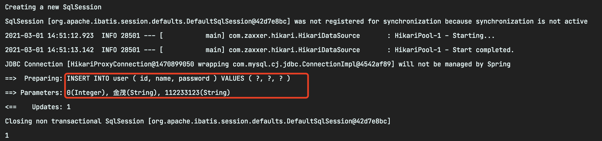
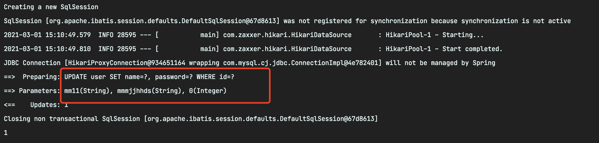
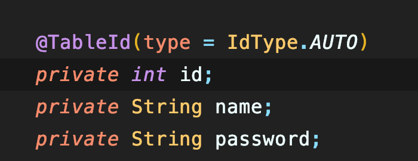
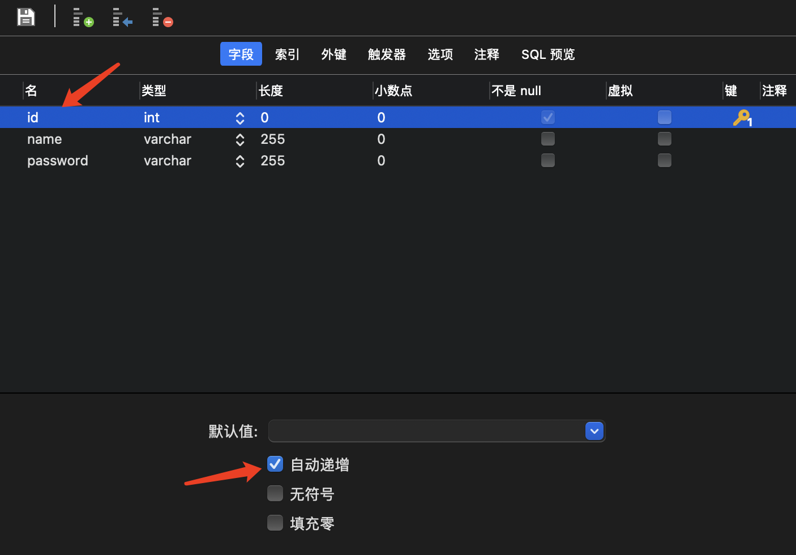
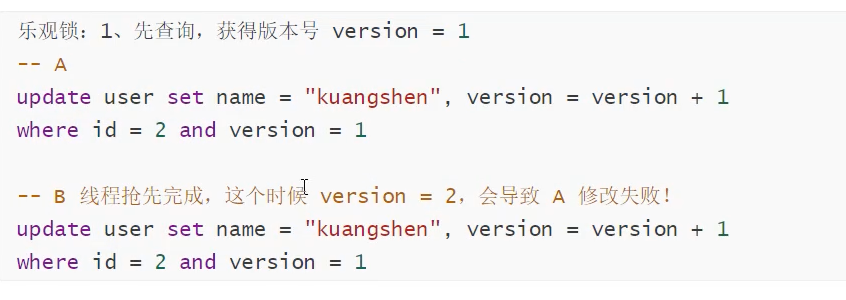
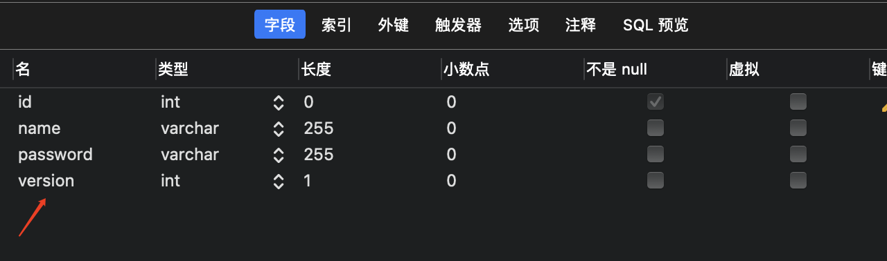
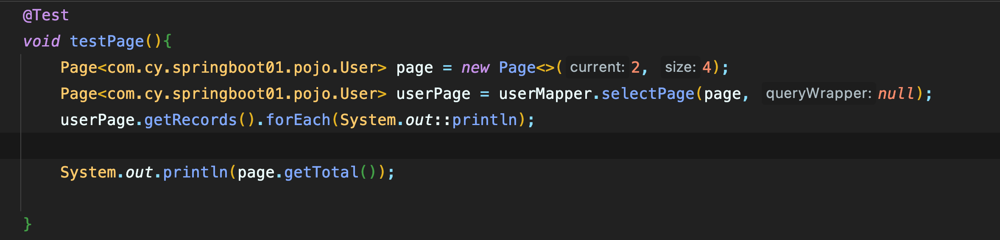

# MyBatisPlus 的使用

``MybatisPlus``是无侵入的，也就是说``Mybatis``的所有都是正常使用的，也都是一样的，``PLUS``拓展了其功能。

## 初始化SpringBoot工程

> 导入pom依赖

```xml
    <dependency>
        <groupId>org.springframework.boot</groupId>
        <artifactId>spring-boot-starter</artifactId>
    </dependency>
    <!-- 测试依赖 -->
    <dependency>
        <groupId>org.springframework.boot</groupId>
        <artifactId>spring-boot-starter-test</artifactId>
        <scope>test</scope>
    </dependency>
    <!-- https://mvnrepository.com/artifact/com.baomidou/mybatis-plus-boot-starter -->
    <dependency>
        <groupId>com.baomidou</groupId>
        <artifactId>mybatis-plus-boot-starter</artifactId>
        <version>3.4.2</version>
    </dependency>
    <!--mysql-->
    <dependency>
        <groupId>mysql</groupId>
        <artifactId>mysql-connector-java</artifactId>
    </dependency>
    <!--lombok-->
    <dependency>
        <groupId>org.projectlombok</groupId>
        <artifactId>lombok</artifactId>
    </dependency>
```

> 在配置文件中配置数据源之类

```yaml
# 设置开发模式
spring:
  profiles:
    active: dev
  # 配置mysql数据源
  datasource:
    username: root
    password: cyroot1231
    url: jdbc:mysql://localhost:3306/test?useSSL=false&useUnicode=true&characterEncoding=utf-8&serverTimezone=GMT%2B8
    driver-class-name: com.mysql.cj.jdbc.Driver
#### mybatis-plus 配置
mybatis-plus:
  global-config:
    db-config:
    # 主键生成策略
      id-type: id_worker
      column-underline: true
  configuration:
  # 配置日志（默认控制台输出）
    log-impl: org.apache.ibatis.logging.stdout.StdOutImpl
    #查询时为null字段不加入，比如QueryWrapper中的应用
    call-setters-on-nulls: true
    lazyLoadingEnabled: true
    aggressiveLazyLoading: false
    #配置mybatis的配置文件扫描路径
    map-underscore-to-camel-case: true
  #mapper-locations: classpath:mapper/*.xml
  # 配置包的别名
  type-aliases-package: com.cy.springboot01.pojo
```

## 相关准备

### 1.创建数据库

```sql
CREATE DATABASE `test`CHARACTER SET utf8 COLLATE utf8_general_ci; 
USE `test`; 

CREATE TABLE `user`(
  id INT(11)NOT NULL AUTO_INCREMENT,
  `name` VARCHAR(255)DEFAULT NULL,
  `password` VARCHAR(255)DEFAULT NULL,
  PRIMARY KEY(id)
)ENGINE=INNODB DEFAULT CHARSET=utf8;

INSERT INTO `user` VALUES(1,'张三',"123456789");
INSERT INTO `user` VALUES(2,'李四',"asdfghj");
INSERT INTO `user` VALUES(3,'王麻子',"kjfdskjf");
INSERT INTO `user` VALUES(4,'小明',"hellorworld");
INSERT INTO `user` VALUES(5,'李华',"redis");

--真实开发环境中,version(乐观锁),deleted(逻辑删除),gmt_create,gmt_modified
```

**传统的方式``pojo-dao``(连接``mybatis``,配置``mapper.xml``文件)-``service``-``controller``**


### 2. **但是使用了``mybatis-plus``**

- 实体类
    ```java
    @AllArgsConstructor
    @NoArgsConstructor
    @Data
    public class User {
        private int id;
        private String name;
        private String password;
    }
    ```
- ``mapper``接口
    ```java
    import com.baomidou.mybatisplus.core.mapper.BaseMapper;
    import com.codeyuaiiao.pojo.User;
    import org.springframework.stereotype.Repository;
    //在对应的mapper上面继承基本的类 BaseMapper
    @Repository//代表持久层
    public interface UserMapper extends BaseMapper<User> {
        //所有CRUD操作都已经编写完成了
        //你不需要向以前一样配置一大堆文件了!
    }
    ```
  注意点:需要在主启动类``MybatisPlusApplication``上扫描我们``Mapper``包下的所有接口
  ``@MapperScan("com.cy.mapper")``
- 测试类中测试
  ```java
  @SpringBootTest
  class MybatisPlusApplicationTests {
    //继承了BaseMapper, 所有的方法都来自己父类
    //我们也可以编写自己的扩展方法
    @Autowired
    private UserMapper userMapper;
    @Test
    void contextLoads() {
        //参数是一个Wrapper , 条件构造器,这里我们先不用 --null
        //查询全部用户
        List<User> users = userMapper.selectList(null);
        users.forEach(System.out::println);
    }
  }
  ```
## ``PLUS``中的``CRUD``操作

> 插入数据 ---- **``Insert``**

```java
@Test
void testInsert(){
    com.cy.springboot01.pojo.User user = new com.cy.springboot01.pojo.User();
    user.setName("金茂");
    user.setPassword("112233123");
    int result = userMapper.insert(user);
    System.out.println(result);
}
```



> 更新数据 ---- **``updateById``**




``sql``已经帮你写好了

> 查询操作 ---- **``Select``**

```java
//测试查询
@Test
public void testSelectById(){
    User user = userMapper.selectById(1L);
    System.out.println(user);
}

//测试批量查询
public void testSelectBatchId(){
    List<User> users = userMapper.selectBatchIds(Arrays.asList(1, 2, 3));
    users.forEach(System.out::println);
}

//按条件查询之--使用Map操作
@Test
public void testSelectBatchIds(){
    HashMap<String, Object> map = new HashMap<>();
    map.put("name","mm");
    map.put("password","112233123");

    List<User> users = userMapper.selectByMap(map);
    users.forEach(System.out::println);
}
```

> 删除操作 ---- ``Delete``

```java
// 测试删除
@Test
public void testdelete(){
    userMapper.deleteById(6L);
}

// 测试批量删除
@Test
public void testdeleteBatchId(){
    userMapper.deleteBatchIds(Arrays.asList(1287326823914405893L,1287326823914405894L));
}

//通过map删除
@Test
public void testDeleteByMap(){
    HashMap<String, Object> map = new HashMap<>();
    map.put("name","KUANG");
    userMapper.deleteByMap(map);
}
```

### **条件构造器**

```java
@SpringBootTest
public class WrapperTest {

    @Autowired
    private UserMapper userMapper;

    @Test
    void contextLoads() {
        // 查询name不为空的用户，并且邮箱不为空的用户，年龄大于等于12
        QueryWrapper<User> wrapper = new QueryWrapper<>();
        wrapper
                .isNotNull("name")
                .isNotNull("email")
                .ge("age",12);
        userMapper.selectList(wrapper).forEach(System.out::println); // 和我们刚才学习的map对比一下
    }

    @Test
    void test2(){
        // 查询名字狂神说
        QueryWrapper<User> wrapper = new QueryWrapper<>();
        wrapper.eq("name","狂神说");
        User user = userMapper.selectOne(wrapper); // 查询一个数据，出现多个结果使用List 或者 Map
        System.out.println(user);
    }

    @Test
    void test3(){
        // 查询年龄在 20 ~ 30 岁之间的用户
        QueryWrapper<User> wrapper = new QueryWrapper<>();
        wrapper.between("age",20,30); // 区间
        Integer count = userMapper.selectCount(wrapper);// 查询结果数
        System.out.println(count);
    }

    // 模糊查询
    @Test
    void test4(){
        // 查询年龄在 20 ~ 30 岁之间的用户
        QueryWrapper<User> wrapper = new QueryWrapper<>();
        // 左和右  t%
        wrapper
                .notLike("name","e")
                .likeRight("email","t");

        List<Map<String, Object>> maps = userMapper.selectMaps(wrapper);
        maps.forEach(System.out::println);
    }

    // 模糊查询
    @Test
    void test5(){

        QueryWrapper<User> wrapper = new QueryWrapper<>();
        // id 在子查询中查出来
        wrapper.inSql("id","select id from user where id<3");

        List<Object> objects = userMapper.selectObjs(wrapper);
        objects.forEach(System.out::println);
    }

    //测试六
    @Test
    void test6(){
        QueryWrapper<User> wrapper = new QueryWrapper<>();
        // 通过id进行排序
        wrapper.orderByAsc("id");

        List<User> users = userMapper.selectList(wrapper);
        users.forEach(System.out::println);
    }

}
```

## **主键生成策略**

> 默认 ``ID_WORKER`` 全局唯一``id``,对应数据库中的主键(``uuid``.自增``id``.雪花算法.``redis``.``zookeeper``)

分布式系统唯一``id``生成: https://www.cnblogs.com/haoxinyue/p/5208136.html

> (``snowflake``是``Twitter``开源的分布式``ID``生成算法，结果是一个``long``型的``ID``。其核心思想是：使用``41bit``作为毫秒数，``10bit``作为机器的``ID``（5个``bit``是数据中心，5个``bit``的机器``ID``），``12bit``作为毫秒内的流水号（意味着每个节点在每毫秒可以产生 ``4096`` 个 ``ID``），最后还有一个符号位，永远是``0``.可以保证几乎全球唯一)


### 主键自增

我们需要配置主键自增:

1. 实体类字段上``@TableId(type = IdType.AUTO)``

2. 数据库字段一定要是自增!







> 其余源码解释

```java
public enum IdType {
     
    AUTO(0),//数据库ID自增  
    NONE(1),//该类型为未设置主键类型      
    INPUT(2),//用户输入ID
      		 //该类型可以通过自己注册自动填充插件进行填充  
    
//以下3种类型、只有当插入对象ID 为空，才自动填充。     
    ID_WORKER(3),//全局唯一ID (idWorker)      
    UUID(4),//全局唯一ID (UUID)          
    ID_WORKER_STR(5);//字符串全局唯一ID (idWorker 的字符串表示)    
}
```

## **乐观锁**

乐观锁实现方式：

- 取出记录时，获取当前``version``
- 更新时，带上这个``version``
- 执行更新时， ``set version`` = ``newVersion where version ``= ``oldVersion``
- 如果``version``不对，就更新失败




> 测试一下``MyBatisPlus``的插件：

1. 数据库中增加一个``version``字段,默认值为1



2. 需要实体类加上对应的字段

```java
@Version // 乐观锁的version注解
private Integer version;
```
3. 注册组件

```java
// 扫描我们的 mapper文件夹
@MapperScan("com.cy.mapper")
@EnableTransactionManagement
@Configuration
public class MyBatisPlusConfig {

    // 注册乐观锁插件
    @Bean
    public OptimisticLockerInterceptor optimisticLockerInterceptor() {
        return new OptimisticLockerInterceptor();
    }
}
```
4. 测试一下

```java
    // 测试乐观锁成功
    @Test
    public void testVersionSuccess(){
        // 1. 查询用户信息
        User user = userMapper.selectById(1L);
        // 2. 修改用户信息
        user.setName("fan");
        // 3. 执行更新操作
        userMapper.updateById(user);
    }
<------------------------------------------------------>
    // 测试乐观锁失败!多线程下
    @Test
    public void testVersionFall(){
        // 线程1
        User user1 = userMapper.selectById(1L);
        user1.setName("fan111");

        // 线程2
        User user2 = userMapper.selectById(1L);
        user2.setName("fan222");
        userMapper.updateById(user2);
        
        //自旋锁来多次尝试提交！
        userMapper.updateById(user1); //如果没有乐观锁就会覆盖插队线程的值
    }
}
```
## **分页插件**

 > 1. 添加``springboot``配置类

 ```java
 //Spring boot方式
@Configuration
@MapperScan("com.baomidou.cloud.service.*.mapper*")
public class MybatisPlusConfig {

    // 旧版
    @Bean
    public PaginationInterceptor paginationInterceptor() {
        PaginationInterceptor paginationInterceptor = new PaginationInterceptor();
        // 设置请求的页面大于最大页后操作， true调回到首页，false 继续请求  默认false
        // paginationInterceptor.setOverflow(false);
        // 设置最大单页限制数量，默认 500 条，-1 不受限制
        // paginationInterceptor.setLimit(500);
        // 开启 count 的 join 优化,只针对部分 left join
        paginationInterceptor.setCountSqlParser(new JsqlParserCountOptimize(true));
        return paginationInterceptor;
    }
    
    // 最新版
    @Bean
    public MybatisPlusInterceptor mybatisPlusInterceptor() {
        MybatisPlusInterceptor interceptor = new MybatisPlusInterceptor();
        interceptor.addInnerInterceptor(new PaginationInnerInterceptor(DbType.H2));
        return interceptor;
    }
    
}
```

> 2. 直接使用``Page``对象即可

```java
// 测试分页查询
@Test
public void testPage(){
    // 参数一: 当前页
    // 参数二： 页面大小
    // 使用了分页插件之后，所有的分页操作变得简单了
    Page<User> page = new Page<>(1,5);
    userMapper.selectPage(page, null);

    page.getRecords().forEach(System.out::println);
    System.out.println(page.getTotal());
}
```



## **逻辑删除**

- 步骤1: 配置``com.baomidou.mybatisplus.core.config.GlobalConfig$DbConfig``

例: ``application.yml``
```yaml
mybatis-plus:
  global-config:
    db-config:
      logic-delete-field: flag  # 全局逻辑删除的实体字段名(since 3.3.0,配置后可以忽略不配置步骤2)
      logic-delete-value: 1 # 逻辑已删除值(默认为 1)
      logic-not-delete-value: 0 # 逻辑未删除值(默认为 0)
```

- 步骤2: 实体类字段上加上``@TableLogic``注解
```java
@TableLogic
private Integer deleted;
```


