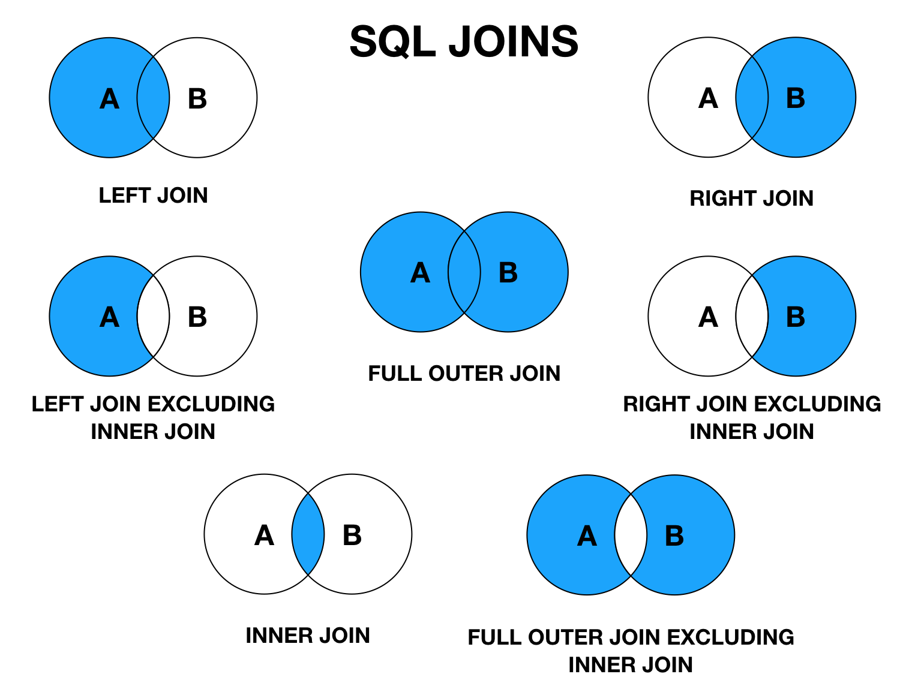
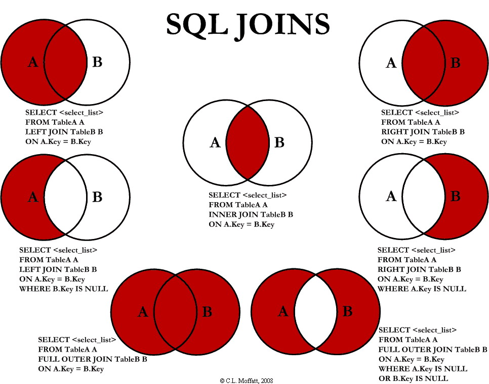

# DQL 语言

**DQL( Data Query Language 数据查询语言 )**

- 查询数据库数据 , 如SELECT语句

- 简单的单表查询或多表的复杂查询和嵌套查询

- 是数据库语言中最核心,最重要的语句

- 使用频率最高的语句

> **SELECT语法**

```sql
SELECT [ALL | DISTINCT]
{* | table.* | [table.field1[as alias1][,table.field2[as alias2]][,...]]}
FROM table_name [as table_alias]
    [left | right | inner join table_name2]  -- 联合查询
    [WHERE ...]  -- 指定结果需满足的条件
    [GROUP BY ...]  -- 指定结果按照哪几个字段来分组
    [HAVING]  -- 过滤分组的记录必须满足的次要条件
    [ORDER BY ...]  -- 指定查询记录按一个或多个条件排序
    [LIMIT {[offset,]row_count | row_countOFFSET offset}];
    --  指定查询的记录从哪条至哪条
```
**注意 : [ ] 括号代表可选的 , { }括号代表必选得**

## **指定查询字段**


```sql
-- 查询表中所有的数据列结果 , 采用 **" \* "** 符号; 但是效率低，不推荐 .
 
-- 查询所有学生信息
SELECT * FROM student;
 
-- 查询指定列(学号 , 姓名)
SELECT studentno,studentname FROM student;
```

> **AS 子句作为别名**

作用：

- 可给数据列取一个新别名

- 可给表取一个新别名

- 可把经计算或总结的结果用另一个新名称来代替


```sql
-- 这里是为列取别名(当然as关键词可以省略)
SELECT studentno AS 学号,studentname AS 姓名 FROM student;
 
-- 使用as也可以为表取别名
SELECT studentno AS 学号,studentname AS 姓名 FROM student AS s;
 
-- 使用as,为查询结果取一个新名字
-- CONCAT()函数拼接字符串
SELECT CONCAT('姓名:',studentname) AS 新姓名 FROM student;
```

> **DISTINCT关键字的使用**

作用 : 去掉SELECT查询返回的记录结果中重复的记录 ( 返回所有列的值都相同 ) , 只返回一条


```sql
-- # 查看哪些同学参加了考试(学号)  去除重复项
SELECT * FROM result; -- 查看考试成绩
SELECT studentno FROM result; --  查看哪些同学参加了考试
SELECT DISTINCT studentno FROM result; -- 了解:DISTINCT 去除重复项 , (默认是ALL)
```

> **使用表达式的列**

数据库中的表达式 : 一般由文本值 , 列值 , NULL , 函数和操作符等组成

应用场景 :

- SELECT语句返回结果列中使用

- SELECT语句中的ORDER BY , HAVING等子句中使用

- DML语句中的 where 条件语句中使用表达式

    ```sql
    -- selcet查询中可以使用表达式
    SELECT @@auto_increment_increment; -- 查询自增步长
    SELECT VERSION(); -- 查询版本号
    SELECT 100*3-1 AS 计算结果; -- 表达式
     
    -- 学员考试成绩集体提分一分查看
    SELECT studentno,StudentResult+1 AS '提分后' FROM result;
    ```
- 避免SQL返回结果中包含 ' . ' , ' * ' 和括号等干扰开发语言程序.

## where条件语句

作用：用于检索数据表中 符合条件 的记录

搜索条件可由一个或多个逻辑表达式组成 , 结果一般为真或假.

> **逻辑操作符**


测试:

```sql
-- 满足条件的查询(where)
SELECT Studentno,StudentResult FROM result;
 
-- 查询考试成绩在95-100之间的
SELECT Studentno,StudentResult
FROM result
WHERE StudentResult>=95 AND StudentResult<=100;
 
-- AND也可以写成 &&
SELECT Studentno,StudentResult
FROM result
WHERE StudentResult>=95 && StudentResult<=100;
 
-- 模糊查询(对应的词:精确查询)
SELECT Studentno,StudentResult
FROM result
WHERE StudentResult BETWEEN 95 AND 100;
 
-- 除了1000号同学,要其他同学的成绩
SELECT studentno,studentresult
FROM result
WHERE studentno!=1000;
 
-- 使用NOT
SELECT studentno,studentresult
FROM result
WHERE NOT studentno=1000;
```

> **模糊查询 ：比较操作符**


注意：
- 数值数据类型的记录之间才能进行算术运算 ;

- 相同数据类型的数据之间才能进行比较 ;

测试：

```sql
-- 模糊查询 between and \ like \ in \ null
 
-- =============================================
-- LIKE
-- =============================================
-- 查询姓刘的同学的学号及姓名
-- like结合使用的通配符 : % (代表0到任意个字符)  _ (一个字符)
SELECT studentno,studentname FROM student
WHERE studentname LIKE '刘%';
 
-- 查询姓刘的同学,后面只有一个字的
SELECT studentno,studentname FROM student
WHERE studentname LIKE '刘_';
 
-- 查询姓刘的同学,后面只有两个字的
SELECT studentno,studentname FROM student
WHERE studentname LIKE '刘__';
 
-- 查询姓名中含有 嘉 字的
SELECT studentno,studentname FROM student
WHERE studentname LIKE '%嘉%';
 
-- 查询姓名中含有特殊字符的需要使用转义符号 '\'
-- 自定义转义符关键字:  ESCAPE ':'
-- =============================================
-- IN
-- =============================================
-- 查询学号为1000,1001,1002的学生姓名
SELECT studentno,studentname FROM student
WHERE studentno IN (1000,1001,1002);
-- 查询地址在北京,南京,河南洛阳的学生
SELECT studentno,studentname,address FROM student
WHERE address IN ('北京','南京','河南洛阳');
-- =============================================
-- NULL 空
-- =============================================
-- 查询出生日期没有填写的同学
-- 不能直接写=NULL , 这是代表错误的 , 用 is null
SELECT studentname FROM student
WHERE BornDate IS NULL;
-- 查询出生日期填写的同学
SELECT studentname FROM student
WHERE BornDate IS NOT NULL;
-- 查询没有写家庭住址的同学(空字符串不等于null)
SELECT studentname FROM student
WHERE Address='' OR Address IS NULL;
```

## 连接查询

> **JOIN 对比**


七种Join：




顺带张贴一下 ``C.L. Moffatt`` 带 ``SQL`` 语句的图片，配合学习，风味更佳：




测试:

```sql
/*
连接查询
    如需要多张数据表的数据进行查询,则可通过连接运算符实现多个查询
内连接 inner join
    查询两个表中的结果集中的交集
外连接 outer join
    左外连接 left join
        (以左表作为基准,右边表来一一匹配,匹配不上的,返回左表的记录,右表以NULL填充)
    右外连接 right join
        (以右表作为基准,左边表来一一匹配,匹配不上的,返回右表的记录,左表以NULL填充)
        
等值连接和非等值连接
自连接
*/
 
-- 查询参加了考试的同学信息(学号,学生姓名,科目编号,分数)
SELECT * FROM student;
SELECT * FROM result;
 
/*思路:
(1):分析需求,确定查询的列来源于两个类,student  result,连接查询
(2):确定使用哪种连接查询?(内连接)
*/
SELECT s.studentno,studentname,subjectno,StudentResult
FROM student s
INNER JOIN result r
ON r.studentno = s.studentno
 
-- 右连接(也可实现)
SELECT s.studentno,studentname,subjectno,StudentResult
FROM student s
RIGHT JOIN result r
ON r.studentno = s.studentno
 
-- 等值连接
SELECT s.studentno,studentname,subjectno,StudentResult
FROM student s , result r
WHERE r.studentno = s.studentno
 
-- 左连接 (查询了所有同学,不考试的也会查出来)
SELECT s.studentno,studentname,subjectno,StudentResult
FROM student s
LEFT JOIN result r
ON r.studentno = s.studentno
 
-- 查一下缺考的同学(左连接应用场景)
SELECT s.studentno,studentname,subjectno,StudentResult
FROM student s
LEFT JOIN result r
ON r.studentno = s.studentno
WHERE StudentResult IS NULL
 
-- 思考题:查询参加了考试的同学信息(学号,学生姓名,科目名,分数)
SELECT s.studentno,studentname,subjectname,StudentResult
FROM student s
INNER JOIN result r
ON r.studentno = s.studentno
INNER JOIN `subject` sub
ON sub.subjectno = r.subjectno
```

> **自连接**


```sql
/*
自连接
    数据表与自身进行连接
需求:从一个包含栏目ID , 栏目名称和父栏目ID的表中
     查询父栏目名称和其他子栏目名称
*/
 
-- 创建一个表
CREATE TABLE `category` (
  `categoryid` INT(10) UNSIGNED NOT NULL AUTO_INCREMENT COMMENT '主题id',
  `pid` INT(10) NOT NULL COMMENT '父id',
  `categoryName` VARCHAR(50) NOT NULL COMMENT '主题名字',
  PRIMARY KEY (`categoryid`)
) ENGINE=INNODB AUTO_INCREMENT=9 DEFAULT CHARSET=utf8
 
-- 插入数据
INSERT INTO `category` (`categoryid`, `pid`, `categoryName`)
VALUES('2','1','信息技术'),
('3','1','软件开发'),
('4','3','数据库'),
('5','1','美术设计'),
('6','3','web开发'),
('7','5','ps技术'),
('8','2','办公信息');
 
-- 编写SQL语句,将栏目的父子关系呈现出来 (父栏目名称,子栏目名称)
-- 核心思想:把一张表看成两张一模一样的表,然后将这两张表连接查询(自连接)
SELECT a.categoryName AS '父栏目',b.categoryName AS '子栏目'
FROM category AS a,category AS b
WHERE a.`categoryid`=b.`pid`
 
-- 思考题:查询参加了考试的同学信息(学号,学生姓名,科目名,分数)
SELECT s.studentno,studentname,subjectname,StudentResult
FROM student s
INNER JOIN result r
ON r.studentno = s.studentno
INNER JOIN `subject` sub
ON sub.subjectno = r.subjectno
 
-- 查询学员及所属的年级(学号,学生姓名,年级名)
SELECT studentno AS 学号,studentname AS 学生姓名,gradename AS 年级名称
FROM student s
INNER JOIN grade g
ON s.`GradeId` = g.`GradeID`
 
-- 查询科目及所属的年级(科目名称,年级名称)
SELECT subjectname AS 科目名称,gradename AS 年级名称
FROM SUBJECT sub
INNER JOIN grade g
ON sub.gradeid = g.gradeid
 
-- 查询 数据库结构-1 的所有考试结果(学号 学生姓名 科目名称 成绩)
SELECT s.studentno,studentname,subjectname,StudentResult
FROM student s
INNER JOIN result r
ON r.studentno = s.studentno
INNER JOIN `subject` sub
ON r.subjectno = sub.subjectno
WHERE subjectname='数据库结构-1'
```

## 排序和分页


```sql
/*============== 排序 ================
语法 : ORDER BY
    ORDER BY 语句用于根据指定的列对结果集进行排序。
    ORDER BY 语句默认按照ASC升序对记录进行排序。
    如果您希望按照降序对记录进行排序，可以使用 DESC 关键字。
    
*/
 
-- 查询 数据库结构-1 的所有考试结果(学号 学生姓名 科目名称 成绩)
-- 按成绩降序排序
SELECT s.studentno,studentname,subjectname,StudentResult
FROM student s
INNER JOIN result r
ON r.studentno = s.studentno
INNER JOIN `subject` sub
ON r.subjectno = sub.subjectno
WHERE subjectname='数据库结构-1'
ORDER BY StudentResult DESC
 
/*============== 分页 ================
语法 : SELECT * FROM table LIMIT [offset,] rows | rows OFFSET offset
好处 : (用户体验,网络传输,查询压力)
推导:
    第一页 : limit 0,5
    第二页 : limit 5,5
    第三页 : limit 10,5
    ......
    第N页 : limit (pageNo-1)*pageSzie,pageSzie
    [pageNo:页码,pageSize:单页面显示条数]
    
*/
 
-- 每页显示5条数据
SELECT s.studentno,studentname,subjectname,StudentResult
FROM student s
INNER JOIN result r
ON r.studentno = s.studentno
INNER JOIN `subject` sub
ON r.subjectno = sub.subjectno
WHERE subjectname='数据库结构-1'
ORDER BY StudentResult DESC , studentno
LIMIT 0,5
 
-- 查询 JAVA第一学年 课程成绩前10名并且分数大于80的学生信息(学号,姓名,课程名,分数)
SELECT s.studentno,studentname,subjectname,StudentResult
FROM student s
INNER JOIN result r
ON r.studentno = s.studentno
INNER JOIN `subject` sub
ON r.subjectno = sub.subjectno
WHERE subjectname='JAVA第一学年'
ORDER BY StudentResult DESC
LIMIT 0,10
```

## 子查询

```sql
/*============== 子查询 ================
什么是子查询?
    在查询语句中的WHERE条件子句中,又嵌套了另一个查询语句
    嵌套查询可由多个子查询组成,求解的方式是由里及外;
    子查询返回的结果一般都是集合,故而建议使用IN关键字;
*/
 
-- 查询 数据库结构-1 的所有考试结果(学号,科目编号,成绩),并且成绩降序排列
-- 方法一:使用连接查询
SELECT studentno,r.subjectno,StudentResult
FROM result r
INNER JOIN `subject` sub
ON r.`SubjectNo`=sub.`SubjectNo`
WHERE subjectname = '数据库结构-1'
ORDER BY studentresult DESC;
 
-- 方法二:使用子查询(执行顺序:由里及外)
SELECT studentno,subjectno,StudentResult
FROM result
WHERE subjectno=(
    SELECT subjectno FROM `subject`
    WHERE subjectname = '数据库结构-1'
)
ORDER BY studentresult DESC;
 
-- 查询课程为 高等数学-2 且分数不小于80分的学生的学号和姓名
-- 方法一:使用连接查询
SELECT s.studentno,studentname
FROM student s
INNER JOIN result r
ON s.`StudentNo` = r.`StudentNo`
INNER JOIN `subject` sub
ON sub.`SubjectNo` = r.`SubjectNo`
WHERE subjectname = '高等数学-2' AND StudentResult>=80
 
-- 方法二:使用连接查询+子查询
-- 分数不小于80分的学生的学号和姓名
SELECT r.studentno,studentname FROM student s
INNER JOIN result r ON s.`StudentNo`=r.`StudentNo`
WHERE StudentResult>=80
 
-- 在上面SQL基础上,添加需求:课程为 高等数学-2
SELECT r.studentno,studentname FROM student s
INNER JOIN result r ON s.`StudentNo`=r.`StudentNo`
WHERE StudentResult>=80 AND subjectno=(
    SELECT subjectno FROM `subject`
    WHERE subjectname = '高等数学-2'
)
 
-- 方法三:使用子查询
-- 分步写简单sql语句,然后将其嵌套起来
SELECT studentno,studentname FROM student WHERE studentno IN(
    SELECT studentno FROM result WHERE StudentResult>=80 AND subjectno=(
        SELECT subjectno FROM `subject` WHERE subjectname = '高等数学-2'
    )
)
 
/*
练习题目:
    查 C语言-1 的前5名学生的成绩信息(学号,姓名,分数)
    使用子查询,查询郭靖同学所在的年级名称
*/

```


