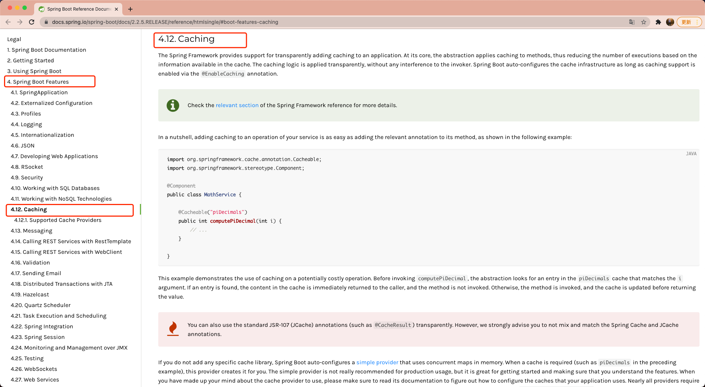
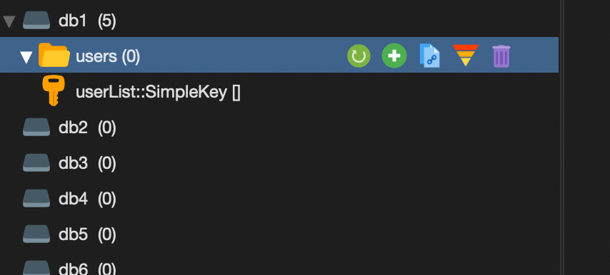
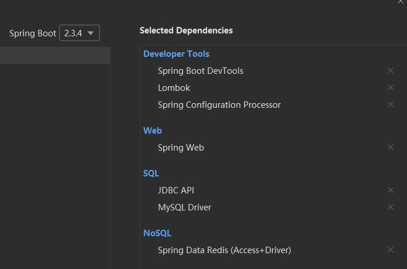
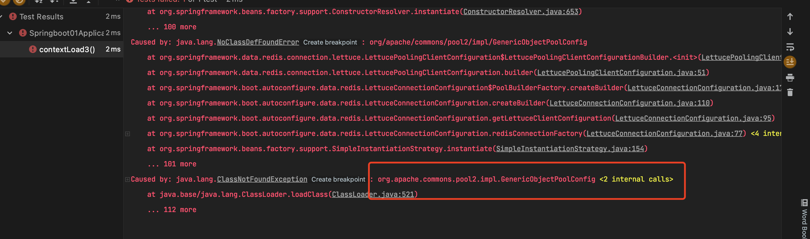
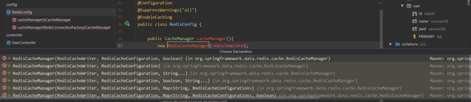
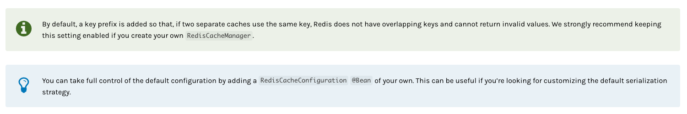
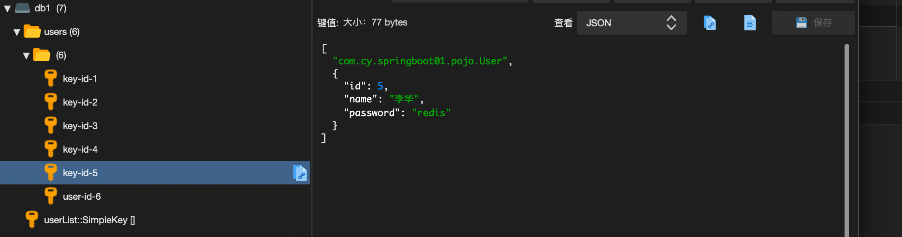

# springboot整合Redis

## 一、``SpringCache``介绍

官方文档： https://docs.spring.io/spring-boot/docs/2.2.5.RELEASE/reference/htmlsingle/#boot-features-caching




在``Spring Boot``中，数据的缓存管理存储依赖于``Spring``框架中``cache``相关的``org.springframework.cache.Cache``和``org.springframework.cache.CacheManagr``缓存管理器接口。

如果程序中没有定义类型为``CacheManager``的``Bean``组件或者是名为``cacheResolver的CacheResolver``缓存解析器，``Spring Boot``将尝试选择并启用以下缓存组件（按照指定的顺序）：

1. ``Generic``

2. ``JCache (JSR-107)(EhCache 3、Hazelcast、Infinispan等)``

3. ``EhCache 2.x``

4. ``Hazelcast``

5. ``Infinispan``

6. ``Couchbase``

7. ``Redis``

8. ``Caffeine``

9. ``Simple``

上面按照``Spring Boot``缓存组件的加载顺序，列举了支持的9种缓存组件，在项目中添加某个缓存管理组件（例如``Redis``）后，``Spring Boot``项目会选择并启用对应的缓存管理器。如果项目中同时添加了多个缓存组件，且没有指定缓存管理器或者缓存解析器（``CacheManager``或者``cacheResolver``），那么``Spring Boot``会按照上述顺序在添加的多个缓存中优先启用指定的缓存组件进行缓存管理。

``Spring Boot``默认缓存管理中，没有添加任何缓存管理组件能实现缓存管理。这是因为开启缓存管理后，``Spring Boot``会按照上述列表顺序查找有效的缓存组件进行缓存管理，如果没有任何缓存组件，会默认使用最后一个``Simple``缓存组件进行管理。``Simple``缓存组件是``Spring Boot``默认的缓存管理组件，它默认使用内存中的``ConcurrentMap``进行缓存存储，所以在没有添加任何第三方缓存组件的情况下，可以实现内存中的缓存管理，但是我们不推荐使用这种缓存管理方式

当在``Spring Boot``默认缓存管理的基础上引入``Redis``缓存组件，即在``pom.xml``文件中添加``Spring Data Redis``依赖启动器后，``SpringBoot``会使用``RedisCacheConfigratioin``当做生效的自动配置类进行缓存相关的自动装配，容器中使用的缓存管理器是``RedisCacheManager``, 这个缓存管理器创建的``Cache``为 ``RedisCache``, 进而操控``redis``进行数据的缓存

```xml
<dependency>
    <groupId>org.springframework.boot</groupId>
    <artifactId>spring-boot-starter-data-redis</artifactId>
</dependency>
```

**核心思想**:当我们调用一个方法时会把该方法的参数和返回结果最为一个键值对存放在缓存中，等下次利用同样的参数来调用该方法时将不会再执行，而是直接从缓存中获取结果进行返回。

**理解：``springboot`` 的缓存机制是通过切面编程 ``aop``来实现的**

## 二、``SpringCache`` 注解

``Spring Cache`` 提供了 ``@Cacheable 、@CachePut 、@CacheEvict 、@Caching``等注解，在方法上使用。

基于注解方式``SpringCache``引入``Redis``做缓存，需要先了解``@EnableCaching、@CacheConfig、@Cacheable、@CachePut、@CacheEvict、@Caching``相关注解的使用

### 1. ``@EnableCaching``

开启缓存功能，一般放在启动类上或者自定义的``RedisConfig``配置类上。

### 2. ``@CacheConfig``

当我们需要缓存的地方越来越多，可以使用``@CacheConfig(cacheNames = "cacheName")``注解在 ``class`` 之上来统一指定``value``的值，统一管理``keys``，这时可省略``value``，如果你在你的方法依旧写上了``value``，那么依然以方法的``value``值为准。

示例：

```java
@Service
@CacheConfig(cacheNames = {"users"})
public class UserServiceImpl implements IUserService {}
```



### 3. ``@Cacheable``

根据方法对其返回结果进行缓存，下次请求时，如果缓存存在，则直接读取缓存数据返回；如果缓存不存在，则执行方法，并把返回的结果存入缓存中。**一般用在查询方法上**。 查看源码，属性值如下：


| 属性/方法名	|  解释
----|---
value	| 缓存名，指定了缓存 存放在哪块命名空间（必须）
cacheNames |	与value差不多，二选一即可
key	 | 缓存的key，可以使用SPEL标签自定义缓存的key
keyGenerator |	 key的生存器。key/keyGenerator二选一使用
cacheManager |	指定缓存管理器
cacheResolver |	指定获取解析器
condition |	条件符合则缓存
unless |	条件符合则不缓存
sync |	是否使用异步模式，默认为false

### 4. ``@CachePut``

使用该注解标志的方法，每次都会执行，并将结果存入指定的缓存中。其他方法可以直接从响应的缓存中读取缓存数据，而不需要再去查询数据库。一般用在新增方法上。 查看源码，属性值同上``@Cacheable``差不多

### 5. ``@CacheEvict``

使用该注解标志的方法，会清空指定的缓存。**一般用在更新或者删除方法上**。

查看源码，属性值与``@Cacheable``差不多，独有的两个属性如下：

属性/方法名	 | 解释
----|---
allEntries |	是否清空所有缓存，默认为false。如果指定为true，则方法调用后将立即清空所有的缓存
beforeInvocation |	是否在方法执行前就清空所有缓存，默认为false。如果指定为true，则方法执行前就会清空所有的缓存

### 6. ``@Caching``

该注解可以实现同一个方法上同时使用多种注解。可从其源码看出：
```java
public @interface Caching {
    Cacheable[] cacheable() default {};
    CachePut[] put() default {};
    CacheEvict[] evict() default {};
}
```

## 三、注解方式实现``Redis``缓存

### 1、数据库及数据环境准备

```sql
CREATE DATABASE `redistest`CHARACTER SET utf8 COLLATE utf8_general_ci; 
USE `redistest`; 

CREATE TABLE `user`(
  id INT(11)NOT NULL AUTO_INCREMENT,
  `name` VARCHAR(255)DEFAULT NULL,
  `password` VARCHAR(255)DEFAULT NULL,
  PRIMARY KEY(id)
)ENGINE=INNODB DEFAULT CHARSET=utf8;

INSERT INTO `user` VALUES(1,'张三',"123456789");
INSERT INTO `user` VALUES(2,'李四',"asdfghj");
INSERT INTO `user` VALUES(3,'王麻子',"kjfdskjf");
INSERT INTO `user` VALUES(4,'小明',"hellorworld");
INSERT INTO `user` VALUES(5,'李华',"redis");
```

### 2、构建一个SpringBoot项目，勾选相应的模块，添加Pom依赖



添加其他的Pom依赖

```xml
<dependency>
    <groupId>com.baomidou</groupId>
    <artifactId>mybatis-plus-boot-starter</artifactId>
    <version>3.4.2</version>
</dependency>
```

### 3、application.properties配置文件
```properties
# ============数据库============
spring.datasource.driver-class-name=com.mysql.cj.jdbc.Driver
spring.datasource.url=jdbc:mysql://localhost:3306/redistest?useSSL=false&useUnicode=true&characterEncoding=utf-8&serverTimezone=GMT%2B8
spring.datasource.username=root
spring.datasource.password=admin

# ============mybatis-plus============
mybatis-plus.mapper-locations=classpath:/mapper/*.xml
mybatis-plus.type-aliases-package=com.cy.pojo
mybatis-plus.configuration.map-underscore-to-camel-case=true
mybatis-plus.configuration.log-impl=org.apache.ibatis.logging.stdout.StdOutImpl

# ============redis============
# 默认是使用0号数据库，这里我们使用1号，笔者现在0号有其他数据- -
spring.redis.database=1 
spring.redis.host=localhost
spring.redis.port=6379
# 默认密码为空
spring.redis.password=
# 连接池最大连接数
spring.redis.lettuce.pool.max-active=8
# 连接池最大阻塞等待时间
spring.redis.lettuce.pool.max-wait=-1ms
# 连接池中的最大空闲连接
spring.redis.lettuce.pool.max-idle=8
# 连接池中的最小空闲连接
spring.redis.lettuce.pool.min-idle=0
```

### 4、``pojo``实体类

```java
@AllArgsConstructor
@NoArgsConstructor
@Data
public class User {
    
    private int id;
    private String name;
    private String password;
}
```

### 5、``dao``层的``Mapper``

```java
@Repository
@Mapper
public interface UserMapper {

    /**
     * 增加
     * @param user
     * @return
     */
    public int addUser(User user);

    /**
     * 删除
     * @param id
     * @return
     */
    public int deleteUser(@Param("id") int id);

    /**
     * 修改
     * @param user
     * @return
     */
    public int updateUser(User user);

    /**
     * 查询获取所有User对象
     * @return
     */
    public List<User> selectUser();

    /**
     * 根据id查询获取某个User对象
     * @param id
     * @return
     */
    public User selectUserById(@Param("id") int id);
    
    /**
     * 查询一共有几条数据
     * @return
     */
    public int countUser();
}
```
### 6、``Mapper``接口对应的``Mapper.xml``文件

```xml
<?xml version="1.0" encoding="UTF-8" ?>
<!DOCTYPE mapper
        PUBLIC "-//mybatis.org//DTD Mapper 3.0//EN"
        "http://mybatis.org/dtd/mybatis-3-mapper.dtd">
<mapper namespace="com.cy.dao.UserMapper">

    <insert id="addUser" parameterType="user">
        insert into `user` (`name`,password) values (#{name},#{password})
    </insert>

    <delete id="deleteUser" parameterType="_int">
        delete from `user` where id =#{id}
    </delete>

    <update id="updateUser" parameterType="user">
        update `user` set `name`=#{name},password=#{password} where id=#{id}
    </update>

    <select id="selectUser" resultType="user">
        select * from `user`
    </select>

    <select id="selectUserById" parameterType="_int" resultType="user">
        select * from `user` where id =#{id}
    </select>
    
    <select id="countUser" resultType="_int">
        select count(*) from `user`
    </select>

</mapper>
```

7、``UserService``和``UserServiceImpl``

``UserService``:

```java
public interface IUserService {
    /**
     * 增加
     * @param user
     * @return
     */
    public int addUser(User user);

    /**
     * 删除
     * @param id
     * @return
     */
    public int deleteUser( int id);

    /**
     * 修改
     * @param user
     * @return
     */
    public int updateUser(User user);

    /**
     * 查询获取所有User对象
     * @return
     */
    public List<Map<String, Object>> selectUser();

    /**
     * 根据id查询获取某个User对象
     * @param id
     * @return
     */
    public User selectUserById( int id);

    /**
     * 查询一共有几条数据
     * @return
     */
    public int countUser();
}
```
``UserServiceImpl``:

```java
@Service
public class UserServiceImpl implements UserService {

    @Autowired
    UserMapper userMapper;

    @Override
    public int addUser(User user) {
        return userMapper.addUser(user);
    }

    @Override
    public int deleteUser(int id) {
        return userMapper.deleteUser(id);
    }

    @Override
    public int updateUser(User user) {
        return userMapper.updateUser(user);
    }

    @Override
    public List<User> selectUser() {
        return userMapper.selectUser();
    }

    @Override
    public User selectUserById(int id) {
        return userMapper.selectUserById(id);
    }
    
    @Override
    public int countUser() {
        return userMapper.countUser();
    }
}
```
### 8、单元测试简单的``CRUD``是否成功

```java
@SpringBootTest
class RedisTestSpringbootApplicationTests {

    @Autowired
    UserService userService;

    @Test
    void test() {
        List<User> users = userService.selectUser();
        for (User user : users) {
            System.out.println(user);
        }
    }
}
```
**发现报错**



解决：，添加``pom``依赖
```xml
 <!-- https://mvnrepository.com/artifact/org.apache.commons/commons-pool2 -->
<dependency>
    <groupId>org.apache.commons</groupId>
    <artifactId>commons-pool2</artifactId>
    <version>2.9.0</version>
</dependency>
```

### 9、构建``RedisConfig``配置类

通常我们都使用``Json``序列化后存入``Redis``，而``SpringBoot1.x``和``SpringBoot2.x``版本在自定义``CacheManager``有很大的区别，需要自行研读源码。

在此简单说明，但不做源码详细分析。

在``SpringBoot1.x``中，``RedisCacheManager``是可以使用``RedisTemplate``作为参数注入的

```java
@Bean
public CacheManager cacheManager(RedisTemplate redisTemplate) {
    RedisCacheManager cacheManager = new RedisCacheManager(redisTemplate);
    return cacheManager;
} 
```

但在``SpringBoot2.x``中，有很大的不同，``RedisCacheManager``构造器如下，已经无法再使用``RedisTemplate``进行构造




官方文档：



说明现在配置``RedisCacheManager``需要一个``RedisCacheConfiguration``来作为配置对象，通过``RedisCacheConfiguration``这个对象来指定对应的序列化策略

``SpringBoot2.x``后自定义``CacheManager``有多种方式，笔者此处直接给出自己所用的一种。其他的构建方法，可自行百度，有很多方法。

要导入``fastJson``依赖
```xml
<!-- https://mvnrepository.com/artifact/com.alibaba/fastjson -->
<dependency>
    <groupId>com.alibaba</groupId>
    <artifactId>fastjson</artifactId>
    <version>1.2.75</version>
</dependency>
```

```java
@Configuration
@SuppressWarnings("all")
@EnableCaching
public class RedisConfig {

    @Bean
    public CacheManager cacheManager(RedisConnectionFactory factory) {
        RedisSerializer<String> redisSerializer = new StringRedisSerializer(StandardCharsets.UTF_8);
        Jackson2JsonRedisSerializer jackson2JsonRedisSerializer = new Jackson2JsonRedisSerializer(Object.class);
        //解决查询缓存转换异常的问题
        ObjectMapper om = new ObjectMapper();
        om.setVisibility(PropertyAccessor.ALL, JsonAutoDetect.Visibility.ANY);
        om.enableDefaultTyping(ObjectMapper.DefaultTyping.NON_FINAL);
        jackson2JsonRedisSerializer.setObjectMapper(om);

        // 配置序列化（解决乱码的问题）
        RedisCacheConfiguration config = RedisCacheConfiguration.defaultCacheConfig()
                .entryTtl(Duration.ofDays(1))
                .serializeKeysWith(RedisSerializationContext.SerializationPair.fromSerializer(redisSerializer))
                .serializeValuesWith(RedisSerializationContext.SerializationPair.fromSerializer(jackson2JsonRedisSerializer))
                .disableCachingNullValues();

        RedisCacheManager cacheManager = RedisCacheManager.builder(factory)
                .cacheDefaults(config)
                .build();
        return cacheManager;
    }
}
```

``RedisConfig``的``json``序列化配置文章参考：

1. https://blog.csdn.net/weixin_...

2. https://blog.csdn.net/qq_4153...

### 10、在``UserServiceImpl``使用注解进行``Redis``缓存

**注意：需要先在``RedisConfig``加上``@EnableCaching``，表示开启缓存功能**

```java
@Service
@CacheConfig(cacheNames = "user")
public class UserServiceImpl implements UserService {

    @Autowired
    UserMapper userMapper;

    @Override
    @CachePut(key = "'user-id-'+ #user.id")
    public int addUser(User user) {
        System.out.println("写入缓存");
        return userMapper.addUser(user);
    }

    @Override
    @CacheEvict(key = "'user-id-'+#p0")//根据key清除缓存，一般该注解标注在修改和删除方法上
    public int deleteUser(int id) {
        return userMapper.deleteUser(id);
    }

    @Override
    @CacheEvict(key = "'user-id-'+#user.id")//根据key清除缓存，一般该注解标注在修改和删除方法上
    public int updateUser(User user) {
        System.out.println("更新数据并清除之前的缓存");
        return userMapper.updateUser(user);
    }

    @Override
    @Cacheable(cacheNames = "userList") // 标志读取缓存操作，如果缓存不存在，则调用目标方法，并将结果放入缓存
    public List<User> selectUser() {
        System.out.println("缓存不存在，执行方法");
        return userMapper.selectUser();
    }

    @Override
    @Cacheable(key = "'user-id-'+#p0")
    public User selectUserById(int id) {
        System.out.println("缓存不存在，执行方法");
        return userMapper.selectUserById(id);
    }
}
```
**其中``#p0``是指的第一个参数，``#p1``是第二个参数，以此类推。**

### 11、单元测试查看缓存

**启动``redis-server``和``RedisDesktopManager``**

运行单元测试，管理工具查看缓存

```java
@SpringBootTest
class RedisTestSpringbootApplicationTests {

    @Autowired
    UserService userService;

    @Test
    void select() {
        List<User> users = userService.selectUser();
        for (User user : users) {
            System.out.println(user);
        }
    }

    @Test
    void selectById() {
        User users = userService.selectUserById(3);
        System.out.println(users);
    }

    @Test
    void add() {
        userService.addUser(new User(6,"小红","56458848"));
    }

    @Test
    void update() {
        userService.updateUser(new User(6,"纸飞机","1111111"));
    }

    @Test
    void delete() {
        userService.deleteUser(6);
    }
}
```




## ``RedisUtils``工具类原生方式实现``Redis``缓存

使用``SpringCache``的注解方式实现``Redis``缓存，底层逻辑原理其实就是``Redis``的``set``、``get``命令操作``key-value``，将操作返回的结果存到``Redis``中，下次执行同样操作的时候，进行判断逻辑看``Redis``中是否有值，存在的话就直接从``Redis``中拿``value``，实现缓存效果。

因此，我们可直接利用``RedisUtils``的方式，进行逻辑的``set``、``get``实现缓存。这种方式很多时候序列化和``key``的设置都相对更灵活一些，但相对也较复杂一些。

1. 数据库及数据环境准备

2. 构建一个``SpringBoot``项目，勾选相应的模块，添加``Pom``依赖

3. ``application.properties``配置文件

4. ``pojo``实体类

5. ``dao层的Mapper``接口

6. ``Mapper``接口对应的``Mapper.xml``文件

7. UserService和UserServiceImpl

8. 单元测试简单的CRUD是否成功

以上步骤都同第三部分一样，不再赘述。

### 9、构建``RedisConfig``配置类

 ``RedisConfig``中自定义``redisTemplate的bean``

```java
@Configuration
@SuppressWarnings("all")
public class RedisConfig {


    @Bean(name="myredisTemplate")
    public RedisTemplate<String, Object> redisTemplate(RedisConnectionFactory factory) {
        RedisTemplate<String, Object> template = new RedisTemplate<>();
        template.setConnectionFactory(factory);
        //Json序列化设置
        Jackson2JsonRedisSerializer<Object> jackson2JsonRedisSerializer = new Jackson2JsonRedisSerializer(Object.class);
        //通过ObjectMapper转义json
        ObjectMapper objectMapper = new ObjectMapper();
        objectMapper.setVisibility(PropertyAccessor.ALL, JsonAutoDetect.Visibility.ANY);
        objectMapper.enableDefaultTyping(ObjectMapper.DefaultTyping.NON_FINAL);
        jackson2JsonRedisSerializer.setObjectMapper(objectMapper);
        //String类型的序列化
        StringRedisSerializer stringRedisSerializer = new StringRedisSerializer();
        //key采用String的序列化方式
        template.setKeySerializer(stringRedisSerializer);
        //hash的key也采用String的序列化方式
        template.setHashKeySerializer(stringRedisSerializer);
        //value的序列化方式采用jackson
        template.setValueSerializer(jackson2JsonRedisSerializer);
        //hash的value序列化方式采用jackson
        template.setHashValueSerializer(jackson2JsonRedisSerializer);
        template.afterPropertiesSet();
        return template;
    }
}
```
### 10、``RedisUtils``封装工具类准备

```java

@Component
public class RedisUtils {

    @Autowired
    @Qualifier("myredisTemplate")
    private RedisTemplate<String,Object> redisTemplate;

    // =============================common============================
    /**
     * 指定缓存失效时间
     * @param key 键
     * @param time 时间（秒）
     * @return
     */
    public boolean expire(String key,long time){
        try {
            if (time > 0){
                redisTemplate.expire(key,time, TimeUnit.SECONDS);
            }
            return true;
        } catch (Exception e){
            e.printStackTrace();
            return false;
        }
    }


    /**
     * 根据key获取过期时间
     * @param key 键  不能为null
     * @return 时间（秒） 返回0代表为永久有效
     */
    public long getExpire(String key){
        return redisTemplate.getExpire(key,TimeUnit.SECONDS);
    }


    /**
     * 判断key是否存在
     * @param key  键
     * @return  true的话存在，false不存在
     */
    public boolean hasKey(String key){
        try {
            return redisTemplate.hasKey(key);
        } catch (Exception e){
            e.printStackTrace();
            return false;
        }
    }


    /**
     * 删除缓存
     * @param key  可以传一个key或多个key
     */
    @SuppressWarnings("unchecked")
    public void del(String... key){
        if (key!=null && key.length>0){
            if (key.length==1){
                redisTemplate.delete(key[0]);
            } else {
                redisTemplate.delete(CollectionUtils.arrayToList(key));
            }
        }
    }


    // ============================String=============================


    /**
     * 普通缓存获取
     * @param key 键
     * @return 值
     */
    public Object get(String key) {
        return key == null ? null : redisTemplate.opsForValue().get(key);
    }


    /**
     * 普通缓存放入
     * @param key   键
     * @param value 值
     * @return true成功 false失败
     */
    public boolean set(String key, Object value) {
        try {
            redisTemplate.opsForValue().set(key, value);
            return true;
        } catch (Exception e) {
            e.printStackTrace();
            return false;
        }
    }


    /**
     * 普通缓存放入并设置时间
     * @param key   键
     * @param value 值
     * @param time  时间(秒) time要大于0 如果time小于等于0 将设置无限期
     * @return true成功 false 失败
     */
    public boolean set(String key, Object value, long time) {
        try {
            if (time > 0) {
                redisTemplate.opsForValue().set(key, value, time, TimeUnit.SECONDS);
            } else {
                set(key, value);
            }
            return true;
        } catch (Exception e) {
            e.printStackTrace();
            return false;
        }
    }


    /**
     * 递增
     * @param key   键
     * @param delta 要增加几(大于0)
     */
    public long incr(String key, long delta) {
        if (delta < 0) {
            throw new RuntimeException("递增因子必须大于0");
        }
        return redisTemplate.opsForValue().increment(key, delta);
    }


    /**
     * 递减
     * @param key   键
     * @param delta 要减少几(小于0)
     */
    public long decr(String key, long delta) {
        if (delta < 0) {
            throw new RuntimeException("递减因子必须大于0");
        }
        return redisTemplate.opsForValue().increment(key, -delta);
    }


    // ================================HashMap=================================


    /**
     * HashGet
     * @param key  键 不能为null
     * @param item 项 不能为null
     */
    public Object hget(String key, String item) {
        return redisTemplate.opsForHash().get(key, item);
    }


    /**
     * 获取hashKey对应的所有键值
     * @param key 键
     * @return 对应的多个键值
     */
    public Map<Object, Object> hmget(String key) {
        return redisTemplate.opsForHash().entries(key);
    }


    /**
     * HashSet
     * @param key 键
     * @param map 对应多个键值
     */
    public boolean hmset(String key, Map<String, Object> map) {
        try {
            redisTemplate.opsForHash().putAll(key, map);
            return true;
        } catch (Exception e) {
            e.printStackTrace();
            return false;
        }
    }


    /**
     * HashSet 并设置时间
     * @param key  键
     * @param map  对应多个键值
     * @param time 时间(秒)
     * @return true成功 false失败
     */
    public boolean hmset(String key, Map<String, Object> map, long time) {
        try {
            redisTemplate.opsForHash().putAll(key, map);
            if (time > 0) {
                expire(key, time);
            }
            return true;
        } catch (Exception e) {
            e.printStackTrace();
            return false;
        }
    }


    /**
     * 向一张hash表中放入数据,如果不存在将创建
     *
     * @param key   键
     * @param item  项
     * @param value 值
     * @return true 成功 false失败
     */
    public boolean hset(String key, String item, Object value) {
        try {
            redisTemplate.opsForHash().put(key, item, value);
            return true;
        } catch (Exception e) {
            e.printStackTrace();
            return false;
        }
    }


    /**
     * 向一张hash表中放入数据,如果不存在将创建
     *
     * @param key   键
     * @param item  项
     * @param value 值
     * @param time  时间(秒) 注意:如果已存在的hash表有时间,这里将会替换原有的时间
     * @return true 成功 false失败
     */
    public boolean hset(String key, String item, Object value, long time) {
        try {
            redisTemplate.opsForHash().put(key, item, value);
            if (time > 0) {
                expire(key, time);
            }
            return true;
        } catch (Exception e) {
            e.printStackTrace();
            return false;
        }
    }


    /**
     * 删除hash表中的值
     *
     * @param key  键 不能为null
     * @param item 项 可以使多个 不能为null
     */
    public void hdel(String key, Object... item) {
        redisTemplate.opsForHash().delete(key, item);
    }


    /**
     * 判断hash表中是否有该项的值
     *
     * @param key  键 不能为null
     * @param item 项 不能为null
     * @return true 存在 false不存在
     */
    public boolean hHasKey(String key, String item) {
        return redisTemplate.opsForHash().hasKey(key, item);
    }


    /**
     * hash递增 如果不存在,就会创建一个 并把新增后的值返回
     *
     * @param key  键
     * @param item 项
     * @param by   要增加几(大于0)
     */
    public double hincr(String key, String item, double by) {
        return redisTemplate.opsForHash().increment(key, item, by);
    }


    /**
     * hash递减
     *
     * @param key  键
     * @param item 项
     * @param by   要减少记(小于0)
     */
    public double hdecr(String key, String item, double by) {
        return redisTemplate.opsForHash().increment(key, item, -by);
    }


    // ============================set=============================


    /**
     * 根据key获取Set中的所有值
     * @param key 键
     */
    public Set<Object> sGet(String key) {
        try {
            return redisTemplate.opsForSet().members(key);
        } catch (Exception e) {
            e.printStackTrace();
            return null;
        }
    }


    /**
     * 根据value从一个set中查询,是否存在
     *
     * @param key   键
     * @param value 值
     * @return true 存在 false不存在
     */
    public boolean sHasKey(String key, Object value) {
        try {
            return redisTemplate.opsForSet().isMember(key, value);
        } catch (Exception e) {
            e.printStackTrace();
            return false;
        }
    }


    /**
     * 将数据放入set缓存
     *
     * @param key    键
     * @param values 值 可以是多个
     * @return 成功个数
     */
    public long sSet(String key, Object... values) {
        try {
            return redisTemplate.opsForSet().add(key, values);
        } catch (Exception e) {
            e.printStackTrace();
            return 0;
        }
    }


    /**
     * 将set数据放入缓存
     *
     * @param key    键
     * @param time   时间(秒)
     * @param values 值 可以是多个
     * @return 成功个数
     */
    public long sSetAndTime(String key, long time, Object... values) {
        try {
            Long count = redisTemplate.opsForSet().add(key, values);
            if (time > 0)
                expire(key, time);
            return count;
        } catch (Exception e) {
            e.printStackTrace();
            return 0;
        }
    }


    /**
     * 获取set缓存的长度
     *
     * @param key 键
     */
    public long sGetSetSize(String key) {
        try {
            return redisTemplate.opsForSet().size(key);
        } catch (Exception e) {
            e.printStackTrace();
            return 0;
        }
    }


    /**
     * 移除值为value的
     *
     * @param key    键
     * @param values 值 可以是多个
     * @return 移除的个数
     */


    public long setRemove(String key, Object... values) {
        try {
            Long count = redisTemplate.opsForSet().remove(key, values);
            return count;
        } catch (Exception e) {
            e.printStackTrace();
            return 0;
        }
    }

    // ===============================list=================================


    /**
     * 获取list缓存的内容
     *
     * @param key   键
     * @param start 开始
     * @param end   结束 0 到 -1代表所有值
     */
    public List<Object> lGet(String key, long start, long end) {
        try {
            return redisTemplate.opsForList().range(key, start, end);
        } catch (Exception e) {
            e.printStackTrace();
            return null;
        }
    }


    /**
     * 获取list缓存的长度
     *
     * @param key 键
     */
    public long lGetListSize(String key) {
        try {
            return redisTemplate.opsForList().size(key);
        } catch (Exception e) {
            e.printStackTrace();
            return 0;
        }
    }


    /**
     * 通过索引 获取list中的值
     *
     * @param key   键
     * @param index 索引 index>=0时， 0 表头，1 第二个元素，依次类推；index<0时，-1，表尾，-2倒数第二个元素，依次类推
     */
    public Object lGetIndex(String key, long index) {
        try {
            return redisTemplate.opsForList().index(key, index);
        } catch (Exception e) {
            e.printStackTrace();
            return null;
        }
    }


    /**
     * 将list放入缓存
     *
     * @param key   键
     * @param value 值
     */
    public boolean lSet(String key, Object value) {
        try {
            redisTemplate.opsForList().rightPush(key, value);
            return true;
        } catch (Exception e) {
            e.printStackTrace();
            return false;
        }
    }


    /**
     * 将list放入缓存
     * @param key   键
     * @param value 值
     * @param time  时间(秒)
     */
    public boolean lSet(String key, Object value, long time) {
        try {
            redisTemplate.opsForList().rightPush(key, value);
            if (time > 0)
                expire(key, time);
            return true;
        } catch (Exception e) {
            e.printStackTrace();
            return false;
        }
    }


    /**
     * 将list放入缓存
     *
     * @param key   键
     * @param value 值
     * @return
     */
    public boolean lSet(String key, List<Object> value) {
        try {
            redisTemplate.opsForList().rightPushAll(key, value);
            return true;
        } catch (Exception e) {
            e.printStackTrace();
            return false;
        }
    }

    /**
     * 将list放入缓存
     *
     * @param key   键
     * @param value 值
     * @param time  时间(秒)
     * @return
     */
    public boolean lSet(String key, List<Object> value, long time) {
        try {
            redisTemplate.opsForList().rightPushAll(key, value);
            if (time > 0)
                expire(key, time);
            return true;
        } catch (Exception e) {
            e.printStackTrace();
            return false;
        }
    }

    /**
     * 根据索引修改list中的某条数据
     *
     * @param key   键
     * @param index 索引
     * @param value 值
     * @return
     */

    public boolean lUpdateIndex(String key, long index, Object value) {
        try {
            redisTemplate.opsForList().set(key, index, value);
            return true;
        } catch (Exception e) {
            e.printStackTrace();
            return false;
        }
    }

    /**
     * 移除N个值为value
     *
     * @param key   键
     * @param count 移除多少个
     * @param value 值
     * @return 移除的个数
     */

    public long lRemove(String key, long count, Object value) {
        try {
            Long remove = redisTemplate.opsForList().remove(key, count, value);
            return remove;
        } catch (Exception e) {
            e.printStackTrace();
            return 0;
        }
    }
}
```

### 11、在``UserServiceImpl``中进行``redis``缓存逻辑编写

```java
@Service
public class UserServiceImpl implements UserService {

    @Autowired
    UserMapper userMapper;
    @Autowired
    RedisUtils redisUtils;

    public static final String CACHE_KEY_USER="user:";

    @Override
    public int addUser(User user) {
        //先直接修改数据库中的数据，方法执行后再更新缓存
        int i = userMapper.addUser(user);
        redisUtils.set(CACHE_KEY_USER+user.getId(),user);
        return i;
    }

    @Override
    public int deleteUser(int id) {
        //方法执行后删除redis中相应的缓存
        int i = userMapper.deleteUser(id);
        redisUtils.del(CACHE_KEY_USER+id);
        return i;
    }

    @Override
    public int updateUser(User user) {
        //先直接修改数据库中的数据
        int i = userMapper.updateUser(user);
        //方法执行后更新redis中相应的缓存
        int id = user.getId();
        redisUtils.set(CACHE_KEY_USER+user.getId(),user);
        return i;
    }

    @Override
    public List<User> selectUser() {
        int i = countUser();
        Object object = redisUtils.get(CACHE_KEY_USER + "number:"+i);
        //判断redis中是否存在缓存的key-value
        if (null != object){
            //有，直接返回
            return (List<User>) object;
        }
        //没有，去数据库中查询，并将查询的结果存到redis中
        List<User> users = userMapper.selectUser();
        redisUtils.set(CACHE_KEY_USER + "number:"+i,users);
        return users;
    }

    @Override
    public User selectUserById(int id) {
        Object object = redisUtils.get(CACHE_KEY_USER + id);
        //判断redis中是否存在缓存的key-value
        if (null != object){
            //有，直接返回
            return (User) object;
        }
        //没有，去数据库中查询，并将查询的结果存到redis中
        User user = userMapper.selectUserById(id);
        redisUtils.set(CACHE_KEY_USER + id,user);
        return user;
    }

    @Override
    public int countUser() {
        return userMapper.countUser();
    }
}
```
### 12、单元测试查看缓存

```java
@SpringBootTest
class RedisTest01SpringbootApplicationTests {

    @Autowired
    UserService userService;

    @Test
    void selectById() {
        User user = userService.selectUserById(3);
        System.out.println(user);
    }

    @Test
    void select() {
        List<User> users = userService.selectUser();
        for (User user : users) {
            System.out.println(user);
        }
    }

    @Test
    void add() {
        userService.addUser(new User(6,"纸飞机","1998dsadsasd"));
    }

    @Test
    void delete() {
        userService.deleteUser(6);
    }

    @Test
    void update() {
        userService.updateUser(new User(6,"纸飞机666","helloredis"));
    }
}
```
以上只是特别简单的``redis``操作，其余的设置``key``的过期时间等，直接使用``redisUtils``进行设置即可。

## 五、总结

``redis``缓存本质仍旧是操作``redis``其中的五大数据类型，需要熟练掌握，并且能知晓用在何处，怎么用。


