# 设计模式模块

> 设计模式的目的

编写软件过程中，程序员面临着来自 耦合性，内聚性以及可维护性，可扩展性，重用性，灵活性 等多方面的挑战，设计模式是为了让程序(软件)，具有更好

1. 代码重用性 (即：相同功能的代码，不用多次编写)
2. 可读性 (即：编程规范性,  便于其他程序员的阅读和理解)
3. 可扩展性 (即：当需要增加新的功能时，非常的方便，称为可维护)
4. 可靠性 (即：当我们增加新的功能后，对原来的功能没有影响)
5. 使程序呈现高内聚，低耦合的特性分享金句：
6. 设计模式包含了面向对象的精髓，“懂了设计模式，你就懂了面向对象分析和设计``（OOA/D）``的精要”
7. ``Scott Mayers`` 在其巨著``《Effective C++》``就曾经说过：``C++``老手和 ``C++``新手的区别就是前者手背上有很多伤疤


## <text style="color:red">1. 七大原则</text>

- 1. 单一职责原则
- 2. 接口隔离原则
- 3. 依赖倒转(倒置)原则
- 4. 里氏替换原则
- 5. 开闭原则
- 6. 迪米特法则
- 7. 合成复用原则

> 单一职责原则

    对类来说的，即一个类应该只负责一项职责。如类 ``A`` 负责两个不同职责：职责 ``1``，职责 ``2``。当职责 ``1`` 需求变更而改变 ``A`` 时，可能造成职责 ``2`` 执行错误，所以需要将类 ``A`` 的粒度分解为 ``A1，A2``

> 接口隔离原则

    1. 客户端不应该依赖它不需要的接口，即一个类对另一个类的依赖应该建立在最小的接口上
2. 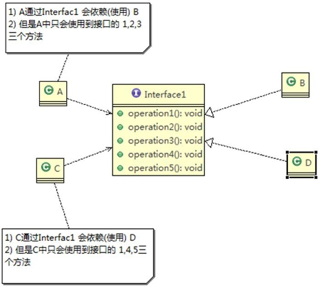

    3. 类 ``A`` 通过接口 ``Interface1`` 依赖类 ``B``，类 ``C`` 通过接口 ``Interface1`` 依赖类 ``D``，如果接口 ``Interface1`` 对于类 ``A`` 和类 ``C``
    来说不是最小接口，那么类 ``B`` 和类 ``D`` 必须去实现他们不需要的方法。
	4. 按隔离原则应当这样处理：
    将接口 ``Interface1`` 拆分为独立的几个接口(这里我们拆分成 ``3`` 个接口)，类 ``A`` 和类 ``C`` 分别与他们需要的接口建立依赖关系。也就是采用接口隔离原则


> 	依赖倒转原则

依赖倒转原则(``Dependence Inversion Principle``)是指：
1. 高层模块不应该依赖低层模块，二者都应该依赖其抽象
2. 抽象不应该依赖细节，细节应该依赖抽象
3. 依赖倒转(倒置)的中心思想是面向接口编程
4. 依赖倒转原则是基于这样的设计理念：相对于细节的多变性，抽象的东西要稳定的多。以抽象为基础搭建的架构比以细节为基础的架构要稳定的多。在 ``java`` 中，抽象指的是接口或抽象类，细节就是具体的实现类
5. 使用接口或抽象类的目的是制定好规范，而不涉及任何具体的操作，把展现细节的任务交给他们的实现类去完成

> 里氏替换原则

**继承性的思考和说明**
1)	继承包含这样一层含义：父类中凡是已经实现好的方法，实际上是在设定规范和契约，虽然它不强制要求所有的子类必须遵循这些契约，但是如果子类对这些已经实现的方法任意修改，就会对整个继承体系造成破坏。
2)	继承在给程序设计带来便利的同时，也带来了弊端。比如使用继承会给程序带来侵入性，程序的可移植性降低， 增加对象间的耦合性，如果一个类被其他的类所继承，则当这个类需要修改时，必须考虑到所有的子类，并且父类修改后，所有涉及到子类的功能都有可能产生故障
3)	问题提出：在编程中，如何正确的使用继承? => 里氏替换原则

**基本介绍**
1)	里氏替换原则(``Liskov Substitution Principle``)在 ``1988`` 年，由麻省理工学院的以为姓里的女士提出的。
2)	如果对每个类型为 ``T1`` 的对象 ``o1``，都有类型为 ``T2`` 的对象 ``o2``，使得以 ``T1`` 定义的所有程序 ``P`` 在所有的对象 ``o1`` 都代换成 ``o2`` 时，程序 ``P`` 的行为没有发生变化，那么类型``T2`` 是类型 ``T1`` 的子类型。换句话说，所有引用基类的地方必须能透明地使用其子类的对象。
3)	在使用继承时，遵循里氏替换原则，在子类中尽量不要重写父类的方法
4)	里氏替换原则告诉我们，继承实际上让两个类耦合性增强了，在适当的情况下，可以通过聚合，组合，依赖 来解决问题。

> 开闭原则

1)	开闭原则（``Open Closed Principle``）是编程中最基础、最重要的设计原则
2)	一个软件实体如类，模块和函数应该对**扩展开放(对提供方)**，对**修改关闭(对使用方)**。用抽象构建框架，用实现扩展细节。
3)	当软件需要变化时，尽量通过扩展软件实体的行为来实现变化，而不是通过修改已有的代码来实现变化。
4)	编程中遵循其它原则，以及使用设计模式的目的就是遵循开闭原则。

> 迪米特法则

1)	一个对象应该对其他对象保持最少的了解
2)	类与类关系越密切，耦合度越大
3)	迪米特法则(``Demeter Principle``)又叫最少知道原则，即一个类对自己依赖的类知道的越少越好。也就是说，对于被依赖的类不管多么复杂，都尽量将逻辑封装在类的内部。对外除了提供的 ``public`` 方法，不对外泄露任何信息
4)	迪米特法则还有个更简单的定义：只与直接的朋友通信
5)	直接的朋友：每个对象都会与其他对象有耦合关系，只要两个对象之间有耦合关系，我们就说这两个对象之间是朋友关系。耦合的方式很多，依赖，关联，组合，聚合等。其中，我们称出现成员变量，方法参数，方法返回值中的类为直接的朋友，而出现在局部变量中的类不是直接的朋友。也就是说，陌生的类最好不要以局部变量的形式出现在类的内部。

> 合成复用原则``（Composite Reuse Principle）``

    原则是尽量使用合成/聚合的方式，而不是使用继承

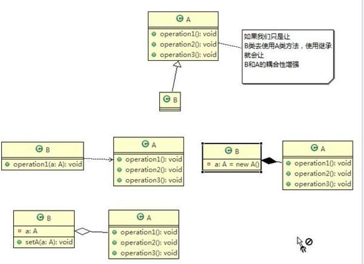

> 设计原则核心思想
1. 找出应用中可能需要变化之处，把它们独立出来，不要和那些不需要变化的代码混在一起。
2. 针对接口编程，而不是针对实现编程。
3. 为了交互对象之间的松耦合设计而努力

> ``UML``图示

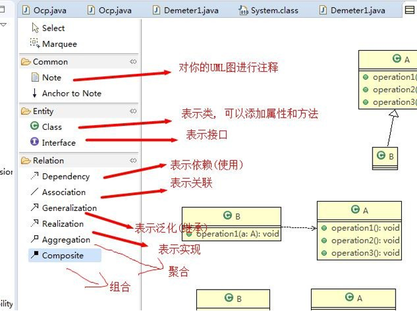

# <text style="color:yellow">设计模式</text>

## 1. <text style="color:#03a5fc">单例模式</text>

### 1.1 单例设计模式介绍

所谓类的单例设计模式，就是采取一定的方法保证在整个的软件系统中，对某个类只能存在一个对象实例， 并且该类只提供一个取得其对象实例的方法(静态方法)。

比如 ``Hibernate`` 的 ``SessionFactory``，它充当数据存储源的代理，并负责创建 ``Session`` 对象。``SessionFactory`` 并不是轻量级的，一般情况下，一个项目通常只需要一个 ``SessionFactory`` 就够，这是就会使用到单例模式。

### 1.2 单例设计模式``八``种方式
单例模式有``八``种方式：

1)	饿汉式(静态常量)---先创建好了
2)	饿汉式（静态代码块）
3)	懒汉式(线程不安全)
4)	懒汉式(线程安全，同步方法)
5)	懒汉式(线程安全，同步代码块)
6)	双重检查
7)	静态内部类
8)	枚举

### 1.2.1 饿汉式（静态常量）

饿汉式（静态常量）应用实例步骤如下：
1)	构造器私有化 (防止 ``new`` )
2)	类的内部创建对象
3)	向外暴露一个静态的公共方法。``getInstance``
4)	代码实现
```java
public class SingletonTest01 {
    public static void main(String[] args) {
        //测试
        Singleton instance = Singleton.getInstance();
        Singleton instance2 = Singleton.getInstance();
        System.out.println(instance == instance2); // true
        System.out.println("instance.hashCode=" + instance.hashCode());//instance.hashCode=13648335
        System.out.println("instance2.hashCode=" + instance2.hashCode());//instance2.hashCode=13648335

    }
}

/**
 * 饿汉式（静态变量）
 */
class Singleton {

    //1.构造器私有化, 外部不能new
    private Singleton() {

    }

    //2.本类内部创建实例
    private final static Singleton instance = new Singleton();

    //3. 提供一个公有的静态方法，返回实例对象

    public static Singleton getInstance() {
        return instance;
    }

}
```

> 	优缺点说明：
1)	优点：这种写法比较简单，就是在类装载的时候就完成实例化。避免了线程同步问题。
2)	缺点：在类装载的时候就完成实例化，没有达到 ``Lazy Loading`` 的效果。如果从始至终从未使用过这个实例，则会造成内存的浪费

3)	这种方式基于 ``classloder`` 机制避免了多线程的同步问题，不过，``instance`` 在类装载时就实例化，在单例模式中大多数都是调用 ``getInstance`` 方法， 但是导致类装载的原因有很多种，因此不能确定有其他的方式（或者其他的静态方法）导致类装载，这时候初始化 ``instance`` 就没有达到 ``lazy loading`` 的效果

4)	结论：这种单例模式可用，可能造成内存浪费

### 1.2.2 饿汉式（静态代码块）

代码演示：

```java
/**
 * 饿汉式（静态代码块）
 */
class Singleton {

    //1.构造器私有化, 外部不能new
    private Singleton() {

    }

    //2.本类内部创建实例
    private static Singleton instance;

    // 在静态代码块中，创建单例对象
    static {
        instance = new Singleton();
    }

    //3. 提供一个公有的静态方法，返回实例对象

    public static Singleton getInstance() {
        return instance;
    }

}
```

> 	优缺点说明：
1)	这种方式和上面的方式其实类似，只不过将类实例化的过程放在了静态代码块中，也是在类装载的时候，就执行静态代码块中的代码，初始化类的实例。优缺点和上面是一样的。
2)	结论：这种单例模式可用，但是可能造成内存浪费

<hr/>

### 1.2.3 懒汉式(线程不安全)

代码演示
```java
class SingleTon {

    //1.创建实例
    private static SingleTon instance;

    //2.构造器私有化, 外部不能new
    private SingleTon() {
    }

    //提供一个静态的公有方法，当使用到该方法时，才去创建 instance
    //即懒汉式
    public static SingleTon getInstance(){
        if(instance == null){
            instance = new SingleTon();
        }
        return instance;
    }

}
```

> 	优缺点说明：

1)	起到了 ``Lazy Loading`` 的效果，但是只能在单线程下使用。
2)	如果在多线程下，一个线程进入了 ``if (singleton == null)``判断语句块，还未来得及往下执行，另一个线程也通过了这个判断语句，这时便会产生多个实例。所以在多线程环境下不可使用这种方式
3)	结论：在实际开发中，不要使用这种方式.

### 1.2.4 懒汉式(线程安全，同步方法)

代码演示

```java
class SingleTon {

    //1.创建实例
    private static SingleTon instance;

    //2..构造器私有化, 外部不能new
    private SingleTon() {
    }

    //提供一个静态的公有方法，加入同步处理的代码，解决线程安全问题
    //即懒汉式
    public static synchronized SingleTon getInstance(){
        if(instance == null){
            instance = new SingleTon();
        }
        return instance;
    }

}
```

> 	优缺点说明：

1)	解决了线程安全问题
2)	效率太低了，每个线程在想获得类的实例时候，执行 ``getInstance()``方法都要进行同步。而其实这个方法只执行一次实例化代码就够了，后面的想获得该类实例，直接 ``return`` 就行了。方法进行同步效率太低
3)	结论：在实际开发中，不推荐使用这种方式

### 1.2.5 懒汉式(线程安全，同步代码块)

代码演示
```java
class SingleTon {

    //1.创建实例
    private static SingleTon instance;

    //2..构造器私有化, 外部不能new
    private SingleTon() {
    }

    //提供一个静态的公有方法，加入了同步代码块，解决线程安全问题
    //即懒汉式
    public static  SingleTon getInstance(){
        if(instance == null){
            synchronized (SingleTon.class){
                instance = new SingleTon();
            }
        }
        return instance;
    }

}
```
**不推荐使用同步代码块**
<hr/>

### 1.2.6 双重检查--使用了``volatile``关键字

```java
class SingleTon {

    //1.创建实例,使用volatile关键字
    private static volatile SingleTon instance;

    //2..构造器私有化, 外部不能new
    private SingleTon() {
    }

    //提供一个静态的公有方法，加入双重检查代码，解决线程安全问题, 同时解决懒加载问题
    //同时保证了效率, 推荐使用
    public static synchronized SingleTon getInstance(){
        if(instance == null){
            synchronized (SingleTon.class){
                if(instance == null){
                    instance = new SingleTon();
                }
            }
        }
        return instance;
    }

}
```
> 	优缺点说明：


1)	``Double-Check`` 概念是多线程开发中常使用到的，如代码中所示，我们进行了两次 ``if (singleton == null)``检查，这样就可以保证线程安全了。
2)	这样，实例化代码只用执行一次，后面再次访问时，判断 ``if (singleton == null)``，直接 ``return`` 实例化对象，也避免的反复进行方法同步.
3)	线程安全；延迟加载；效率较高
4)	结论：在实际开发中，推荐使用这种单例设计模式

### 1.2.7 静态内部类

代码演示

```java
class SingleTon {

    //1.构造器私有化, 外部不能new
    private SingleTon() {
    }
    //2.写一个静态内部类,该类中有一个静态属性 Singleton 
    private static class  SingletonInstance{
        private static final SingleTon INSTANCE = new SingleTon();
    }

    //3.提供一个静态的公有方法，直接返回 SingletonInstance.INSTANCE
    public static synchronized SingleTon getInstance(){
        return SingletonInstance.INSTANCE;
    }

}
```

> 	优缺点说明：

1)	这种方式采用了类装载的机制来保证初始化实例时只有一个线程。
2)	静态内部类方式在 ``Singleton`` 类被装载时并不会立即实例化，而是在需要实例化时，调用 ``getInstance`` 方法，才会装载 ``SingletonInstance`` 类，从而完成 ``Singleton`` 的实例化。
3)	类的静态属性只会在第一次加载类的时候初始化，所以在这里，``JVM`` 帮助我们保证了线程的安全性，在类进行初始化时，别的线程是无法进入的。
4)	优点：避免了线程不安全，利用静态内部类特点实现延迟加载，效率高
5)	结论：推荐使用.

### 1.2.8 枚举

代码演示
```java
public class SingletonTest08 {
    public static void main(String[] args) {
        Singleton instance1 = Singleton.INSTANCE;
        Singleton instance2 = Singleton.INSTANCE;

        System.out.println(instance1 == instance2);//true

        System.out.println(instance1.hashCode());//13648335
        System.out.println(instance2.hashCode());//13648335

        instance1.sayOK();//OK~

    }
}
//使用枚举，可以实现单例, 推荐
enum Singleton{
    //属性
    INSTANCE;
    public void sayOK(){
        System.out.println("OK～");
    }
}
```
> 	优缺点说明：

1)	这借助 ``JDK1.5`` 中添加的枚举来实现单例模式。不仅能避免多线程同步问题，而且还能防止反序列化重新创建新的对象。
2)	这种方式是 ``Effective Java`` 作者 ``Josh Bloch``  提倡的方式
3)	结论：推荐使用

### 1.2.9 单例模式在 ``JDK``  应用的源码分析

> 单例模式在``JDK`` 应用的源码分析

1)	我们 ``JDK`` 中，``java.lang.Runtime`` 就是经典的单例模式(饿汉式)
2)	代码分析+``Debug`` 源码+代码说明

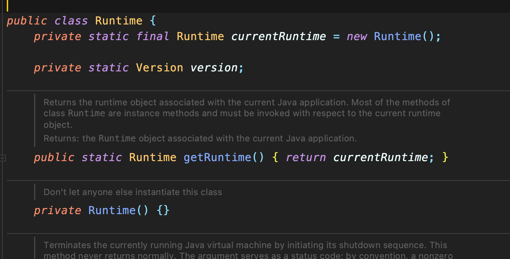

### 1.2.10 单例模式注意事项和细节说明

1)	单例模式保证了系统内存中该类只存在一个对象，节省了系统资源，对于一些需要频繁创建销毁的对象，使用单例模式可以提高系统性能
2)	当想实例化一个单例类的时候，必须要记住使用相应的获取对象的方法，而不是使用 ``new``
3)	单例模式使用的场景：需要**频繁**的进行创建和销毁的对象、创建对象时耗时过多或耗费资源过多(即：**重量级对象**)，但又经常用到的对象、**工具类对象**、频繁访问数据库或文件的对象(比如**数据源、session 工厂**等)


<HR style="border:3 double #987cb9" width="100%" color=#84fa2a SIZE=3>


## 2 <text style="color:#fc0356">工厂模式</text>

### 2.1 简单工厂模式

> 看一个具体的需求

看一个披萨的项目：要便于披萨种类的扩展，要便于维护
1)	披萨的种类很多(比如 ``GreekPizz``、``CheesePizz`` 等)
2)	披萨的制作有 ``prepare``，``bake``, ``cut``, ``box``
3)	完成披萨店订购功能。

#### <text style="color:#03fca5">2.1.1. 传统方式</text>

1)	思路分析(类图)

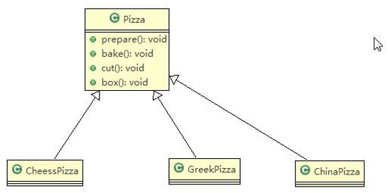

编写 ``OrderPizza.java`` 去订购需要的各种 ``Pizza``

项目结构：

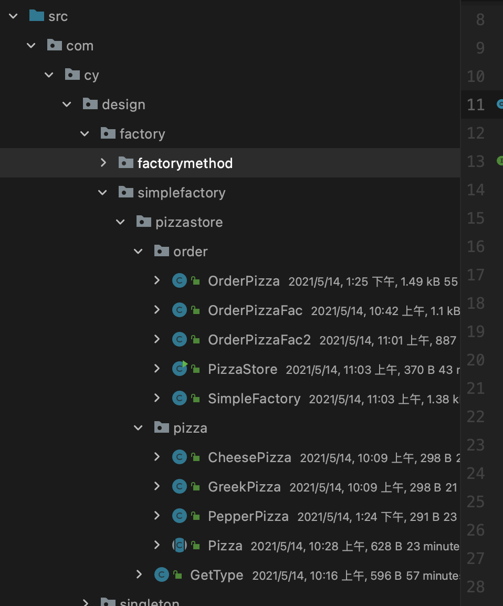


代码演示：

```java
//Pizza.java
public abstract class Pizza {
    protected String name;//名字

    //准备原材料，因为不同的披萨不一样，因此这边做成抽象方法
    public abstract void prepare();

    public void bake(){
        System.out.println(name+ " backing");
    }

    public void cut(){
        System.out.println(name+ " cutting");
    }

    public void box(){
        System.out.println(name+ " boxing");
    }

    public void setName(String name){
        this.name = name;
    }

}
/***********************************************************/
//CheesePizza.java
public class CheesePizza extends Pizza{
    @Override
    public void prepare() {
        System.out.println("给制作奶酪披萨准备原材料....");
    }
}
/***********************************************************/
//GreekPizza.java
public class GreekPizza extends Pizza{

    @Override
    public void prepare() {
        System.out.println("给希腊披萨制作准备原材料....");
    }
}
/***********************************************************/
//OrderPizza.java
public class OrderPizza {
    
    //构造器
    public OrderPizza() {
        Pizza pizza = null;
        String orderType; //订购的披萨类型

        do {
            //IntelliJ IDEA 2018.2的新特性：对于一些被重新分配地址的变量或者参数，IDEA默认给它们加上下划线
            orderType = GetType.getType();
            if (orderType.equals("greek")) {
                pizza = new GreekPizza();
                pizza.setName("希腊披萨");
            } else if (orderType.equals("cheese")) {
                pizza = new CheesePizza();
                pizza.setName(" 奶酪披萨 ");
            } else {
                break;
            }
           //输出 pizza 制作过程
            pizza.prepare();
            pizza.bake();
            pizza.cut();
            pizza.box();
        } while (true);
    }
}
/***********************************************************/
//GetType.java
public class GetType {

    public static String getType(){
        try {
            BufferedReader strIn = new BufferedReader(new InputStreamReader(System.in));
            System.out.println("input pizza type: ");
            String str = strIn.readLine();
            return str;
        } catch (Exception e) {
            e.printStackTrace();
            return "";
        }
    }
}
/***********************************************************/
//PizzaStore.java  ---主方法类
public class PizzaStore {
    public static void main(String[] args) {
       new OrderPizza();
    }
}
```
> 传统的方式的优缺点

1)	优点是比较好理解，简单易操作。
2)	缺点是违反了设计模式的 ``ocp`` 原则，即对扩展开放，对修改关闭。即当我们给类增加新功能的时候，尽量不修改代码，或者尽可能少修改代码.
3)	比如我们这时要新增加一个 ``Pizza`` 的种类(``Pepper`` 披萨)，我们需要做如下修改. 如果我们增加一个 ``Pizza`` 类，只要是订购 ``Pizza`` 的代码都需要修改.


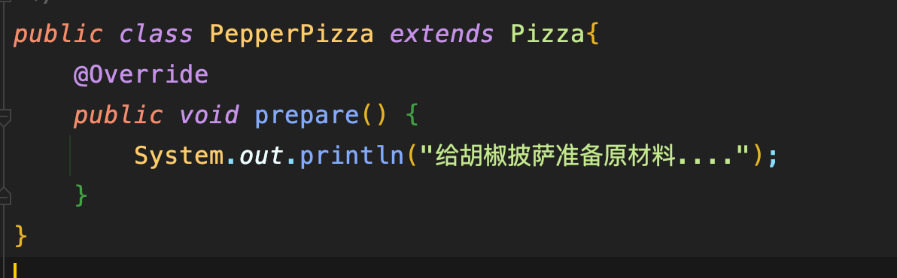


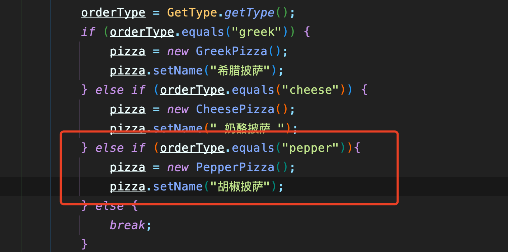

4)	改进的思路分析
> 分析：修改代码可以接受，但是如果我们在其它的地方也有创建 ``Pizza`` 的代码，就意味着，也需要修改，而创建 ``Pizza``的代码，往往有多处。
> 
思路：把创建 ``Pizza`` 对象封装到一个类中，这样我们有新的 ``Pizza`` 种类时，只需要修改该类就可，其它有创建到 ``Pizza``
对象的代码就不需要修改了.-> 简单工厂模式


#### <text style="color:#03fca5">2.1.2 基本介绍</text>

1)	简单工厂模式是属于创建型模式，是工厂模式的一种。简单工厂模式是由一个工厂对象决定创建出哪一种产品类的实例。简单工厂模式是工厂模式家族中最简单实用的模式
2)	简单工厂模式：定义了一个创建对象的类，由这个类来封装实例化对象的行为(代码)
3)	在软件开发中，当我们会用到大量的创建某种、某类或者某批对象时，就会使用到工厂模式.

#### <text style="color:#03fca5">2.1.3 使用简单工厂模式</text>

1)	简单工厂模式的设计方案: 定义一个可以实例化 ``Pizaa`` 对象的类，封装创建对象的代码。

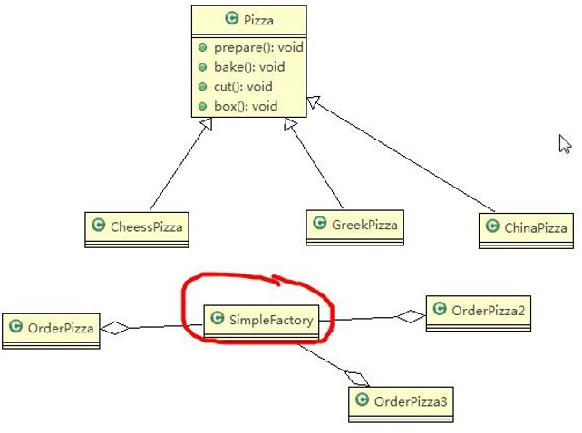


代码实现:

```java
//SimpleFactory.java
public class SimpleFactory {

    //根据 orderType 返回对应的 Pizza 对象
    public Pizza createPizza(String orderType) {
        Pizza pizza = null;
        System.out.println("使用简单工厂模式");
        if (orderType.equals("greek")) {
            pizza = new GreekPizza();
            pizza.setName(" 希腊披萨 ");
        } else if (orderType.equals("cheese")) {
            pizza = new CheesePizza();
            pizza.setName(" 奶酪披萨 ");
        }
        return pizza;
    }
   //-----------------------------------------------------//
    //使用静态方法，简单工厂也被称为静态工厂
    public static Pizza createPizza2(String orderType){
        Pizza pizza = null;
        System.out.println("使用静态工厂模式");
        if (orderType.equals("greek")) {
            pizza = new GreekPizza();
            pizza.setName(" 希腊披萨 ");
        } else if (orderType.equals("cheese")) {
            pizza = new CheesePizza();
            pizza.setName(" 奶酪披萨 ");
        }
        return pizza;
    }

}
/***********************************************************/
//OrderPizzaFac.java --- 这是使用简单工厂模式方法
public class OrderPizzaFac {

    //定义一个简单工厂对象
    SimpleFactory simpleFactory;
    Pizza pizza = null;

    public OrderPizzaFac(SimpleFactory simpleFactory) {
        setSimpleFactory(simpleFactory);
    }

    public void setSimpleFactory(SimpleFactory simpleFactory) {
        String orderType = "";

        this.simpleFactory = simpleFactory;

        do {
            orderType = GetType.getType();
            pizza = simpleFactory.createPizza(orderType);

            //输出 pizza
            if (pizza != null) { //订购成功
                pizza.prepare();
                pizza.bake();
                pizza.cut();
                pizza.box();
            } else {
                System.out.println(" 订购披萨失败 ");
                break;
            }

        } while (true);
    }
}
/***********************************************************/
//OrderPizzaFac2.java --- 这是使用静态工厂模式方法
public class OrderPizzaFac2 {

    Pizza pizza = null;

    public OrderPizzaFac2() {
        String orderType = "";

        do {
            orderType = GetType.getType();
            pizza = SimpleFactory.createPizza2(orderType);

            //输出 pizza
            if (pizza != null) { //订购成功
                pizza.prepare();
                pizza.bake();
                pizza.cut();
                pizza.box();
            } else {
                System.out.println(" 订购披萨失败 ");
                break;
            }

        } while (true);
    }

}
/***********************************************************/
//PizzaStore.java
public class PizzaStore {
    public static void main(String[] args) {
       // new OrderPizza();
        //new OrderPizzaFac(new SimpleFactory());

        new OrderPizzaFac2();
        System.out.println("~退出程序~");
    }
}
```
但是一般使用简单工厂，因为静态工厂的创建方式过于单一

<HR style="border:1 double #987cb9" width="100%" color=#768768 SIZE=2>

### 2.2 <text style="color:#eb0942">工厂方法模式</text>

> 看一个新的需求
>
披萨项目新的需求：客户在点披萨时，可以点不同口味的披萨，比如 北京的奶酪 ``pizza``、北京的胡椒 ``pizza`` 或者是伦敦的奶酪 ``pizza``、伦敦的胡椒 ``pizza``。

> 思路 ``1``
> 
使用简单工厂模式，创建不同的简单工厂类，比如 ``BJPizzaSimpleFactory、LDPizzaSimpleFactory`` 等等.从当前这个案例来说，也是可以的，但是考虑到项目的规模，以及软件的可维护性、可扩展性并不是特别好

> 思路 ``2``
> 
使用工厂方法模式

#### <text style="color:#03fca5">2.2.1  工厂方法模式介绍</text>

1)	工厂方法模式设计方案：将披萨项目的实例化功能抽象成抽象方法，在不同的口味点餐子类中具体实现。
2)	工厂方法模式：定义了一个创建对象的抽象方法，由子类决定要实例化的类。工厂方法模式将对象的实例化推迟到子类。

#### <text style="color:#03fca5">2.2.2  工厂方法模式应用案例</text>
1)	披萨项目新的需求：客户在点披萨时，可以点不同口味的披萨，比如 北京的奶酪 ``pizza``、北京的胡椒 ``pizza`` 或者是伦敦的奶酪 ``pizza``、伦敦的胡椒 ``pizza``
2)  思路分析图解

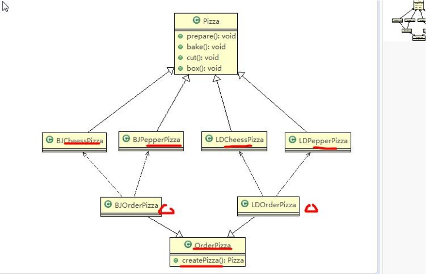

项目结构


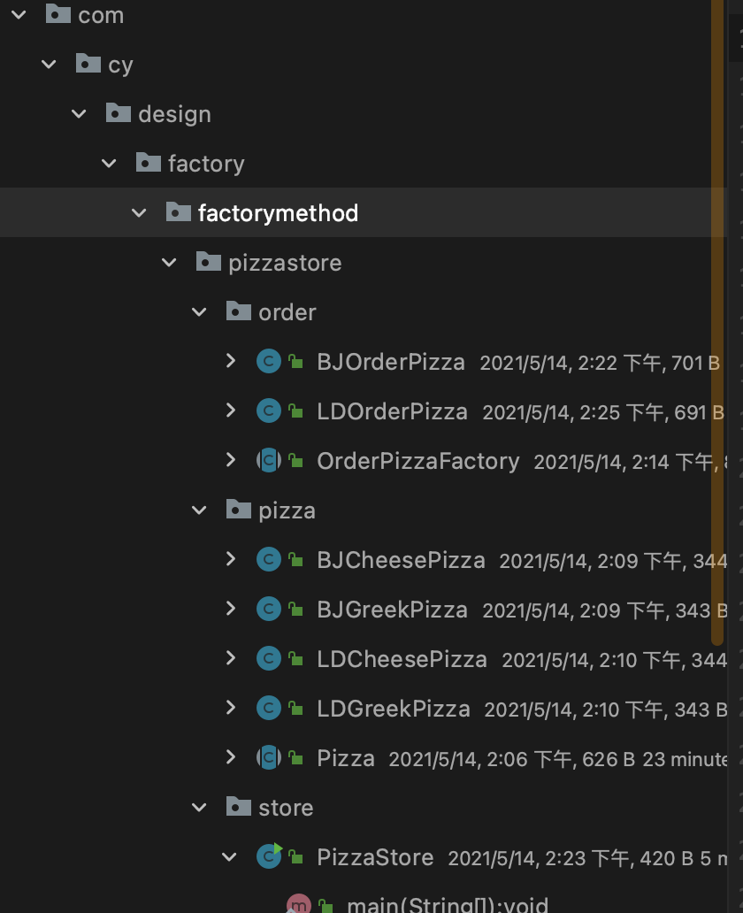


代码解析

```java
//GetType.java
public class GetType {

    public static String getType(){
        try {
            BufferedReader strIn = new BufferedReader(new InputStreamReader(System.in));
            System.out.println("input pizza type: ");
            String str = strIn.readLine();
            return str;
        } catch (Exception e) {
            e.printStackTrace();
            return "";
        }
    }
}
/***********************************************************/
//BJCheesePizza.java
public class BJCheesePizza extends Pizza{
    @Override
    public void prepare() {
        setName("北京奶酪披萨");
        System.out.println("给制作北京奶酪披萨准备原材料....");
    }
}
/***********************************************************/
//BJGreekPizza.java
public class BJGreekPizza extends Pizza{
    @Override
    public void prepare() {
        setName("北京希腊披萨");
        System.out.println("给制作北京希腊披萨准备原材料....");
    }
}
/***********************************************************/
//LDCheesePizza.java
public class LDCheesePizza extends Pizza{
    @Override
    public void prepare() {
        setName("伦敦奶酪披萨");
        System.out.println("给制作伦敦奶酪披萨准备原材料....");
    }
}
/***********************************************************/
//LDGreekPizza.java
public class LDGreekPizza extends Pizza{
    @Override
    public void prepare() {
        setName("伦敦希腊披萨");
        System.out.println("给制作伦敦希腊披萨准备原材料....");
    }
}
/***********************************************************/
//Pizza.java
public abstract class Pizza {
    protected String name;//名字

    //准备原材料，因为不同的披萨不一样，因此这边做成抽象方法
    public abstract void prepare();

    public void bake(){
        System.out.println(name+ " backing");
    }

    public void cut(){
        System.out.println(name+ " cutting");
    }

    public void box(){
        System.out.println(name+ " boxing");
    }

    public void setName(String name){
        this.name = name;
    }
}
/***********************************************************/
//OrderPizzaFactory.java
public abstract class OrderPizzaFactory {
    //定义一个抽象方法，createPizza ,  让各个工厂子类自己实现
    abstract Pizza createPizza(String orderType);

    //构造器
    public OrderPizzaFactory() {
        Pizza pizza = null;
        String orderType;//订购的披萨类型

        do {
            orderType = GetType.getType();
            pizza = createPizza(orderType);
            //输出 pizza 制作过程
            pizza.prepare();
            pizza.bake();
            pizza.cut();
            pizza.box();
        } while (true);

    }
}
/***********************************************************/
//BJOrderPizza.java
public class BJOrderPizza extends OrderPizzaFactory {
    @Override
    Pizza createPizza(String orderType) {
        Pizza pizza = null;
        if (orderType.equals("cheese")) {
            pizza = new BJCheesePizza();
        } else if (orderType.equals("greek")) {
            pizza = new BJGreekPizza();
        }
        return pizza;
    }
}
/***********************************************************/
//LDOrderPizza.java
public class LDOrderPizza extends OrderPizzaFactory{
    @Override
    Pizza createPizza(String orderType) {
        Pizza pizza = null;
        if(orderType.equals("cheese")){
            pizza = new LDCheesePizza();
        }if (orderType.equals("greek")){
            pizza = new LDGreekPizza();
        }
        return pizza;
    }
}
/***********************************************************/
//PizzaStore.java
public class PizzaStore {
    public static void main(String[] args) {
       //new BJOrderPizza();
        new LDOrderPizza();
    }
}
```
> 个人理解就是相比简单工厂模式，因为多了一个选项，原来的口味的披萨，多了一个地区的限制，因此可以理解为多加了层，原来的简单工厂``（OrderPizzaFactory）``不创建对象，多创建的一层子类(``LDOrderPizza,BJOrderPizza``)来实现创建。


<HR style="border:1 double #987cb9" width="100%" color=#768768 SIZE=2>

### 2.3 <text style="color:#a666ad">抽象工厂模式</text>


#### 2.3.1 基本介绍

1)	抽象工厂模式：定义了一个 ``interface`` 用于创建相关或有依赖关系的对象簇，而无需指明具体的类
2)	抽象工厂模式可以将简单工厂模式和工厂方法模式进行整合。
3)	从设计层面看，抽象工厂模式就是对简单工厂模式的改进(或者称为进一步的抽象)。
4)	将工厂抽象成两层，``AbsFactory(抽象工厂)`` 和 具体实现的工厂子类。程序员可以根据创建对象类型使用对应的工厂子类。这样将单个的简单工厂类变成了工厂簇，更利于代码的维护和扩展。
5)	类图

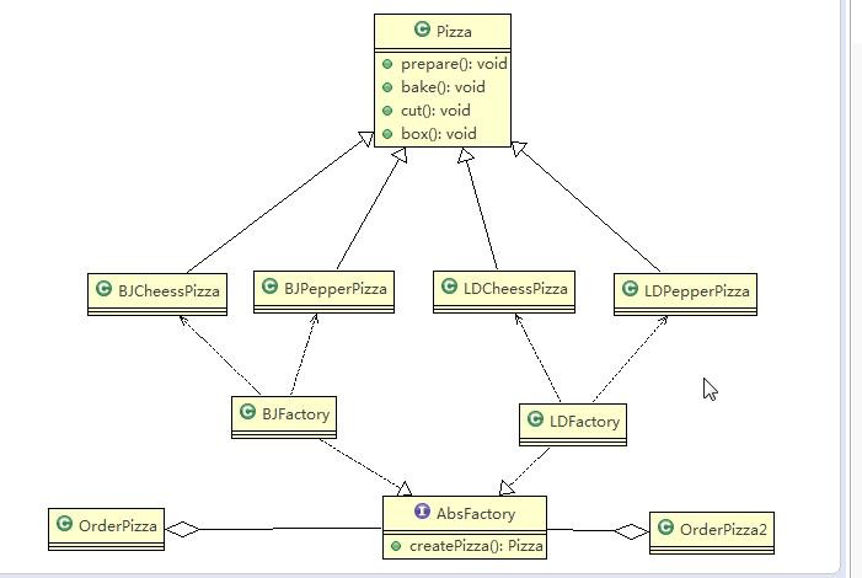

#### 2.3.2 抽象工厂模式应用实例
使用抽象工厂模式来完成披萨项目:

项目目录：


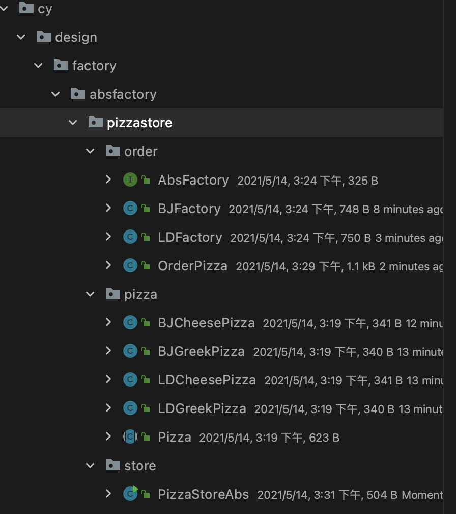

**``pizza``包代码与上面工厂方法模式一致，这边不再放出**

```java
//AbsFactory.java
public interface AbsFactory {
    //让下面的工厂子类来 具体实现
    public Pizza createPizza(String orderType);

}
/***********************************************************/
//BJFactory.java
public class BJFactory implements AbsFactory {
    @Override
    public Pizza createPizza(String orderType) {
        System.out.println("~使用的是抽象工厂模式~");
        Pizza pizza = null;
        if(orderType.equals("cheese")){
            pizza = new BJCheesePizza();
        }else if(orderType.equals("greek")){
            pizza = new BJGreekPizza();
        }
        return pizza;
    }
}
/***********************************************************/
//LDFactory.java
public class LDFactory implements AbsFactory {
    @Override
    public Pizza createPizza(String orderType) {

        System.out.println("~使用的是抽象工厂模式~");
        Pizza pizza = null;

        if(orderType.equals("cheese")){
            pizza = new LDCheesePizza();
        }else if(orderType.equals("greek")){
            pizza = new LDGreekPizza();
        }
        return pizza;
    }
}
/***********************************************************/
//OrderPizza.java
public class OrderPizza {

    AbsFactory absFactory;

    // 构造器
    public OrderPizza(AbsFactory absFactory){
        setFactory(absFactory);
    }

    public void setFactory(AbsFactory absFactory){
        Pizza pizza = null;
        String orderType = "";//用户输入

        this.absFactory = absFactory;

        do {
            orderType = GetType.getType();
            // factory  可能是北京的工厂子类，也可能是伦敦的工厂子类
            pizza = absFactory.createPizza(orderType);

            if (pizza != null) { // 订 购 ok
                pizza.prepare();
                pizza.bake();
                pizza.cut();
                pizza.box();
            }else {
                System.out.println("订购失败！");
                break;
            }
            }while (true);

    }

}
/***********************************************************/
//StorePizzaAbs.java
public class PizzaStoreAbs {
    public static void main(String[] args) {
        //new OrderPizza(new BJFactory());
        new OrderPizza(new LDFactory());
    }
}
```

<HR style="border:1 double #987cb9" width="100%" color=#768768 SIZE=2>

### 2.4 <text style="color:#3f7a0f">工厂模式在 ``JDK-Calendar`` 应用的源码分析</text>

1)	``JDK`` 中的 ``Calendar`` 类中，就使用了简单工厂模式
2)	源码分析+``Debug`` 源码+说明

实例代码
```java
public class Factory {
    public static void main(String[] args) {
        // getInstance 是 Calendar 静态方法
        Calendar cal = Calendar.getInstance();
        // 注 意 月 份 下 标 从 0 开 始 ， 所 以 取 月 份 要 +1
        System.out.println(" 年 :" + cal.get(Calendar.YEAR));
        System.out.println(" 月 :" + (cal.get(Calendar.MONTH) + 1));
        System.out.println("日:" + cal.get(Calendar.DAY_OF_MONTH));
        System.out.println(" 时 :" + cal.get(Calendar.HOUR_OF_DAY));
        System.out.println(" 分 :" + cal.get(Calendar.MINUTE));
        System.out.println("秒:" + cal.get(Calendar.SECOND));
    }
}
```
``getInstance()``方法


``createCalendar()``方法
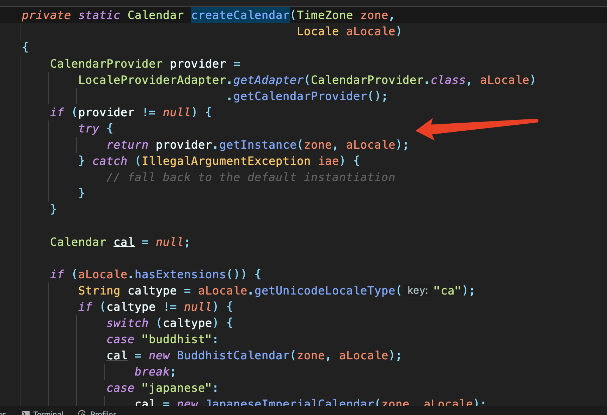

<HR style="border:1 double #987cb9" width="100%" color=#768768 SIZE=2>

### 2.5 <text style="color:#3f7a0f">工厂模式小结</text>
1)	工厂模式的意义

    将实例化对象的代码提取出来，放到一个类中统一管理和维护，达到和主项目的依赖关系的解耦。从而提高项目的扩展和维护性。

2)	三种工厂模式 (简单工厂模式、工厂方法模式、抽象工厂模式)
3)	设计模式的依赖抽象原则

- 创建对象实例时，不要直接 ``new`` 类, 而是把这个 ``new``  类的动作放在一个工厂的方法中，并返回。有的书上说， 变量不要直接持有具体类的引用。
- 不要让类继承具体类，而是继承抽象类或者是实现 ``interface``(接口)
- 不要覆盖基类中已经实现的方法。

<HR style="border:3 double #987cb9" width="100%" color=#84fa2a SIZE=3>


## 3 <text style="color:#15fa00">原型模式</text>

> 克隆羊问题
> 
现在有一只羊 ``tom``，姓名为: ``tom``, 年龄为：``1``，颜色为：白色，请编写程序创建和 ``tom`` 羊 属性完全相同的 ``10``只羊。

> 传统方式解决克隆羊问题

1)	思路分析(图解)

   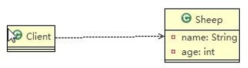

传统方法使用不断``new``的方法，实现该需求。

> 传统的方式的优缺点

1)	优点是比较好理解，简单易操作。
2)	在创建新的对象时，总是需要重新获取原始对象的属性，如果创建的对象比较复杂时，效率较低
3)	总是需要重新初始化对象，而不是动态地获得对象运行时的状态, 不够灵活
4)	改进的思路分析

思路：``Java`` 中 ``Object`` 类是所有类的根类，``Object`` 类提供了一个 ``clone()``方法，该方法可以将一个 ``Java`` 对象复制一份，但是需要实现 ``clone`` 的``Java`` 类必须要实现一个接口``Cloneable``，该接口表示该类能够复制且具有复制的能力  ``=>``  原型模式

### 3.1 <text style="color:#749171">原型模式-基本介绍</text>

1)	原型模式(``Prototype`` 模式)是指：用原型实例指定创建对象的种类，并且通过拷贝这些原型，创建新的对象
2)	原型模式是一种创建型设计模式，允许一个对象再创建另外一个可定制的对象，无需知道如何创建的细节
3)	工作原理是:通过将一个原型对象传给那个要发动创建的对象，这个要发动创建的对象通过请求原型对象拷贝它们自己来实施创建，即 ``对象.clone()``
4)	形象的理解：孙大圣拔出猴毛， 变出其它孙大圣

### 3.2 <text style="color:#1e9412">原型模式原理结构图-``uml`` 类图</text>

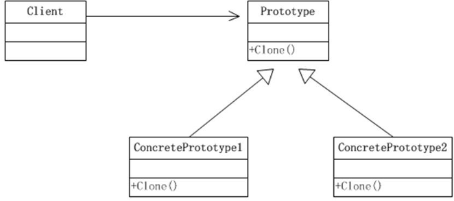

> 	原理结构图说明
> 
1)	``Prototype`` : 原型类，声明一个克隆自己的接口
2)	``ConcretePrototype``: 具体的原型类,  实现一个克隆自己的操作
3)	``Client``: 让一个原型对象克隆自己，从而创建一个新的对象(属性一样）

### 3.3 <text style="color:#1e9460">  原型模式解决克隆羊问题的应用实例</text>

使用原型模式改进传统方式，让程序具有更高的效率和扩展性。

```java
//sheep.java
public class Sheep implements Cloneable{
    private String name;
    private int age;
    private String color;

    public Sheep(String name, int age, String color) {
        this.name = name;
        this.age = age;
        this.color = color;
    }

    public String getName() {
        return name;
    }

    public void setName(String name) {
        this.name = name;
    }

    public int getAge() {
        return age;
    }

    public void setAge(int age) {
        this.age = age;
    }

    public String getColor() {
        return color;
    }

    public void setColor(String color) {
        this.color = color;
    }

    @Override
    public String toString() {
        return "Sheep{" +
                "name='" + name + '\'' +
                ", age=" + age +
                ", color='" + color + '\'' +
                '}';
    }
    //克隆该实例，使用默认的 clone 方法来完成
    @Override
    protected Object clone() throws CloneNotSupportedException {
        Sheep sheep = null;
        try {
            sheep = (Sheep) super.clone();

        } catch (CloneNotSupportedException e) {
            e.printStackTrace();
        }
        return sheep;
    }
}
/***********************************************************/
//Client.java
public class Client {
    public static void main(String[] args) throws CloneNotSupportedException {
        Sheep sheep = new Sheep("tom", 1, "白色");

        Sheep sheep1 = (Sheep) sheep.clone();
        Sheep sheep2 = (Sheep) sheep.clone();
        Sheep sheep3 = (Sheep) sheep.clone();
        Sheep sheep4 = (Sheep) sheep.clone();

        System.out.println("sheep1: "+sheep1+" ---- "+ "sheep.hashCode: "+ sheep1.hashCode());
        System.out.println("sheep2: "+sheep2+" ---- "+ "sheep.hashCode: "+ sheep2.hashCode());
        System.out.println("sheep3: "+sheep3+" ---- "+ "sheep.hashCode: "+ sheep3.hashCode());
        System.out.println("sheep4: "+sheep4+" ---- "+ "sheep.hashCode: "+ sheep4.hashCode());

    }
}
```
打印结果


可以观察到哈希值不一致，实现了深拷贝。

<HR style="border:3 double #987cb9" width="100%" color=#84fa2a SIZE=3>

🌟
**但是，原生的``Object`` 方法只能实现基本数据类型以及 ``String`` 方法的 深拷贝，所以，在实体类中引用一些其他一些引用类型时，需要通过别的方法实现深拷贝**
🌟

我们在``Sheep``中新添一个 ``Sheep``引用
```java
private String name;
private int age; 
private String color;
public Sheep friend; //是对象,  克隆是会如何处理,  默认是浅拷贝
``` 
进行上述测试


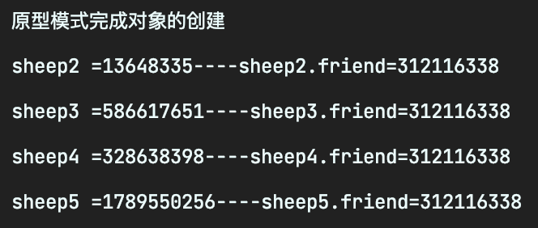


可以看到，``jdk``默认的``Clone``方法只能复制基本数据类型以及``String``类型的变量，对于其他的引用类型变量，都是只是新增一个引用。所以默认``Clone ``只是浅拷贝，所以只能使用其他办法实现深拷贝。

### 3.4 <text style="color:#4e9946">原型模式在 ``Spring`` 框架中源码分析</text>
1)	``Spring`` 中原型 ``bean`` 的创建，就是原型模式的应用
2)	代码分析 + ``Debug`` 源码

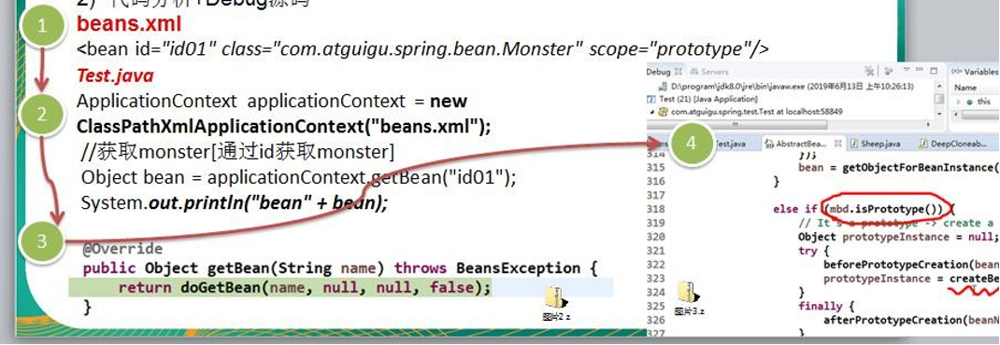

### 3.5 <text style="color:#3c5d75">深入讨论-浅拷贝和深拷贝</text>

> 浅拷贝的介绍

1)	对于数据类型是基本数据类型的成员变量，浅拷贝会直接进行值传递，也就是将该属性值复制一份给新的对象。
2)	对于数据类型是引用数据类型的成员变量，比如说成员变量是某个数组、某个类的对象等，那么浅拷贝会进行引用传递，也就是只是将该成员变量的引用值（内存地址）复制一份给新的对象。因为实际上两个对象的该成员变量都指向同一个实例。在这种情况下，在一个对象中修改该成员变量会影响到另一个对象的该成员变量值
3)	前面我们克隆羊就是浅拷贝
4)	浅拷贝是使用默认的 ``clone()``方法来实现
 ```java   
     sheep = (Sheep) super.clone();
 ```
### 3.6 <text style="color:#403e59">深拷贝基本介绍</text>
1)	复制对象的所有基本数据类型的成员变量值
2)	为所有引用数据类型的成员变量申请存储空间，并复制每个引用数据类型成员变量所引用的对象，直到该对象可达的所有对象。也就是说，对象进行深拷贝要对整个对象(包括对象的引用类型)进行拷贝

3)	深拷贝实现方式 ``1``：重写 ``clone`` 方法来实现深拷贝
4)	深拷贝实现方式 ``2``：通过对象序列化实现深拷贝(推荐)

### 3.7 <text style="color:#8e8bb0">深拷贝应用实例</text>

1)	使用 重写 ``clone`` 方法实现深拷贝
2)	使用序列化来实现深拷贝
3)	代码演示

```java
//DeepCloneableTarget.java
public class DeepCloneableTarget implements Serializable,Cloneable {
    private static final long serialVersionUID = 1L;

    private String cloneName;

    private String cloneClass;

    //构造器
    public DeepCloneableTarget(String cloneName, String cloneClass) {
        this.cloneName = cloneName;
        this.cloneClass = cloneClass;
    }

    //因为该类的属性，都是 String ,  因此我们这里使用默认的 clone 完成即可
    @Override
    protected Object clone() throws CloneNotSupportedException {
        return super.clone();
    }

}
/***********************************************************/
//DeepProtoType.java
public class DeepProtoType implements Serializable,Cloneable {

    public String name; //String 属 性
    public DeepCloneableTarget deepCloneableTarget;// 引用类型

    public DeepProtoType() {
        super();
    }

    //深拷贝 - 方式 1  使用 clone 方法
//    @Override
//    protected Object clone() throws CloneNotSupportedException {
//
//        Object deep = null;
//        //这里完成对基本数据类型(属性)和 String 的克隆
//        deep = super.clone();
//        //对引用类型的属性，进行单独处理
//
//        DeepProtoType deepProtoType = (DeepProtoType) deep;
//        deepProtoType.deepCloneableTarget = (DeepCloneableTarget) deepCloneableTarget.clone();
//
//        return deepProtoType;
//    }

    //深拷贝 - 方式 2 通过对象的序列化实现 (推荐)
    @Override
    protected Object clone() throws CloneNotSupportedException {
        DeepProtoType deepProtoType = null;

        //1.第一步
        ByteArrayOutputStream bos = new ByteArrayOutputStream();
        try(ObjectOutputStream oos = new ObjectOutputStream(bos);){
            //序列化
            oos.writeObject(this);

        } catch (IOException e) {
            e.printStackTrace();
        }

        //2.第二步
        ByteArrayInputStream bis = new ByteArrayInputStream(bos.toByteArray());
        try(ObjectInputStream ois = new ObjectInputStream(bis)) {
            //反序列化
            deepProtoType  = (DeepProtoType) ois.readObject();
        } catch (IOException | ClassNotFoundException e) {
            e.printStackTrace();
        }

        return deepProtoType;
    }
}
/***********************************************************/
//Client.java
public class Client {
    public static void main(String[] args) throws CloneNotSupportedException {
        DeepProtoType p = new DeepProtoType();
        p.name = "李三";
        p.deepCloneableTarget = new DeepCloneableTarget("大牛","小牛");

        DeepProtoType p2 = (DeepProtoType) p.clone();

        System.out.println("p.name=" + p.name + "---------" +"p.deepCloneableTarget=" + p.deepCloneableTarget.hashCode());
        System.out.println("p2.name=" + p.name + "---------" + "p2.deepCloneableTarget=" + p2.deepCloneableTarget.hashCode());

    }
}
```

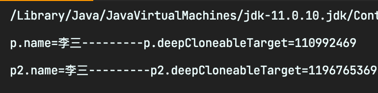

通过两种办法实现了深拷贝，一般来说，第一种方法比较方便，第二种方法比较通用，但是写起来会有一点点麻烦，根据情况选择即可。

### 3.8 <text style="color:#8e8bb0">原型模式的注意事项和细节</text>

1)	创建新的对象比较复杂时，可以利用原型模式简化对象的创建过程，同时也能够提高效率
2)	不用重新初始化对象，而是动态地获得对象运行时的状态
3)	如果原始对象发生变化(增加或者减少属性)，其它克隆对象的也会发生相应的变化，无需修改代码
4)	在实现深克隆的时候可能需要比较复杂的代码
5)	缺点：需要为每一个类配备一个克隆方法，这对全新的类来说不是很难，但对已有的类进行改造时，需要修改其源代码，违背了 ``ocp`` 原则，这点请同学们注意.

<HR style="border:3 double #987cb9" width="100%" color=#84fa2a SIZE=3>


## 4 <text style="color:#15fa00">建造者模式</text>

> 盖房项目需求

1)	需要建房子：这一过程为打桩、砌墙、封顶
2)	房子有各种各样的，比如普通房，高楼，别墅，各种房子的过程虽然一样，但是要求不要相同的.
3)	请编写程序，完成需求.

> 传统方式解决盖房需求

1)	思路分析(图解)

    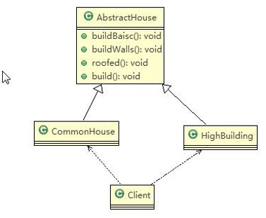

2) 代码演示

```java
//AbstractHouse.java
public abstract class AbstractHouse {
    //打地基
    public abstract void buildBasic();
    //砌墙
    public abstract void buildWalls();
    //封顶
    public abstract void roofed();

    public void build(){
        buildBasic();
        buildWalls();
        roofed();
    }

}
/***********************************************************/
//CommonHouse.java
public class CommonHouse extends AbstractHouse{

    @Override
    public void buildBasic() {
        System.out.println(" 普通房子打地基 ");
    }

    @Override
    public void buildWalls() {
        System.out.println(" 普通房子砌墙 ");
    }

    @Override
    public void roofed() {
        System.out.println(" 普通房子封顶 ");
    }
}
/***********************************************************/
//Client.java
public class Client {
    public static void main(String[] args) {
        CommonHouse commonHouse = new CommonHouse();
        commonHouse.build();
    }
}
```
> 传统方式的问题分析

1)	优点是比较好理解，简单易操作。
2)	设计的程序结构，过于简单，没有设计缓存层对象，程序的扩展和维护不好. 也就是说，这种设计方案，把产品(即：房子) 和 创建产品的过程(即：建房子流程) 封装在一起，耦合性增强了。
3)	解决方案：将产品和产品建造过程解耦  =>	建造者模式.

### 4.1 <text style="color:#622866">建造者模式基本介绍</text>

1)	建造者模式（``Builder Pattern``） 又叫生成器模式，是一种对象构建模式。它可以将复杂对象的建造过程抽象出来（抽象类别），使这个抽象过程的不同实现方法可以构造出不同表现（属性）的对象。
2)	建造者模式 是一步一步创建一个复杂的对象，它允许用户只通过指定复杂对象的类型和内容就可以构建它们， 用户不需要知道内部的具体构建细节。

### 4.2 <text style="color:#73203d">建造者模式的四个角色</text>

1)	``Product``（产品角色）： 一个具体的产品对象。
2)	``Builder``（抽象建造者）： 创建一个 ``Product`` 对象的各个部件指定的 接口/抽象类。

3)	``ConcreteBuilder（具体建造者）：`` 实现接口，构建和装配各个部件。
4)	``Director（指挥者）：`` 构建一个使用 ``Builder`` 接口的对象。它主要是用于创建一个复杂的对象。它主要有两个作用，一是：隔离了客户与对象的生产过程，二是：负责控制产品对象的生产过程。

### 4.3 <text style="color:#781d61">建造者模式原理类图</text>


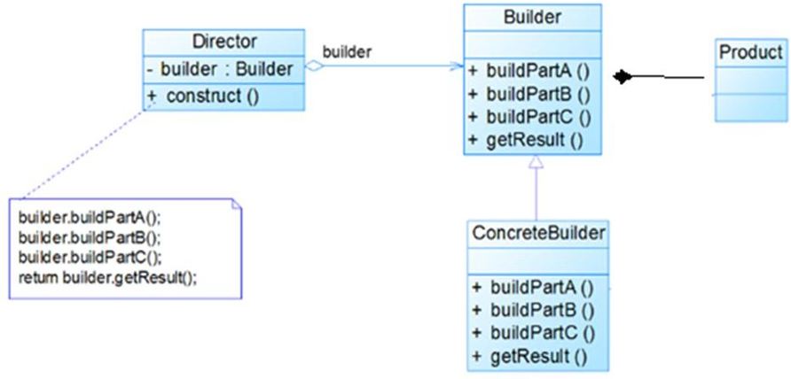

### 4.4 <text style="color:#33a151">建造者模式解决盖房需求应用实例</text>

1)	需要建房子：这一过程为打桩、砌墙、封顶。不管是普通房子也好，别墅也好都需要经历这些过程，下面我们使用建造者模式(``Builder Pattern``)来完成
2)	思路分析图解(类图)

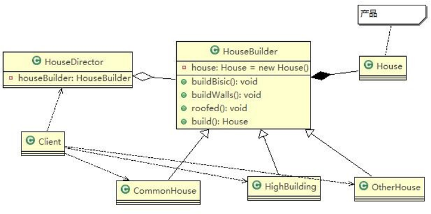

3) 代码实现

目录结构

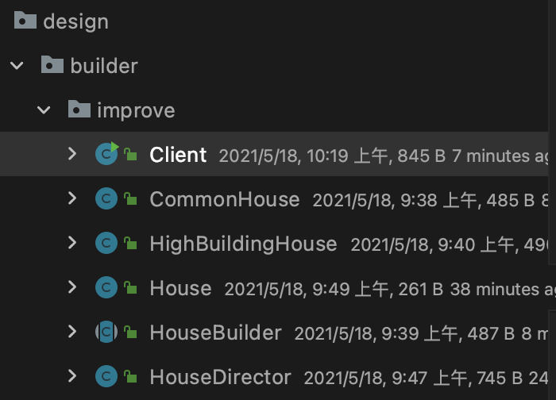


```java
//House.java
// 产 品 ->Product
@Data
public class House {
    private String basis;
    private String wall;
    private String roofed;
}
/***********************************************************/
//HouseBuilder.java
//抽象的建造者
public abstract class HouseBuilder {

    protected House house = new House();

    //将建造的流程写好, 抽象的方法
    public abstract void buildBasis();

    public abstract void buildWalls();

    public abstract void roofed();

    //建造房子好， 将产品(房子) 返回
    public House buildHouse(){
        return house;
    }

}
/***********************************************************/
//HouseDirector.java
//指挥者，这里去指定制作流程，返回产品
public class HouseDirector {
    HouseBuilder houseBuilder = null;

    //通过构造器传入
    public HouseDirector(HouseBuilder houseBuilder){
        this.houseBuilder = houseBuilder;
    }

    //通过setter传入
    public void setHouseBuilder(HouseBuilder houseBuilder){
        this.houseBuilder = houseBuilder;
    }

    //如何处理建造房子的流程，交给指挥者
    public House constructHouse(){
        houseBuilder.buildBasis();
        houseBuilder.buildWalls();
        houseBuilder.roofed();

        return houseBuilder.buildHouse();
    }

}
/***********************************************************/
//CommonHouse.java   --- 具体的建造者
public class CommonHouse extends HouseBuilder {

    @Override
    public void buildBasis() {
        System.out.println(" 普通房子打地基 5 米 ");
    }

    @Override
    public void buildWalls() {
        System.out.println(" 普通房子砌墙 10cm ");
    }

    @Override
    public void roofed() {
        System.out.println(" 普通房子屋顶 ");
    }

}
/***********************************************************/
//HighBuildingHouse.java   --- 具体的建造者
public class HighBuildingHouse extends HouseBuilder {
    @Override
    public void buildBasis() {
        System.out.println(" 高楼的打地基 100 米 ");
    }

    @Override
    public void buildWalls() {
        System.out.println(" 高楼的砌墙 20cm ");
    }

    @Override
    public void roofed() {
        System.out.println(" 高楼的透明屋顶 ");
    }
}
/***********************************************************/
//Client.java
public class Client {
    public static void main(String[] args) {
        //建造普通房子
        CommonHouse commonHouse = new CommonHouse();
        //准备创建房子的指挥者
        HouseDirector houseDirector = new HouseDirector(commonHouse);
        //完成盖房子，返回产品(普通房子)
        houseDirector.constructHouse();

        //System.out.println(" 输 出 流 程 ");

        System.out.println(" ------------------ ");

        //盖高楼
        HighBuildingHouse highBuildingHouse = new HighBuildingHouse();
        //重置建造者
        houseDirector.setHouseBuilder(highBuildingHouse);
        //完成盖房子，返回产品(高楼)
        houseDirector.constructHouse();
    }
}
```
### 4.5 <text style="color:#c2f571">建造者模式在``JDK`` 的应用和源码分析</text>
1)	``java.lang.StringBuilder`` 中的建造者模式
2)	代码说明+``Debug`` 源码


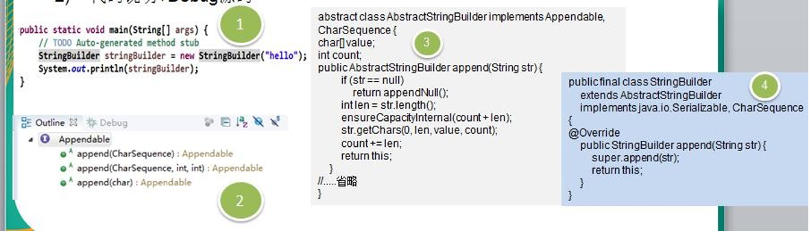

3)	源码中建造者模式角色分析

- 	``Appendable`` 接口定义了多个 ``append`` 方法(抽象方法), 即 ``Appendable`` 为抽象建造者, 定义了抽象方法
-   ``AbstractStringBuilder``  实现了  ``Appendable``  接口方法，这里的  ``AbstractStringBuilder``	已经是建造者，只是不能实例化
-   ``StringBuilder`` 即充当了指挥者角色，同时充当了具体的建造者，建造方法的实现是由 ``AbstractStringBuilder`` 完成 , 而 ``StringBuilder``	继承了 ``AbstractStringBuilder``

### 4.6 <text style="color:#3f4a2f">建造者模式的注意事项和细节</text>
1)	客户端(使用程序)不必知道产品内部组成的细节，将产品本身与产品的创建过程解耦，使得相同的创建过程可以创建不同的产品对象
2)	每一个具体建造者都相对独立，而与其他的具体建造者无关，因此可以很方便地替换具体建造者或增加新的具体建造者， 用户使用不同的具体建造者即可得到不同的产品对象
3)	可以更加精细地控制产品的创建过程 。将复杂产品的创建步骤分解在不同的方法中，使得创建过程更加清晰， 也更方便使用程序来控制创建过程
4)	增加新的具体建造者无须修改原有类库的代码，指挥者类针对抽象建造者类编程，系统扩展方便，符合“开闭原则”
5)	建造者模式所创建的产品一般具有较多的共同点，其组成部分相似，如果产品之间的差异性很大，则不适合使用建造者模式，因此其使用范围受到一定的限制。
6)	如果产品的内部变化复杂，可能会导致需要定义很多具体建造者类来实现这种变化，导致系统变得很庞大，因此在这种情况下，要考虑是否选择建造者模式.
7) > 抽象工厂模式 VS 建造者模式

抽象工厂模式实现对产品家族的创建，一个产品家族是这样的一系列产品：具有不同分类维度的产品组合，采用抽象工厂模式不需要关心构建过程，只关心什么产品由什么工厂生产即可。而建造者模式则是要求按照指定的蓝图建造产品，它的主要目的是通过组装零配件而产生一个新产品


<HR style="border:3 double #987cb9" width="100%" color=#84fa2a SIZE=3>


## 5 <text style="color:#15fa00">适配器设计模式</text>

> 现实生活中的适配器例子

泰国插座用的是两孔的（欧标），可以买个多功能转换插头 (适配器) ，这样就可以使用了。


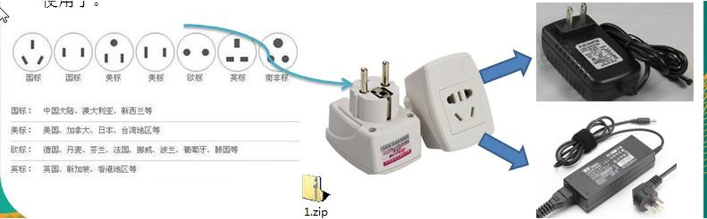

### 5.1 <text style="color:#8a7c74">基本介绍</text>

1)	适配器模式(``Adapter Pattern``)将某个类的接口转换成客户端期望的另一个接口表示，主的目的是兼容性，让原本因接口不匹配不能一起工作的两个类可以协同工作。其别名为包装器(``Wrapper``)
2)	适配器模式属于结构型模式
3)	主要分为三类：类适配器模式、对象适配器模式、接口适配器模式

### 5.2 <text style="color:#524640">工作原理</text>

1)	适配器模式：将一个类的接口转换成另一种接口.让原本接口不兼容的类可以兼容
2)	从用户的角度看不到被适配者，是解耦的
3)	用户调用适配器转化出来的目标接口方法，适配器再调用被适配者的相关接口方法
4)	用户收到反馈结果，感觉只是和目标接口交互，如图

    

### 5.3 <text style="color:#995f42">类适配器模式</text>

#### 5.3.1 	类适配器模式介绍
> 基本介绍

``Adapter`` 类，通过继承 ``src`` 类，实现 ``dst``  类接口，完成 ``src->dst`` 的适配。

#### 5.3.2 类适配器模式应用实例

1. 应用实例说明
以生活中充电器的例子来讲解适配器，充电器本身相当于 ``Adapter``，``220V`` 交流电相当于 ``src`` (即被适配者)，我们的目 ``dst``(即 目标)是 ``5V`` 直流电
2. 思路分析(类图)
   
   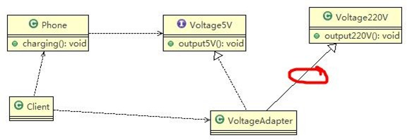  
3. 代码实现

目录结构: 
  


```java
//适配接口
public interface IVoltage5V {
    public int output5V();
}
/***********************************************************/
//被适配的类
public class Voltage220V {
    //输出220V的电压
    public int output220V(){
        int src = 220;
        System.out.println("电压=" + src + "伏");
        return src;
    }
}
/***********************************************************/
//作用类
public class Phone {
    //充电
    public void charging(IVoltage5V iVoltage5V) {
        if (iVoltage5V.output5V() == 5) {
            System.out.println("电压为 5V, 可以充电~~");
        } else if (iVoltage5V.output5V() > 5) {
            System.out.println("电压大于 5V, 不能充电~~");
        }
    }
}
/***********************************************************/
//适配器类
public class VoltageAdapter extends Voltage220V implements IVoltage5V{
    @Override
    public int output5V() {
        //获取到220V的电压
        int srcV = output220V();
        int dstV = srcV / 44;
        return dstV;
    }

}
/***********************************************************/
public class Client {
    public static void main(String[] args) {
        System.out.println(" === 类适配器模式 ====");
        Phone phone = new Phone();
        phone.charging(new VoltageAdapter());
    }
}
```
结果:

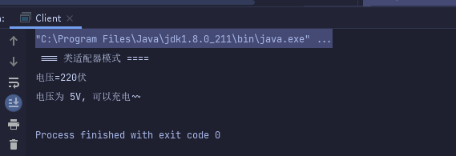  

#### 5.3.3 类适配器模式注意事项和细节
1. ``Java`` 是单继承机制，所以类适配器需要继承 ``src`` 类这一点算是一个缺点, 因为这要求 ``dst`` 必须是接口，有一定局限性;
2. ``src`` 类的方法在 ``Adapter`` 中都会暴露出来，也增加了使用的成本。
3. 由于其继承了 ``src`` 类，所以它可以根据需求重写 ``src`` 类的方法，使得 ``Adapter`` 的灵活性增强了。


<HR style="border:1 double #987cb9" width="100%" color=#768768 SIZE=2>

### 5.4 <text style="color:#702e0c">对象适配器模式</text>

#### 5.4.1 对象适配器模式介绍

1. 基本思路和类的适配器模式相同，只是将 ``Adapter`` 类作修改，不是继承 ``src`` 类，而是持有 ``src`` 类的实例，以解决兼容性的问题。 即：持有 ``src`` 类，实现 dst  类接口，完成 ``src->dst`` 的适配
2. 根据“合成复用原则”，在系统中尽量使用关联关系（聚合）来替代继承关系。
3. 对象适配器模式是适配器模式常用的一种

#### 5.4.2 对象适配器模式应用实例

1. 应用实例说明
以生活中充电器的例子来讲解适配器，充电器本身相当于 ``Adapter，220V`` 交流电相当于 ``src`` (即被适配者)，我们的目 ``dst``(即目标)是 ``5V`` 直流电，使用对象适配器模式完成。
2.思路分析(类图)：只需修改适配器即可, 如下:

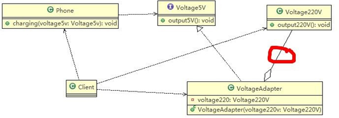  

3. 代码实现

对象适配器主要的不同点在于适配器类采用了类的聚合以及构造器传入的方式
```java
public class VoltageAdapter implements IVoltage5V {

    //关联关系-聚合
    private Voltage220V voltage220V;

    //通过构造器，传入一个 Voltage220V 实例
    public VoltageAdapter(Voltage220V voltage220V) {
        this.voltage220V = voltage220V;
    }

    @Override
    public int output() {
        int dst = 0;
        if (null != voltage220V) {
            int src = voltage220V.output220V();
            System.out.println("使用对象适配器，进行适配~~");
            dst = src / 44;
            System.out.println("适配完成，输出的电压为=" + dst);
        }

        return dst;
    }
}
```
执行结果:

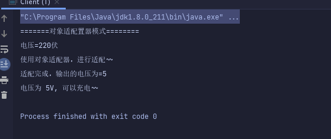  


#### 5.4.3 对象适配器模式注意事项和细节

1. 对象适配器和类适配器其实算是同一种思想，只不过实现方式不同。根据合成复用原则，使用组合替代继承， 所以它解决了类适配器必须继承 ``src`` 的局限性问题，也不再要求 ``dst``
必须是接口。
2. 使用成本更低，更灵活。


<HR style="border:1 double #987cb9" width="100%" color=#768768 SIZE=2>


### 5.5 <text style="color:#cecf99">接口适配器模式</text>

#### 5.5.1 接口适配器模式介绍
1. 一些书籍称为：适配器模式``(Default Adapter Pattern)``或缺省适配器模式。
2. 核心思路：当不需要全部实现接口提供的方法时，可先设计一个抽象类实现接口，并为该接口中每个方法提供一个默认实现（空方法），那么该抽象类的子类可有选择地覆盖父类的某些方法来实现需求
3. 适用于一个接口不想使用其所有的方法的情况。

#### 5.5.2 接口适配器模式应用实例

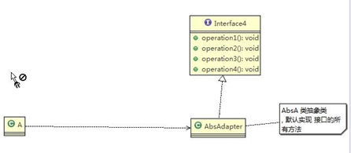  

代码实现:

```java
public interface InterfaceAdapter {
    public void m1();
    public void m2();
    public void m3();
    public void m4();
    public void m5();
}
/***********************************************************/
public class AbsAdapter implements InterfaceAdapter{
    /**
     * 默认实现
     */
    @Override
    public void m1() {

    }

    @Override
    public void m2() {

    }

    @Override
    public void m3() {

    }

    @Override
    public void m4() {

    }

    @Override
    public void m5() {

    }
}
/***********************************************************/
public class Client {
    public static void main(String[] args) {
        //只需要去覆盖我们 需要使用 接口方法
        AbsAdapter adapter = new AbsAdapter() {
            @Override
            public void m1() {
                System.out.println("使用了m1的方法");
            }
        };
        adapter.m1();
    }
}
```
执行结果:

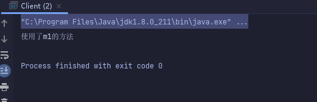  


<HR style="border:3 double #987cb9" width="100%" color=#84fa2a SIZE=3>


## 6 <text style="color:#15fa00">桥接模式</text>


