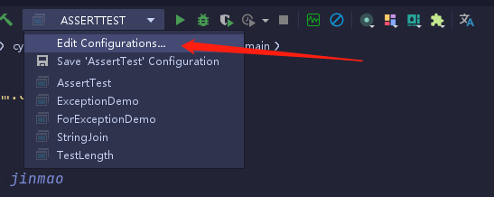
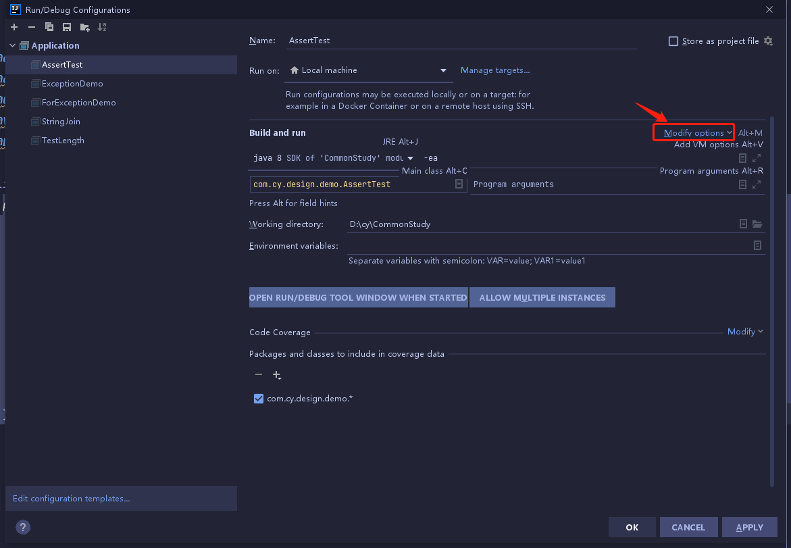
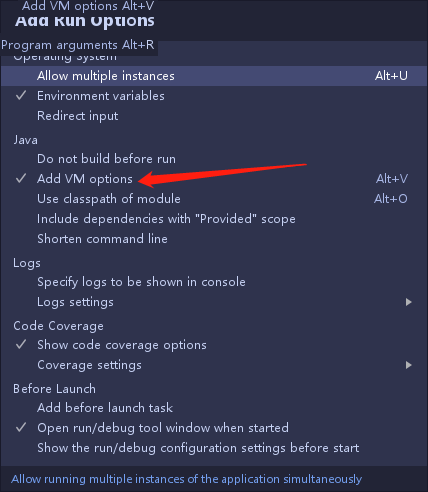
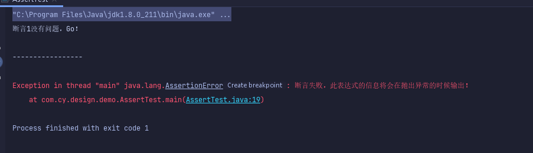

# ``Java``之``assert``关键字

在``Java``中，``assert``关键字是从``JAVA SE 1.4`` 引入的，为了避免和老版本的``Java``代码中使用了``assert``关键字导致错误，``Java``在执行的时候默认是不启动断言检查的（这个时候，所有的断言语句都 将忽略！），如果要开启断言检查，则需要用开关``-enableassertions``或``-ea``来开启。
 
``assert``关键字语法很简单，有两种用法：
 
1. ``assert`` ``<boolean表达式>``

    如果``<boolean表达式>``为``true``，则程序继续执行。

    如果为``false``，则程序抛出``AssertionError``，并终止执行。
 
2. ``assert <boolean表达式>`` : <错误信息表达式>

    如果``<boolean表达式>``为``true``，则程序继续执行。

    如果为``false``，则程序抛出``java.lang.AssertionError``，并输入<错误信息表达式>。
 

## 简单实例

```java
public static void main(String[] args) {
    //断言1结果为true，则继续往下执行
    assert true;
    System. out.println("断言1没有问题，Go！");

    System. out.println("\n-----------------\n");

    //断言2结果为false,程序终止
    assert false : "断言失败，此表达式的信息将会在抛出异常的时候输出！";
    System. out.println("断言2没有问题，Go！");
}
```

由于上述所说,在``IDEA``中需要手动开启 断言机制

开启方法:

  


  


  


输入``-ea``

  


运行结果

  


## 陷阱
 
``assert``关键字用法简单，但是使用``assert``往往会让你陷入越来越深的陷阱中。应避免使用。笔者经过研究，总结了以下原因：
 
1、``assert``关键字需要在运行时候显式开启才能生效，否则你的断言就没有任何意义。而现在主流的``Java IDE``工具默认都没有开启``-ea``断言检查功能。这就意味着你如果使用``IDE``工具编码，调试运行时候会有一定的麻烦。并且，对于``Java Web``应用，程序代码都是部署在容器里面，你没法直接去控制程序的运行，如果一定要开启``-ea``的开关，则需要更改``Web``容器的运行配置参数。这对程序的移 植和部署都带来很大的不便。
 
2、用``assert``代替``if``是陷阱之二。``assert``的判断和``if``语句差不多，但两者的作用有着本质的区别：``assert``关键字本意上是为测试 调试程序时使用的，但如果不小心用``assert``来控制了程序的业务流程，那在测试调试结束后去掉``assert``关键字就意味着修改了程序的正常的逻辑。
 
3、``assert``断言失败将面临程序的退出。这在一个生产环境下的应用是绝不能容忍的。一般都是通过异常处理来解决程序中潜在的错误。但是使用断言就很危险，一旦失败系统就挂了。
 
 
## 对``assert``的思考
 
``assert``既然是为了调试测试程序用，不在正式生产环境下用，那应该考虑更好的测试``JUint``来代替其做用，``JUint``相对``assert``关键的所提供的功能是有过之而无不及。当然完全可以通过``IDE debug``来进行调试测试。在此看来，``assert``的前途一片昏暗。
 
因此，应当避免在``Java``中使用``assert``关键字，除非哪一天``Java``默认支持开启``-ea``的开关，这时候可以考虑。对比一下，``assert``能给你带来多少好处，多少麻烦，这是我们选择是否使用的的原则。

