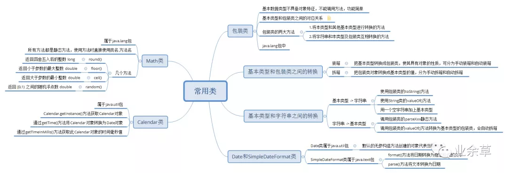

# ``Java``自带的好用的工具类

## ``List``集合拼接成以逗号分隔的字符串

```java
// 如何把list集合拼接成以逗号分隔的字符串 a,b,c 
List<String> list = Arrays.asList("a", "b", "c");  
// 第一种方法，可以用stream流 
String join = list.stream().collect(Collectors.joining(","));  
System.out.println(join); // 输出 a,b,c 
// 第二种方法，其实String也有join方法可以实现这个功能 
String join = String.join(",", list);  
System.out.println(join); // 输出 a,b,c
```

## 比较两个字符串是否相等，忽略大小写
```java
if (strA.equalsIgnoreCase(strB)) {  
  System.out.println("相等");  
}
```

## 比较两个对象是否相等
当我们用 ``equals`` 比较两个对象是否相等的时候，还需要对左边的对象进行判空，不然可能会报空指针异常，我们可以用 ``java.util`` 包下 ``Objects`` 封装好的比较是否相等的方法。

```java
Objects.equals(strA, strB);
//源码是这样的
public static boolean equals(Object a, Object b) {  
    return (a == b) || (a != null && a.equals(b));  
}
```

## 两个``List``取交集
```java
List<String> list1 = new ArrayList<>();  
list1.add("a");  
list1.add("b");  
list1.add("c");  
List<String> list2 = new ArrayList<>();  
list2.add("a");  
list2.add("b");  
list2.add("d");  
list1.retainAll(list2);  
System.out.println(list1);
// 输出[a, b]
```
# 使用``apache commons`` 工具类库

## 字符串判空

传参 ``CharSequence`` 类型是 ``String、StringBuilder、StringBuffer`` 的父类，都可以直接下面方法判空，以下是源码：

```java

public static boolean isEmpty(final CharSequence cs) {  
    return cs == null || cs.length() == 0;  
}  
  
public static boolean isNotEmpty(final CharSequence cs) {  
    return !isEmpty(cs);  
}  
  
// 判空的时候，会去除字符串中的空白字符，比如空格、换行、制表符 
public static boolean isBlank(final CharSequence cs) {  
    final int strLen = length(cs);  
    if (strLen == 0) {  
        return true;  
    }  
    for (int i = 0; i < strLen; i++) {  
        if (!Character.isWhitespace(cs.charAt(i))) {  
            return false;  
        }  
    }  
    return true;  
}  
  
public static boolean isNotBlank(final CharSequence cs) {  
    return !isBlank(cs);  
}
```
## 首字母转成大写

```Java
String str = "yideng";  
String capitalize = StringUtils.capitalize(str);  
System.out.println(capitalize); // 输出Yideng
```
## 重复拼接字符串
```java
String str = StringUtils.repeat("ab", 2);  
System.out.println(str); // 输出abab
```
## 格式化日期
```java
// Date类型转String类型 
String date = DateFormatUtils.format(new Date(), "yyyy-MM-dd HH:mm:ss");  
System.out.println(date); // 输出 2021-05-01 01:01:01 
  
// String类型转Date类型 
Date date = DateUtils.parseDate("2021-05-01 01:01:01", "yyyy-MM-dd HH:mm:ss");  
  
// 计算一个小时后的日期 
Date date = DateUtils.addHours(new Date(), 1);
```

## 包装临时对象
当一个方法需要返回两个及以上字段时，我们一般会封装成一个临时对象返回，现在有了 ``Pair`` 和 ``Triple`` 就不需要了。
```java
// 返回两个字段 
ImmutablePair<Integer, String> pair = ImmutablePair.of(1, "yideng");  
System.out.println(pair.getLeft() + "," + pair.getRight()); // 输出 1,yideng 
// 返回三个字段 
ImmutableTriple<Integer, String, Date> triple = ImmutableTriple.of(1, "yideng", new Date());  
System.out.println(triple.getLeft() + "," + triple.getMiddle() + "," + triple.getRight()); // 输出 1,yideng,Wed Apr 07 23:30:00 CST 2021
```

# ``commons-collections`` 集合工具类

```xml
<dependency>  
    <groupId>org.apache.commons</groupId>  
    <artifactId>commons-collections4</artifactId>  
    <version>4.4</version>  
</dependency>
```
## 集合判空
封装了集合判空的方法，以下是源码：

```java
public static boolean isEmpty(final Collection<?> coll) {  
    return coll == null || coll.isEmpty();  
}  
  
public static boolean isNotEmpty(final Collection<?> coll) {  
    return !isEmpty(coll);  
}  
// 两个集合取交集 
Collection<String> collection = CollectionUtils.retainAll(listA, listB);  
// 两个集合取并集 
Collection<String> collection = CollectionUtils.union(listA, listB);  
// 两个集合取差集 
Collection<String> collection = CollectionUtils.subtract(listA, listB);
```
# ``common-beanutils`` 操作对象
```xml
<dependency>  
    <groupId>commons-beanutils</groupId>  
    <artifactId>commons-beanutils</artifactId>  
    <version>1.9.4</version>  
</dependency>
```
```java
public class User {  
    private Integer id;  
    private String name;  
}
/******************************************************************/
User user = new User();  
BeanUtils.setProperty(user, "id", 1);  
BeanUtils.setProperty(user, "name", "yideng");  
System.out.println(BeanUtils.getProperty(user, "name")); // 输出 yideng 
System.out.println(user); // 输出 {"id":1,"name":"yideng"}
/******************************************************************/
//对象和 map 互转
Map<String, String> map = BeanUtils.describe(user);  
System.out.println(map); // 输出 {"id":"1","name":"yideng"} 
// map转对象 
User newUser = new User();  
BeanUtils.populate(newUser, map);  
System.out.println(newUser); // 输出 {"id":1,"name":"yideng"}
```

# ``commons-io`` 文件流处理
```xml
<dependency>  
    <groupId>commons-io</groupId>  
    <artifactId>commons-io</artifactId>  
    <version>2.8.0</version>  
</dependency>
```
文件处理
```java
File file = new File("demo1.txt");  
// 读取文件 
List<String> lines = FileUtils.readLines(file, Charset.defaultCharset());  
// 写入文件 
FileUtils.writeLines(new File("demo2.txt"), lines);  
// 复制文件 
FileUtils.copyFile(srcFile, destFile);
```   
# ``Google Guava`` 工具类库

```xml
<dependency>  
    <groupId>com.google.guava</groupId>  
    <artifactId>guava</artifactId>  
    <version>30.1.1-jre</version>  
</dependency>
```

## 创建集合
```java
List<String> list = Lists.newArrayList();  
List<Integer> list = Lists.newArrayList(1, 2, 3);  
// 反转list 
List<Integer> reverse = Lists.reverse(list);  
System.out.println(reverse); // 输出 [3, 2, 1] 
// list集合元素太多，可以分成若干个集合，每个集合10个元素 
List<List<Integer>> partition = Lists.partition(list, 10);  
  
Map<String, String> map = Maps.newHashMap();  
Set<String> set = Sets.newHashSet();
```

## ``Multimap`` 一个 ``key`` 可以映射多个 ``value`` 的 ``HashMap``

```java

Multimap<String, Integer> map = ArrayListMultimap.create();  
map.put("key", 1);  
map.put("key", 2);  
Collection<Integer> values = map.get("key");  
System.out.println(map); // 输出 {"key":[1,2]} 
// 还能返回你以前使用的臃肿的Map 
Map<String, Collection<Integer>> collectionMap = map.asMap();
```
多省事，多简洁，省得你再创建 Map<String, List>

## ``BiMap`` 一种连 ``value`` 也不能重复的 `HashMap`

```java
BiMap<String, String> biMap = HashBiMap.create();  
// 如果value重复，put方法会抛异常，除非用forcePut方法 
biMap.put("key","value");  
System.out.println(biMap); // 输出 {"key":"value"} 
// 既然value不能重复，何不实现个翻转key/value的方法，已经有了 
BiMap<String, String> inverse = biMap.inverse();  
System.out.println(inverse); // 输出 {"value":"key"}
```
这其实是双向映射，在某些场景还是很实用的。

  

## ``Table`` 一种有两个 ``key`` 的 ``HashMap``
```java
// 一批用户，同时按年龄和性别分组 
Table<Integer, String, String> table = HashBasedTable.create();  
table.put(18, "男", "yideng");  
table.put(18, "女", "Lily");  
System.out.println(table.get(18, "男")); // 输出 yideng 
// 这其实是一个二维的Map，可以查看行数据 
Map<String, String> row = table.row(18);  
System.out.println(row); // 输出 {"男":"yideng","女":"Lily"} 
// 查看列数据 
Map<Integer, String> column = table.column("男");  
System.out.println(column); // 输出 {18:"yideng"}
```
## ``Multiset`` 一种用来计数的 ``Set``
```java
Multiset<String> multiset = HashMultiset.create();  
multiset.add("apple");  
multiset.add("apple");  
multiset.add("orange");  
System.out.println(multiset.count("apple")); // 输出 2 
// 查看去重的元素 
Set<String> set = multiset.elementSet();  
System.out.println(set); // 输出 ["orange","apple"] 
// 还能查看没有去重的元素 
Iterator<String> iterator = multiset.iterator();  
while (iterator.hasNext()) {  
    System.out.println(iterator.next());  
}  
// 还能手动设置某个元素出现的次数 
multiset.setCount("apple", 5);
```


