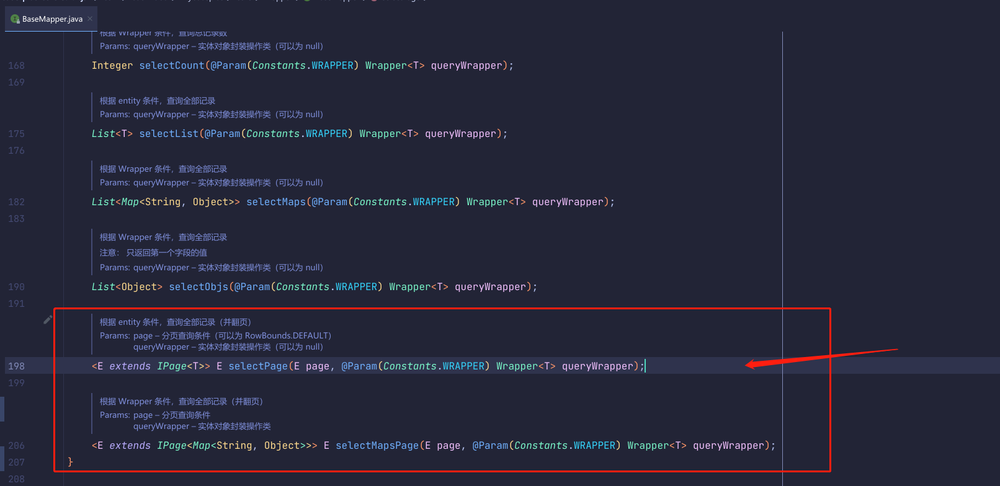

# ``MybatisPlus``实现分页查询

## 分页区别
分页查询每个人程序猿几乎都使用过，但是有部分同学不懂什么是物理分页和逻辑分页。

物理分页：相当于执行了``limit``分页语句，返回部分数据。物理分页只返回部分数据占用内存小，能够获取数据库最新的状态，实施性比较强，一般适用于数据量比较大，数据更新比较频繁的场景。

逻辑分页：一次性把全部的数据取出来，通过程序进行筛选数据。如果数据量大的情况下会消耗大量的内存，由于逻辑分页只需要读取数据库一次，不能获取数据库最新状态，实施性比较差，适用于数据量小，数据稳定的场合。

那么MP中的物理分页怎么实现呢？ 往下看往下看

## 配置

需要新建一个``JavaConfig``类
```java
@Configuration
public class MyBatisPlusConfig {
    /**
     * 分页插件
     * @return
     */
    @Bean
    public PaginationInterceptor paginationInterceptor() {
        return new PaginationInterceptor();
    }
}
```
## 具体分页实现
``MP``的``Wrapper``提供了两种分页查询的方式，源码如下：
  

可见两个分页方法参数都是一致的，只是返回参数略有不同，具体选择根据实际业务为准。

```java
/**
* 分页查询
*/
@Test
public void selectByPage() {
    QueryWrapper<User> wrapper = new QueryWrapper();
    wrapper.like("name", "雨").lt("age", 40);

    Page<User> page = new Page<>(1,2);

    //IPage<User> userIPage = userMapper.selectPage(page, wrapper);

    IPage<Map<String, Object>> mapIPage = userMapper.selectMapsPage(page, wrapper);


    System.out.println("总页数"+mapIPage.getPages());
    System.out.println("总记录数"+mapIPage.getTotal());
    List<Map<String, Object>> records = mapIPage.getRecords();
    records.forEach(System.out::println);
}
```
以上分页查询执行``sql``如下，先是查询了一次总记录数，然后在查询的数据。

```sql
DEBUG==>  Preparing: SELECT COUNT(1) FROM user WHERE name LIKE ? AND age < ? 
DEBUG==> Parameters: %雨%(String), 40(Integer)
TRACE<==    Columns: COUNT(1)
TRACE<==        Row: 2
DEBUG==>  Preparing: SELECT id,name,age,email,manager_id,create_time FROM user WHERE name LIKE ? AND age < ? LIMIT ?,? 
DEBUG==> Parameters: %雨%(String), 40(Integer), 0(Long), 2(Long)
TRACE<==    Columns: id, name, age, email, manager_id, create_time
TRACE<==        Row: 2, 张雨琪, 31, zjq@baomidou.com, 1088248166370832385, 2021-01-14 09:15:15
TRACE<==        Row: 3, 刘红雨, 31, lhm@baomidou.com, 1088248166370832385, 2021-01-14 09:48:16
DEBUG<==      Total: 2
总页数1
总记录数2
```
现在我们有需求只要查询数据即可， 不关心总记录数等，如果使用默认的方式就消耗不必要的性能。那么解决办法也是很简单的，只需要在创建``page``对象时传入第三个参数为``false``即可。
```java
Page<User> page = new Page<>(1,2,false);
```


