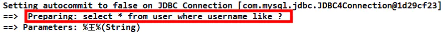
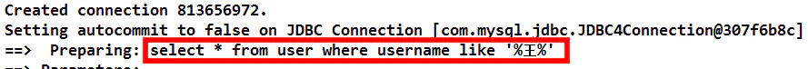

# `Mybatis`使用`Sql`进行模糊查询


## 方式一

```xml
<!-- 根据名称模糊查询 -->
<select id="findByName" resultType="com.sc.domain.User" parameterType="String">
    select * from user where username like #{username}
</select>
```

模糊查询的测试方法

```java
List<User> users = userDao.findByName("%王%");
```

  


我们在配置文件中没有加入`%`来作为模糊查询的条件，所以在传入字符串实参时，就需要给定模糊查询的标
识%。配置文件中的`#{username}`也只是一个占位符，所以 `SQL` 语句显示为`“？”`。

## 方式二

```xml
<select id="findByName" parameterType="string" resultType="com.sc.domain.User">
 select * from user where username like '%${value}%'
</select>
```
我们在上面将原来的`#{}`占位符，改成了`{value}`。注意如果用模糊查询的这种写法，那么`${value}`的写法就是固定的，不能写成其它名字。

```java
//执行查询一个方法
List<User> users = userDao.findByName("王");
```

  

可以发现，我们在程序代码中就不需要加入模糊查询的匹配符%了，这两种方式的实现效果是一样的，但执行
的语句是不一样的。

## 方式三


说明：通过前两种写法，虽然可以解决模糊查询的问题，但是还是不好，因为通过`%`的方式会引发`sql`注入的问题，现在的期望是：既能够解决`sql`注入又能在配置文件中写`%`该如何实现呢，可以借助`mysql`的函数。

修改 `SQL` 语句的配置，配置如下：
```xml
<select id="findByName" parameterType="string" resultType="com.sc.domain.User">
 select * from user where username like concat('%',#{username},'%')
</select>
```

`*#{ }`是预编译处理，`MyBatis`在处理`#{ }`时，它会将`sql`中的`#{ }`替换为`？`，然后调用`PreparedStatement`的`set`方法来赋值，传入字符串后，会在值两边加上单引号，使用占位符的方式提高效率，可以防止`sql`注入。
`${}:`表示拼接`sql`串，将接收到参数的内容不加任何修饰拼接在`sql`中，可能引发`sql`注入。


