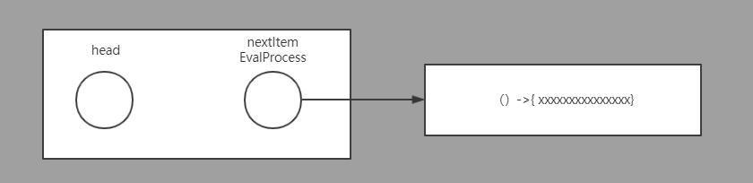
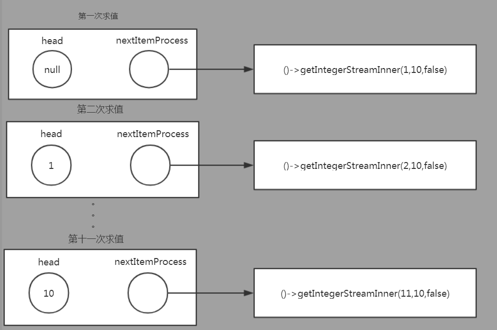
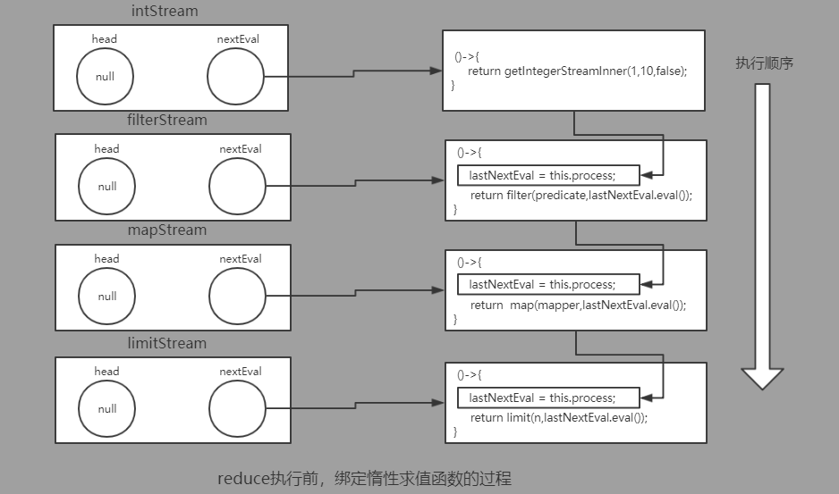
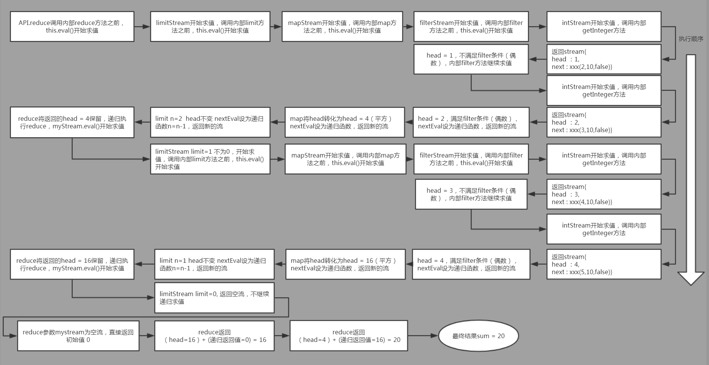
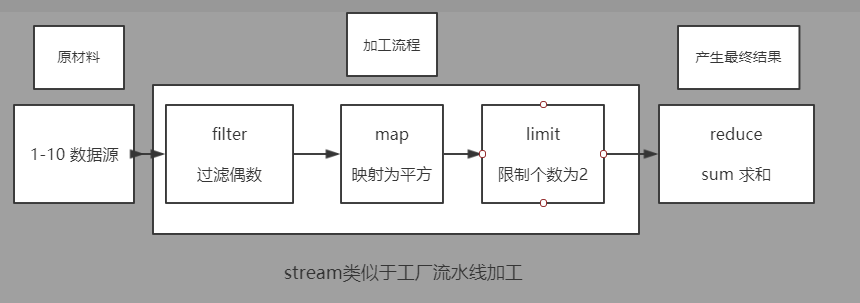
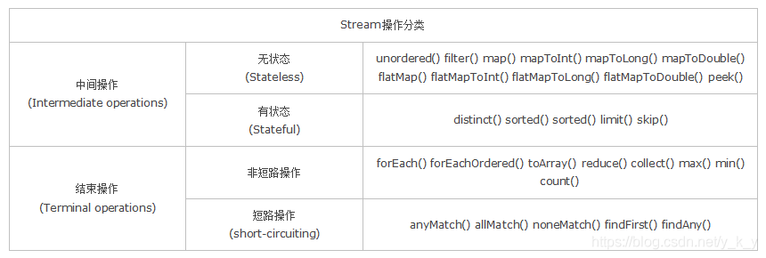

# ``Stream`` 流的介绍

## 1.1 ``java8 stream``介绍
　　``java8``新增了``stream``流的特性，能够让用户以函数式的方式、更为简单的操纵集合等数据结构，并实现了用户无感知的并行计算。

## 1.2 从零开始实现一个``stream``流
　　相信很多人在使用过``java8``的``streamAPI``接口之后，都会对其实现原理感到好奇，但往往在看到``jdk``的``stream``源码后却被其复杂的抽象、封装给弄糊涂了，而无法很好的理解其背后的原理。究其原因，是因为``jdk``的``stream``源码是高度工程化的代码，工程化的代码为了效率和满足各式各样的需求，会将代码实现的极其复杂，不易理解。

　　在这里，我们将抛开``jdk``的实现思路，从零开始实现一个``stream``流。

　　我们的``stream``流同样拥有惰性求值，函数式编程接口等特性，并兼容``jdk``的``Collection``等数据结构(但不支持并行计算 ``orz``)。

　　相信在亲手实现一个``stream``流的框架之后，大家能更好的理解流计算的原理。

## ``stream``的优点

在探讨探究``stream``的实现原理和动手实现之前，我们先要体会``stream``流计算的独特之处。

> 举个例子： 有一个``List<Person>``列表,我们需要获得年龄为``70``岁的前``10``个``Person``的姓名。

> 过程式的解决方案：

　　稍加思考，我们很快就写出了一个过程式的解决方案(伪代码)：
```java
List<Person> personList = fromDB(); // 获得List<Person>
int limit = 10; // 限制条件
List<String> nameList = new ArrayList(); // 收集的姓名集合
for(Person personItem : personList){
    if(personItem.age == 70){ // 满足条件
        nameList.add(personItem.name); // 加入姓名集合
        if(nameList.size() >= 10){ // 判断是否超过限制
            break;
        }
    }
}
return nameList;
```
> 函数式``stream``解决方案：

　　下面我们给出一种基于``stream``流的解决方案(伪代码)：
```java
List<Person> personList = fromDB(); // 获得List<Person>
List<String> nameList = personList.stream()
　　　　　　.filter(item->item.age == 70) // 过滤条件
　　　　　　.limit(10)    // limit限制条件
　　　　　　.map(item->item.name) // 获得姓名
　　　　　　.collect(Collector.toList()); // 转化为list

return nameList;
```

两种方案的不同之处：

　　从函数式的角度上看，过程式的代码实现将收集元素、循环迭代、各种逻辑判断耦合在一起，暴露了太多细节。当未来需求变动和变得更加复杂的情况下，过程式的代码将变得难以理解和维护(需要控制台打印出 年龄为``70``岁的前10个``Person``中，姓王的``Person``的名称）。

　　函数式的解决方案解开了代码细节和业务逻辑的耦合，类似于``sql``语句，表达的是"要做什么"而不是"如何去做"，使程序员可以更加专注于业务逻辑，写出易于理解和维护的代码。

```java
List<Person> personList = fromDB(); // 获得List<Person>
personList.stream()
    .filter(item->item.age == 70) // 过滤条件
    .limit(10)    // limit限制条件
    .filter(item->item.name.startWith("王"))  // 过滤条件
    .map(item->item.name) // 获得姓名
    .forEach(System.out::println);
```


# ``stream API``接口介绍

``stream API``的接口是函数式的，尽管``java 8``也引入了``lambda``表达式，但``java``实质上依然是由接口-匿名内部类来实现函数传参的，所以需要事先定义一系列的函数式接口。

> ``Function:`` 类似于 ``y = F(x)``

```java
@FunctionalInterface
public interface Function<R,T> {

    /**
     * 函数式接口
     * 类似于 y = F(x)
     * */
    R apply(T t);
}
```
> ``BiFunction``: 类似于 ``z = F(x,y)``

```java
@FunctionalInterface
public interface BiFunction<R, T, U> {

    /**
     * 函数式接口
     * 类似于 z = F(x,y)
     * */
    R apply(T t, U u);
}
```
> ``ForEach``: 遍历处理

```java
@FunctionalInterface
public interface ForEach <T>{

    /**
     * 迭代器遍历
     * @param item 被迭代的每一项
     * */
    void apply(T item);
}
```

``Comparator``: 比较器

```java
@FunctionalInterface
public interface Comparator<T>  {

    /**
     * 比较方法逻辑
     * @param o1    参数1
     * @param o2    参数2
     * @return      返回值大于0 ---> (o1 > o2)
     *              返回值等于0 ---> (o1 = o2)
     *              返回值小于0 ---> (o1 < o2)
     */
    int compare(T o1, T o2);
}
```

> ``Predicate:`` 条件判断

```java
@FunctionalInterface
public interface Predicate <T>{

    /**
     * 函数式接口
     * @param item 迭代的每一项
     * @return true 满足条件
     *          false 不满足条件
     * */
    boolean satisfy(T item);
}
```
> ``Supplier：``提供初始值
```java
@FunctionalInterface
public interface Supplier<T> {

    /**
     * 提供初始值
     * @return 初始化的值
     * */
    T get();
}
```

> ``EvalFunction：stream``求值函数
```java
@FunctionalInterface
public interface EvalFunction<T> {

    /**
     * stream流的强制求值方法
     * @return 求值返回一个新的stream
     * */
    MyStream<T> apply();
}
```
## ``stream API``接口：

```java
/**
 * stream流的API接口
 */
public interface Stream<T> {

    /**
     * 映射 lazy 惰性求值
     * @param mapper 转换逻辑 T->R
     * @return 一个新的流
     * */
    <R> MyStream<R> map(Function<R,T> mapper);

    /**
     * 扁平化 映射 lazy 惰性求值
     * @param mapper 转换逻辑 T->MyStream<R>
     * @return  一个新的流(扁平化之后)
     * */
    <R> MyStream<R> flatMap(Function<? extends MyStream<R>, T> mapper);

    /**
     * 过滤 lazy 惰性求值
     * @param predicate 谓词判断
     * @return 一个新的流，其中元素是满足predicate条件的
     * */
    MyStream<T> filter(Predicate<T> predicate);

    /**
     * 截断 lazy 惰性求值
     * @param n 截断流，只获取部分
     * @return 一个新的流，其中的元素不超过 n
     * */
    MyStream<T> limit(int n);

    /**
     * 去重操作 lazy 惰性求值
     * @return 一个新的流，其中的元素不重复(!equals）
     * */
    MyStream<T> distinct();

    /**
     * 窥视 lazy 惰性求值
     * @return 同一个流，peek不改变流的任何行为
     * */
    MyStream<T> peek(ForEach<T> consumer);

    /**
     * 遍历 eval 强制求值
     * @param consumer 遍历逻辑
     * */
    void forEach(ForEach<T> consumer);

    /**
     * 浓缩 eval 强制求值
     * @param initVal 浓缩时的初始值
     * @param accumulator 浓缩时的 累加逻辑
     * @return 浓缩之后的结果
     * */
    <R> R reduce(R initVal, BiFunction<R, R, T> accumulator);

    /**
     * 收集 eval 强制求值
     * @param collector 传入所需的函数组合子，生成高阶函数
     * @return 收集之后的结果
     * */
    <R, A> R collect(Collector<T,A,R> collector);

    /**
     * 最大值 eval 强制求值
     * @param comparator 大小比较逻辑
     * @return 流中的最大值
     * */
    T max(Comparator<T> comparator);

    /**
     * 最小值 eval 强制求值
     * @param comparator 大小比较逻辑
     * @return 流中的最小值
     * */
    T min(Comparator<T> comparator);

    /**
     * 计数 eval 强制求值
     * @return  当前流的个数
     * */
    int count();

    /**
     * 流中是否存在满足predicate的项
     * @return true 存在 匹配项
     *         false 不存在 匹配项
     * */
    boolean anyMatch(Predicate<? super T> predicate);

    /**
     * 流中的元素是否全部满足predicate
     * @return true 全部满足
     *          false 不全部满足
     * */
    boolean allMatch(Predicate<? super T> predicate);

    /**
     * 返回空的 stream
     * @return 空stream
     * */
    static <T> MyStream<T> makeEmptyStream(){
        // isEnd = true
        return new MyStream.Builder<T>().isEnd(true).build();
    }
}
```

##  ``MyStream`` 实现细节

简单介绍了``API``接口定义之后，我们开始深入探讨流的内部实现。

　　流由两个重要的部分所组成，当前数据项(head)"和"下一数据项的求值函数``(nextItemEvalProcess)``。

　　其中，``nextItemEvalProcess``是流能够实现"惰性求值"的关键。




> 流的基本属性：

```java
public class MyStream<T> implements Stream<T> {
    /**
     * 流的头部
     * */
    private T head;

    /**
     * 流的下一项求值函数
     * */
    private NextItemEvalProcess nextItemEvalProcess;

    /**
     * 是否是流的结尾
     * */
    private boolean isEnd;

    public static class Builder<T>{
        private MyStream<T> target;

        public Builder() {
            this.target = new MyStream<>();
        }

        public Builder<T> head(T head){
            target.head = head;
            return this;
        }

        Builder<T> isEnd(boolean isEnd){
            target.isEnd = isEnd;
            return this;
        }

        public Builder<T> nextItemEvalProcess(NextItemEvalProcess nextItemEvalProcess){
            target.nextItemEvalProcess = nextItemEvalProcess;
            return this;
        }

        public MyStream<T> build(){
            return target;
        }
    }

   /**
     * 当前流强制求值
     * @return 求值之后返回一个新的流
     * */
    private MyStream<T> eval(){
        return this.nextItemEvalProcess.eval();
    }

    /**
     * 当前流 为空
     * */
    private boolean isEmptyStream(){
        return this.isEnd;
    }
}
```

```java
/**
 * 下一个元素求值过程
 */
public class NextItemEvalProcess {

    /**
     * 求值方法
     * */
    private EvalFunction evalFunction;

    public NextItemEvalProcess(EvalFunction evalFunction) {
        this.evalFunction = evalFunction;
    }

    MyStream eval(){
        return evalFunction.apply();
    }
}
```

### 4.1 ``stream``流在使用过程中的三个阶段

1. 生成并构造一个流 (List.stream() 等方法)

2. 在流的处理过程中添加、绑定惰性求值流程  (map、filter、limit 等方法)

3. 对流使用强制求值函数，生成最终结果 (max、collect、forEach等方法)

### 4.2 生成并构造一个流

　　流在生成时是"纯净"的，其最初的``NextItemEvalProcess``求值之后就是指向自己的下一个元素。

　　我们以一个``Integer``整数流的生成为例。``IntegerStreamGenerator.getIntegerStream(1,10) ``会返回一个流结构，其逻辑上等价于一个从``1``到``10``的整数流。但实质是一个惰性求值的``stream``对象，这里称其为``IntStream``，其``NextItemEvalProcess``是一个闭包，方法体是一个递归结构的求值函数，其中下界参数``low = low + 1``。

　　当``IntStream``第一次被求值时，流开始初始化，``isStart = false``。当初始化完成之后，每一次求值，都会生成一个新的流对象，其中``head(low) = low + 1``。当``low > high``时，流被终止，返回空的流对象。



```java
/**
 * 整数流生成器
 */
public class IntegerStreamGenerator {
    /**
     * 获得一个有限的整数流 介于[low-high]之间
     * @param low 下界
     * @param high 上界
     * */
    public static MyStream<Integer> getIntegerStream(int low, int high){
        return getIntegerStreamInner(low,high,true);
    }

    /**
     * 递归函数。配合getIntegerStream(int low,int high)
     * */
    private static MyStream<Integer> getIntegerStreamInner(int low, int high, boolean isStart){
        if(low > high){
            // 到达边界条件，返回空的流
            return Stream.makeEmptyStream();
        }
        if(isStart){
            return new MyStream.Builder<Integer>()
                    .process(new NextItemEvalProcess(()->getIntegerStreamInner(low,high,false)))
                    .build();
        }else{
            return new MyStream.Builder<Integer>()
                    // 当前元素 low
                    .head(low)
                    // 下一个元素 low+1
                    .process(new NextItemEvalProcess(()->getIntegerStreamInner(low+1,high,false)))
                    .build();
        }
    }
}
```

可以看到，生成一个流的关键在于确定如何求值下一项元素。对于整数流来说，``low = low + 1``就是其下一项的求值过程。

　　那么对于我们非常关心的``jdk``集合容器，又该如何生成对应的流呢?

　　答案是``Iterator``迭代器，``jdk``的集合容器都实现了``Iterator``迭代器接口，通过迭代器我们可以轻易的取得容器的下一项元素，而不用关心容器内部实现细节。换句话说，只要实现过迭代器接口，就可以自然的转化为``stream``流，从而获得流计算的所有能力。

```java
/**
 * 集合流生成器
 */
public class CollectionStreamGenerator {
    /**
     * 将一个List转化为stream流
     * */
    public static <T> MyStream<T> getListStream(List<T> list){
        return getListStream(list.iterator(),true);
    }

    /**
     * 递归函数
     * @param iterator list 集合的迭代器
     * @param isStart 是否是第一次迭代
     * */
    private static <T> MyStream<T> getListStream(Iterator<T> iterator, boolean isStart){
        if(!iterator.hasNext()){
            // 不存在迭代的下一个元素，返回空的流
            return Stream.makeEmptyStream();
        }

        if(isStart){
            // 初始化，只需要设置 求值过程
            return new MyStream.Builder<T>()
                    .nextItemEvalProcess(new NextItemEvalProcess(()-> getListStream(iterator,false)))
                    .build();
        }else{
            // 非初始化，设置head和接下来的求值过程
            return new MyStream.Builder<T>()
                    .head(iterator.next())
                    .nextItemEvalProcess(new NextItemEvalProcess(()-> getListStream(iterator,false)))
                    .build();
        }
    }
}
```

## 举例分析

　　我们选择一个简单而又不失一般性的例子，串联起这些内容。通过完整的描述一个流求值的全过程，加深大家对流的理解。

```java
public static void main(String[] args){
    Integer sum = IntegerStreamGenerator.getIntegerStream(1,10)
                .filter(item-> item%2 == 0) // 过滤出偶数
                .map(item-> item * item)    // 映射为平方
                .limit(2)                   // 截取前两个
                .reduce(0,(i1,i2)-> i1+i2); // 最终结果累加求和(初始值为0)

    System.out.println(sum); // 20
}
```

> 由于我们的``stream``实现采用的是链式编程的方式，不太好理解，将其展开为逻辑等价的形式。

```java
public static void main(String[] args){　　　　 // 生成整数流 1-10
    Stream<Integer> intStream = IntegerStreamGenerator.getIntegerStream(1,10);
    // intStream基础上过滤出偶数
    Stream<Integer> filterStream =  intStream.filter(item-> item%2 == 0);
    // filterStream基础上映射为平方
    Stream<Integer> mapStream = filterStream.map(item-> item * item);
    // mapStream基础上截取前两个
    Stream<Integer> limitStream = mapStream.limit(2);
    // 最终结果累加求和(初始值为0)
    Integer sum = limitStream.reduce(0,(i1,i2)-> i1+i2);

    System.out.println(sum); // 20
}
```

> ``reduce``强制求值操作之前的执行过程图：




> ``reduce``强制求值过程中的执行过程图 ：





可以看到，``stream``的求值过程并不会一口气将初始的流全部求值，而是按需的、一个一个的进行求值。

``stream``的一次求值过程至多只会遍历流中元素一次；如果存在短路操作(``limit、anyMatch``等)，实际迭代的次数会更少。

因此不必担心多层的``map、filter``处理逻辑的嵌套会让流进行多次迭代，导致效率急剧下降。





<hr/>


## 具体用法




- 无状态：指元素的处理不受之前元素的影响；

- 有状态：指该操作只有拿到所有元素之后才能继续下去。

- 非短路操作：指必须处理所有元素才能得到最终结果；

- 短路操作：指遇到某些符合条件的元素就可以得到最终结果，如`` A || B``，只要``A``为``true``，则无需判断``B``的结果。

### 1. 流的常用创建方法

#### 1.1 使用``Collection``下的 ``stream()`` 和 ``parallelStream()`` 方法

```java
List<String> list = new ArrayList<>();
Stream<String> stream = list.stream(); //获取一个顺序流
Stream<String> parallelStream = list.parallelStream(); //获取一个并行流
```
#### 1.2 使用``Arrays`` 中的 ``stream()`` 方法，将数组转成流

```java
Integer[] nums = new Integer[10];
Stream<Integer> stream = Arrays.stream(nums);
```
#### 1.3 使用``Stream``中的静态方法：``of()、iterate()、generate()``

```java
Stream<Integer> stream = Stream.of(1,2,3,4,5,6);
 
Stream<Integer> stream2 = Stream.iterate(0, (x) -> x + 2).limit(6);
stream2.forEach(System.out::println); // 0 2 4 6 8 10
 
Stream<Double> stream3 = Stream.generate(Math::random).limit(2);
stream3.forEach(System.out::println);
```

#### 1.4 使用 ``BufferedReader.lines()`` 方法，将每行内容转成流

```java
BufferedReader reader = new BufferedReader(new FileReader("F:\\test_stream.txt"));
Stream<String> lineStream = reader.lines();
lineStream.forEach(System.out::println);
```

#### 1.5 使用 ``Pattern.splitAsStream()`` 方法，将字符串分隔成流

```java
Pattern pattern = Pattern.compile(",");
Stream<String> stringStream = pattern.splitAsStream("a,b,c,d");
stringStream.forEach(System.out::println);
```

### ``2.`` 流的中间操作

#### ``2.1`` 筛选与切片

``filter：``过滤流中的某些元素

``limit(n)：``获取``n``个元素

``skip(n)：``跳过``n``元素，配合``limit(n)``可实现分页

``distinct：``通过流中元素的 ``hashCode()`` 和 ``equals()`` 去除重复元素

```java
Stream<Integer> stream = Stream.of(6, 4, 6, 7, 3, 9, 8, 10, 12, 14, 14);
 
Stream<Integer> newStream = stream.filter(s -> s > 5) //6 6 7 9 8 10 12 14 14
        .distinct() //6 7 9 8 10 12 14
        .skip(2) //9 8 10 12 14
        .limit(2); //9 8
newStream.forEach(System.out::println);
```

#### ``2.2`` 映射        
- ``map：``接收一个函数作为参数，该函数会被应用到每个元素上，并将其映射成一个新的元素。
- ``flatMap：``接收一个函数作为参数，将流中的每个值都换成另一个流，然后把所有流连接成一个流。

```java
List<String> list = Arrays.asList("a,b,c", "1,2,3");
 
//将每个元素转成一个新的且不带逗号的元素
Stream<String> s1 = list.stream().map(s -> s.replaceAll(",", ""));
s1.forEach(System.out::println); // abc  123
 
Stream<String> s3 = list.stream().flatMap(s -> {
    //将每个元素转换成一个stream
    String[] split = s.split(",");
    Stream<String> s2 = Arrays.stream(split);
    return s2;
});
s3.forEach(System.out::println); // a b c 1 2 3
```

#### ``2.3`` 排序
- ``sorted()：``自然排序，流中元素需实现``Comparable``接口
- ``sorted(Comparator com)：``定制排序，自定义``Comparator``排序器  

```java
List<String> list = Arrays.asList("aa", "ff", "dd");
//String 类自身已实现Compareable接口
list.stream().sorted().forEach(System.out::println);// aa dd ff
 
Student s1 = new Student("aa", 10);
Student s2 = new Student("bb", 20);
Student s3 = new Student("aa", 30);
Student s4 = new Student("dd", 40);
List<Student> studentList = Arrays.asList(s1, s2, s3, s4);
 
//自定义排序：先按姓名升序，姓名相同则按年龄升序
studentList.stream().sorted(
        (o1, o2) -> {
            if (o1.getName().equals(o2.getName())) {
                return o1.getAge() - o2.getAge();
            } else {
                return o1.getName().compareTo(o2.getName());
            }
        }
).forEach(System.out::println);
```

#### 2.4 消费
``peek：``如同于``map``，能得到流中的每一个元素。但``map``接收的是一个``Function``表达式，有返回值；而``peek``接收的是``Consumer``表达式，没有返回值。
```java
Student s1 = new Student("aa", 10);
Student s2 = new Student("bb", 20);
List<Student> studentList = Arrays.asList(s1, s2);
 
studentList.stream()
        .peek(o -> o.setAge(100))
        .forEach(System.out::println);   
 
//结果：
Student{name='aa', age=100}
Student{name='bb', age=100}            
```
### 3. 流的终止操作

#### 3.1 匹配、聚合操作

``allMatch``：接收一个 ``Predicate`` 函数，当流中每个元素都符合该断言时才返回``true``，否则返回``false``
- ``noneMatch``：接收一个 ``Predicate`` 函数，当流中每个元素都不符合该断言时才返回``true``，否则返回``false``
- ``anyMatch``：接收一个 ``Predicate`` 函数，只要流中有一个元素满足该断言则返回``true``，否则返回``false``
- ``findFirst``：返回流中第一个元素
- ``findAny``：返回流中的任意元素
- ``count``：返回流中元素的总个数
- ``max``：返回流中元素最大值
- ``min``：返回流中元素最小值

```java
List<Integer> list = Arrays.asList(1, 2, 3, 4, 5);
 
boolean allMatch = list.stream().allMatch(e -> e > 10); //false
boolean noneMatch = list.stream().noneMatch(e -> e > 10); //true
boolean anyMatch = list.stream().anyMatch(e -> e > 4);  //true
 
Integer findFirst = list.stream().findFirst().get(); //1
Integer findAny = list.stream().findAny().get(); //1
 
long count = list.stream().count(); //5
Integer max = list.stream().max(Integer::compareTo).get(); //5
Integer min = list.stream().min(Integer::compareTo).get(); //1
```

#### 3.2 规约操作

``Optional<T> reduce(BinaryOperator<T> accumulator)：``第一次执行时，``accumulator``函数的第一个参数为流中的第一个元素，第二个参数为流中元素的第二个元素；第二次执行时，第一个参数为第一次函数执行的结果，第二个参数为流中的第三个元素；依次类推。

``T reduce(T identity, BinaryOperator<T> accumulator)：``流程跟上面一样，只是第一次执行时，``accumulator``函数的第一个参数为``identity``，而第二个参数为流中的第一个元素。

``<U> U reduce(U identity,BiFunction<U, ? super T, U> accumulator,BinaryOperator<U> combiner)：``在串行流(``stream``)中，该方法跟第二个方法一样，即第三个参数``combiner``不会起作用。在并行流(``parallelStream``)中,我们知道流被``fork join``出多个线程进行执行，此时每个线程的执行流程就跟第二个方法``reduce(identity,accumulator)``一样，而第三个参数``combiner``函数，则是将每个线程的执行结果当成一个新的流，然后使用第一个方法``reduce(accumulator)``流程进行规约。

```java
//经过测试，当元素个数小于24时，并行时线程数等于元素个数，当大于等于24时，并行时线程数为16
List<Integer> list = Arrays.asList(1, 2, 3, 4, 5, 6, 7, 8, 9, 10, 11, 12, 13, 14, 15, 16, 17, 18, 19, 20, 21, 22, 23, 24);
 
Integer v = list.stream().reduce((x1, x2) -> x1 + x2).get();
System.out.println(v);   // 300
 
Integer v1 = list.stream().reduce(10, (x1, x2) -> x1 + x2);
System.out.println(v1);  //310
 
Integer v2 = list.stream().reduce(0,
        (x1, x2) -> {
            System.out.println("stream accumulator: x1:" + x1 + "  x2:" + x2);
            return x1 - x2;
        },
        (x1, x2) -> {
            System.out.println("stream combiner: x1:" + x1 + "  x2:" + x2);
            return x1 * x2;
        });
System.out.println(v2); // -300
 
Integer v3 = list.parallelStream().reduce(0,
        (x1, x2) -> {
            System.out.println("parallelStream accumulator: x1:" + x1 + "  x2:" + x2);
            return x1 - x2;
        },
        (x1, x2) -> {
            System.out.println("parallelStream combiner: x1:" + x1 + "  x2:" + x2);
            return x1 * x2;
        });
System.out.println(v3); //197474048
```

#### 3.3 收集操作
- ``collect``：接收一个``Collector``实例，将流中元素收集成另外一个数据结构。
- ``Collector<T, A, R>`` 是一个接口，有以下5个抽象方法：
- ``Supplier<A> supplier()``：创建一个结果容器A
- ``BiConsumer<A, T> accumulator()``：消费型接口，第一个参数为容器A，第二个参数为流中元素``T``。
- ``BinaryOperator<A> combiner()``：函数接口，该参数的作用跟上一个方法(``reduce``)中的``combiner``参数一样，将并行流中各个子进程的运行结果(``accumulator``函数操作后的容器``A``)进行合并。
- ``Function<A, R> finisher()``：函数式接口，参数为：容器``A``，返回类型为：``collect``方法最终想要的结果``R``。
- ``Set<Characteristics> characteristics()``：返回一个不可变的``Set``集合，用来表明该``Collector``的特征。有以下三个特征：
  - ``CONCURRENT``：表示此收集器支持并发。（官方文档还有其他描述，暂时没去探索，故不作过多翻译）
  - ``UNORDERED``：表示该收集操作不会保留流中元素原有的顺序。
  - ``IDENTITY_FINISH``：表示``finisher``参数只是标识而已，可忽略。

##### 3.3.1 ``Collector`` 工具库：Collectors

```java
Student s1 = new Student("aa", 10,1);
Student s2 = new Student("bb", 20,2);
Student s3 = new Student("cc", 10,3);
List<Student> list = Arrays.asList(s1, s2, s3);
 
//装成list
List<Integer> ageList = list.stream().map(Student::getAge).collect(Collectors.toList()); // [10, 20, 10]
 
//转成set
Set<Integer> ageSet = list.stream().map(Student::getAge).collect(Collectors.toSet()); // [20, 10]
 
//转成map,注:key不能相同，否则报错
Map<String, Integer> studentMap = list.stream().collect(Collectors.toMap(Student::getName, Student::getAge)); // {cc=10, bb=20, aa=10}
 
//字符串分隔符连接
String joinName = list.stream().map(Student::getName).collect(Collectors.joining(",", "(", ")")); // (aa,bb,cc)
 
//聚合操作
//1.学生总数
Long count = list.stream().collect(Collectors.counting()); // 3
//2.最大年龄 (最小的minBy同理)
Integer maxAge = list.stream().map(Student::getAge).collect(Collectors.maxBy(Integer::compare)).get(); // 20
//3.所有人的年龄
Integer sumAge = list.stream().collect(Collectors.summingInt(Student::getAge)); // 40
//4.平均年龄
Double averageAge = list.stream().collect(Collectors.averagingDouble(Student::getAge)); // 13.333333333333334
// 带上以上所有方法
DoubleSummaryStatistics statistics = list.stream().collect(Collectors.summarizingDouble(Student::getAge));
System.out.println("count:" + statistics.getCount() + ",max:" + statistics.getMax() + ",sum:" + statistics.getSum() + ",average:" + statistics.getAverage());
 
//分组
Map<Integer, List<Student>> ageMap = list.stream().collect(Collectors.groupingBy(Student::getAge));
//多重分组,先根据类型分再根据年龄分
Map<Integer, Map<Integer, List<Student>>> typeAgeMap = list.stream().collect(Collectors.groupingBy(Student::getType, Collectors.groupingBy(Student::getAge)));
 
//分区
//分成两部分，一部分大于10岁，一部分小于等于10岁
Map<Boolean, List<Student>> partMap = list.stream().collect(Collectors.partitioningBy(v -> v.getAge() > 10));
 
//规约
Integer allAge = list.stream().map(Student::getAge).collect(Collectors.reducing(Integer::sum)).get(); //40
```
##### 3.3.2 ``Collectors.toList()`` 解析

```java
//toList 源码
public static <T> Collector<T, ?, List<T>> toList() {
    return new CollectorImpl<>((Supplier<List<T>>) ArrayList::new, List::add,
            (left, right) -> {
                left.addAll(right);
                return left;
            }, CH_ID);
}
 
//为了更好地理解，我们转化一下源码中的lambda表达式
public <T> Collector<T, ?, List<T>> toList() {
    Supplier<List<T>> supplier = () -> new ArrayList();
    BiConsumer<List<T>, T> accumulator = (list, t) -> list.add(t);
    BinaryOperator<List<T>> combiner = (list1, list2) -> {
        list1.addAll(list2);
        return list1;
    };
    Function<List<T>, List<T>> finisher = (list) -> list;
    Set<Collector.Characteristics> characteristics = Collections.unmodifiableSet(EnumSet.of(Collector.Characteristics.IDENTITY_FINISH));
 
    return new Collector<T, List<T>, List<T>>() {
        @Override
        public Supplier supplier() {
            return supplier;
        }
 
        @Override
        public BiConsumer accumulator() {
            return accumulator;
        }
 
        @Override
        public BinaryOperator combiner() {
            return combiner;
        }
 
        @Override
        public Function finisher() {
            return finisher;
        }
 
        @Override
        public Set<Characteristics> characteristics() {
            return characteristics;
        }
    };
 
}
```


