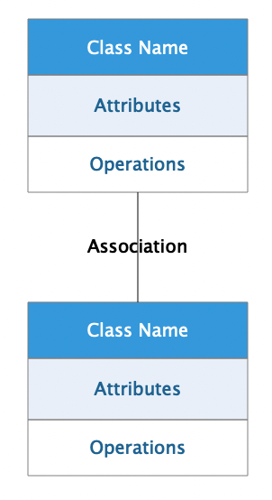

# ``UML``:类图关系总结

UML类图几种关系的总结，泛化 = 实现 > 组合 > 聚合 > 关联 > 依赖
在UML类图中，常见的有以下几种关系: ``泛化（Generalization）``, ``实现（Realization）``，``关联（Association)``，``聚合（Aggregation）``，``组合(Composition)``，``依赖(Dependency)``

## 1. 泛化（``Generalization``）
- 【泛化关系】：是一种**继承**关系，表示一般与特殊的关系，它指定了子类如何特化父类的所有特征和行为。例如：老虎是动物的一种，即有老虎的特性也有动物的共性。
- 【箭头指向】：带三角箭头的实线，箭头指向父类.
   
    

## 2.实现（``Realization``）
【实现关系】：在这里插入图片描述是一种类与接口的关系，表示类是接口所有特征和行为的实现.

【箭头指向】：带三角箭头的虚线，箭头指向接口

 

## 3.关联（``Association``)
【关联关系】：是一种拥有的关系，它使一个类知道另一个类的属性和方法；如：老师与学生，丈夫与妻子关联可以是双向的，也可以是单向的。双向的关联可以有两个箭头或者没有箭头，单向的关联有一个箭头。

【代码体现】：成员变量

【箭头及指向】：带普通箭头的实心线，指向被拥有者

 

## 4.聚合（``Aggregation``）
【聚合关系】：是整体与部分的关系，且部分可以离开整体而单独存在。如车和轮胎是整体和部分的关系，轮胎离开车仍然可以存在。
聚合关系是关联关系的一种，是强的关联关系；关联和聚合在语法上无法区分，必须考察具体的逻辑关系。
【代码体现】：成员变量
【箭头及指向】：带空心菱形的实心线，菱形指向整体
 
  

  
## 5.组合(``Composition``)
【组合关系】：是**整体与部分**的关系，但部分不能离开整体而单独存在。如公司和部门是整体和部分的关系，没有公司就不存在部门。
组合关系是关联关系的一种，是比聚合关系还要强的关系，它要求普通的聚合关系中代表整体的对象负责代表部分的对象的生命周期。
【代码体现】：成员变量

【箭头及指向】：带实心菱形的实线，菱形指向整体

 

## 6. 依赖(``Dependency``)

 只要在类中用到了对方，他们之间就存在依赖关系

 

