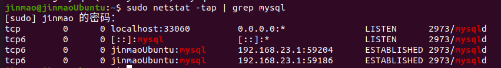
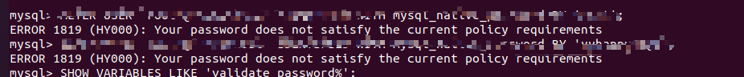
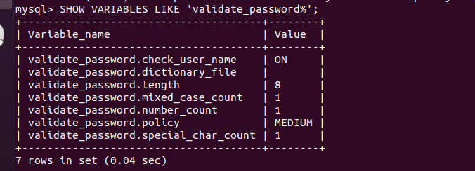
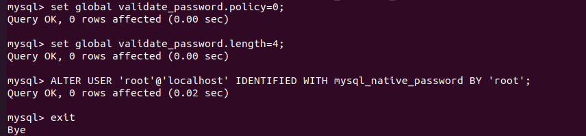
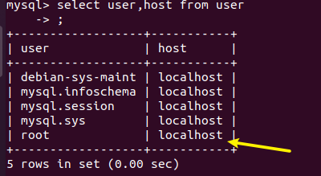
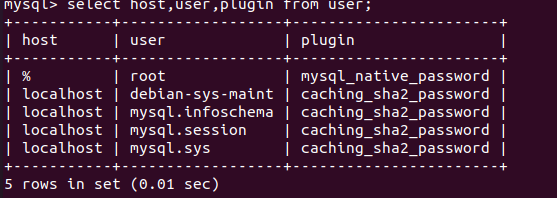

# `Ubuntu`中安装卸载`Mysql`数据库

> 启动`Mysql`
```bash
service mysql start
```
> 关闭`Mysql`
```bash
service mysql stop
```

> 重启`Mysql`

```bash
/etc/init.d/mysql restart
```

## `Mysql`卸载

1. 先卸载 `mysql-common`

```bash
sudo apt-get remove mysql-common
```
2. 再卸载(因为我的`Mysql`是`8.0`)

```bash
sudo apt-get autoremove --purge mysql-server-8.0
```

3. 再用`dpkg --list|grep mysql`查看，还剩什么就卸载什么

4. 最后清除残留数据
```bash
dpkg -l |grep ^rc|awk '{print $2}' |sudo xargs dpkg -P 
```

## `Mysql`安装
### 一、安装
1. 更新软件库
   ```bash
   sudo apt update
   ```
2. 安装`Mysql`服务
   ```bash
   sudo apt install mysql-server(这步就已经安装mysql-client)
   ```
3. 安装依赖
   ```bash
   sudo apt install libmysqlclient-dev
   ```      

### 二、检查状态
```bash
sudo netstat -tap | grep mysql
```
如果出现“无此命令”，输入命令`sudo apt install netstat`

  

### 三、设置`Root`密码
1、进入`root`
```bash
sudo su
```
2、进入`mysql`
```bash
mysql
```
3、配置数据库`root`权限
```sql
update mysql.user set authentication_string=PASSWORD('123456'), plugin='mysql_native_password' where user='root';
```
或者
```sql
ALTER USER 'root'@'localhost' IDENTIFIED WITH mysql_native_password BY 'root';
```

  

如果显示密码过于简单则需要重新设置密码强度

```sql
SHOW VARIABLES LIKE 'validate_password%';
```
  

> 密码的长度是由`validate_password.length`决定的,但是可以通过以下命令修改
```sql
set global validate_password.length=4;
```
> `validate_password.policy`决定密码的验证策略,默认等级为`MEDIUM`(中等),可通过以下命令修改为`LOW`(低)
```SQL
set global validate_password.policy=0;
```
  

### 四、配置远程连接

查看目前是否支持远程连接

```sql
use mysql;
select user,host from user;
```
  

目前只支持本地连接

> 更新域属性，`'%'`表示允许外部访问：
```sql
update user set host='%' where user ='root';
```
> 执行以上语句之后再执行：
```sql
FLUSH PRIVILEGES;
```
> 再执行授权语句：
```sql
GRANT ALL PRIVILEGES ON *.* TO 'root'@'%'WITH GRANT OPTION;
```
`FLUSH PRIVILEGES;` 命令本质上的作用是：

将当前`user`和`privilige`表中的用户信息/权限设置从`mysql`库(`MySQL`数据库的内置库)中提取到内存里。

`MySQL`用户数据和权限有修改后，希望在"不重启`MySQL`服务"的情况下直接生效，那么就需要执行这个命令。

通常是在修改`ROOT`帐号的设置后，怕重启后无法再登录进来，那么直接`flush`之后就可以看权限设置是否生效。

而不必冒太大风险。


#### 可能存在的其它问题

执行完之后，再用`Navicat`连接`mysql`，报错如下：
```sql
Client does not support authentication protocol requested by server；
```
报错原因：

`mysql8.0` 引入了新特性 `caching_sha2_password；`这种密码加密方式`Navicat 12`以下客户端不支持；

`Navicat 12`以下客户端支持的是`mysql_native_password` 这种加密方式；

解决方案:

1. 用如下语句查看`MySQL`当前加密方式
```sql
select host,user,plugin from user;
```
  

一般第一行，`root`加密方式为`caching_sha2_password`。

2，使用命令将他修改成`mysql_native_password`加密模式：
```sql
update user set plugin='mysql_native_password' where user='root';
```
再次连接的时候，就成功了。
 

#### 如果还连接不上

通过以上操作后，依然无法连接上，问题可能出在了防火墙上。

1，`MySQL`部署在实体服务器上解决方案如下：
a.开放`MySQL`的端口号，默认端口号是`3306`。
b.直接关闭防火墙（慎重操作，不建议。当然测试玩的话就随意了。。。。）

2，`MySQL`部署在云计算机上的方案如下：
a.以阿里云为例，找到实例，设置安全组，开放端口号即可。

### 关于开放端口

```bash
#防火墙开放3306端口
iptables -A INPUT -p tcp --dport 3306 -j ACCEPT
#修改MySQL监听
vim /etc/mysql/mysql.conf.d/mysqld.cnf
##注释掉bind-address = 127.0.0.1
#重启动MySQL
sudo /etc/init.d/mysql restart
#开放MySQL用户远程访问权限
grant all privileges on *.* to 'root'@'%' identified by 'root';
flush privileges;​
```

大功告成


