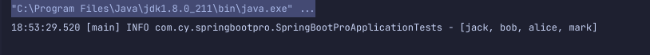
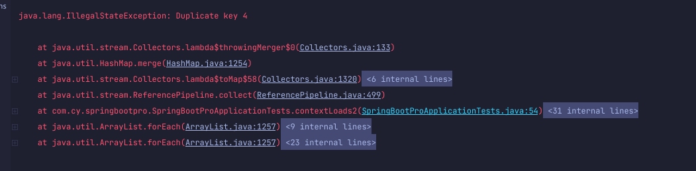
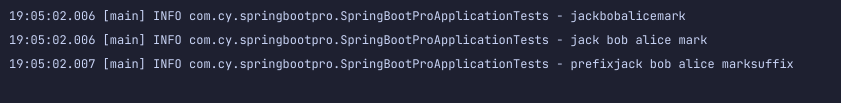

# `java stream`中`Collectors`的用法

- [`java stream`中`Collectors`的用法](#java-stream中collectors的用法)
  - [<span id="common">简介</span>](#简介)
  - [<span id="toList">`Collectors.toList()`</span>](#collectorstolist)
  - [<span id="toSet">`Collectors.toSet()`</span>](#collectorstoset)
  - [<span id="toColl">`Collectors.toCollection()`</span>](#collectorstocollection)
  - [<span id="toMap">`Collectors.toMap()`</span>](#collectorstomap)
  - [<span id="toCollAndThen">Collectors.collectingAndThen()</span>](#collectorscollectingandthen)
  - [<span id="join">`Collectors.joining()`</span>](#collectorsjoining)
  - [<span id="count">`Collectors.counting()`</span>](#collectorscounting)
  - [<span id="sum">`Collectors.summarizingDouble/Long/Int()`</span>](#collectorssummarizingdoublelongint)
  - [<span id="average">`Collectors.averagingDouble/Long/Int()`</span>](#collectorsaveragingdoublelongint)
  - [<span id="summing">`Collectors.summingDouble/Long/Int()`</span>](#collectorssummingdoublelongint)
  - [<span id="max">`Collectors.maxBy()/minBy()`</span>](#collectorsmaxbyminby)
  - [<span id="group">`Collectors.groupingBy()`</span>](#collectorsgroupingby)
  - [<span id="par">`Collectors.partitioningBy()`</span>](#collectorspartitioningby)

## <span id="common">简介</span>

在`java stream`中，我们通常需要将处理后的`stream`转换成集合类，这个时候就需要用到`stream.collect`方法。`collect`方法需要传入一个`Collector`类型，要实现`Collector`还是很麻烦的，需要实现好几个接口。

于是`java`提供了更简单的`Collectors`工具类来方便我们构建`Collector`。

下面我们将会具体讲解`Collectors`的用法。

假如我们有这样两个`list：`

```java
List<String> list = Arrays.asList("jack", "bob", "alice", "mark");
List<String> duplicateList = Arrays.asList("jack", "jack", "alice", "mark");
```
上面一个是无重复的`list`，一个是带重复数据的`list`。接下来的例子我们会用上面的两个`list`来讲解`Collectors`的用法。

## <span id="toList">`Collectors.toList()`</span>
```java
List<String> listResult = list.stream().collect(Collectors.toList());
        log.info("{}",listResult);
```
  

将`stream`转换为`list`。这里转换的`list`是`ArrayList`，如果想要转换成特定的`list`，需要使用`toCollection`方法。

## <span id="toSet">`Collectors.toSet()`</span>

```java
Set<String> setResult = list.stream().collect(Collectors.toSet());
        log.info("{}",setResult);
```
  

## <span id="toColl">`Collectors.toCollection()`</span>

上面的`toMap,toSet`转换出来的都是特定的类型，如果我们需要自定义，则可以使用`toCollection()`

```java
List<String> custListResult = list.stream().collect(Collectors.toCollection(LinkedList::new));
        log.info("{}",custListResult);
```
  

## <span id="toMap">`Collectors.toMap()`</span>

`toMap`接收两个参数，第一个参数是`keyMapper`，第二个参数是`valueMapper`:
```java
Map<String, Integer> mapResult = list.stream()
                .collect(Collectors.toMap(Function.identity(), String::length));
        log.info("{}",mapResult);
```
如果`stream`中有重复的值，则转换会报`IllegalStateException`异常：

```java
Map<String, Integer> duplicateMapResult = duplicateList.stream()
                .collect(Collectors.toMap(Function.identity(), String::length));
```
  

解决方案:

```java
Map<String, Integer> duplicateMapResult2 = duplicateList.stream()
                .collect(Collectors.toMap(Function.identity(), String::length, (item, identicalItem) -> item));
        log.info("{}",duplicateMapResult2);
```
在`toMap`中添加第三个参数`mergeFunction`，来解决冲突的问题。

  

## <span id="toCollAndThen">Collectors.collectingAndThen()</span>

`collectingAndThen`允许我们对生成的集合再做一次操作。

```java
List<String> collectAndThenResult = list.stream()
                .collect(Collectors.collectingAndThen(Collectors.toList(), l -> {return new ArrayList<>(l);}));
        log.info("{}",collectAndThenResult);
```
  


## <span id="join">`Collectors.joining()`</span>

`Joining`用来连接`stream`中的元素：

```java
String joinResult = list.stream().collect(Collectors.joining());
        log.info("{}",joinResult);
        String joinResult1 = list.stream().collect(Collectors.joining(" "));
        log.info("{}",joinResult1);
        String joinResult2 = list.stream().collect(Collectors.joining(" ", "prefix","suffix"));
        log.info("{}",joinResult2);
```
  

可以不带参数，也可以带一个参数，也可以带三个参数，根据我们的需要进行选择。

## <span id="count">`Collectors.counting()`</span>

`counting`主要用来统计`stream`中元素的个数：

```java
Long countResult = list.stream().collect(Collectors.counting());
        log.info("{}",countResult);
```

  


## <span id="sum">`Collectors.summarizingDouble/Long/Int()`</span>

`SummarizingDouble/Long/Int`为`stream`中的元素生成了统计信息，返回的结果是一个统计类：

```java
IntSummaryStatistics intResult = list.stream()
                .collect(Collectors.summarizingInt(String::length));
        log.info("{}",intResult);
```
  

## <span id="average">`Collectors.averagingDouble/Long/Int()`</span>

`averagingDouble/Long/Int()`对`stream`中的元素做平均：

```java
Double averageResult = list.stream().collect(Collectors.averagingInt(String::length));
        log.info("{}",averageResult);
```
  


## <span id="summing">`Collectors.summingDouble/Long/Int()`</span>

`summingDouble/Long/Int()`对`stream`中的元素做`sum`操作：

```java
Double summingResult = list.stream().collect(Collectors.summingDouble(String::length));
        log.info("{}",summingResult);
```

  


## <span id="max">`Collectors.maxBy()/minBy()`</span>

`maxBy()/minBy()`根据提供的`Comparator`，返回`stream`中的最大或者最小值：
```java
Optional<String> maxByResult = list.stream().collect(Collectors.maxBy(Comparator.naturalOrder()));
        log.info("{}",maxByResult);
```

  


## <span id="group">`Collectors.groupingBy()`</span>

`GroupingBy`根据某些属性进行分组，并返回一个`Map`：

```java
Map<Integer, Set<String>> groupByResult = list.stream()
                .collect(Collectors.groupingBy(String::length, Collectors.toSet()));
        log.info("{}",groupByResult);
```
  


## <span id="par">`Collectors.partitioningBy()`</span>

`PartitioningBy`是一个特别的`groupingBy，PartitioningBy`返回一个`Map`，这个`Map`是以`boolean`值为`key`，从而将`stream`分成两部分，一部分是匹配`PartitioningBy`条件的，一部分是不满足条件的：

  

